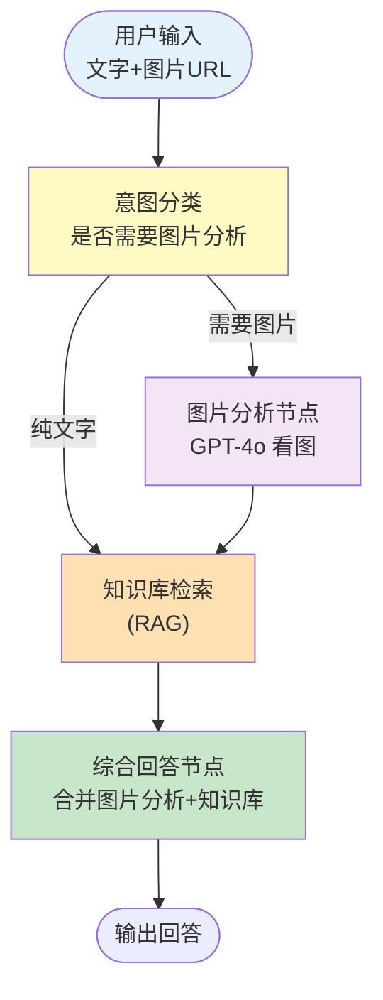

# 实战案例 05：多模态文档助手

> 支持图片+文字混合输入的智能助手，能看图分析、读图表数据、从截图中提取信息。

---

## 一、项目背景与目标

### 背景

纯文字 RAG 只能处理文本。但现实中大量信息在图片里：数据图表、流程截图、手写笔记、产品图片。多模态 LLM 能"看图说话"。

### 目标

1. 用户可以输入文字 + 图片 URL
2. 系统自动判断是否需要图片分析
3. 支持图片内容提取（图表数据、文字 OCR、物体识别）
4. 结合知识库进行综合问答

### 架构



## 二、技术栈与依赖

```bash
pip install langchain langchain-openai langgraph faiss-cpu python-dotenv
```

前置课程：第 07 课（RAG）、第 09-10 课（LangGraph）
关联知识库：[多模态应用开发](../知识库/15-多模态应用开发.md)

## 三、完整代码实现

### 3.1 State 定义

```python
from typing import TypedDict, Annotated
from operator import add
from langchain_core.messages import AnyMessage

class MultimodalState(TypedDict):
    messages: Annotated[list[AnyMessage], add]
    user_text: str           # 用户文字输入
    image_url: str            # 用户提供的图片URL
    needs_image: bool         # 是否需要图片分析
    image_description: str    # 图片分析结果
    kb_context: str           # 知识库检索结果
    final_answer: str         # 最终回答
```

### 3.2 完整实现

```python
import os
from dotenv import load_dotenv
from typing import TypedDict, Annotated
from operator import add
from langchain_openai import ChatOpenAI, OpenAIEmbeddings
from langchain_core.messages import (
    HumanMessage, AIMessage, AnyMessage, SystemMessage
)
from langchain_core.prompts import ChatPromptTemplate
from langchain_core.output_parsers import StrOutputParser
from langchain_core.documents import Document
from langchain_community.vectorstores import FAISS
from langchain_text_splitters import RecursiveCharacterTextSplitter
from langgraph.graph import StateGraph, START, END
from langgraph.checkpoint.memory import MemorySaver

load_dotenv()
llm = ChatOpenAI(model="gpt-4o-mini", temperature=0)
embeddings = OpenAIEmbeddings()

# ========== State ==========
class MultimodalState(TypedDict):
    messages: Annotated[list[AnyMessage], add]
    user_text: str
    image_url: str
    needs_image: bool
    image_description: str
    kb_context: str
    final_answer: str

# ========== 构建知识库 ==========
def build_knowledge_base():
    """构建示例知识库"""
    docs = [
        Document(page_content="""图表分析方法：柱状图用于比较不同类别的数值大小。
        折线图用于展示数据随时间的变化趋势。饼图用于展示各部分占总体的比例。
        散点图用于展示两个变量之间的相关关系。"""),

        Document(page_content="""数据可视化最佳实践：1.选择合适的图表类型 2.保持简洁
        3.使用恰当的颜色 4.添加清晰的标题和标签 5.避免3D效果和过度装饰
        6.确保数据准确性"""),

        Document(page_content="""图表数据读取技巧：1.先看标题了解主题 2.看坐标轴
        了解单位和范围 3.关注最高点和最低点 4.注意趋势方向 5.比较不同数据系列
        的差异 6.查看是否有异常值或拐点。"""),

        Document(page_content="""OCR（光学字符识别）技术可以将图片中的文字转换为
        可编辑的文本。常见的OCR场景包括：扫描文档数字化、截图文字提取、手写体
        识别、车牌识别、发票信息提取等。现代多模态LLM已内置OCR能力。"""),
    ]

    splitter = RecursiveCharacterTextSplitter(chunk_size=300, chunk_overlap=50)
    chunks = splitter.split_documents(docs)
    return FAISS.from_documents(chunks, embeddings)

vectorstore = build_knowledge_base()
retriever = vectorstore.as_retriever(search_kwargs={"k": 3})

# ========== 节点定义 ==========

def classify_node(state: MultimodalState) -> dict:
    """判断是否需要图片分析"""
    image_url = state.get("image_url", "")
    needs_image = bool(image_url and image_url.startswith("http"))
    return {"needs_image": needs_image}

def image_analysis_node(state: MultimodalState) -> dict:
    """用GPT-4o分析图片内容"""
    image_url = state["image_url"]
    user_text = state["user_text"]

    # 构造多模态消息
    message = HumanMessage(content=[
        {"type": "text", "text": f"""请详细分析这张图片。用户的问题是：{user_text}

请提取图片中的所有可见信息：
1. 如果是图表：读取标题、坐标轴、数据值、趋势
2. 如果是文字截图：提取所有文字内容
3. 如果是实物图：描述物体特征
4. 如果是界面截图：列出所有UI元素和文字

请给出详细的分析结果。"""},
        {"type": "image_url", "image_url": {"url": image_url}},
    ])

    response = llm.invoke([message])
    return {"image_description": response.content}

def kb_retrieval_node(state: MultimodalState) -> dict:
    """从知识库检索相关信息"""
    query = state["user_text"]
    if state.get("image_description"):
        query += " " + state["image_description"][:100]

    docs = retriever.invoke(query)
    context = "\n\n".join(d.page_content for d in docs)
    return {"kb_context": context}

def answer_node(state: MultimodalState) -> dict:
    """综合图片分析和知识库生成回答"""
    image_desc = state.get("image_description", "")
    kb_ctx = state.get("kb_context", "")
    user_text = state["user_text"]

    system_prompt = """你是一个多模态文档助手。基于图片分析结果和知识库信息回答用户问题。

规则：
1. 如果有图片分析结果，基于图片内容回答
2. 结合知识库中的相关知识补充说明
3. 如果图片和知识库都不能回答问题，明确说明
4. 回答时标注信息来源（图片/知识库）"""

    user_prompt = f"""用户问题：{user_text}

图片分析结果：
{image_desc or "（无图片输入）"}

知识库相关信息：
{kb_ctx or "（无相关知识）"}
"""

    prompt = ChatPromptTemplate.from_messages([
        ("system", system_prompt),
        ("human", "{question}"),
    ])

    chain = prompt | llm | StrOutputParser()
    answer = chain.invoke({"question": user_prompt})

    return {
        "final_answer": answer,
        "messages": [AIMessage(content=answer)],
    }

# ========== 路由 ==========

def route_after_classify(state: MultimodalState) -> str:
    """根据是否需要图片分析路由"""
    if state.get("needs_image"):
        return "image"
    return "kb"

# ========== 构建图 ==========

graph = StateGraph(MultimodalState)

graph.add_node("classify", classify_node)
graph.add_node("image_analysis", image_analysis_node)
graph.add_node("kb_retrieval", kb_retrieval_node)
graph.add_node("answer", answer_node)

graph.add_edge(START, "classify")

graph.add_conditional_edges(
    "classify",
    route_after_classify,
    {"image": "image_analysis", "kb": "kb_retrieval"}
)

# 图片分析后也去检索知识库
graph.add_edge("image_analysis", "kb_retrieval")
graph.add_edge("kb_retrieval", "answer")
graph.add_edge("answer", END)

app = graph.compile(checkpointer=MemorySaver())

# ========== 运行 ==========

def main():
    print("=" * 55)
    print("  多模态文档助手")
    print("=" * 55)
    print("\n💡 输入文字问题，可选附带图片URL")
    print("   格式: 你的问题 | https://example.com/image.jpg")
    print("   或纯文字: 你的问题")
    print("   quit退出\n")

    history = []
    config = {"configurable": {"thread_id": "mm_001"}}

    while True:
        raw = input("👤 你: ").strip()
        if raw.lower() == "quit":
            break
        if not raw:
            continue

        # 解析输入：文字 | 图片URL
        if "|" in raw:
            parts = raw.split("|", 1)
            user_text = parts[0].strip()
            image_url = parts[1].strip()
        else:
            user_text = raw
            image_url = ""

        result = app.invoke(
            {
                "messages": [HumanMessage(content=user_text)] + history,
                "user_text": user_text,
                "image_url": image_url,
                "needs_image": False,
                "image_description": "",
                "kb_context": "",
                "final_answer": "",
            },
            config=config
        )

        # 显示结果
        print(f"\n🤖 助手: {result['final_answer']}")

        if result.get("image_description"):
            print(f"\n   📷 图片分析: {result['image_description'][:150]}...")
        if result.get("kb_context"):
            print(f"   📚 知识库: 已检索到相关内容")
        print()

        history.append(HumanMessage(content=user_text))
        history.append(AIMessage(content=result["final_answer"]))

if __name__ == "__main__":
    main()
```

## 四、运行与测试

```bash
# 1. 配置
echo "OPENAI_API_KEY=你的密钥" > .env

# 2. 运行
python main.py

# 3. 测试纯文字
# 输入: "如何读取柱状图的数据？"

# 4. 测试图片输入（用一个公开图片URL）
# 输入: "这个图表显示了什么趋势？| https://example.com/chart.png"

# 5. 测试截图OCR
# 输入: "提取这张截图中的文字 | https://example.com/screenshot.png"
```

## 五、多模态处理流程

```mermaid
sequenceDiagram
    participant U as 用户
    participant C as 分类节点
    participant I as 图片分析
    participant K as 知识库
    participant A as 回答节点

    U->>C: "这个图表什么趋势？| https://img.png"

    C->>C: 检测到图片URL
    Note over C: needs_image = True

    C->>I: 路由到图片分析

    I->>I: GPT-4o分析图片
    Note over I: 提取：标题"月度销售"<br/>X轴: 1-12月<br/>Y轴: 销售额<br/>趋势: 先升后降

    I->>K: 带着图片描述检索知识库

    K->>K: 检索"图表分析"相关知识
    Note over K: 找到"图表数据读取技巧"

    K->>A: 图片分析 + 知识库

    A->>A: 综合生成回答

    A-->>U: "图表显示月度销售趋势，1-6月上升，7-12月下降。
    根据图表分析知识，建议关注7月的拐点..."
```

## 六、扩展方向

1. 支持本地图片上传（base64编码）
2. 添加 PDF 中的图片提取
3. 支持图片+图片对比分析
4. 将图片描述存入向量库（多模态RAG）
5. 添加图表数据表格化输出
6. 集成语音输入（Whisper 模型）
