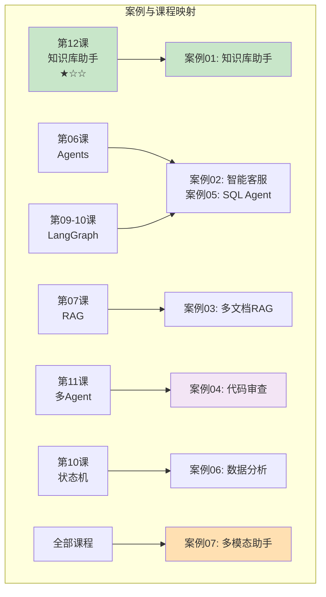
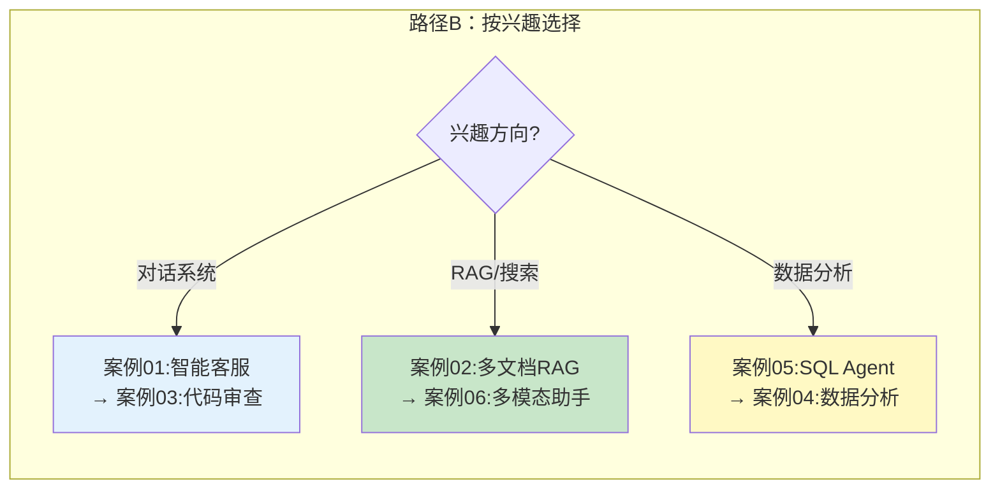

# 实战索引与学习路径串联

> 把所有实战案例按技术组合和学习阶段串联起来，帮你找到最适合自己水平的练习路径。

---

## 一、案例全景与能力矩阵



## 二、案例索引表

| 案例 | 核心技术 | 难度 | 前置课程 | 关联知识库 | 关联图解 |
|------|----------|------|----------|-----------|---------|
| [01-智能客服](01-智能客服机器人.md) | Memory+Agent+路由 | ★★☆ | 04,06,09 | 14(工具),32(对话系统) | 06(图结构),08(选型) |
| [02-多文档RAG](02-多文档RAG问答系统.md) | RAG+流式+溯源 | ★★☆ | 05,07,08 | 12(向量库),13(流式) | 03(RAG流程),10(流式) |
| [03-代码审查](03-代码审查助手.md) | 多Agent+HIL+并行 | ★★★ | 06,09,10,11 | 11(评估),15(多模态) | 07(多Agent),06(图结构) |
| [04-数据分析](04-数据分析对话助手.md) | Agent+代码执行+自纠错 | ★★★ | 06,09,10 | 14(工具),23(错误处理) | 14(高级模式),15(工具链) |
| [05-SQL Agent](06-SQL数据分析Agent.md) | LangGraph+SQL自纠错 | ★★★ | 06,10 | 22(SQL Agent) | 14(高级模式) |
| [06-多模态助手](05-多模态文档助手.md) | 多模态+RAG+LangGraph | ★★★ | 07,10 | 15(多模态) | 06(图结构) |
| [07-学习路径串联](07-实战索引与学习路径串联.md) | 全部综合 | — | 全部 | 全部 | 全部 |

## 三、推荐学习路径

```mermaid
graph LR
    subgraph 路径A ["路径A：从简到繁（推荐）"}
        A1["第12课<br/>知识库助手<br/>(入门级)"] --> A2["案例02<br/>多文档RAG<br/>(★★☆)"]
        A2 --> A3["案例01<br/>智能客服<br/>(★★☆)"]
        A3 --> A4["案例05<br/>SQL Agent<br/>(★★★)"]
        A4 --> A5["案例04<br/>数据分析<br/>(★★★)"]
        A5 --> A6["案例03<br/>代码审查<br/>(★★★)"]
        A6 --> A7["案例06<br/>多模态助手<br/>(★★★)"]
    end

    style A1 fill:#C8E6C9
    style A2 fill:#C8E6C9
    style A3 fill:#FFF9C4
    style A4 fill:#FFE0B2
    style A7 fill:#F3E5F5
```



## 四、技术组合矩阵

| 技术 | 案例01 | 案例02 | 案例03 | 案例04 | 案例05 | 案例06 |
|------|--------|--------|--------|--------|--------|--------|
| LangChain Chain | ✅ | ✅ | ✅ | ✅ | ✅ | ✅ |
| LangGraph | ✅ | — | ✅ | ✅ | ✅ | ✅ |
| Memory | ✅ | ✅ | — | ✅ | ✅ | ✅ |
| Agent+Tools | ✅ | — | — | ✅ | ✅ | — |
| RAG | — | ✅ | — | — | — | ✅ |
| 多模态 | — | — | — | — | — | ✅ |
| 流式输出 | — | ✅ | — | — | — | — |
| Human-in-Loop | — | — | ✅ | — | — | — |
| 多Agent | — | — | ✅ | — | — | — |
| 自纠错循环 | — | — | — | ✅ | ✅ | — |
| 条件路由 | ✅ | — | — | ✅ | ✅ | ✅ |
| 并行执行 | — | — | ✅ | — | — | — |

## 五、每学完一个案例应该具备的能力

```mermaid
graph TB
    subgraph 能力成长 {"案例驱动的能力成长"}
        L1["完成案例02后<br/>✅ 能构建RAG系统<br/>✅ 能实现流式输出<br/>✅ 能做引用溯源"]
        L2["完成案例01后<br/>✅ 能用LangGraph路由<br/>✅ 能构建多Agent<br/>✅ 能管理对话历史"]
        L3["完成案例04后<br/>✅ 能实现代码执行+自纠错<br/>✅ 能用LangGraph循环<br/>✅ 能安全执行代码"]
        L4["完成案例03后<br/>✅ 能做多Agent并行<br/>✅ 能实现Human-in-Loop<br/>✅ 能用子图组织"]
        L5["完成全部案例后<br/>✅ 能独立设计架构<br/>✅ 能选择正确技术<br/>✅ 能交付生产项目"]
    end

    style L5 fill:#C8E6C9
```

## 六、练习建议

| 阶段 | 做什么 | 目标 |
|------|--------|------|
| 每个案例 | 运行原版代码 | 理解整体流程 |
| 改造1 | 修改Prompt/参数 | 理解每个参数的作用 |
| 改造2 | 添加一个新功能 | 练习扩展能力 |
| 改造3 | 替换一个组件（如换模型） | 理解组件化设计 |
| 创新 | 基于案例设计自己的项目 | 综合应用能力 |
