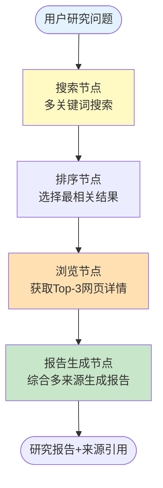
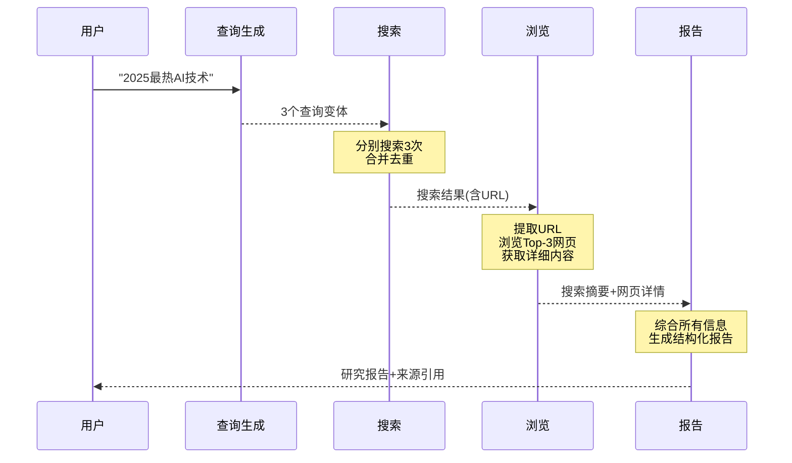

# 实战案例 08：Web 搜索研究 Agent

> 构建一个能搜索互联网、浏览网页、综合多来源信息生成研究报告的 Agent。

---

## 一、项目背景与目标

### 目标

1. 用户提出研究问题
2. Agent 自动搜索多个来源
3. 深入浏览关键网页获取详情
4. 综合多来源信息生成结构化研究报告

### 架构



## 二、技术栈与依赖

```bash
pip install langchain langchain-openai langgraph duckduckgo-search python-dotenv
```

前置课程：第 06 课（Agents）、第 09-10 课（LangGraph）

## 三、完整代码实现

```python
import os
from dotenv import load_dotenv
from typing import TypedDict, Annotated
from operator import add
from langchain_openai import ChatOpenAI
from langchain_core.prompts import ChatPromptTemplate
from langchain_core.output_parsers import StrOutputParser
from langchain_core.messages import HumanMessage, AIMessage, AnyMessage
from langchain_community.tools import DuckDuckGoSearchRun
from langchain_community.document_loaders import WebBaseLoader
from langgraph.graph import StateGraph, START, END

load_dotenv()
llm = ChatOpenAI(model="gpt-4o-mini", temperature=0)
search = DuckDuckGoSearchRun()

class ResearchState(TypedDict):
    question: str
    search_queries: list[str]
    search_results: str
    web_contents: str
    report: str

def generate_queries_node(state: ResearchState) -> dict:
    """生成多个搜索查询变体"""
    prompt = ChatPromptTemplate.from_template(
        "将以下研究问题改写为3个搜索查询（中英文混合），每行一个：\n{question}\n\n查询："
    )
    result = (prompt | llm | StrOutputParser()).invoke({"question": state["question"]})
    queries = [q.strip() for q in result.split("\n") if q.strip()][:3]
    queries.append(state["question"])  # 加上原始问题
    return {"search_queries": queries}

def search_node(state: ResearchState) -> dict:
    """多查询搜索"""
    all_results = []
    seen = set()
    for query in state["search_queries"][:3]:
        try:
            result = search.invoke(query)
            if result not in seen:
                seen.add(result)
                all_results.append(f"[查询: {query}]\n{result[:500]}")
        except Exception as e:
            all_results.append(f"[查询: {query}]\n搜索失败: {e}")

    return {"search_results": "\n\n".join(all_results)}

def browse_node(state: ResearchState) -> dict:
    """从搜索结果中提取URL并浏览"""
    import re
    urls = re.findall(r'https?://[^\s\]<>"]+', state["search_results"])

    contents = []
    for url in urls[:3]:  # 最多浏览3个网页
        try:
            loader = WebBaseLoader(url)
            docs = loader.load()
            if docs:
                content = docs[0].page_content[:1500]
                contents.append(f"[来源: {url}]\n{content}")
        except Exception:
            pass

    return {"web_contents": "\n\n".join(contents) if contents else "(无法获取网页详情)"}

def report_node(state: ResearchState) -> dict:
    """生成结构化研究报告"""
    prompt = ChatPromptTemplate.from_template(
        """你是一个研究助手。基于搜索结果和网页内容，生成一份结构化研究报告。

研究问题：{question}

搜索结果摘要：
{search_results}

网页详细内容：
{web_contents}

报告格式：
## 研究报告：{question}

### 主要发现
- 发现1
- 发现2
- 发现3

### 详细分析
（基于来源的综合分析）

### 信息来源
- 来源1
- 来源2

报告："""
    )
    chain = prompt | llm | StrOutputParser()
    report = chain.invoke({
        "question": state["question"],
        "search_results": state["search_results"],
        "web_contents": state["web_contents"],
    })
    return {"report": report}

# 构建图
graph = StateGraph(ResearchState)
graph.add_node("queries", generate_queries_node)
graph.add_node("search", search_node)
graph.add_node("browse", browse_node)
graph.add_node("report", report_node)

graph.add_edge(START, "queries")
graph.add_edge("queries", "search")
graph.add_edge("search", "browse")
graph.add_edge("browse", "report")
graph.add_edge("report", END)

app = graph.compile()

def main():
    print("=" * 55)
    print("  Web 搜索研究 Agent")
    print("=" * 55)
    print("\n输入研究问题（quit退出）\n")

    while True:
        question = input("👤 研究问题: ").strip()
        if question.lower() == "quit":
            break
        if not question:
            continue

        print("\n🔍 正在搜索...")
        result = app.invoke({
            "question": question,
            "search_queries": [],
            "search_results": "",
            "web_contents": "",
            "report": "",
        })

        print("\n" + "=" * 55)
        print(result["report"])
        print("=" * 55)

if __name__ == "__main__":
    main()
```

## 四、运行与测试

```bash
# 1. 配置
echo "OPENAI_API_KEY=你的密钥" > .env

# 2. 运行
python main.py

# 3. 测试
# 研究: "2025年最热门的AI技术趋势"
# 研究: "LangChain和LangGraph有什么区别"
# 研究: "量子计算最新进展"
```

## 五、工作流程详解



## 六、扩展方向

1. 用 Tavily 替代 DuckDuckGo 提升搜索质量
2. 添加多轮追问（"关于第2点，能深入说说吗"）
3. 保存报告为 Markdown 文件
4. 添加时效性判断（搜索结果是否过时）
5. 并行搜索多个查询（asyncio.gather）
