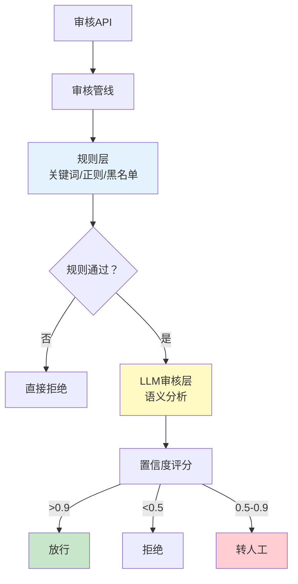

# 实战案例 16：内容审核 Agent

> 用户生成内容（UGC）需要审核——评论、帖文、商品描述。纯人工审核慢且贵，纯规则审核误杀多。内容审核 Agent 用 LLM 理解语义+规则精确匹配，兼顾效率和准确率。

---

## 一、案例概述

```mermaid
graph TB
    subgraph 系统 {"内容审核Agent"}
        INPUT["待审核内容"] --> CLASSIFY["分类<br/>文本/图片/链接"]
        CLASSIFY --> RULE["规则审核<br/>关键词/正则/黑名单"]
        RULE --> LLM{"需语义判断？"}
        LLM -->|是| AI["LLM审核<br/>理解上下文"]
        LLM -->|否| RESULT["结果"]
        AI --> RESULT
        RESULT --> APPROVE{"通过？"}
        APPROVE -->|通过| PASS["放行"]
        APPROVE -->|拒绝| REJECT["拒绝+原因"]
        APPROVE -->|不确定| HUMAN["转人工"]
    end

    style RULE fill:#E3F2FD
    style AI fill:#FFF9C4,stroke:#F9A825,stroke-width:3px
    style HUMAN fill:#FFCDD2
```

**核心技术：** 规则过滤+LLM语义审核+置信度路由+人工兜底

---

## 二、系统架构



---

## 三、规则审核层

```python
import re
from dataclasses import dataclass
from enum import Enum

class AuditResult(str, Enum):
    PASS = "pass"
    REJECT = "reject"
    REVIEW = "review"  # 需人工

@dataclass
class AuditDecision:
    result: AuditResult
    confidence: float
    reason: str
    triggered_rules: list[str]

class RuleAuditor:
    """规则审核器：快速精确匹配。"""

    SENSITIVE_PATTERNS = [
        (r'(?:赌博|博彩|时时彩)', "赌博相关"),
        (r'(?:色情|黄色|av)', "色情内容"),
        (r'(?:毒品|大麻|冰毒)', "毒品相关"),
        (r'(?:枪支|弹药|炸弹)', "暴力物品"),
        (r'(?:代开发票|假证)', "违法服务"),
        (r'https?://[^\s]+', "包含外部链接"),
        (r'(?:微信号|QQ群|二维码)', "引流信息"),
    ]

    BLACKLIST_WORDS = {"特定敏感词1", "特定敏感词2"}

    @classmethod
    def audit(cls, content: str) -> AuditDecision:
        """规则审核。"""
        triggered = []

        for pattern, rule_name in cls.SENSITIVE_PATTERNS:
            if re.search(pattern, content, re.IGNORECASE):
                triggered.append(rule_name)

        for word in cls.BLACKLIST_WORDS:
            if word in content:
                triggered.append(f"黑名单词: {word}")

        if triggered:
            return AuditDecision(
                result=AuditResult.REJECT,
                confidence=0.95,
                reason=f"触发规则: {', '.join(triggered)}",
                triggered_rules=triggered,
            )

        return AuditDecision(
            result=AuditResult.PASS,
            confidence=0.7,  # 规则通过但不代表内容安全
            reason="未触发规则",
            triggered_rules=[],
        )
```

---

## 四、LLM 审核层

```python
from langchain_core.messages import HumanMessage
from langchain_openai import ChatOpenAI

llm = ChatOpenAI(model="gpt-4o-mini", temperature=0)

LLM_AUDIT_PROMPT = """你是内容审核专家。请审核以下内容是否违反平台规则。

## 审核维度
1. **违规内容**: 赌博、色情、毒品、暴力、诈骗
2. **垃圾信息**: 广告引流、重复内容、无关链接
3. **人身攻击**: 辱骂、歧视、威胁
4. **虚假信息**: 误导性内容、虚假宣传
5. **隐私泄露**: 个人信息、联系方式

## 待审核内容
{content}

## 输出JSON格式
```json
{{
  "safe": true/false,
  "confidence": 0.0-1.0,
  "violations": ["违规类型1", "违规类型2"],
  "reason": "审核理由"
}}
```"""

class LLMAuditor:
    """LLM语义审核器。"""

    def __init__(self, llm: ChatOpenAI = None):
        self.llm = llm or ChatOpenAI(model="gpt-4o-mini", temperature=0)

    async def audit(self, content: str) -> AuditDecision:
        """LLM审核。"""
        prompt = LLM_AUDIT_PROMPT.format(content=content[:1000])
        response = await self.llm.ainvoke([HumanMessage(content=prompt)])

        import json, re
        json_match = re.search(r'\{.*\}', response.content, re.DOTALL)
        if not json_match:
            return AuditDecision(
                result=AuditResult.REVIEW,
                confidence=0.3,
                reason="LLM审核解析失败",
                triggered_rules=[],
            )

        data = json.loads(json_match.group())
        confidence = data.get("confidence", 0.5)
        is_safe = data.get("safe", True)
        violations = data.get("violations", [])

        if is_safe and confidence >= 0.85:
            return AuditDecision(
                result=AuditResult.PASS,
                confidence=confidence,
                reason=data.get("reason", "内容安全"),
                triggered_rules=[],
            )
        elif not is_safe and confidence >= 0.85:
            return AuditDecision(
                result=AuditResult.REJECT,
                confidence=confidence,
                reason=f"违规: {', '.join(violations)}",
                triggered_rules=violations,
            )
        else:
            return AuditDecision(
                result=AuditResult.REVIEW,
                confidence=confidence,
                reason=f"不确定: {data.get('reason', '')}",
                triggered_rules=violations,
            )
```

---

## 五、审核管线

```python
class ContentAuditPipeline:
    """内容审核管线：规则→LLM→路由。"""

    def __init__(self, llm: ChatOpenAI = None):
        self.rule_auditor = RuleAuditor()
        self.llm_auditor = LLMAuditor(llm)

    async def audit(self, content: str) -> dict:
        """完整审核流程。"""
        # 1. 规则审核（快速）
        rule_result = self.rule_auditor.audit(content)

        if rule_result.result == AuditResult.REJECT:
            return self._format_result(
                "rule_rejected", rule_result,
                "规则审核未通过，直接拒绝"
            )

        # 2. LLM审核（语义）
        llm_result = await self.llm_auditor.audit(content)

        # 3. 综合决策
        if llm_result.result == AuditResult.PASS:
            return self._format_result("approved", llm_result, "审核通过")
        elif llm_result.result == AuditResult.REJECT:
            return self._format_result("llm_rejected", llm_result, "LLM审核拒绝")
        else:
            # 不确定→转人工
            return self._format_result("human_review", llm_result, "转人工审核")

    @staticmethod
    def _format_result(
        action: str,
        decision: AuditDecision,
        message: str,
    ) -> dict:
        return {
            "action": action,
            "result": decision.result.value,
            "confidence": decision.confidence,
            "reason": decision.reason,
            "triggered_rules": decision.triggered_rules,
            "message": message,
        }
```

---

## 六、使用示例

```python
import asyncio

async def main():
    pipeline = ContentAuditPipeline()

    # 测试用例
    cases = [
        "今天天气真好，适合出去玩",                    # 安全
        "加我微信号xxx，免费领取礼品",                 # 引流
        "这个产品质量太差了，建议大家不要买",          # 负面评价(应通过)
        "代开发票 联系13800138000",                   # 违法服务
    ]

    for content in cases:
        result = await pipeline.audit(content)
        print(f"内容: {content[:30]}...")
        print(f"  结果: {result['action']} (置信度: {result['confidence']})")
        print(f"  原因: {result['reason']}")
        print()

asyncio.run(main())
```

---

## 七、最佳实践

| 实践 | 说明 | 优先级 |
|------|------|--------|
| 规则先行 | 快速拦截明确违规 | ★★★ |
| LLM做语义判断 | 理解上下文减少误杀 | ★★★ |
| 不确定转人工 | 宁可保守不可放行 | ★★★ |
| 用小模型审核 | gpt-4o-mini够用 | ★★☆ |
| 定期更新规则 | 新违规模式要补充 | ★★☆ |
| 审核日志 | 记录所有审核决策 | ★★☆ |

---

## 八、检查清单

| 检查项 | 状态 |
|--------|------|
| 有规则审核层 | ☐ |
| 有LLM审核层 | ☐ |
| 有置信度路由 | ☐ |
| 有人工兜底 | ☐ |
| 有审核日志 | ☐ |
