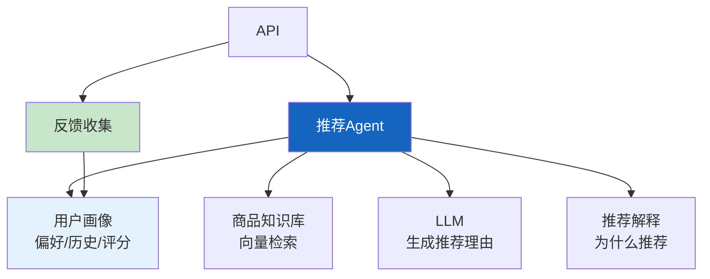

# 实战案例 17：个性化推荐 Agent

> 推荐系统不只是"买了A的人也买了B"。Agent 可以理解用户意图、解释推荐理由、根据反馈调整。这个案例构建一个个性化推荐 Agent，综合运用用户画像、RAG 和反馈学习。

---

## 一、案例概述

```mermaid
graph TB
    subgraph 系统 {"个性化推荐Agent"}
        U["用户: '推荐适合我的书'"] --> AGENT["Agent"]
        AGENT --> PROFILE["用户画像<br/>历史偏好+评分"]
        AGENT --> RAG["知识库检索<br/>商品库+评价"]
        PROFILE & RAG --> MATCH["匹配+排序"]
        MATCH --> REC["推荐结果<br/>+推荐理由"]
        REC --> FEEDBACK["收集反馈<br/>更新画像"]
    end

    style AGENT fill:#1565C0,color:#fff
    style FEEDBACK fill:#C8E6C9,stroke:#2E7D32,stroke-width:3px
```

**核心技术：** 用户画像 + RAG检索 + LLM推荐理由生成 + 反馈学习

---

## 二、系统架构



---

## 三、用户画像

```python
from dataclasses import dataclass, field
from typing import Any

@dataclass
class UserProfile:
    """用户画像。"""
    user_id: str
    preferences: dict = field(default_factory=dict)  # {category: score}
    history: list[dict] = field(default_factory=list)  # 浏览/购买历史
    ratings: dict = field(default_factory=dict)  # {item_id: rating}
    tags: list[str] = field(default_factory=list)  # 用户标签

    def update_preference(self, category: str, score_delta: float = 0.1):
        """更新偏好。"""
        current = self.preferences.get(category, 0.5)
        self.preferences[category] = max(0, min(1, current + score_delta))

    def add_interaction(self, item_id: str, action: str, item_category: str = ""):
        """记录交互。"""
        self.history.append({"item_id": item_id, "action": action})
        if action == "purchase":
            self.update_preference(item_category, 0.1)
        elif action == "skip":
            self.update_preference(item_category, -0.05)

    def top_categories(self, n: int = 3) -> list[str]:
        """获取最偏好的分类。"""
        return sorted(
            self.preferences.keys(),
            key=lambda k: self.preferences[k],
            reverse=True
        )[:n]

class ProfileStore:
    """用户画像存储。"""
    def __init__(self):
        self.profiles: dict[str, UserProfile] = {}

    def get_or_create(self, user_id: str) -> UserProfile:
        if user_id not in self.profiles:
            self.profiles[user_id] = UserProfile(user_id=user_id)
        return self.profiles[user_id]
```

---

## 四、推荐引擎

```python
from langchain_core.language_models import BaseChatModel
from langchain_core.messages import HumanMessage, SystemMessage

RECOMMEND_PROMPT = """你是个性化推荐专家。基于用户画像和商品信息，推荐最合适的商品。

## 用户画像
- 偏好分类: {preferences}
- 历史浏览: {history}
- 评分记录: {ratings}

## 候选商品
{candidates}

## 要求
1. 推荐3-5个最匹配的商品
2. 每个推荐附带推荐理由（关联用户偏好）
3. 考虑多样性（不要全是同一分类）
4. 优先推荐用户偏好分类的高评分商品

## 输出格式
```json
{{
  "recommendations": [
    {{"item_id": "...", "name": "...", "reason": "...", "match_score": 0.9}}
  ]
}}
```"""

class RecommendationAgent:
    """个性化推荐Agent。"""

    def __init__(self, llm: BaseChatModel, profile_store: ProfileStore, vectorstore):
        self.llm = llm
        self.profiles = profile_store
        self.vectorstore = vectorstore

    async def recommend(
        self,
        user_id: str,
        query: str = "",
        top_k: int = 5,
    ) -> dict:
        """生成个性化推荐。"""
        # 1. 获取用户画像
        profile = self.profiles.get_or_create(user_id)

        # 2. 检索候选商品（RAG）
        search_query = query or " ".join(profile.top_categories())
        candidates = await self.vectorstore.asimilarity_search(search_query, k=15)

        # 3. LLM生成推荐
        candidates_text = "\n".join(
            f"[{i+1}] {d.page_content[:200]}" for i, d in enumerate(candidates)
        )

        prompt = RECOMMEND_PROMPT.format(
            preferences=profile.top_categories(),
            history=profile.history[-5:],
            ratings=list(profile.ratings.items())[-5:],
            candidates=candidates_text,
        )

        response = await self.llm.ainvoke([
            SystemMessage(content="你是推荐专家。"),
            HumanMessage(content=prompt),
        ])

        # 4. 解析推荐结果
        import json, re
        json_match = re.search(r'\{.*\}', response.content, re.DOTALL)
        if json_match:
            rec_data = json.loads(json_match.group())
            return {
                "user_id": user_id,
                "recommendations": rec_data.get("recommendations", []),
                "based_on": profile.top_categories(),
            }

        return {"user_id": user_id, "recommendations": [], "error": "解析失败"}

    async def record_feedback(
        self,
        user_id: str,
        item_id: str,
        action: str,  # purchase/skip/rate
        rating: int = None,
        category: str = "",
    ):
        """记录用户反馈，更新画像。"""
        profile = self.profiles.get_or_create(user_id)
        profile.add_interaction(item_id, action, category)
        if rating is not None:
            profile.ratings[item_id] = rating
            if rating >= 4 and category:
                profile.update_preference(category, 0.1)
            elif rating <= 2 and category:
                profile.update_preference(category, -0.1)

        return {"status": "updated", "preferences": profile.top_categories()}
```

---

## 五、使用示例

```python
import asyncio

async def main():
    from langchain_openai import ChatOpenAI, OpenAIEmbeddings
    from langchain_core.vectorstores import InMemoryVectorStore
    from langchain_core.documents import Document

    llm = ChatOpenAI(model="gpt-4o-mini", temperature=0)
    vectorstore = InMemoryVectorStore(OpenAIEmbeddings())
    profile_store = ProfileStore()

    # 添加商品到知识库
    items = [
        Document(page_content="Python编程：从入门到实践，适合初学者", metadata={"id": "b1", "category": "编程"}),
        Document(page_content="深度学习入门：基于PyTorch的实现", metadata={"id": "b2", "category": "AI"}),
        Document(page_content="数据结构与算法分析", metadata={"id": "b3", "category": "编程"}),
        Document(page_content="机器学习实战：Scikit-Learn指南", metadata={"id": "b4", "category": "AI"}),
        Document(page_content="设计模式：可复用面向对象软件的基础", metadata={"id": "b5", "category": "编程"}),
    ]
    await vectorstore.aadd_documents(items)

    agent = RecommendationAgent(llm, profile_store, vectorstore)

    # 第一次推荐（无画像）
    result = await agent.recommend("user-001", "编程书籍")
    print(f"推荐: {len(result['recommendations'])}个")
    for rec in result["recommendations"]:
        print(f"  - {rec.get('name', '')}: {rec.get('reason', '')[:50]}")

    # 记录反馈
    await agent.record_feedback("user-001", "b1", "purchase", 5, "编程")
    print("\n画像已更新：偏好编程")

    # 第二次推荐（基于画像）
    result2 = await agent.recommend("user-001")
    print(f"基于画像推荐: {result2['based_on']}")

asyncio.run(main())
```

---

## 六、扩展方向

| 扩展 | 说明 | 难度 |
|------|------|------|
| 协同过滤 | 结合相似用户推荐 | ★★☆ |
| 实时更新 | 流式更新画像 | ★★☆ |
| A/B测试 | 对比推荐策略 | ★★☆ |
| 冷启动 | 新用户推荐策略 | ★★☆ |
| 多模态推荐 | 图文商品推荐 | ★★★ |

---

## 七、检查清单

| 检查项 | 状态 |
|--------|------|
| 有用户画像 | ☐ |
| 有商品知识库 | ☐ |
| 有推荐理由生成 | ☐ |
| 有反馈收集 | ☐ |
| 有画像更新 | ☐ |
