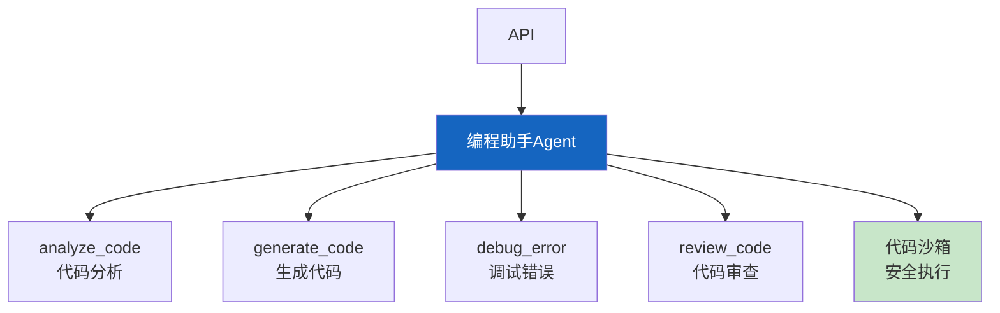

# 实战案例 23：智能编程助手 Agent

> Copilot 式的编程助手——能理解代码、回答问题、生成代码、审查代码、调试错误。这个案例构建一个完整的编程助手 Agent。

---

## 一、案例概述

```mermaid
graph TB
    subgraph 系统 {"编程助手Agent"}
        U["开发者: '这段代码有bug'"] --> ANALYZE["代码分析<br/>理解上下文"]
        ANALYZE --> ACTION{"需要什么?"}
        ACTION -->|解释| EXPLAIN["解释代码"]
        ACTION -->|生成| GEN["生成代码"]
        ACTION -->|调试| DEBUG["定位bug"]
        ACTION -->|审查| REVIEW["代码审查"]
        ACTION -->|重构| REFACTOR["重构建议"]
    end

    style ANALYZE fill:#FFF9C4,stroke:#F9A825,stroke-width:3px
```

**核心技术：** 代码理解 + 代码生成 + 错误诊断 + 代码审查 + 沙箱执行

---

## 二、系统架构



---

## 三、核心实现

### 3.1 代码分析

```python
from langchain_core.tools import tool
from langchain_core.messages import HumanMessage
from langchain_openai import ChatOpenAI
import json, re

llm = ChatOpenAI(model="gpt-4o", temperature=0)

ANALYZE_PROMPT = """你是编程专家。分析以下代码。

代码:
```{language}
{code}
```

分析:
1. 代码功能
2. 时间复杂度
3. 潜在问题
4. 改进建议

输出JSON:
```json
{{
  "function": "功能描述",
  "complexity": "O(n)",
  "issues": ["问题1"],
  "improvements": ["建议1"]
}}
```"""

@tool
async def analyze_code(code: str, language: str = "python") -> dict:
    """分析代码的功能、复杂度和潜在问题。

    Args:
        code: 要分析的代码
        language: 编程语言
    """
    prompt = ANALYZE_PROMPT.format(code=code[:2000], language=language)
    response = await llm.ainvoke([HumanMessage(content=prompt)])
    match = re.search(r'\{.*\}', response.content, re.DOTALL)
    if match:
        return json.loads(match.group())
    return {"function": "分析失败"}

GEN_PROMPT = """生成{language}代码。

需求: {requirement}
约束: {constraints}

要求:
1. 包含类型注解
2. 包含docstring
3. 包含错误处理
4. 输出完整可运行的代码

代码:"""

@tool
async def generate_code(requirement: str, language: str = "python", constraints: str = "") -> str:
    """根据需求生成代码。

    Args:
        requirement: 代码需求描述
        language: 编程语言
        constraints: 约束条件
    """
    prompt = GEN_PROMPT.format(
        requirement=requirement, language=language, constraints=constraints,
    )
    response = await llm.ainvoke([HumanMessage(content=prompt)])
    return response.content

DEBUG_PROMPT = """你是调试专家。分析以下错误。

代码:
```
{code}
```

错误信息:
```
{error}
```

分析:
1. 错误原因
2. 具体出错位置
3. 修复方案（给出修正后的代码片段）

输出:"""

@tool
async def debug_error(code: str, error: str) -> dict:
    """诊断代码错误并给出修复方案。

    Args:
        code: 出错的代码
        error: 错误信息
    """
    prompt = DEBUG_PROMPT.format(code=code[:1500], error=error[:500])
    response = await llm.ainvoke([HumanMessage(content=prompt)])
    return {"diagnosis": response.content}

REVIEW_PROMPT = """审查以下代码。

代码:
```
{code}
```

审查维度:
1. 安全性（注入/越权/敏感信息）
2. 性能（N+1查询/内存泄漏/不必要计算）
3. 可读性（命名/注释/结构）
4. 最佳实践（错误处理/类型注解/测试覆盖）

输出JSON:
```json
{{
  "score": 0-10,
  "security": ["问题1"],
  "performance": ["问题1"],
  "readability": ["问题1"],
  "best_practices": ["问题1"],
  "overall": "总结"
}}
```"""

@tool
async def review_code(code: str) -> dict:
    """代码审查：安全性、性能、可读性、最佳实践。

    Args:
        code: 要审查的代码
    """
    prompt = REVIEW_PROMPT.format(code=code[:2000])
    response = await llm.ainvoke([HumanMessage(content=prompt)])
    match = re.search(r'\{.*\}', response.content, re.DOTALL)
    if match:
        return json.loads(match.group())
    return {"score": 5, "overall": "审查失败"}

@tool
async def execute_code_safely(code: str) -> str:
    """在沙箱中执行代码并返回结果。

    Args:
        code: 要执行的Python代码
    """
    import subprocess, tempfile, os

    with tempfile.NamedTemporaryFile(mode="w", suffix=".py", delete=False) as f:
        f.write(code)
        f.flush()

    try:
        result = subprocess.run(
            ["python3", f.name],
            capture_output=True, text=True, timeout=10,
            env={"PATH": "/usr/local/bin:/usr/bin:/bin", "HOME": "/tmp"},
        )
        output = f"输出:\n{result.stdout[:2000]}\n"
        if result.stderr:
            output += f"错误:\n{result.stderr[:1000]}\n"
        output += f"退出码: {result.returncode}"
        return output
    except subprocess.TimeoutExpired:
        return "执行超时（10秒）"
    finally:
        os.unlink(f.name)
```

### 3.2 Agent 组装

```python
from langgraph.prebuilt import create_react_agent

SYSTEM_PROMPT = """你是智能编程助手。你可以：

1. **analyze_code**: 分析代码功能、复杂度和问题
2. **generate_code**: 根据需求生成代码
3. **debug_error**: 诊断错误并给修复方案
4. **review_code**: 代码审查（安全/性能/可读性/最佳实践）
5. **execute_code_safely**: 在沙箱中执行代码

## 工作原则
- 代码要有类型注解和docstring
- 始终考虑错误处理
- 安全审查时检查注入和敏感信息
- 生成代码后可执行验证
- 解释代码要通俗易懂"""

coding_agent = create_react_agent(
    llm,
    [analyze_code, generate_code, debug_error, review_code, execute_code_safely],
    prompt=SYSTEM_PROMPT,
)
```

---

## 四、使用示例

```python
import asyncio

async def main():
    result = await coding_agent.ainvoke({
        "messages": [{
            "role": "user",
            "content": "帮我写一个Python函数，输入一个列表返回出现频率最高的元素。写完帮我审查一下。"
        }]
    })
    print(result["messages"][-1].content[:2000])

asyncio.run(main())
```

---

## 五、检查清单

| 检查项 | 状态 |
|--------|------|
| 有代码分析 | ☐ |
| 有代码生成 | ☐ |
| 有错误调试 | ☐ |
| 有代码审查 | ☐ |
| 有沙箱执行 | ☐ |
