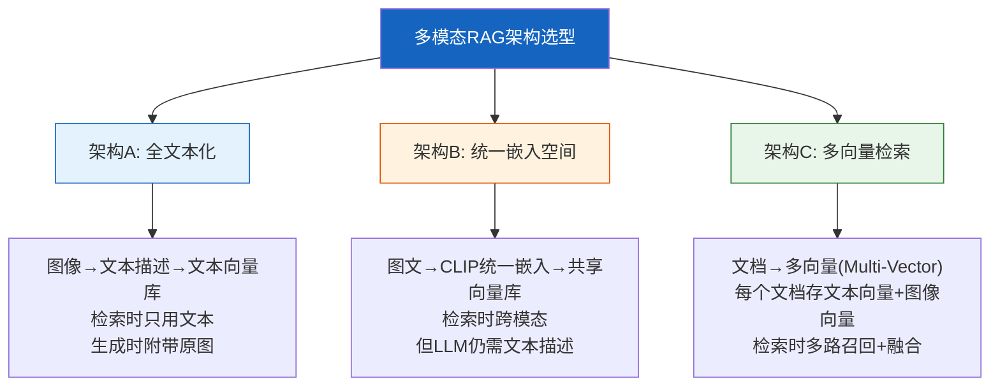

# 多模态 RAG 实践指南

> 传统 RAG 只处理文本。但现实中的知识库充满了图表、截图、PDF 扫描件、演示文稿。多模态 RAG 让检索增强生成跨越文字边界，同时理解图像和文本。这份指南覆盖三种主流架构、完整实现代码和选型决策。

---

## 一、多模态 RAG 的核心挑战

```mermaid
graph TB
    subgraph 问题 {"传统RAG的局限"}
        D1["PDF含图表"] --> D2["文本提取丢失图表信息"]
        D2 --> D3["检索不到图表中的数据"]
        D3 --> D4["❌ 回答不完整"]

        D5["用户问'这个架构图怎么画的'"] --> D6["纯文本向量库找不到"]
        D6 --> D7["❌ 无法回答"]
    end

    subgraph 挑战 {"多模态RAG三大挑战"}
        C1["1.异构表示<br/>文本和图像<br/>如何统一检索"]
        C2["2.对齐问题<br/>图文对应关系<br/>如何维护"]
        C3["3.生成融合<br/>如何让LLM<br/>同时理解图文"]
    end

    style 问题 fill:#FFCDD2
    style 挑战 fill:#FFF3E0
```

---

## 二、三种主流架构



| 架构 | 优点 | 缺点 | 适合场景 |
|------|------|------|----------|
| A 全文本化 | 实现简单，兼容现有RAG | 丢失图像细节，依赖描述质量 | 图表为主的文档 |
| B 统一嵌入 | 跨模态检索，用户可用图片查询 | 嵌入质量依赖模型，生成仍需文本 | 图文混合查询 |
| C 多向量 | 检索精度高，保留原始信息 | 存储和检索成本高 | 生产级多模态系统 |

---

## 三、架构A：全文本化方案

### 3.1 流程

```mermaid
graph LR
    subgraph 离线 {"离线建库"}
        P1["多模态文档<br/>PDF/PPT/HTML"] --> P2["解析提取<br/>文本+图像"]
        P2 --> P3["多模态LLM<br/>图像→文本描述"]
        P3 --> P4["合并文本<br/>原文+图像描述"]
        P4 --> P5["分块+嵌入<br/>存入向量库"]
    end

    subgraph 在线 {"在线检索"}
        Q1["用户问题"] --> Q2["文本检索"] --> Q3["返回文本块<br/>含图像描述"]
        Q3 --> Q4["LLM生成<br/>基于文本描述"]
    end

    style 离线 fill:#E3F2FD
    style 在线 fill:#FFF3E0
```

### 3.2 实现

```python
import base64
from langchain_core.messages import HumanMessage
from langchain_core.language_models import BaseChatModel
from langchain_text_splitters import RecursiveCharacterTextSplitter

IMAGE_DESC_PROMPT = """请详细描述这张图片的内容，包括：
1. 图片类型（图表/截图/流程图/照片/示意图）
2. 图中所有可见的文字内容
3. 图中的数据、数值、标签
4. 图表的趋势或关键结论

用中文输出，结构化描述。"""

async def image_to_text(
    llm: BaseChatModel,
    image_bytes: bytes,
    mime_type: str = "image/png",
) -> str:
    """用多模态LLM将图像转为文本描述。

    Args:
        llm: 支持视觉的LLM（如GPT-4o, Claude 3.5）
        image_bytes: 图像二进制数据
        mime_type: 图像MIME类型

    Returns:
        图像的文本描述
    """
    b64 = base64.b64encode(image_bytes).decode()
    message = HumanMessage(
        content=[
            {"type": "text", "text": IMAGE_DESC_PROMPT},
            {
                "type": "image_url",
                "image_url": {"url": f"data:{mime_type};base64,{b64}"},
            },
        ]
    )
    response = await llm.ainvoke([message])
    return response.content


async def process_multimodal_document(
    llm: BaseChatModel,
    document_path: str,
    text_splitter: RecursiveCharacterTextSplitter,
) -> list[dict]:
    """处理多模态文档，生成含图像描述的文本块。

    Args:
        llm: 多模态LLM
        document_path: 文档路径
        text_splitter: 文本分割器

    Returns:
        文本块列表，每个块包含content和metadata
    """
    from unstructured.partition.auto import partition

    # 解析文档，提取文本和图像元素
    elements = partition(filename=document_path)

    text_parts = []
    for elem in elements:
        category = elem.category
        if category == "Text":
            text_parts.append({"type": "text", "content": str(elem)})
        elif category == "Image":
            # 图像转文本描述
            image_bytes = elem.metadata.image_bytes
            if image_bytes:
                desc = await image_to_text(llm, image_bytes)
                text_parts.append({
                    "type": "image_description",
                    "content": f"[图像描述]\n{desc}",
                    "original_image": image_bytes,
                })

    # 合并为完整文本
    full_text = "\n\n".join(p["content"] for p in text_parts)

    # 分块
    chunks = text_splitter.split_text(full_text)

    # 为每个块添加元数据
    result = []
    for i, chunk in enumerate(chunks):
        result.append({
            "content": chunk,
            "metadata": {
                "source": document_path,
                "chunk_index": i,
                "total_chunks": len(chunks),
            },
        })

    return result
```

---

## 四、架构B：统一嵌入空间

### 4.1 原理

```mermaid
graph TB
    subgraph 统一空间 {"CLIP统一嵌入空间"}
        T1["文本"] --> E1["CLIP Text Encoder"]
        I1["图像"] --> E2["CLIP Image Encoder"]
        E1 --> V1["文本向量<br/>512维"]
        E2 --> V2["图像向量<br/>512维"]
        V1 & V2 --> VS["同一向量空间<br/>可跨模态检索"]
    end

    subgraph 检索 {"跨模态检索"}
        Q1["用户文本问题"] --> QE["CLIP Text Encoder"]
        QE --> QV["查询向量"]
        QV --> RET["在统一空间检索<br/>最近的图文向量"]
        RET --> R1["返回: 相关文本块 + 相关图像"]
    end

    style 统一空间 fill:#E3F2FD
    style 检索 fill:#FFF3E0
```

### 4.2 实现

```python
import numpy as np
from PIL import Image
from langchain_core.embeddings import Embeddings

class CLIPEmbeddings(Embeddings):
    """基于CLIP的统一文本-图像嵌入模型。

    将文本和图像映射到同一向量空间，
    支持跨模态检索（用文本搜图像，或用图像搜文本）。
    """

    def __init__(self, model_name: str = "openai/clip-vit-base-patch32"):
        from transformers import CLIPModel, CLIPProcessor
        self.model = CLIPModel.from_pretrained(model_name)
        self.processor = CLIPProcessor.from_pretrained(model_name)
        self._dim = self.model.config.projection_dim  # 通常512

    @property
    def dimension(self) -> int:
        return self._dim

    def embed_documents(self, texts: list[str]) -> list[list[float]]:
        """嵌入文本"""
        inputs = self.processor(text=texts, return_tensors="pt", padding=True)
        features = self.model.get_text_features(**inputs)
        vectors = features.detach().numpy()
        # L2归一化
        norms = np.linalg.norm(vectors, axis=1, keepdims=True)
        vectors = vectors / np.clip(norms, 1e-8, None)
        return vectors.tolist()

    def embed_images(self, images: list[Image.Image]) -> list[list[float]]:
        """嵌入图像"""
        inputs = self.processor(images=images, return_tensors="pt")
        features = self.model.get_image_features(**inputs)
        vectors = features.detach().numpy()
        norms = np.linalg.norm(vectors, axis=1, keepdims=True)
        vectors = vectors / np.clip(norms, 1e-8, None)
        return vectors.tolist()

    def embed_query(self, text: str) -> list[float]:
        return self.embed_documents([text])[0]


async def build_unified_index(
    clip_embedder: CLIPEmbeddings,
    documents: list[dict],  # [{text, image: PIL.Image | None}]
) -> list[dict]:
    """构建统一嵌入索引。

    将文本和图像都嵌入到同一向量空间，
    存储原始内容以便后续检索。

    Args:
        clip_embedder: CLIP嵌入模型
        documents: 文档列表，每个含text和可选image

    Returns:
        索引条目列表
    """
    index = []

    texts = [d["text"] for d in documents]
    text_vectors = clip_embedder.embed_documents(texts)

    for i, doc in enumerate(documents):
        entry = {
            "id": i,
            "text": doc["text"],
            "text_vector": text_vectors[i],
            "image": None,
            "image_vector": None,
            "metadata": doc.get("metadata", {}),
        }

        if doc.get("image") is not None:
            img_vec = clip_embedder.embed_images([doc["image"]])[0]
            entry["image"] = doc["image"]
            entry["image_vector"] = img_vec

        index.append(entry)

    return index


def unified_search(
    clip_embedder: CLIPEmbeddings,
    index: list[dict],
    query: str,
    top_k: int = 5,
    search_mode: str = "both",  # text, image, both
) -> list[dict]:
    """在统一索引中跨模态检索。

    Args:
        query: 查询文本
        search_mode: text=只搜文本向量, image=只搜图像向量, both=两者都搜

    Returns:
        最相关的条目列表
    """
    query_vec = np.array(clip_embedder.embed_query(query))

    candidates = []

    for entry in index:
        scores = []

        if search_mode in ("text", "both") and entry["text_vector"]:
            text_vec = np.array(entry["text_vector"])
            sim = float(np.dot(query_vec, text_vec))
            scores.append(("text", sim))

        if search_mode in ("image", "both") and entry["image_vector"]:
            img_vec = np.array(entry["image_vector"])
            sim = float(np.dot(query_vec, img_vec))
            scores.append(("image", sim))

        if scores:
            best_modality, best_score = max(scores, key=lambda x: x[1])
            candidates.append({
                "id": entry["id"],
                "text": entry["text"],
                "score": round(best_score, 4),
                "modality": best_modality,
                "has_image": entry["image"] is not None,
                "metadata": entry["metadata"],
            })

    candidates.sort(key=lambda x: x["score"], reverse=True)
    return candidates[:top_k]
```

---

## 五、架构C：多向量检索（推荐生产用）

### 5.1 架构

```mermaid
graph TB
    subgraph 离线 {"离线建库"}
        D1["文档解析"] --> D2["提取文本块+图像块"]
        D2 --> D3["文本块→文本嵌入"]
        D2 --> D4["图像块→图像描述→嵌入"]
        D2 --> D5["图像块→CLIP图像嵌入"]
        D3 & D4 & D5 --> D6["多向量存储<br/>每个文档关联多个向量"]
    end

    subgraph 在线 {"在线检索+融合"}
        Q1["用户问题"] --> Q2["文本向量检索<br/>Top-K文本"]
        Q1 --> Q3["文本向量检索<br/>Top-K图像描述"]
        Q1 --> Q4["CLIP向量检索<br/>Top-K图像"]
        Q2 & Q3 & Q4 --> FUSE["RRF融合排序"]
        FUSE --> GEN["LLM多模态生成<br/>文本+图像→回答"]
    end

    style 离线 fill:#E3F2FD
    style 在线 fill:#FFF3E0
```

### 5.2 LangChain Multi-Vector Retriever 实现

```python
from langchain_core.documents import Document
from langchain_core.stores import BaseStore
from langchain.retrievers.multi_vector import MultiVectorRetriever
from langchain_core.embeddings import Embeddings
from langchain_core.vectorstores import InMemoryVectorStore
import uuid

async def build_multivector_retriever(
    text_embeddings: Embeddings,
    clip_embeddings: CLIPEmbeddings,
    vision_llm: BaseChatModel,
    doc_store: BaseStore,
    documents: list[dict],  # [{text, images: [bytes]}]
) -> MultiVectorRetriever:
    """构建多向量检索器。

    使用LangChain的MultiVectorRetriever：
    - 向量库存储多个向量（文本向量+图像描述向量+CLIP图像向量）
    - 文档库存储原始完整文档（含图像）
    - 检索时用向量召回，返回完整文档

    Args:
        text_embeddings: 文本嵌入模型
        clip_embeddings: CLIP统一嵌入模型
        vision_llm: 用于图像描述的多模态LLM
        doc_store: 原始文档存储
        documents: 原始文档列表

    Returns:
        配置好的MultiVectorRetriever
    """
    # 文本向量库
    text_store = InMemoryVectorStore(text_embeddings)
    # CLIP向量库（图像向量）
    image_store = InMemoryVectorStore(clip_embeddings)

    retriever = MultiVectorRetriever(
        vectorstore=text_store,
        docstore=doc_store,
        id_key="doc_id",
    )

    for doc_data in documents:
        doc_id = str(uuid.uuid4())

        # 存储原始文档到docstore
        full_doc = Document(
            page_content=doc_data["text"],
            metadata={
                "doc_id": doc_id,
                "source": doc_data.get("source", "unknown"),
                "has_images": len(doc_data.get("images", [])) > 0,
            },
        )
        doc_store.mset([(doc_id, full_doc)])

        # 1. 文本向量
        text_sub_docs = [Document(
            page_content=doc_data["text"],
            metadata={"doc_id": doc_id, "type": "text"},
        )]
        await text_store.aadd_documents(text_sub_docs)

        # 2. 图像描述向量
        for img_bytes in doc_data.get("images", []):
            desc = await image_to_text(vision_llm, img_bytes)
            desc_doc = Document(
                page_content=desc,
                metadata={"doc_id": doc_id, "type": "image_description"},
            )
            await text_store.aadd_documents([desc_doc])

        # 3. CLIP图像向量
        if doc_data.get("images"):
            from io import BytesIO
            images = [
                Image.open(BytesIO(img)).convert("RGB")
                for img in doc_data["images"]
            ]
            img_vectors = clip_embeddings.embed_images(images)
            img_docs = [
                Document(
                    page_content=f"[image_{doc_id}_{i}]",
                    metadata={"doc_id": doc_id, "type": "clip_image"},
                )
                for i in range(len(images))
            ]
            await image_store.aadd_documents(img_docs, vectors=img_vectors)

    return retriever


def rrf_fuse(
    result_lists: list[list[dict]],
    k: int = 60,
    top_k: int = 5,
) -> list[dict]:
    """RRF（Reciprocal Rank Fusion）多路结果融合。

    将多路检索结果按排名倒数加权融合。

    Args:
        result_lists: 多路检索结果列表
        k: RRF常数（通常60），平滑排名
        top_k: 返回前K条

    Returns:
        融合排序后的结果
    """
    scores = {}

    for result_list in result_lists:
        for rank, item in enumerate(result_list):
            doc_id = item.get("id") or item.get("doc_id")
            rrf_score = 1.0 / (k + rank + 1)
            if doc_id in scores:
                scores[doc_id]["score"] += rrf_score
                scores[doc_id]["sources"] += 1
            else:
                scores[doc_id] = {
                    "id": doc_id,
                    "score": rrf_score,
                    "sources": 1,
                    "text": item.get("text", ""),
                    "metadata": item.get("metadata", {}),
                }

    fused = sorted(scores.values(), key=lambda x: x["score"], reverse=True)
    return fused[:top_k]
```

---

## 六、多模态生成

### 6.1 带图像的回答生成

```mermaid
graph TB
    subgraph 生成 {"多模态回答生成"}
        R1["检索到的文本块"] --> LLM["多模态LLM"]
        R2["检索到的图像"] --> LLM
        Q1["用户问题"] --> LLM
        LLM --> ANS["回答<br/>引用文本+解读图像"]
    end

    style 生成 fill:#E8F5E9
```

```python
from langchain_core.messages import HumanMessage, SystemMessage
import base64

MULTIMODAL_RAG_PROMPT = """你是一个多模态问答助手。基于以下检索到的文本和图像信息回答用户问题。

## 检索到的文本
{text_context}

## 检索到的图像
（下方附有图像）

## 用户问题
{question}

## 回答要求
1. 优先使用检索到的信息
2. 如果图像中有与问题相关的数据或信息，请明确引用
3. 如果信息不足以回答，请说明缺什么
4. 标注信息来源（文本/图像）"""

async def multimodal_rag_answer(
    llm: BaseChatModel,
    question: str,
    text_context: str,
    images: list[bytes],
) -> str:
    """多模态RAG生成回答。

    Args:
        llm: 支持视觉的多模态LLM
        question: 用户问题
        text_context: 检索到的文本上下文
        images: 检索到的图像列表（bytes）

    Returns:
        LLM的回答
    """
    content = [
        {"type": "text", "text": MULTIMODAL_RAG_PROMPT.format(
            text_context=text_context,
            question=question,
        )},
    ]

    for img_bytes in images:
        b64 = base64.b64encode(img_bytes).decode()
        content.append({
            "type": "image_url",
            "image_url": {"url": f"data:image/png;base64,{b64}"},
        })

    messages = [
        SystemMessage(content="你是一个专业的多模态问答助手。"),
        HumanMessage(content=content),
    ]

    response = await llm.ainvoke(messages)
    return response.content
```

---

## 七、文档解析策略对比

```mermaid
graph TB
    subgraph 解析方案 {"多模态文档解析方案"}
        S1["Unstructured<br/>通用解析<br/>支持PDF/PPT/HTML<br/>提取文本+图像元素"]
        S2["PyMuPDF<br/>PDF专用<br/>高精度文本+图像提取<br/>支持表格区域检测"]
        S3["LlamaParse<br/>商业服务<br/>高精度OCR+表格识别<br/>多模态原生支持"]
        S4["LayoutLMv3<br/>自建模型<br/>文档理解+版面分析<br/>需GPU推理"]
    end

    style 解析方案 fill:#FFF3E0
```

| 方案 | 文本精度 | 图像提取 | 表格识别 | 成本 | 推荐场景 |
|------|----------|----------|----------|------|----------|
| Unstructured | 中 | 好 | 中 | 免费 | 通用文档 |
| PyMuPDF | 高 | 好 | 需辅助 | 免费 | PDF密集型 |
| LlamaParse | 高 | 好 | 高 | 付费 | 复杂表格+扫描件 |
| LayoutLMv3 | 高 | 中 | 高 | GPU成本 | 大规模自建 |

---

## 八、表格数据处理

```python
async def extract_tables_from_pdf(pdf_path: str) -> list[dict]:
    """从PDF中提取表格并转为结构化数据。

    Returns:
        表格列表 [{page, html, csv, summary}]
    """
    import fitz  # PyMuPDF

    tables = []
    doc = fitz.open(pdf_path)

    for page_num in range(len(doc)):
        page = doc[page_num]

        # 使用PyMuPDF的表格检测
        found_tables = page.find_tables()

        for table_idx, table in enumerate(found_tables):
            # 提取为列表
            data = table.extract()

            if not data:
                continue

            # 转CSV
            import io, csv
            csv_buffer = io.StringIO()
            writer = csv.writer(csv_buffer)
            writer.writerows(data)

            tables.append({
                "page": page_num + 1,
                "table_index": table_idx,
                "csv": csv_buffer.getvalue(),
                "rows": len(data),
                "cols": len(data[0]) if data else 0,
            })

    return tables


def table_to_text(table_data: dict) -> str:
    """将表格转为LLM可理解的文本描述。

    用于将表格信息融入RAG文本索引。
    """
    csv_content = table_data["csv"]
    return (
        f"[表格 第{table_data['page']}页 表{table_data['table_index']}]\n"
        f"共{table_data['rows']}行{table_data['cols']}列\n"
        f"内容:\n{csv_content}"
    )
```

---

## 九、评估多模态 RAG

```mermaid
graph TB
    subgraph 评估 {"多模态RAG评估维度"}
        E1["检索评估<br/>图文召回率<br/>跨模态命中率"]
        E2["生成评估<br/>图文引用准确率<br/>图像信息利用率"]
        E3["端到端<br/>多模态问答准确率<br/>图文综合回答质量"]
    end

    style 评估 fill:#E8F5E9
```

```python
def evaluate_multimodal_retrieval(
    retrieved: list[dict],
    ground_truth: dict,
) -> dict:
    """评估多模态检索质量。

    Args:
        retrieved: 检索结果列表
        ground_truth: {expected_docs: [ids], expected_modalities: ["text","image"]}

    Returns:
        评估指标
    """
    retrieved_ids = {r["id"] for r in retrieved}
    expected_ids = set(ground_truth["expected_docs"])

    # 文档召回率
    recall = len(retrieved_ids & expected_ids) / len(expected_ids) if expected_ids else 0

    # 模态覆盖
    retrieved_modalities = set()
    for r in retrieved:
        if r.get("has_image"):
            retrieved_modalities.add("image")
        retrieved_modalities.add("text")

    expected_modalities = set(ground_truth.get("expected_modalities", ["text"]))
    modality_coverage = len(retrieved_modalities & expected_modalities) / len(expected_modalities)

    return {
        "doc_recall": round(recall, 4),
        "modality_coverage": round(modality_coverage, 4),
        "retrieved_modalities": list(retrieved_modalities),
        "expected_modalities": list(expected_modalities),
    }
```

---

## 十、最佳实践

| 实践 | 说明 | 优先级 |
|------|------|--------|
| 生产环境优先选架构C（多向量） | 精度最高，可扩展，LangChain原生支持 | ★★★ |
| 图像描述用最强多模态LLM | 描述质量直接决定文本化方案效果 | ★★★ |
| 表格单独结构化处理 | 不要靠LLM从图像中读表格，直接提取结构化数据 | ★★☆ |
| CLIP向量+文本向量双路检索 | 覆盖语义相似和跨模态匹配两种需求 | ★★☆ |
| 图文对应关系保持到metadata | 检索到图像时能找到对应文本上下文 | ★★☆ |
| 评估时加入模态覆盖指标 | 不能只看文档召回，还要看是否召回了正确模态 | ★☆☆ |

---

## 十一、检查清单

| 检查项 | 状态 |
|--------|------|
| 选定了多模态RAG架构方案（A/B/C） | ☐ |
| 文档解析器支持图像提取 | ☐ |
| 图像描述生成流程已实现 | ☐ |
| 表格数据有结构化提取方案 | ☐ |
| 多路检索结果有融合策略（RRF等） | ☐ |
| 多模态LLM生成能同时处理文本和图像 | ☐ |
| 检索评估包含模态覆盖指标 | ☐ |
| 图文对应关系在metadata中可追溯 | ☐ |
