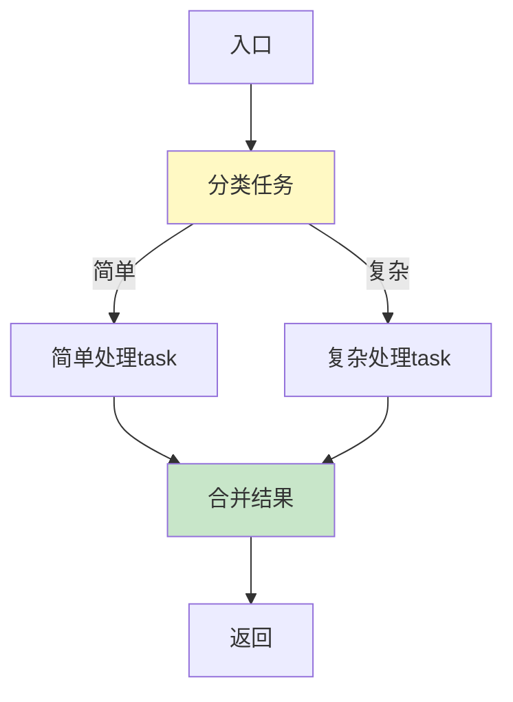
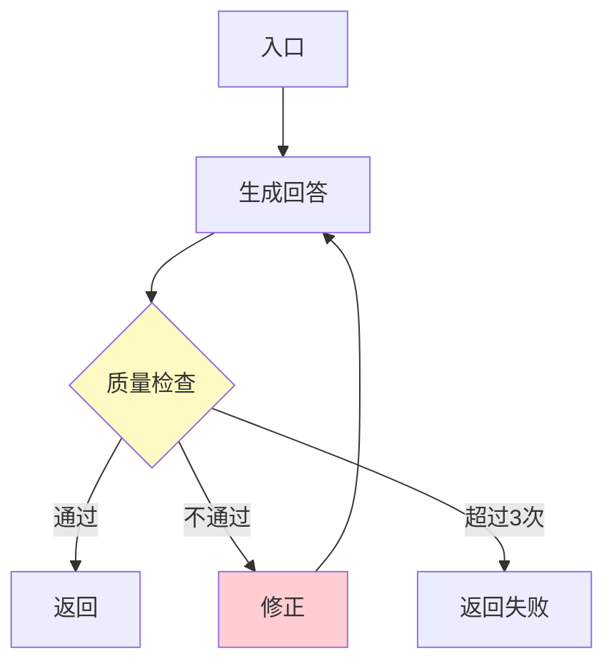
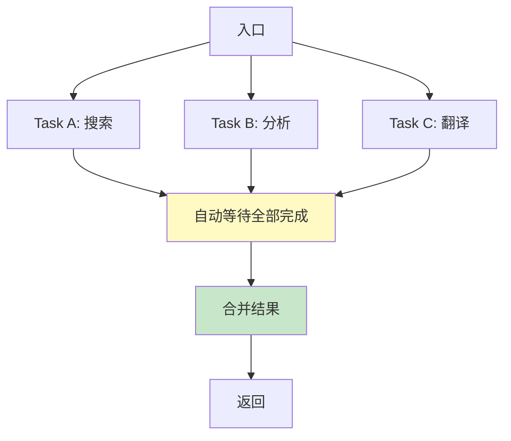
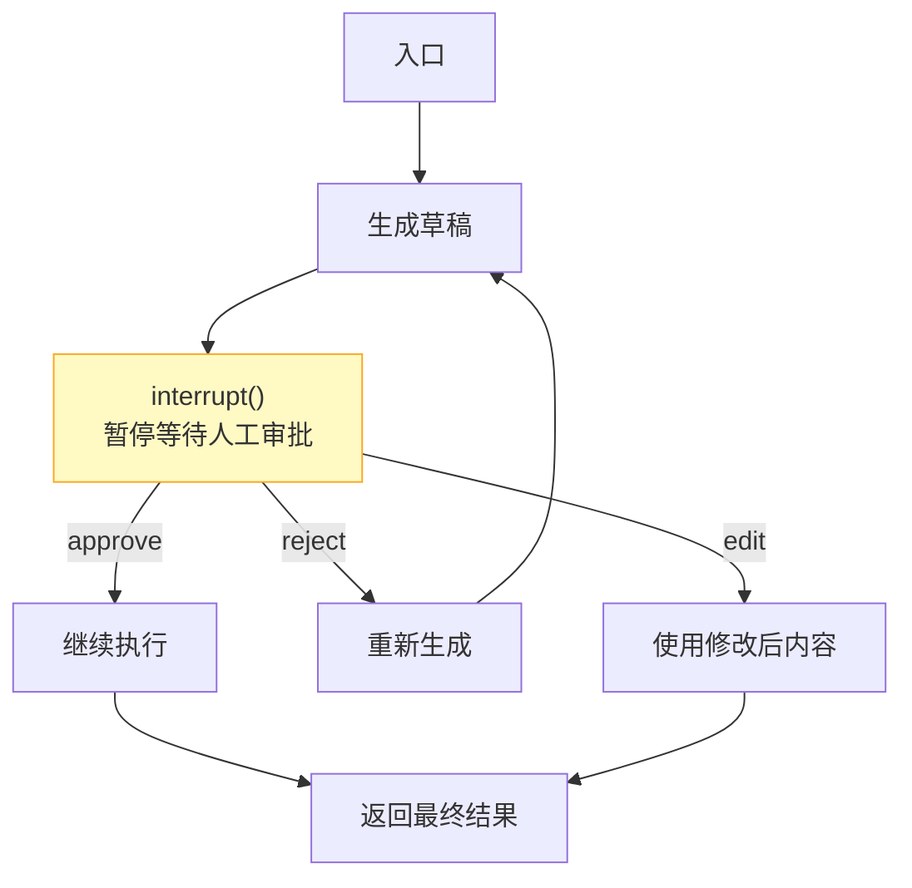
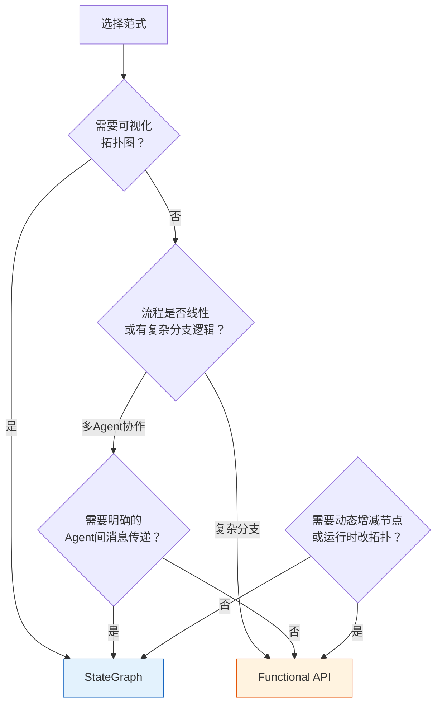

# LangGraph Functional API 指南

> LangGraph 提供两种编程范式：StateGraph（声明式图）和 Functional API（函数式）。StateGraph 用节点和边画出拓扑图，Functional API 用 Python 装饰器直接编排控制流。这份指南讲透两者的区别、适用场景和 Functional API 的完整用法。

---

## 一、两种范式对比

```mermaid
graph TB
    subgraph StateGraph {"StateGraph 声明式"}
        SG1["定义State"] --> SG2["定义Node函数"]
        SG2 --> SG3["add_node注册"]
        SG3 --> SG4["add_edge连线"]
        SG4 --> SG5["编译→执行"]
    end

    subgraph Functional {"Functional API 函数式"}
        F1["@entrypoint装饰"] --> F2["普通Python函数<br/>含控制流逻辑"]
        F2 --> F3["@task装饰子任务"]
        F3 --> F4["自动管理状态/检查点"]
        F4 --> F5["直接执行"]
    end

    style StateGraph fill:#E3F2FD,stroke:#1565C0
    style Functional fill:#FFF3E0,stroke:#E65100
```

| 维度 | StateGraph | Functional API |
|------|------------|----------------|
| 编程模型 | 声明式：先画图再执行 | 命令式：直接写控制流 |
| 控制流 | 条件边 + 路由函数 | if/else、for、while |
| 持久化 | Checkpointer | 同样支持（基于task） |
| 可读性 | 拓扑结构清晰 | 代码逻辑直观 |
| 适用场景 | 复杂多Agent、需要可视化 | 线性流程、有复杂分支逻辑 |
| 人机交互 | interrupt() | 同样支持 |
| 并行 | Send API | task并行 |

---

## 二、核心概念：Entry Point 和 Task

```mermaid
graph TB
    subgraph 核心 {"两个核心装饰器"}
        EP["@entrypoint<br/>定义流程入口<br/>等同于StateGraph的编译图"]
        TK["@task<br/>定义可检查点子任务<br/>等同于StateGraph的Node"]
    end

    EP --> E1["入口函数内调用<br/>被@task装饰的函数"]
    TK --> T1["task函数可以被<br/>entrypoint或其他task调用"]
    TK --> T2["task的执行自动持久化<br/>中断后可恢复"]

    style 核心 fill:#E3F2FD
```

### 2.1 基本用法

```python
from langgraph.func import entrypoint, task
from langgraph.checkpoint.memory import MemorySaver

# 定义任务
@task
async def fetch_data(query: str) -> str:
    """这个函数会被LangGraph管理，支持检查点"""
    # 模拟数据获取
    return f"数据: {query}"

@task
async def analyze(data: str) -> str:
    """分析数据"""
    return f"分析结果: {data}"

@task
async def summarize(analysis: str) -> str:
    """总结分析"""
    return f"总结: {analysis}"

# 定义流程入口
@entrypoint(checkpointer=MemorySaver())
async def my_workflow(inputs: dict) -> str:
    """流程入口，编排任务执行顺序"""
    query = inputs["query"]

    # 直接调用task函数，返回的是future
    data_future = await fetch_data(query)
    # await获取实际结果
    data = await data_future

    analysis_future = await analyze(data)
    analysis = await analysis_future

    summary_future = await summarize(analysis)
    summary = await summary_future

    return summary

# 执行
import asyncio
result = asyncio.run(my_workflow.ainvoke({"query": "LLM趋势"}))
```

---

## 三、控制流：条件分支



```python
from langgraph.func import entrypoint, task

@task
async def classify_complexity(query: str) -> str:
    """判断任务复杂度"""
    if len(query) < 20:
        return "simple"
    return "complex"

@task
async def simple_answer(query: str) -> str:
    return f"快速回答: {query}"

@task
async def complex_reasoning(query: str) -> str:
    """复杂推理：多步思考"""
    steps = []
    for i in range(3):
        steps.append(f"推理步骤{i+1}")
    return f"深度回答: {query} ({'→'.join(steps)})"

@entrypoint()
async def smart_workflow(inputs: dict) -> str:
    """根据复杂度选择不同处理路径"""
    query = inputs["query"]

    # 条件分支：直接用if/else
    complexity = await (await classify_complexity(query))

    if complexity == "simple":
        result = await (await simple_answer(query))
    else:
        result = await (await complex_reasoning(query))

    return result
```

---

## 四、控制流：循环与重试



```python
from langgraph.func import entrypoint, task

@task
async def generate_answer(query: str, feedback: str = "") -> str:
    """生成回答，可接受修正反馈"""
    if feedback:
        return f"修正后的回答（{feedback}）: {query}"
    return f"回答: {query}"

@task
async def quality_check(answer: str) -> dict:
    """检查回答质量"""
    if "修正后" in answer:
        return {"passed": True, "feedback": ""}
    return {"passed": False, "feedback": "需要更详细"}

@entrypoint(checkpointer=MemorySaver())
async def self_improving_workflow(inputs: dict) -> str:
    """自改进工作流：最多重试3次"""
    query = inputs["query"]
    max_retries = 3

    feedback = ""
    for attempt in range(max_retries):
        # 生成
        answer = await (await generate_answer(query, feedback))

        # 检查
        check_result = await (await quality_check(answer))

        if check_result["passed"]:
            return answer

        feedback = check_result["feedback"]

    return f"达到最大重试次数，最终结果: {answer}"
```

---

## 五、并行执行



```python
import asyncio
from langgraph.func import entrypoint, task

@task
async def search_web(query: str) -> list[str]:
    await asyncio.sleep(0.5)  # 模拟搜索
    return [f"搜索结果1: {query}", f"搜索结果2: {query}"]

@task
async def search_knowledge_base(query: str) -> list[str]:
    await asyncio.sleep(0.3)
    return [f"知识库结果1: {query}"]

@task
async def translate(query: str) -> str:
    await asyncio.sleep(0.2)
    return f"Translated: {query}"

@task
async def merge_results(
    web: list[str],
    kb: list[str],
    translation: str,
) -> str:
    all_results = web + kb
    return f"合并{len(all_results)}条结果 | 翻译: {translation}"

@entrypoint()
async def parallel_workflow(inputs: dict) -> str:
    """并行执行多个task，自动等待"""
    query = inputs["query"]

    # 并行启动所有task（不await，获取future）
    web_future = search_web(query)
    kb_future = search_knowledge_base(query)
    trans_future = translate(query)

    # await各个future获取结果
    # 注意：task调用返回future，需要await两次
    web_result = await (await web_future)
    kb_result = await (await kb_future)
    trans_result = await (await trans_future)

    # 合并
    merged = await (await merge_results(web_result, kb_result, trans_result))
    return merged
```

---

## 六、人机交互（Human-in-the-Loop）



```python
from langgraph.func import entrypoint, task
from langgraph.types import interrupt, Command

@task
async def generate_email(topic: str) -> str:
    return f"关于{topic}的邮件草稿..."

@task
async def send_email(content: str) -> str:
    return f"已发送: {content[:30]}..."

@entrypoint(checkpointer=MemorySaver())
async def email_workflow(inputs: dict) -> str:
    """邮件工作流：生成→人工审批→发送"""
    topic = inputs["topic"]

    # 生成草稿
    draft = await (await generate_email(topic))

    # 暂停等待人工审批
    # interrupt()会暂停执行，返回给调用方
    approval = interrupt({
        "type": "email_approval",
        "draft": draft,
        "question": "是否批准发送这封邮件？",
    })

    # approval是恢复执行时传入的值
    if approval.get("action") == "approve":
        result = await (await send_email(draft))
        return result
    elif approval.get("action") == "edit":
        edited = approval.get("content", draft)
        result = await (await send_email(edited))
        return result
    else:
        return "邮件被拒绝发送"

# 使用：第一次调用（会暂停）
# config = {"configurable": {"thread_id": "thread-1"}}
# result = await email_workflow.ainvoke({"topic": "季度报告"}, config)
# → 抛出interrupt

# 恢复执行（人工审批后）
# result = await email_workflow.ainvoke(
#     Command(resume={"action": "approve"}),
#     config,
# )
```

---

## 七、状态持久化与恢复

```mermaid
graph TB
    subgraph 执行 {"带检查点的执行"}
        E1["调用ainvoke"] --> E2["执行到task边界"]
        E2 --> E3["自动持久化<br/>到checkpointer"]
        E3 --> E4["继续执行"]
        E4 -->|中断/异常| E5["状态已保存"]
        E5 --> E6["恢复时从断点继续<br/>不重复已完成的task"]
    end

    style E3 fill:#FFF9C4
    style E6 fill:#C8E6C9
```

```python
from langgraph.checkpoint.memory import MemorySaver
from langgraph.func import entrypoint, task

@task
async def step_one(data: str) -> str:
    return f"step1处理: {data}"

@task
async def step_two(data: str) -> str:
    # 模拟可能在执行中失败
    return f"step2处理: {data}"

@task
async def step_three(data: str) -> str:
    return f"step3处理: {data}"

checkpointer = MemorySaver()

@entrypoint(checkpointer=checkpointer)
async def pipeline(inputs: dict) -> str:
    data = inputs["data"]

    r1 = await (await step_one(data))
    r2 = await (await step_two(r1))
    r3 = await (await step_three(r2))

    return r3

# 使用：带thread_id的配置
config = {"configurable": {"thread_id": "pipeline-001"}}

# 第一次执行
# result = await pipeline.ainvoke({"data": "test"}, config)

# 如果在step_two后中断，恢复执行：
# result = await pipeline.ainvoke({"data": "test"}, config)
# → step_one不会重新执行（已持久化），从step_two继续
```

---

## 八、StateGraph vs Functional API 选型决策



| 场景 | 推荐范式 | 理由 |
|------|----------|------|
| 线性数据处理管线 | Functional API | 代码直观，不需要画图 |
| 多Agent Supervisor 模式 | StateGraph | Agent间消息传递清晰 |
| 重试+条件分支密集 | Functional API | if/else比条件边更自然 |
| 需要在LangSmith中可视化 | StateGraph | 拓扑可视化更清晰 |
| 快速原型开发 | Functional API | 代码量更少 |
| 生产部署+团队协作 | StateGraph | 拓扑可审查，更易维护 |
| 动态控制流（运行时决定执行什么） | Functional API | 灵活性更高 |

---

## 九、混合使用：Functional API 中嵌入子图

```python
from langgraph.graph import StateGraph, START, END
from langgraph.func import entrypoint, task
from typing import TypedDict, Annotated
from operator import add

# 定义子图（StateGraph）
class ResearchState(TypedDict):
    query: str
    findings: Annotated[list[str], add]
    summary: str

async def search_node(state: ResearchState) -> dict:
    return {"findings": [f"关于{state['query']}的发现"]}

async def summarize_node(state: ResearchState) -> dict:
    return {"summary": f"总结: {state['findings']}"}

research_graph = StateGraph(ResearchState)
research_graph.add_node("search", search_node)
research_graph.add_node("summarize", summarize_node)
research_graph.add_edge(START, "search")
research_graph.add_edge("search", "summarize")
research_graph.add_edge("summarize", END)
research_compiled = research_graph.compile()

# 在Functional API中使用子图
@entrypoint()
async def hybrid_workflow(inputs: dict) -> str:
    """混合范式：Functional API编排，内嵌StateGraph子图"""
    query = inputs["query"]

    # 调用编译好的子图
    result = await research_compiled.ainvoke({
        "query": query,
        "findings": [],
        "summary": "",
    })

    return result["summary"]
```

---

## 十、最佳实践

| 实践 | 说明 | 优先级 |
|------|------|--------|
| task粒度适中 | 太细=检查点开销大，太粗=恢复粒度不够 | ★★★ |
| 入口函数只做编排 | 业务逻辑放在task中，入口只编排调用 | ★★☆ |
| 并行task注意无依赖 | 确保并行task间无数据依赖，否则串行 | ★★☆ |
| 持久化必须配checkpointer | 没有checkpointer，interrupt和恢复不生效 | ★★★ |
| 复杂拓扑用StateGraph | 超过5个分支条件时，声明式更易维护 | ★★☆ |

---

## 十一、检查清单

| 检查项 | 状态 |
|--------|------|
| 理解 @entrypoint 和 @task 的作用 | ☐ |
| 能区分何时用 Functional API vs StateGraph | ☐ |
| 掌握条件分支、循环重试写法 | ☐ |
| 掌握并行 task 执行方式 | ☐ |
| 理解 interrupt 人机交互机制 | ☐ |
| 配置了 checkpointer 支持持久化 | ☐ |
| 能在 Functional API 中嵌入 StateGraph 子图 | ☐ |
