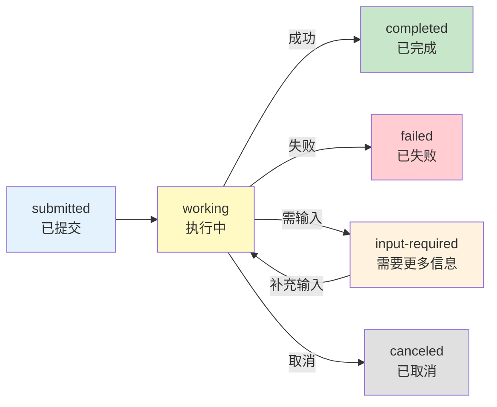
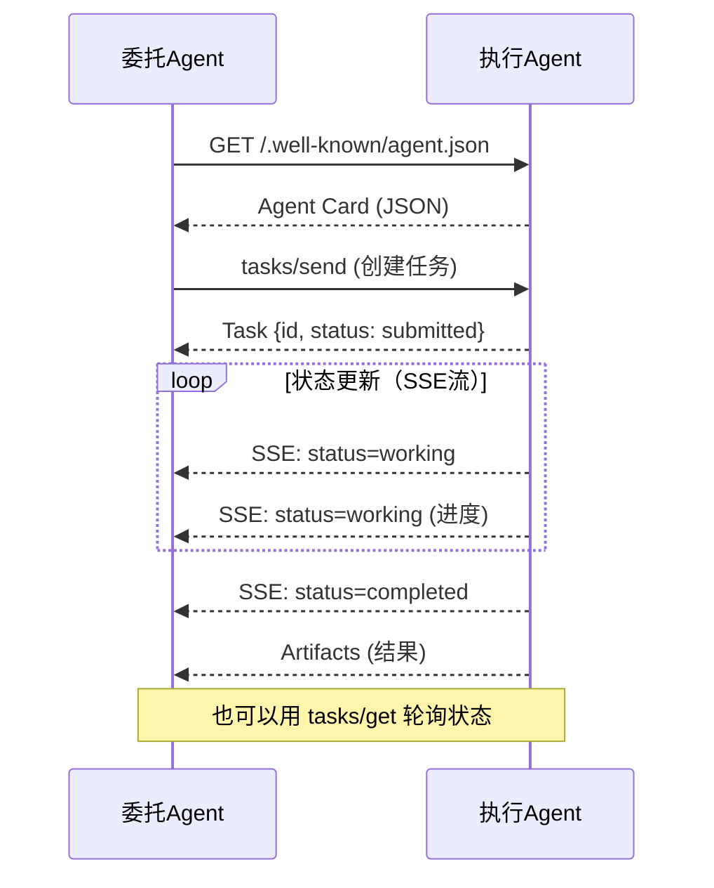

# A2A 协议与 Agent 互联

> MCP 解决了 Agent 与工具的连接问题，但 Agent 之间如何对话？Google 提出的 A2A（Agent-to-Agent）协议填补了这个空白。这份指南讲解 A2A 的核心概念、与 MCP 的关系，以及如何在 LangGraph 中实现多 Agent 互联。

---

## 一、为什么需要 A2A

```mermaid
graph TB
    subgraph 现状 {"Agent孤岛问题"}
        A1["客服Agent<br/>LangGraph构建"] 
        A2["分析Agent<br/>Dify构建"]
        A3["搜索Agent<br/>AutoGen构建"]
        A1 -.->|"无法直接通信"| A2
        A2 -.->|"无法直接通信"| A3
    end

    subgraph 方案 {"A2A协议解决"}
        P1["统一Agent间通信标准"]
        P2["Agent能力发现<br/>Agent Card"]
        P3["任务委托与状态追踪"]
        P4["跨框架Agent协作"]
    end

    style 现状 fill:#FFCDD2
    style 方案 fill:#E8F5E9
```

---

## 二、A2A vs MCP

```mermaid
graph TB
    subgraph MCP {"MCP: Agent↔工具"}
        M1["Agent"] -->|"调用工具"| M2["MCP Server<br/>(文件系统/数据库/API)"]
        M1 -->|"获取结果"| M2
    end

    subgraph A2A {"A2A: Agent↔Agent"}
        A1["Agent A<br/>(委托方)"] -->|"委派任务"| A2["Agent B<br/>(执行方)"]
        A2 -->|"返回结果"| A1
        A2 -->|"状态更新"| A1
    end

    subgraph 互补 {"两者互补"}
        C1["Agent用MCP<br/>连接工具"]
        C2["Agent用A2A<br/>委托给其他Agent"]
        C1 & C2 --> C3["完整生态"]
    end

    style MCP fill:#E3F2FD,stroke:#1565C0
    style A2A fill:#FFF3E0,stroke:#E65100
    style 互补 fill:#E8F5E9
```

| 维度 | MCP | A2A |
|------|-----|-----|
| 解决什么 | Agent 如何使用外部工具 | Agent 之间如何协作 |
| 通信模式 | 请求-响应 | 任务委托 + 状态追踪 |
| 发现机制 | 工具列表（tools/list） | Agent Card（JSON元数据） |
| 状态管理 | 无状态工具调用 | 有状态任务追踪 |
| 传输协议 | stdio, SSE, HTTP | HTTP + JSON-RPC + SSE |
| 典型场景 | Agent 查数据库/调API | Agent A 委托 Agent B 做研究 |

---

## 三、A2A 核心概念

```mermaid
graph TB
    subgraph 核心概念 {"A2A四大核心概念"}
        C1["Agent Card<br/>Agent名片<br/>JSON格式元数据<br/>描述Agent能力"]
        C2["Task<br/>任务对象<br/>有生命周期<br/>submitted→working→completed"]
        C3["Message<br/>消息<br/>Agent间通信载体<br/>含文本/文件/数据"]
        C4["Artifact<br/>产物<br/>任务执行结果<br/>文件/结构化数据"]
    end

    style 核心概念 fill:#E3F2FD
```

### 3.1 Agent Card

```json
{
  "name": "research-agent",
  "description": "深度研究Agent，擅长信息搜集和分析",
  "url": "https://agent.example.com/a2a",
  "version": "1.0.0",
  "capabilities": {
    "streaming": true,
    "pushNotifications": false,
    "stateTransitionHistory": true
  },
  "skills": [
    {
      "id": "web-research",
      "name": "网络研究",
      "description": "对给定主题进行深度网络搜索和分析",
      "inputModes": ["text"],
      "outputModes": ["text", "file"]
    },
    {
      "id": "data-analysis",
      "name": "数据分析",
      "description": "分析CSV/JSON数据并生成报告",
      "inputModes": ["text", "file"],
      "outputModes": ["text", "file"]
    }
  ]
}
```

### 3.2 Task 生命周期



---

## 四、A2A 通信协议



---

## 五、实现 A2A Server（执行方）

### 5.1 定义 A2A Server

```python
from typing import Any
from dataclasses import dataclass, field
from enum import Enum
import json
import uuid

class TaskState(str, Enum):
    SUBMITTED = "submitted"
    WORKING = "working"
    INPUT_REQUIRED = "input-required"
    COMPLETED = "completed"
    FAILED = "failed"
    CANCELED = "canceled"

@dataclass
class A2ATask:
    """A2A任务对象"""
    id: str
    state: TaskState
    message: dict | None = None      # 输入消息
    artifacts: list[dict] = field(default_factory=list)  # 结果产物
    history: list[dict] = field(default_factory=list)     # 状态历史

    def to_dict(self) -> dict:
        return {
            "id": self.id,
            "state": self.state.value,
            "message": self.message,
            "artifacts": self.artifacts,
            "history": self.history,
        }

@dataclass
class AgentCard:
    """Agent Card：描述Agent的能力"""
    name: str
    description: str
    url: str
    version: str
    skills: list[dict]
    capabilities: dict = field(default_factory=lambda: {
        "streaming": True,
        "pushNotifications": False,
    })

    def to_dict(self) -> dict:
        return {
            "name": self.name,
            "description": self.description,
            "url": self.url,
            "version": self.version,
            "skills": self.skills,
            "capabilities": self.capabilities,
        }
```

### 5.2 实现 A2A Server 接口

```python
import asyncio
from collections import defaultdict

class A2AServer:
    """A2A协议服务端实现。

    执行方Agent实现这个接口，
    委托方Agent通过HTTP调用这些方法。
    """

    def __init__(
        self,
        card: AgentCard,
        task_handler: callable,  # async def handler(task: A2ATask) -> A2ATask
    ):
        self.card = card
        self.task_handler = task_handler
        self.tasks: dict[str, A2ATask] = {}

    def get_card(self) -> dict:
        """返回Agent Card"""
        return self.card.to_dict()

    async def send_task(
        self,
        message: dict,
        skill_id: str | None = None,
    ) -> dict:
        """接收任务并开始执行。

        Args:
            message: 输入消息 {role, parts: [{type, content}]}
            skill_id: 指定使用的skill

        Returns:
            创建的Task对象
        """
        task_id = str(uuid.uuid4())
        task = A2ATask(
            id=task_id,
            state=TaskState.SUBMITTED,
            message=message,
            history=[{"state": TaskState.SUBMITTED.value}],
        )
        self.tasks[task_id] = task

        # 异步执行任务
        asyncio.create_task(self._run_task(task_id))

        return task.to_dict()

    async def _run_task(self, task_id: str):
        """异步执行任务"""
        task = self.tasks[task_id]
        try:
            task.state = TaskState.WORKING
            task.history.append({"state": TaskState.WORKING.value})

            # 调用实际处理逻辑
            result = await self.task_handler(task)

            task.state = TaskState.COMPLETED
            task.history.append({"state": TaskState.COMPLETED.value})

        except Exception as e:
            task.state = TaskState.FAILED
            task.history.append({
                "state": TaskState.FAILED.value,
                "error": str(e),
            })

    async def get_task(self, task_id: str) -> dict:
        """查询任务状态"""
        task = self.tasks.get(task_id)
        if not task:
            return {"error": "task not found"}
        return task.to_dict()

    async def cancel_task(self, task_id: str) -> dict:
        """取消任务"""
        task = self.tasks.get(task_id)
        if not task:
            return {"error": "task not found"}
        task.state = TaskState.CANCELED
        task.history.append({"state": TaskState.CANCELED.value})
        return task.to_dict()
```

---

## 六、实现 A2A Client（委托方）

```python
import httpx
import json

class A2AClient:
    """A2A协议客户端。

    委托方Agent用这个客户端与其他Agent通信。
    """

    def __init__(self, agent_url: str):
        self.base_url = agent_url.rstrip("/")
        self._card: dict | None = None

    async def get_agent_card(self) -> dict:
        """获取目标Agent的Agent Card"""
        if self._card:
            return self._card

        async with httpx.AsyncClient() as client:
            # A2A标准：Agent Card在 /.well-known/agent.json
            resp = await client.get(
                f"{self.base_url}/.well-known/agent.json"
            )
            self._card = resp.json()
            return self._card

    async def send_task(
        self,
        message: str,
        skill_id: str | None = None,
    ) -> dict:
        """向目标Agent发送任务。

        Args:
            message: 任务描述文本
            skill_id: 指定使用哪个skill

        Returns:
            Task对象
        """
        payload = {
            "jsonrpc": "2.0",
            "method": "tasks/send",
            "params": {
                "message": {
                    "role": "user",
                    "parts": [{"type": "text", "content": message}],
                },
                "skillId": skill_id,
            },
            "id": str(uuid.uuid4()),
        }

        async with httpx.AsyncClient() as client:
            resp = await client.post(
                f"{self.base_url}/a2a",
                json=payload,
            )
            return resp.json()["result"]

    async def get_task_status(self, task_id: str) -> dict:
        """查询任务状态"""
        payload = {
            "jsonrpc": "2.0",
            "method": "tasks/get",
            "params": {"id": task_id},
            "id": str(uuid.uuid4()),
        }

        async with httpx.AsyncClient() as client:
            resp = await client.post(
                f"{self.base_url}/a2a",
                json=payload,
            )
            return resp.json()["result"]

    async def wait_for_completion(
        self,
        task_id: str,
        poll_interval: float = 1.0,
        timeout: float = 120.0,
    ) -> dict:
        """轮询等待任务完成。

        Args:
            task_id: 任务ID
            poll_interval: 轮询间隔（秒）
            timeout: 超时时间（秒）

        Returns:
            最终Task对象
        """
        import time
        start = time.time()

        while time.time() - start < timeout:
            task = await self.get_task_status(task_id)
            state = task.get("state", "")

            if state in ("completed", "failed", "canceled"):
                return task

            await asyncio.sleep(poll_interval)

        raise TimeoutError(f"Task {task_id} timed out after {timeout}s")
```

---

## 七、在 LangGraph 中实现多 Agent 协作

```mermaid
graph TB
    subgraph LangGraph实现 {"用LangGraph编排A2A多Agent"}
        SUPER["Supervisor Agent<br/>(LangGraph)"] --> AC1["A2A Client<br/>→ Research Agent"]
        SUPER --> AC2["A2A Client<br/>→ Analysis Agent"]
        SUPER --> AC3["A2A Client<br/>→ Writer Agent"]
        AC1 --> SUPER
        AC2 --> SUPER
        AC3 --> SUPER
        SUPER --> RESULT["综合结果"]
    end

    style SUPER fill:#1565C0,color:#fff
    style RESULT fill:#C8E6C9
```

```python
from langgraph.graph import StateGraph, START, END
from typing import TypedDict, Annotated
from operator import add

class SupervisorState(TypedDict):
    task: str
    research_results: list[str]
    analysis_results: list[str]
    final_report: str

async def research_node(state: SupervisorState) -> dict:
    """通过A2A委托给Research Agent"""
    client = A2AClient("https://research-agent.example.com")

    # 获取Agent能力
    card = await client.get_agent_card()

    # 发送任务
    task_result = await client.send_task(
        message=f"研究主题: {state['task']}",
        skill_id="web-research",
    )

    # 等待完成
    final = await client.wait_for_completion(task_result["id"])

    # 提取结果
    artifacts = final.get("artifacts", [])
    result_text = artifacts[0]["parts"][0]["content"] if artifacts else ""

    return {"research_results": [result_text]}

async def analysis_node(state: SupervisorState) -> dict:
    """通过A2A委托给Analysis Agent"""
    client = A2AClient("https://analysis-agent.example.com")

    research_data = "\n".join(state["research_results"])

    task_result = await client.send_task(
        message=f"分析以下研究数据:\n{research_data}",
        skill_id="data-analysis",
    )

    final = await client.wait_for_completion(task_result["id"])
    artifacts = final.get("artifacts", [])
    result_text = artifacts[0]["parts"][0]["content"] if artifacts else ""

    return {"analysis_results": [result_text]}

async def write_node(state: SupervisorState) -> dict:
    """通过A2A委托给Writer Agent"""
    client = A2AClient("https://writer-agent.example.com")

    all_data = (
        f"研究: {state['research_results']}\n"
        f"分析: {state['analysis_results']}"
    )

    task_result = await client.send_task(
        message=f"基于以下内容写报告:\n{all_data}",
        skill_id="report-writing",
    )

    final = await client.wait_for_completion(task_result["id"])
    artifacts = final.get("artifacts", [])
    result_text = artifacts[0]["parts"][0]["content"] if artifacts else ""

    return {"final_report": result_text}

# 构建Supervisor工作流
graph = StateGraph(SupervisorState)
graph.add_node("research", research_node)
graph.add_node("analysis", analysis_node)
graph.add_node("write", write_node)
graph.add_edge(START, "research")
graph.add_edge("research", "analysis")
graph.add_edge("analysis", "write")
graph.add_edge("write", END)

supervisor = graph.compile()

# 执行
# result = await supervisor.ainvoke({"task": "AI Agent市场趋势", ...})
```

---

## 八、安全考量

```mermaid
graph TB
    subgraph 安全 {"A2A安全要点"}
        S1["Agent身份验证<br/>API Key / OAuth"]
        S2["任务权限控制<br/>限制可委派的任务类型"]
        S3["输入验证<br/>防止恶意指令注入"]
        S4["输出审查<br/>检查返回内容安全性"]
        S5["速率限制<br/>防止资源耗尽"]
    end

    style 安全 fill:#FFCDD2
```

| 风险 | 说明 | 缓解措施 |
|------|------|----------|
| Agent冒充 | 恶意Agent伪装成可信Agent | 验证Agent Card签名 |
| 指令注入 | 委派任务中嵌入恶意指令 | 输入净化 + 指令隔离 |
| 信息泄露 | Agent返回敏感信息 | 输出审查 + 脱敏 |
| 资源耗尽 | 大量任务涌入 | 速率限制 + 队列 |
| 权限提升 | Agent执行超出授权的操作 | 最小权限原则 |

---

## 九、最佳实践

| 实践 | 说明 | 优先级 |
|------|------|--------|
| Agent Card保持最新 | 能力变更时及时更新，委托方据此决策 | ★★★ |
| 任务超时必须有 | 防止委托的任务无限执行 | ★★★ |
| 优先流式而非轮询 | SSE流式更新比轮询效率高 | ★★☆ |
| A2A + MCP组合使用 | A2A连接Agent，MCP连接工具 | ★★☆ |
| 实现优雅降级 | 目标Agent不可用时，有备选方案 | ★★☆ |

---

## 十、检查清单

| 检查项 | 状态 |
|--------|------|
| 理解A2A与MCP的区别和互补关系 | ☐ |
| 掌握Agent Card的结构和作用 | ☐ |
| 理解Task生命周期状态机 | ☐ |
| 能实现基本的A2A Server和Client | ☐ |
| 能在LangGraph中编排A2A多Agent协作 | ☐ |
| 考虑了安全风险和缓解措施 | ☐ |
| 有任务超时和降级方案 | ☐ |
