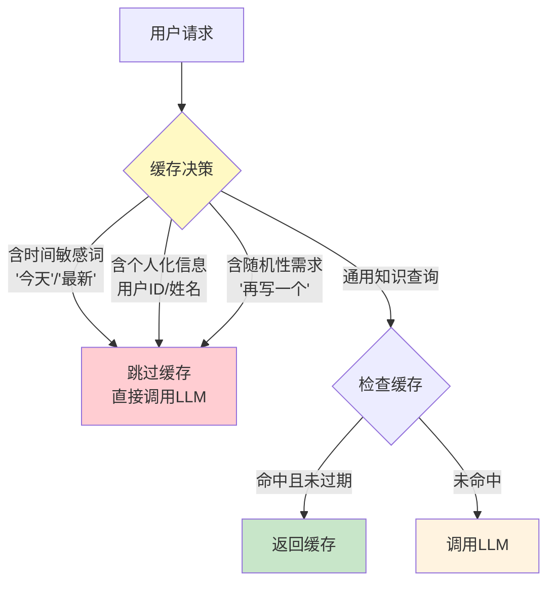

# 语义缓存层设计

> 传统缓存用精确键匹配——同一个查询命中，换一种说法就失效。语义缓存用向量相似度判断，即使用户换了措辞，只要语义相近就能命中缓存。这份指南覆盖语义缓存原理、实现、失效策略和生产级架构。

---

## 一、语义缓存 vs 传统缓存

```mermaid
graph TB
    subgraph 传统缓存 {"精确键匹配"}
        Q1["查询: 'Python列表怎么排序'"] --> K1["hash(查询文本)"]
        K1 --> MISS["❌ 未命中<br/>（上次问的是'如何排序列表'）"]
    end

    subgraph 语义缓存 {"向量相似度匹配"}
        Q2["查询: 'Python列表怎么排序'"] --> V1["嵌入向量"]
        V1 --> COMPARE["与缓存向量比对<br/>cosine_sim > 0.92"]
        COMPARE --> HIT["✅ 命中<br/>（'如何排序列表'语义相同）"]
    end

    style 传统缓存 fill:#FFCDD2
    style 语义缓存 fill:#C8E6C9
```

| 维度 | 精确缓存 | 语义缓存 |
|------|----------|----------|
| 匹配方式 | hash精确匹配 | 向量余弦相似度 |
| 命中率 | 低（措辞变化即miss） | 高（语义相近即hit） |
| 延迟 | ~1ms（O(1)查找） | ~5-20ms（向量检索） |
| 存储 | key→value | 向量+value |
| 准确性风险 | 无（完全匹配） | 有（语义相似但答案不同） |

---

## 二、语义缓存架构

```mermaid
graph TB
    Q["用户请求"] --> CHECK{"缓存检查"}
    CHECK -->|相似度>阈值| CACHE_HIT["缓存命中"]
    CHECK -->|相似度<阈值| CACHE_MISS["缓存未命中"]

    CACHE_HIT --> RETURN["返回缓存结果"]
    CACHE_MISS --> LLM["调用LLM"]
    LLM --> STORE["存入语义缓存<br/>查询向量+回答"]
    STORE --> RETURN

    subgraph 缓存结构 {"语义缓存存储"}
        S1["查询文本"]
        S2["查询向量"]
        S3["回答文本"]
        S4["元数据<br/>时间戳/模型/Token数"]
    end

    style CHECK fill:#FFF9C4
    style CACHE_HIT fill:#C8E6C9
    style CACHE_MISS fill:#FFCDD2
```

---

## 三、核心实现

### 3.1 基础语义缓存

```python
import time
import numpy as np
from dataclasses import dataclass, field
from langchain_core.embeddings import Embeddings

@dataclass
class CacheEntry:
    """缓存条目"""
    query: str                      # 原始查询
    query_vector: list[float]       # 查询向量
    answer: str                     # 缓存的回答
    created_at: float               # 创建时间戳
    model: str                      # 生成模型
    hit_count: int = 0              # 命中次数
    metadata: dict = field(default_factory=dict)

class SemanticCache:
    """语义缓存：基于向量相似度的LLM回答缓存。

    核心思路：
    1. 用户查询→嵌入向量
    2. 在缓存中搜索最相似向量
    3. 如果相似度超过阈值→返回缓存的回答
    4. 否则→调用LLM，将结果存入缓存
    """

    def __init__(
        self,
        embeddings: Embeddings,
        similarity_threshold: float = 0.92,
        max_entries: int = 10000,
        ttl_seconds: float = 3600,  # 1小时过期
    ):
        self.embeddings = embeddings
        self.threshold = similarity_threshold
        self.max_entries = max_entries
        self.ttl = ttl_seconds
        self.entries: list[CacheEntry] = []
        self._vectors: np.ndarray | None = None  # 向量矩阵

    async def lookup(self, query: str) -> tuple[CacheEntry | None, float]:
        """查找语义相似的缓存条目。

        Returns:
            (匹配的条目, 相似度分数) 或 (None, 0)
        """
        query_vec = np.array(await self.embeddings.aembed_query(query))

        # 过滤过期条目
        now = time.time()
        valid_entries = [
            e for e in self.entries
            if now - e.created_at < self.ttl
        ]

        if not valid_entries:
            return None, 0.0

        # 构建向量矩阵
        vectors = np.array([e.query_vector for e in valid_entries])

        # 计算余弦相似度
        query_norm = query_vec / (np.linalg.norm(query_vec) + 1e-8)
        vec_norms = vectors / (np.linalg.norm(vectors, axis=1, keepdims=True) + 1e-8)
        similarities = vec_norms @ query_norm

        best_idx = int(np.argmax(similarities))
        best_score = float(similarities[best_idx])

        if best_score >= self.threshold:
            entry = valid_entries[best_idx]
            entry.hit_count += 1
            return entry, best_score

        return None, best_score

    async def store(
        self,
        query: str,
        answer: str,
        model: str = "unknown",
        metadata: dict | None = None,
    ):
        """存储新的缓存条目"""
        query_vec = await self.embeddings.aembed_query(query)

        entry = CacheEntry(
            query=query,
            query_vector=query_vec,
            answer=answer,
            created_at=time.time(),
            model=model,
            metadata=metadata or {},
        )

        self.entries.append(entry)

        # LRU淘汰：超过最大数量时删除最旧的
        if len(self.entries) > self.max_entries:
            self.entries.sort(key=lambda e: e.created_at)
            self.entries = self.entries[-self.max_entries:]

    def stats(self) -> dict:
        """缓存统计"""
        now = time.time()
        valid = [e for e in self.entries if now - e.created_at < self.ttl]
        return {
            "total_entries": len(self.entries),
            "valid_entries": len(valid),
            "total_hits": sum(e.hit_count for e in self.entries),
            "avg_hits_per_entry": (
                sum(e.hit_count for e in self.entries) / len(self.entries)
                if self.entries else 0
            ),
        }
```

### 3.2 与 LangChain LLM 集成

```python
from langchain_core.language_models import BaseChatModel
from langchain_core.messages import HumanMessage, AIMessage
from langchain_core.runnables import RunnableConfig

class CachedLLM:
    """带语义缓存的LLM包装器。

    在LLM调用前检查缓存，调用后存储结果。
    """

    def __init__(
        self,
        llm: BaseChatModel,
        cache: SemanticCache,
    ):
        self.llm = llm
        self.cache = cache

    async def ainvoke(
        self,
        messages: list,
        config: RunnableConfig | None = None,
    ) -> AIMessage:
        """带缓存的LLM调用"""
        # 提取最后一条用户消息作为缓存键
        user_msg = ""
        for msg in reversed(messages):
            if isinstance(msg, HumanMessage):
                user_msg = msg.content
                break

        if not user_msg:
            return await self.llm.ainvoke(messages, config)

        # 检查缓存
        entry, score = await self.cache.lookup(user_msg)

        if entry:
            # 命中缓存
            return AIMessage(
                content=entry.answer,
                additional_kwargs={
                    "cached": True,
                    "cache_score": score,
                    "original_query": entry.query,
                },
            )

        # 未命中→调用LLM
        response = await self.llm.ainvoke(messages, config)

        # 存入缓存
        await self.cache.store(
            query=user_msg,
            answer=response.content,
            model=getattr(self.llm, "model_name", "unknown"),
        )

        return response
```

---

## 四、失效策略

```mermaid
graph TB
    subgraph 失效策略 {"缓存失效策略矩阵"}
        F1["TTL过期<br/>时间到了自动失效"]
        F2["语义漂移检测<br/>相似查询的答案变了"]
        F3["主动失效<br/>知识更新时清除"]
        F4["LRU淘汰<br/>空间不够时删除最老"]
    end

    style 失效策略 fill:#FFF3E0
```

### 4.1 智能失效：检测答案漂移

```python
class SmartSemanticCache(SemanticCache):
    """增强版语义缓存：支持答案漂移检测和主动失效"""

    def __init__(self, *args, **kwargs):
        super().__init__(*args, **kwargs)
        self.invalidation_rules: list[dict] = []

    def add_invalidation_rule(
        self,
        keyword_pattern: str,
        reason: str,
    ):
        """添加主动失效规则。

        当查询包含特定关键词时，相关缓存自动失效。
        例如知识库更新了产品价格，则清除所有含"价格"的缓存。
        """
        self.invalidation_rules.append({
            "pattern": keyword_pattern.lower(),
            "reason": reason,
            "added_at": time.time(),
        })

    async def lookup(self, query: str) -> tuple[CacheEntry | None, float]:
        """查找时检查失效规则"""
        query_lower = query.lower()

        # 检查是否匹配任何失效规则
        for rule in self.invalidation_rules:
            if rule["pattern"] in query_lower:
                # 失效所有匹配的缓存
                before = len(self.entries)
                self.entries = [
                    e for e in self.entries
                    if rule["pattern"] not in e.query.lower()
                ]
                if before != len(self.entries):
                    pass  # 实际可记录日志

        return await super().lookup(query)

    async def validate_cache_accuracy(
        self,
        sample_size: int = 10,
        llm: BaseChatModel | None = None,
    ) -> dict:
        """抽样验证缓存准确性。

        随机抽样缓存条目，重新调用LLM，
        对比新旧答案是否一致。如果不一致，
        说明缓存可能已过期。

        Returns:
            验证报告
        """
        import random

        if len(self.entries) < sample_size:
            sample = self.entries
        else:
            sample = random.sample(self.entries, sample_size)

        if not llm:
            return {"error": "需要提供LLM进行验证"}

        results = {"consistent": 0, "drifted": 0, "details": []}

        for entry in sample:
            new_response = await llm.ainvoke([HumanMessage(content=entry.query)])
            new_answer = new_response.content

            # 简单判断：答案是否相同
            # 生产中应使用LLM-as-Judge或语义相似度
            is_consistent = (
                new_answer.strip()[:100] == entry.answer.strip()[:100]
            )

            if is_consistent:
                results["consistent"] += 1
            else:
                results["drifted"] += 1
                results["details"].append({
                    "query": entry.query,
                    "old_answer": entry.answer[:100],
                    "new_answer": new_answer[:100],
                    "age_hours": (time.time() - entry.created_at) / 3600,
                })

        results["drift_rate"] = round(
            results["drifted"] / len(sample), 4
        ) if sample else 0

        return results
```

---

## 五、生产级架构

```mermaid
graph TB
    subgraph 生产架构 {"分布式语义缓存架构"}
        APP["应用层"] --> LB["负载均衡"]
        LB --> CACHE_LAYER["缓存层"]
        CACHE_LAYER --> REDIS["Redis元数据<br/>键值缓存/TTL管理"]
        CACHE_LAYER --> VEC_DB["向量库<br/>Milvus/Qdrant<br/>语义检索"]
        CACHE_LAYER --> MONITOR["监控层<br/>命中率/延迟/漂移"]
        CACHE_LAYER -.->|未命中| LLM_POOL["LLM调用层"]
    end

    style CACHE_LAYER fill:#FFF9C4
    style VEC_DB fill:#E3F2FD
```

### 5.1 基于 Redis + 向量库的实现

```python
import redis
import json

class DistributedSemanticCache:
    """分布式语义缓存：Redis + 向量库。

    Redis存储：
    - 精确缓存（hash→answer，快速路径）
    - 元数据（TTL/计数器）

    向量库存储：
    - 查询向量→entry_id映射（语义检索路径）
    """

    def __init__(
        self,
        embeddings: Embeddings,
        redis_url: str = "redis://localhost:6379",
        similarity_threshold: float = 0.92,
        ttl: int = 3600,
    ):
        self.embeddings = embeddings
        self.redis = redis.from_url(redis_url, decode_responses=True)
        self.threshold = similarity_threshold
        self.ttl = ttl
        # 向量库（这里用内存模拟，生产用Milvus/Qdrant）
        from langchain_community.vectorstores import Qdrant
        self._vector_store = None  # 初始化时配置

    async def lookup(self, query: str) -> tuple[str | None, float]:
        """两层查找：先精确，后语义"""
        # 第一层：精确匹配（快速路径）
        exact_key = f"cache:exact:{hash(query)}"
        exact = self.redis.get(exact_key)
        if exact:
            return exact, 1.0

        # 第二层：语义匹配
        query_vec = await self.embeddings.aembed_query(query)

        # 在向量库中搜索相似查询
        # 实际用Qdrant/Milvus的similarity_search_with_score
        # 这里用伪代码展示流程
        if self._vector_store:
            results = await self._vector_store.asimilarity_search_with_score(
                query, k=1
            )
            if results:
                doc, score = results[0]
                if score >= self.threshold:
                    # 从Redis获取缓存的回答
                    entry_id = doc.metadata.get("entry_id")
                    answer = self.redis.get(f"cache:answer:{entry_id}")
                    if answer:
                        # 更新命中计数
                        self.redis.incr(f"cache:hits:{entry_id}")
                        return answer, float(score)

        return None, 0.0

    async def store(self, query: str, answer: str, model: str = ""):
        """存储到两层缓存"""
        entry_id = f"entry_{hash(query)}_{int(time.time())}"

        # 存精确缓存到Redis
        self.redis.setex(
            f"cache:exact:{hash(query)}",
            self.ttl,
            answer,
        )

        # 存回答到Redis
        self.redis.setex(
            f"cache:answer:{entry_id}",
            self.ttl,
            answer,
        )

        # 存向量到向量库
        if self._vector_store:
            await self._vector_store.aadd_texts(
                [query],
                metadatas=[{"entry_id": entry_id, "query": query}],
            )

    def flush_pattern(self, pattern: str):
        """按模式清除缓存。

        当知识库更新特定主题时，清除相关缓存。
        """
        # Redis中搜索匹配的键并删除
        for key in self.redis.scan_iter(f"cache:exact:*"):
            # 实际需要更精细的匹配逻辑
            pass

        # 向量库中删除匹配的向量
        # self._vector_store.delete(filter={"query": {"$contains": pattern}})
```

---

## 六、缓存决策策略



```python
import re

class CachePolicy:
    """缓存策略：决定哪些请求应该被缓存"""

    # 不应缓存的模式
    SKIP_PATTERNS = [
        r"今天|今日|现在|最新|实时",  # 时间敏感
        r"我的|我|帮我",               # 个人化
        r"再|另一个|不同的|换一个",     # 随机性需求
        r"随机|rand",                  # 随机
    ]

    @classmethod
    def should_cache(cls, query: str) -> bool:
        """判断查询是否应该被缓存"""
        for pattern in cls.SKIP_PATTERNS:
            if re.search(pattern, query):
                return False
        return True

    @classmethod
    def should_bypass(cls, query: str) -> tuple[bool, str]:
        """判断是否应跳过缓存，返回原因"""
        reasons = {
            r"今天|今日|现在|最新|实时": "时间敏感查询",
            r"我的|帮我": "个人化查询",
            r"再|另一个|换一个": "随机性需求",
        }
        for pattern, reason in reasons.items():
            if re.search(pattern, query):
                return True, reason
        return False, ""
```

---

## 七、监控指标

```mermaid
graph TB
    subgraph 监控 {"语义缓存监控指标"}
        M1["命中率<br/>hit_count / total_count<br/>目标: >40%"]
        M2["误命中率<br/>错误命中数 / 命中总数<br/>目标: <2%"]
        M3["缓存延迟<br/>向量检索耗时<br/>目标: <20ms"]
        M4["存储效率<br/>节省的Token / 存储成本"]
        M5["漂移率<br/>验证不一致比例<br/>目标: <5%"]
    end

    style 监控 fill:#E3F2FD
```

---

## 八、最佳实践

| 实践 | 说明 | 优先级 |
|------|------|--------|
| 相似度阈值从0.92开始调 | 太高命中率低，太低误命中多 | ★★★ |
| 必须有缓存策略层 | 不是所有查询都该缓存 | ★★★ |
| 定期验证缓存准确性 | 知识更新后旧缓存可能错误 | ★★★ |
| 两层缓存：精确+语义 | 精确匹配走快速路径，语义匹配兜底 | ★★☆ |
| 监控误命中率 | 语义缓存最大的风险是返回错误答案 | ★★☆ |
| TTL不要太长 | 默认1小时，根据知识更新频率调整 | ★★☆ |

---

## 九、检查清单

| 检查项 | 状态 |
|--------|------|
| 理解语义缓存与精确缓存的区别 | ☐ |
| 实现了基础语义缓存类 | ☐ |
| 配置了合理的相似度阈值 | ☐ |
| 实现了TTL过期和LRU淘汰 | ☐ |
| 有缓存策略决定哪些查询可缓存 | ☐ |
| 实现了主动失效机制 | ☐ |
| 有缓存命中率监控 | ☐ |
| 有误命中率检测和漂移验证 | ☐ |
