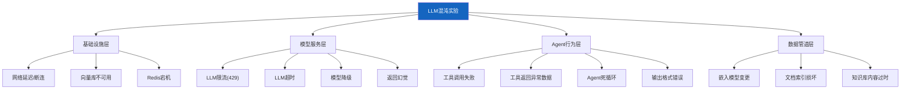

# LLM 应用混沌工程

> 传统混沌工程验证基础设施故障，但 LLM 应用有独特的故障模式：LLM 返回幻觉、工具调用超时、Token 限流、嵌入模型漂移。这份指南讲解如何对 LLM 应用进行混沌实验，主动发现脆弱点。

---

## 一、为什么 LLM 应用需要混沌工程

```mermaid
graph TB
    subgraph 传统故障 {"传统混沌工程关注的故障"}
        T1["网络延迟"]
        T2["磁盘满"]
        T3["进程崩溃"]
        T4["CPU过载"]
    end

    subgraph LLM特有故障 {"LLM应用特有故障"}
        L1["LLM幻觉<br/>返回错误信息"]
        L2["Token限流<br/>429错误"]
        L3["工具调用超时<br/>Agent卡死"]
        L4["嵌入漂移<br/>检索质量下降"]
        L5["模型降级<br/>备用模型能力不足"]
        L6["输出格式错误<br/>JSON解析失败"]
    end

    style 传统故障 fill:#E3F2FD
    style LLM特有故障 fill:#FFCDD2
```

---

## 二、LLM 混沌实验分类



---

## 三、故障注入框架

### 3.1 实验定义

```python
from dataclasses import dataclass, field
from enum import Enum
from typing import Any, Callable, Awaitable

class FaultType(str, Enum):
    # 模型层
    LLM_TIMEOUT = "llm_timeout"
    LLM_RATE_LIMIT = "llm_rate_limit"
    LLM_HALLUCINATION = "llm_hallucination"
    LLM_FORMAT_ERROR = "llm_format_error"
    LLM_DEGRADED = "llm_degraded"
    # 工具层
    TOOL_TIMEOUT = "tool_timeout"
    TOOL_ERROR = "tool_error"
    TOOL_BAD_DATA = "tool_bad_data"
    # 基础设施层
    VECTOR_DB_DOWN = "vector_db_down"
    REDIS_DOWN = "redis_down"
    NETWORK_LATENCY = "network_latency"
    # 数据层
    EMBEDDING_DRIFT = "embedding_drift"
    STALE_KNOWLEDGE = "stale_knowledge"

@dataclass
class ChaosExperiment:
    """混沌实验定义"""
    name: str
    fault_type: FaultType
    description: str
    target: str                        # 故障目标（如"llm", "search_tool"）
    fault_params: dict                 # 故障参数
    steady_state: dict                 # 稳态假设（期望不变的行为）
    duration_seconds: float = 30       # 实验持续时间
    blast_radius: float = 0.1           # 影响范围（0-1，10%流量）
    auto_rollback: bool = True          # 是否自动回滚

@dataclass
class ExperimentResult:
    """实验结果"""
    experiment: ChaosExperiment
    passed: bool                       # 稳态假设是否保持
    metrics: dict                      # 采集的指标
    observations: list[str]            # 观察记录
    recovery_time_s: float = 0          # 恢复时间
    errors: list[str] = field(default_factory=list)
```

### 3.2 故障注入器

```python
import asyncio
import random
import time
from contextlib import asynccontextmanager

class LLMChaosInjector:
    """LLM应用混沌故障注入器。

    在实验期间，拦截关键组件的调用，
    注入预设故障，观察系统行为。
    """

    def __init__(self):
        self.active_faults: dict[str, dict] = {}  # target -> fault config
        self.metrics = {
            "total_calls": 0,
            "faulted_calls": 0,
            "successful_calls": 0,
            "failed_calls": 0,
            "errors": [],
        }

    def activate_fault(self, target: str, fault: dict):
        """激活故障"""
        self.active_faults[target] = fault

    def deactivate_fault(self, target: str):
        """停用故障"""
        self.active_faults.pop(target, None)

    @asynccontextmanager
    async def fault_context(self, target: str, fault: dict):
        """故障上下文管理器：在代码块内激活故障"""
        self.activate_fault(target, fault)
        try:
            yield
        finally:
            self.deactivate_fault(target)

    def should_inject(self, target: str, blast_radius: float = 1.0) -> bool:
        """根据影响范围决定是否注入故障"""
        if target not in self.active_faults:
            return False
        return random.random() < blast_radius

    async def inject_llm_call(
        self,
        target: str,
        original_call: Callable,
        *args, **kwargs
    ) -> Any:
        """拦截LLM调用，注入故障"""
        self.metrics["total_calls"] += 1

        fault = self.active_faults.get(target, {})

        if not fault:
            # 无故障，正常调用
            result = await original_call(*args, **kwargs)
            self.metrics["successful_calls"] += 1
            return result

        fault_type = fault.get("type")
        params = fault.get("params", {})

        self.metrics["faulted_calls"] += 1

        if fault_type == FaultType.LLM_TIMEOUT.value:
            # LLM超时
            timeout = params.get("timeout", 0.001)
            await asyncio.sleep(timeout)
            raise asyncio.TimeoutError(
                f"[CHAOS] LLM timeout injected ({timeout}s)"
            )

        elif fault_type == FaultType.LLM_RATE_LIMIT.value:
            # 限流429
            raise Exception(
                "[CHAOS] 429 Rate Limit Exceeded"
            )

        elif fault_type == FaultType.LLM_HALLUCINATION.value:
            # 幻觉：返回预设的错误回答
            hallucination = params.get(
                "response",
                "根据我的知识，地球是平的。"  # 故意错误的回答
            )
            self.metrics["successful_calls"] += 1
            return hallucination

        elif fault_type == FaultType.LLM_FORMAT_ERROR.value:
            # 格式错误：返回非JSON格式的响应
            bad_format = params.get(
                "response",
                "这是一个回答，但不是JSON格式"
            )
            self.metrics["successful_calls"] += 1
            return bad_format

        elif fault_type == FaultType.LLM_DEGRADED.value:
            # 模型降级：返回低质量回答
            degraded_response = params.get(
                "response",
                "我不确定。"  # 模拟弱模型
            )
            self.metrics["successful_calls"] += 1
            return degraded_response

        else:
            result = await original_call(*args, **kwargs)
            self.metrics["successful_calls"] += 1
            return result

    async def inject_tool_call(
        self,
        tool_name: str,
        original_call: Callable,
        *args, **kwargs
    ) -> Any:
        """拦截工具调用，注入故障"""
        fault = self.active_faults.get(f"tool:{tool_name}", {})
        if not fault:
            return await original_call(*args, **kwargs)

        fault_type = fault.get("type")

        if fault_type == FaultType.TOOL_TIMEOUT.value:
            await asyncio.sleep(fault.get("params", {}).get("delay", 30))
            raise asyncio.TimeoutError(
                f"[CHAOS] Tool {tool_name} timeout"
            )

        elif fault_type == FaultType.TOOL_ERROR.value:
            raise Exception(
                f"[CHAOS] Tool {tool_name} failed: "
                + fault.get("params", {}).get("error", "unknown")
            )

        elif fault_type == FaultType.TOOL_BAD_DATA.value:
            # 返回异常数据
            bad_data = fault.get("params", {}).get(
                "response",
                {"error": "unexpected", "data": None}
            )
            return bad_data

        return await original_call(*args, **kwargs)
```

---

## 四、实验执行引擎

```python
class ChaosExperimentRunner:
    """混沌实验执行引擎"""

    def __init__(self, injector: LLMChaosInjector):
        self.injector = injector
        self.results: list[ExperimentResult] = []

    async def run_experiment(
        self,
        experiment: ChaosExperiment,
        test_function: Callable,  # async def test_func() -> dict
    ) -> ExperimentResult:
        """执行单个混沌实验。

        Args:
            experiment: 实验定义
            test_function: 被测函数，执行正常业务流程

        Returns:
            实验结果
        """
        observations = []
        errors = []

        # 1. 记录实验前稳态
        observations.append(f"实验开始: {experiment.name}")
        observations.append(f"故障类型: {experiment.fault_type.value}")
        observations.append(f"影响范围: {experiment.blast_radius*100}%")

        # 2. 激活故障
        fault_config = {
            "type": experiment.fault_type.value,
            "params": experiment.fault_params,
        }
        self.injector.activate_fault(experiment.target, fault_config)

        # 3. 执行测试
        start = time.time()
        test_metrics = {}
        passed = True

        try:
            # 运行测试函数
            test_metrics = await test_function()
        except Exception as e:
            errors.append(str(e))
            passed = False
        finally:
            # 4. 停用故障
            if experiment.auto_rollback:
                self.injector.deactivate_fault(experiment.target)

        elapsed = time.time() - start

        # 5. 检查稳态假设
        for key, expected in experiment.steady_state.items():
            actual = test_metrics.get(key)
            if actual != expected:
                passed = False
                observations.append(
                    f"❌ 稳态违反: {key} 期望={expected} 实际={actual}"
                )
            else:
                observations.append(
                    f"✅ 稳态保持: {key}={actual}"
                )

        # 6. 构建结果
        result = ExperimentResult(
            experiment=experiment,
            passed=passed,
            metrics={
                **test_metrics,
                **self.injector.metrics,
                "elapsed": round(elapsed, 2),
            },
            observations=observations,
            errors=errors,
        )

        self.results.append(result)
        return result

    async def run_suite(
        self,
        experiments: list[ChaosExperiment],
        test_function: Callable,
    ) -> dict:
        """批量执行实验套件"""
        results = []
        for exp in experiments:
            result = await self.run_experiment(exp, test_function)
            results.append(result)
            # 实验间隔
            await asyncio.sleep(1)

        return {
            "total": len(results),
            "passed": sum(1 for r in results if r.passed),
            "failed": sum(1 for r in results if not r.passed),
            "pass_rate": round(
                sum(1 for r in results if r.passed) / len(results), 4
            ) if results else 0,
            "results": results,
        }
```

---

## 五、实验用例库

```mermaid
graph TB
    subgraph 实验库 {"LLM混沌实验用例库"}
        E1["实验1: LLM超时<br/>验证超时后降级策略"]
        E2["实验2: 限流429<br/>验证重试和退避"]
        E3["实验3: 工具失败<br/>验证Agent容错"]
        E4["实验4: 向量库宕机<br/>验证降级检索"]
        E5["实验5: 幻觉注入<br/>验证护栏检测"]
        E6["实验6: 格式错误<br/>验证解析容错"]
        E7["实验7: 网络延迟<br/>验证流式输出抗延迟"]
        E8["实验8: 嵌入漂移<br/>验证检索质量监控"]
    end

    style 实验库 fill:#E3F2FD
```

### 5.1 定义实验

```python
# 实验1: LLM超时——验证超时后是否有降级策略
exp_llm_timeout = ChaosExperiment(
    name="LLM超时容错测试",
    fault_type=FaultType.LLM_TIMEOUT,
    description="注入LLM超时，验证系统是否正确降级",
    target="llm",
    fault_params={"timeout": 0.001},
    steady_state={
        "fallback_triggered": True,  # 应该触发降级
        "error_handled": True,        # 错误应该被处理
    },
    blast_radius=0.5,
)

# 实验2: 限流——验证重试退避机制
exp_rate_limit = ChaosExperiment(
    name="LLM限流重试测试",
    fault_type=FaultType.LLM_RATE_LIMIT,
    description="注入429限流，验证重试和指数退避",
    target="llm",
    fault_params={},
    steady_state={
        "retried": True,
        "eventual_success": True,  # 重试后应成功
    },
    blast_radius=0.3,
)

# 实验3: 工具调用失败——验证Agent容错
exp_tool_failure = ChaosExperiment(
    name="工具调用失败容错",
    fault_type=FaultType.TOOL_ERROR,
    description="注入工具错误，验证Agent是否能跳过或替代",
    target="tool:web_search",
    fault_params={"error": "Connection refused"},
    steady_state={
        "agent_continued": True,  # Agent应该继续执行
        "error_logged": True,     # 错误应该被记录
    },
    blast_radius=1.0,
)

# 实验4: 向量库不可用——验证降级检索
exp_vector_db_down = ChaosExperiment(
    name="向量库宕机降级测试",
    fault_type=FaultType.VECTOR_DB_DOWN,
    description="模拟向量库不可用，验证是否降级到关键词搜索",
    target="vector_db",
    fault_params={},
    steady_state={
        "fallback_search": True,
        "response_returned": True,
    },
    blast_radius=1.0,
)

# 实验5: 幻觉注入——验证护栏
exp_hallucination = ChaosExperiment(
    name="幻觉检测护栏测试",
    fault_type=FaultType.LLM_HALLUCINATION,
    description="注入错误回答，验证输出护栏是否拦截",
    target="llm",
    fault_params={"response": "地球是平的，这是科学事实。"},
    steady_state={
        "hallucination_blocked": True,  # 护栏应该拦截
    },
    blast_radius=1.0,
)

# 实验6: 格式错误——验证解析容错
exp_format_error = ChaosExperiment(
    name="输出格式错误容错",
    fault_type=FaultType.LLM_FORMAT_ERROR,
    description="注入非JSON格式输出，验证解析容错",
    target="llm",
    fault_params={"response": "这不是JSON格式"},
    steady_state={
        "parse_recovered": True,   # 解析应该恢复
    },
    blast_radius=0.5,
)

CHAOS_EXPERIMENTS = [
    exp_llm_timeout,
    exp_rate_limit,
    exp_tool_failure,
    exp_vector_db_down,
    exp_hallucination,
    exp_format_error,
]
```

---

## 六、稳态假设验证

```python
class SteadyStateValidator:
    """稳态假设验证器"""

    @staticmethod
    def validate_llm_app_health(
        response: Any,
        expected_format: type = str,
        max_latency: float = 10.0,
        actual_latency: float = 0,
    ) -> dict:
        """验证LLM应用稳态。

        Args:
            response: LLM返回
            expected_format: 期望的返回类型
            max_latency: 最大允许延迟
            actual_latency: 实际延迟

        Returns:
            稳态检查结果
        """
        checks = {}

        # 1. 响应存在
        checks["response_exists"] = response is not None

        # 2. 类型正确
        checks["correct_type"] = isinstance(response, expected_format)

        # 3. 延迟可接受
        checks["latency_ok"] = actual_latency <= max_latency

        # 4. 非空
        if isinstance(response, str):
            checks["non_empty"] = len(response.strip()) > 0

        all_passed = all(checks.values())

        return {
            "steady_state": all_passed,
            "checks": checks,
            "response_preview": str(response)[:100] if response else None,
        }
```

---

## 七、自动化实验调度

```mermaid
graph TB
    subgraph 调度 {"混沌实验自动化调度"}
        TRIGGER["触发器"] --> SELECT["选择实验"]
        SELECT --> NOTIFY["通知团队<br/>实验即将开始"]
        NOTIFY --> SNAP["记录稳态快照"]
        SNAP --> INJECT["注入故障"]
        INJECT --> MONITOR["监控指标<br/>延迟/错误率/恢复时间"]
        MONITOR --> VALIDATE{"验证稳态"}
        VALIDATE -->|通过| PASS["✅ 实验 PASS"]
        VALIDATE -->|违反| FAIL["❌ 实验 FAIL"]
        FAIL --> ALERT["告警+人工介入"]
        INJECT -->|超时| ROLLBACK["自动回滚"]
    end

    style TRIGGER fill:#E3F2FD
    style INJECT fill:#FFCDD2
    style PASS fill:#C8E6C9
    style FAIL fill:#FFCDD2
    style ROLLBACK fill:#FFF9C4
```

---

## 八、实验报告生成

```python
def generate_chaos_report(results: list[ExperimentResult]) -> str:
    """生成混沌实验报告"""
    total = len(results)
    passed = sum(1 for r in results if r.passed)
    failed = total - passed

    report = f"""# 混沌实验报告

## 总览
- 实验总数: {total}
- 通过: {passed}
- 失败: {failed}
- 通过率: {passed/total*100:.1f}%

## 详细结果
"""
    for r in results:
        status = "✅ PASS" if r.passed else "❌ FAIL"
        report += f"\n### {r.experiment.name} — {status}\n"
        report += f"- 故障: {r.experiment.fault_type.value}\n"
        report += f"- 耗时: {r.metrics.get('elapsed', 0)}s\n"
        report += f"- 观察记录:\n"
        for obs in r.observations:
            report += f"  - {obs}\n"
        if r.errors:
            report += f"- 错误:\n"
            for err in r.errors:
                report += f"  - {err}\n"

    return report
```

---

## 九、最佳实践

| 实践 | 说明 | 优先级 |
|------|------|--------|
| 从小爆炸半径开始 | 先影响1%流量，确认安全再扩大 | ★★★ |
| 必须有自动回滚 | 实验超时自动停止故障注入 | ★★★ |
| 先在预发环境跑 | 生产环境需充分授权 | ★★★ |
| 每次只注入一个故障 | 多故障同时注入难以归因 | ★★☆ |
| 记录完整快照 | 实验前后指标对比 | ★★☆ |
| 定期执行形成基线 | 月度/季度执行，跟踪系统韧性变化 | ★★☆ |

---

## 十、检查清单

| 检查项 | 状态 |
|--------|------|
| 定义了至少5个LLM特有混沌实验 | ☐ |
| 实现了故障注入器 | ☐ |
| 有稳态假设验证机制 | ☐ |
| 配置了自动回滚 | ☐ |
| 实验有爆炸半径控制 | ☐ |
| 有实验报告自动生成 | ☐ |
| 实验纳入定期执行计划 | ☐ |
| 团队有明确的实验授权流程 | ☐ |
