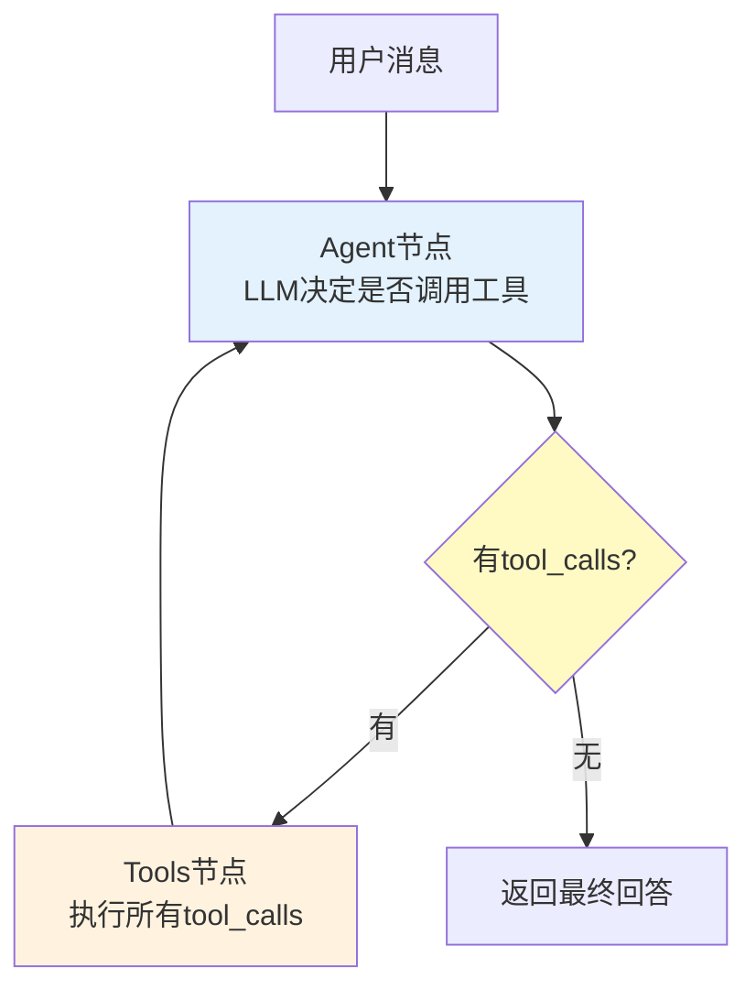
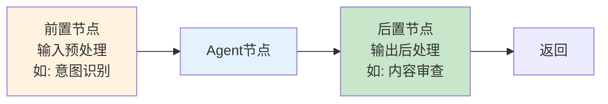
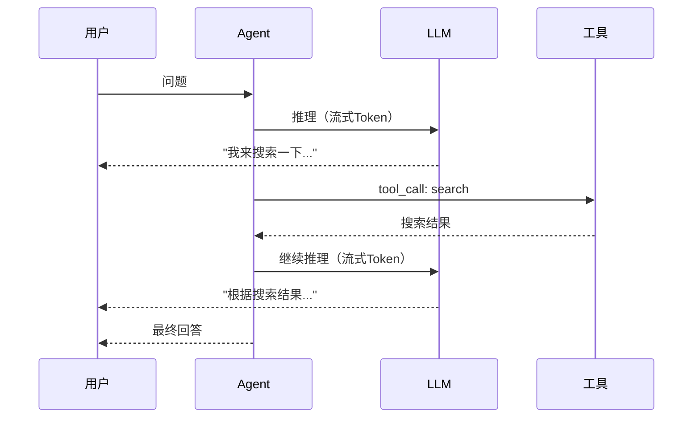
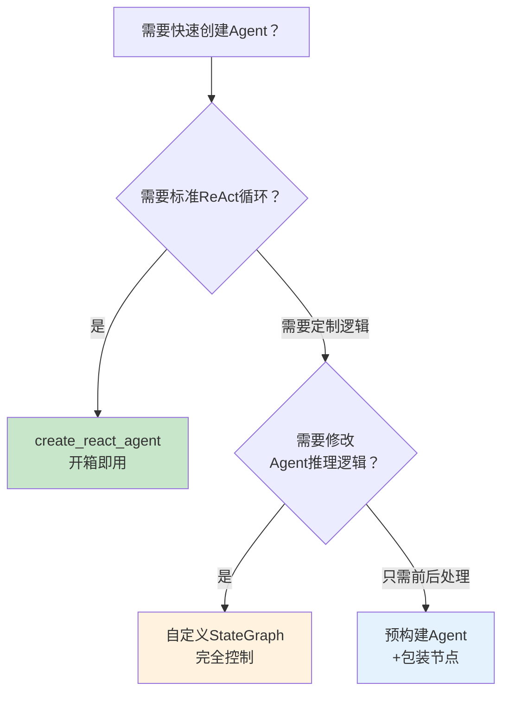

# LangGraph 预构建 Agent 与 create_react_agent

> 手动构建 ReAct 循环需要写节点、边、条件路由——代码量大且容易出错。LangGraph 提供了预构建 Agent，一行代码就能跑起来一个功能完整的工具调用 Agent。这份指南讲透 create_react_agent 和 ToolNode 的用法、配置和定制方法。

---

## 一、预构建 Agent 解决什么问题

```mermaid
graph TB
    subgraph 手动构建 {"手动构建ReAct Agent需要什么"}
        M1["定义State TypedDict"] --> M2["写agent节点<br/>调用LLM+绑定工具"]
        M2 --> M3["写tools节点<br/>执行工具调用"]
        M3 --> M4["add_node注册"]
        M4 --> M5["add_edge连线"]
        M5 --> M6["条件边: 有tool_calls→tools<br/>无tool_calls→END"]
        M6 --> M7["compile()"]
    end

    subgraph 预构建 {"create_react_agent一行搞定"}
        P1["create_react_agent(model, tools)"] --> P2["自动处理以上全部"]
    end

    style 手动构建 fill:#FFCDD2
    style 预构建 fill:#C8E6C9
```

---

## 二、create_react_agent 基本用法

### 2.1 最简示例

```python
from langchain_openai import ChatOpenAI
from langchain_core.tools import tool
from langgraph.prebuilt import create_react_agent

# 定义工具
@tool
def search(query: str) -> str:
    """搜索网络获取信息"""
    # 实际实现接入搜索API
    return f"搜索结果: {query}"

@tool
def calculate(expression: str) -> str:
    """计算数学表达式"""
    try:
        result = eval(expression)  # 生产环境用安全的计算器
        return str(result)
    except Exception as e:
        return f"计算错误: {e}"

# 创建Agent——就这一行
model = ChatOpenAI(model="gpt-4o")
agent = create_react_agent(model, [search, calculate])

# 执行
result = agent.invoke({
    "messages": [{"role": "user", "content": "2024年中国GDP是多少万亿？除以14亿人口后人均多少？"}]
})

# 返回完整消息历史
for msg in result["messages"]:
    print(f"{msg.__class__.__name__}: {msg.content[:100]}")
```

### 2.2 执行流程



---

## 三、State 结构

create_react_agent 自动创建的 State 包含以下字段：

```python
from typing import TypedDict, Annotated
from langchain_core.messages import AnyMessage
from langgraph.graph.message import add_messages

class AgentState(TypedDict):
    # 消息历史，add_messages reducer自动追加
    messages: Annotated[list[AnyMessage], add_messages]
```

```mermaid
graph LR
    subgraph State流转 {"消息如何在State中流转"}
        U["用户消息"] --> S1["messages: [user]"]
        S1 --> A["Agent: LLM生成回复"]
        A --> S2["messages: [user, ai(tool_calls)]"]
        S2 --> T["Tools: 执行工具"]
        T --> S3["messages: [user, ai(tool_calls), tool(result)]"]
        S3 --> A
        A --> S4["messages: [..., ai(final_answer)]"]
    end

    style S1 fill:#E3F2FD
    style S2 fill:#FFF3E0
    style S3 fill:#FFF9C4
    style S4 fill:#C8E6C9
```

---

## 四、配置选项详解

### 4.1 指定系统提示

```python
agent = create_react_agent(
    model,
    [search, calculate],
    # 方式1: 直接指定提示
    prompt="你是一个专业的金融分析助手。只回答金融相关问题。如果问题超出范围，请说明。",
)

# 方式2: 使用函数动态生成提示（支持多租户等场景）
from langchain_core.messages import SystemMessage

def get_system_prompt(state):
    user_id = state.get("user_id", "default")
    # 根据用户返回不同提示
    if user_id == "vip":
        return SystemMessage(content="你是VIP专属助手，提供优先服务。")
    return SystemMessage(content="你是通用助手。")

agent_with_dynamic_prompt = create_react_agent(
    model,
    [search, calculate],
    prompt=get_system_prompt,
)
```

### 4.2 结构化输出

```python
from pydantic import BaseModel, Field

class ResearchResult(BaseModel):
    """研究结果结构化输出"""
    summary: str = Field(description="研究总结")
    key_findings: list[str] = Field(description="关键发现列表")
    confidence: float = Field(description="置信度0-1", ge=0, le=1)
    sources: list[str] = Field(description="信息来源")

# Agent最终输出会自动解析为ResearchResult
structured_agent = create_react_agent(
    model,
    [search],
    structured_response=ResearchResult,
)

result = structured_agent.invoke({
    "messages": [{"role": "user", "content": "研究2024年AI Agent市场趋势"}]
})

# result["structured_response"] 是ResearchResult对象
print(result["structured_response"].summary)
print(result["structured_response"].key_findings)
```

### 4.3 消息截断与上下文管理

```mermaid
graph TB
    subgraph 截断策略 {"消息历史截断"}
        BEFORE["截断前: 50条消息<br/>可能超出上下文窗口"]
        BEFORE --> STRATEGY{"截断策略"}
        STRATEGY -->|保留最近N条| KEEP_N["保留最近10条<br/>丢弃早期消息"]
        STRATEGY -->|保留首尾| KEEP_FRIST_LAST["保留首条+最后N条<br/>保留任务上下文"]
        STRATEGY -->|摘要压缩| SUMMARIZE["早期消息→摘要<br/>保留最近原文"]
    end

    style BEFORE fill:#FFCDD2
    style KEEP_N fill:#E3F2FD
    style KEEP_FRIST_LAST fill:#FFF3E0
    style SUMMARIZE fill:#C8E6C9
```

```python
from langgraph.prebuilt import create_react_agent

agent = create_react_agent(
    model,
    [search, calculate],
    # 限制消息历史长度
    messages_modifier=lambda messages: messages[-20:],  # 保留最近20条
)
```

---

## 五、添加记忆与持久化

```python
from langgraph.checkpoint.memory import MemorySaver
from langgraph.checkpoint.sqlite import SqliteSaver
from langgraph.store.memory import InMemoryStore

# 短期记忆：线程内对话记忆
checkpointer = MemorySaver()

# 长期记忆：跨线程持久存储
store = InMemoryStore()  # 生产用持久化存储

agent = create_react_agent(
    model,
    [search, calculate],
    checkpointer=checkpointer,
    store=store,
)

# 线程内记忆：同一thread_id共享上下文
config = {"configurable": {"thread_id": "conversation-1"}}

# 第一轮
result1 = agent.invoke(
    {"messages": [{"role": "user", "content": "我叫张三"}]},
    config,
)

# 第二轮——Agent记得上一轮
result2 = agent.invoke(
    {"messages": [{"role": "user", "content": "我叫什么名字？"}]},
    config,
)
# → "你叫张三"

# 不同thread_id——不共享记忆
result3 = agent.invoke(
    {"messages": [{"role": "user", "content": "我叫什么名字？"}]},
    {"configurable": {"thread_id": "conversation-2"}},
)
# → "不知道你的名字"
```

```mermaid
graph TB
    subgraph 记忆层次 {"两层记忆"}
        SHORT["短期记忆<br/>Checkpointer<br/>同一thread_id内共享<br/>对话历史"]
        LONG["长期记忆<br/>Store<br/>跨thread_id共享<br/>用户画像/偏好"]
    end

    U1["对话A<br/>thread=1"] --> SHORT
    U2["对话B<br/>thread=1"] --> SHORT
    U3["对话C<br/>thread=2"] --> SHORT
    SHORT -.->|"thread不同<br/>不共享"| U3

    U1 & U2 & U3 --> LONG
    LONG -->|"所有线程<br/>共享"| U1
    LONG -->|"所有线程<br/>共享"| U2

    style SHORT fill:#E3F2FD
    style LONG fill:#FFF3E0
```

---

## 六、人机交互：中断与审批

```python
from langgraph.types import interrupt, Command
from langgraph.prebuilt import create_react_agent
from langchain_core.tools import tool

@tool
def send_email(to: str, subject: str, body: str) -> str:
    """发送邮件——需要人工审批"""
    # 中断执行，等待人工审批
    approval = interrupt({
        "type": "email_approval",
        "to": to,
        "subject": subject,
        "body": body[:200],
    })

    if approval.get("approved"):
        # 实际发送邮件
        return f"邮件已发送给{to}"
    return "邮件被拒绝"

agent = create_react_agent(
    model,
    [send_email],
    checkpointer=MemorySaver(),
)

config = {"configurable": {"thread_id": "email-1"}}

# 第一次调用——会暂停在send_email处
result = agent.invoke(
    {"messages": [{"role": "user", "content": "给老板发邮件请假，主题'请假申请'"}]},
    config,
)
# → 返回interrupt信息

# 人工审批后恢复执行
result = agent.invoke(
    Command(resume={"approved": True}),
    config,
)
```

---

## 七、ToolNode 详解

```mermaid
graph TB
    subgraph ToolNode {"ToolNode: 批量执行工具"}
        INPUT["收到ai_message<br/>含多个tool_calls"] --> PARSE["解析每个tool_call"]
        PARSE --> EXEC1["执行tool_call_1"]
        PARSE --> EXEC2["执行tool_call_2"]
        EXEC1 & EXEC2 --> COLLECT["收集所有结果"]
        COLLECT --> OUTPUT["返回tool_messages<br/>每个tool_call一个结果"]
    end

    style PARSE fill:#FFF9C4
    style EXEC1 fill:#E3F2FD
    style EXEC2 fill:#E3F2FD
    style COLLECT fill:#FFF3E0
    style OUTPUT fill:#C8E6C9
```

```python
from langgraph.prebuilt import ToolNode
from langchain_core.messages import AIMessage, ToolCall

# ToolNode可以独立使用
tool_node = ToolNode([search, calculate])

# 手动调用ToolNode
ai_msg = AIMessage(
    content="",
    tool_calls=[
        {"name": "search", "args": {"query": "Python"}, "id": "call_1"},
        {"name": "calculate", "args": {"expression": "2+3"}, "id": "call_2"},
    ],
)

result = tool_node.invoke({"messages": [ai_msg]})
# 返回: {"messages": [ToolMessage("搜索结果: Python"), ToolMessage("5")]}
```

### 7.1 工具错误处理

```python
from langgraph.prebuilt import ToolNode

# ToolNode自动处理工具执行错误
# 默认: 异常会被捕获并作为ToolMessage返回错误信息
# Agent看到错误信息后可以自我修正

@tool
def divide(a: float, b: float) -> str:
    """除法计算"""
    if b == 0:
        raise ValueError("除数不能为零")
    return str(a / b)

agent = create_react_agent(model, [divide])

# Agent尝试除以零——会收到错误信息并自我修正
result = agent.invoke({
    "messages": [{"role": "user", "content": "10除以0等于多少？如果出错请换一种方式计算"}]
})
# Agent: 尝试divide(10, 0) → 收到错误 → 换一种方式回答
```

---

## 八、定制预构建 Agent

### 8.1 添加前置/后置处理节点



```python
from langgraph.graph import StateGraph, START, END
from langgraph.prebuilt import create_react_agent
from langchain_core.messages import HumanMessage, SystemMessage
from typing import TypedDict, Annotated
from langgraph.graph.message import add_messages

# 创建预构建Agent
base_agent = create_react_agent(model, [search, calculate])

# 定义扩展State
class ExtendedState(TypedDict):
    messages: Annotated[list, add_messages]
    intent: str  # 新增字段: 用户意图

# 前置节点: 意图识别
async def intent_node(state: ExtendedState) -> dict:
    last_msg = state["messages"][-1]
    user_input = last_msg.content if hasattr(last_msg, "content") else str(last_msg)

    # 简单意图分类
    if "计算" in user_input or "多少" in user_input:
        intent = "calculation"
    elif "搜索" in user_input or "查询" in user_input:
        intent = "search"
    else:
        intent = "general"

    return {"intent": intent}

# 后置节点: 输出审查
async def review_node(state: ExtendedState) -> dict:
    last_msg = state["messages"][-1]
    content = last_msg.content if hasattr(last_msg, "content") else ""

    # 简单内容审查
    forbidden = ["密码", "信用卡号"]
    for word in forbidden:
        if word in content:
            return {"messages": [HumanMessage(content="抱歉，回答包含敏感信息，已被过滤。")]}

    return {}  # 通过审查，不修改

# 组装完整工作流
workflow = StateGraph(ExtendedState)
workflow.add_node("intent", intent_node)
workflow.add_node("agent", base_agent)
workflow.add_node("review", review_node)

workflow.add_edge(START, "intent")
workflow.add_edge("intent", "agent")
workflow.add_edge("agent", "review")
workflow.add_edge("review", END)

app = workflow.compile()
```

### 8.2 替换默认 Agent 节点

```python
from langgraph.prebuilt import ToolNode
from langgraph.graph import StateGraph, START, END
from langgraph.graph.message import add_messages
from typing import TypedDict, Annotated

class CustomState(TypedDict):
    messages: Annotated[list, add_messages]

# 自定义Agent节点（替代默认的LLM调用）
async def custom_agent_node(state: CustomState) -> dict:
    messages = state["messages"]

    # 可以在调用LLM前做额外处理
    # 如: 添加动态系统提示、检索增强等
    system_msg = SystemMessage(content="你是一个谨慎的助手，回答前请三思。")
    full_messages = [system_msg] + messages

    # 绑定工具后调用LLM
    model_with_tools = model.bind_tools([search, calculate])
    response = await model_with_tools.ainvoke(full_messages)

    return {"messages": [response]}

# 用ToolNode处理工具调用
tool_node = ToolNode([search, calculate])

# 条件路由
def should_use_tools(state: CustomState) -> str:
    last_msg = state["messages"][-1]
    if hasattr(last_msg, "tool_calls") and last_msg.tool_calls:
        return "tools"
    return "end"

# 组装
graph = StateGraph(CustomState)
graph.add_node("agent", custom_agent_node)
graph.add_node("tools", tool_node)

graph.add_edge(START, "agent")
graph.add_conditional_edges("agent", should_use_tools, {
    "tools": "tools",
    "end": END,
})
graph.add_edge("tools", "agent")  # 工具执行后回到Agent

custom_agent = graph.compile()
```

---

## 九、多模型配置

```python
# 主模型+备用模型
from langchain_openai import ChatOpenAI
from langchain_anthropic import ChatAnthropic

# 路由函数: 根据任务复杂度选模型
def select_model(complexity: str):
    if complexity == "high":
        return ChatOpenAI(model="gpt-4o")  # 强模型
    elif complexity == "medium":
        return ChatAnthropic(model="claude-3-5-sonnet")
    else:
        return ChatOpenAI(model="gpt-4o-mini")  # 快速模型

# 创建Agent时绑定主模型
# 运行时通过配置覆盖
agent = create_react_agent(
    ChatOpenAI(model="gpt-4o"),
    [search, calculate],
)

# 通过configurable动态切换模型
from langchain_core.runnables import ConfigurableField

agent_with_config = agent.configurable_fields(
    # LangGraph支持运行时配置覆盖
)
```

---

## 十、流式输出

```python
# 流式输出Token
async def stream_agent():
    async for event in agent.astream_events(
        {"messages": [{"role": "user", "content": "解释量子计算"}]},
        version="v2",
    ):
        kind = event["event"]

        if kind == "on_chat_model_stream":
            # LLM Token流式输出
            chunk = event["data"]["chunk"]
            print(chunk.content, end="", flush=True)

        elif kind == "on_tool_start":
            print(f"\n[工具开始: {event['name']}]")

        elif kind == "on_tool_end":
            print(f"[工具完成: {event['name']}]")

        elif kind == "on_chain_end" and event["name"] == "LangGraph":
            print("\n[Agent完成]")

# 也可以流式输出消息级别
async def stream_messages():
    async for msg, metadata in agent.astream(
        {"messages": [{"role": "user", "content": "搜索AI最新进展并总结"}]},
        stream_mode="messages",
    ):
        msg_type = msg.__class__.__name__
        if msg_type == "AIMessageChunk":
            print(msg.content, end="", flush=True)
        elif msg_type == "ToolMessage":
            print(f"\n[工具结果: {msg.content[:50]}]")
```



---

## 十一、预构建 Agent vs 自定义图



| 场景 | 推荐 | 理由 |
|------|------|------|
| 快速原型 | create_react_agent | 一行代码，标准ReAct |
| 需要工具调用Agent | create_react_agent | 内置工具循环 |
| 需要自定义推理逻辑 | 自定义StateGraph | 完全控制LLM调用 |
| 需要前后处理 | 预构建+包装节点 | 复用Agent逻辑 |
| 多Agent协作 | 自定义StateGraph | 需要编排多个Agent |
| 需要结构化输出 | create_react_agent + structured_response | 原生支持 |

---

## 十二、最佳实践

| 实践 | 说明 | 优先级 |
|------|------|--------|
| 工具描述要清晰 | Agent靠工具描述决定何时调用 | ★★★ |
| 工具参数用Pydantic | 类型约束减少参数错误 | ★★★ |
| 设置max_iterations | 防止Agent死循环 | ★★★ |
| 配置checkpointer | 支持对话记忆和中断恢复 | ★★☆ |
| 用结构化输出 | 最终输出可控、可解析 | ★★☆ |
| 工具数量不超过10个 | 太多工具影响Agent决策准确率 | ★★☆ |
| 流式输出提升体验 | 用户看到实时进展 | ★★☆ |

---

## 十三、检查清单

| 检查项 | 状态 |
|--------|------|
| 能用 create_react_agent 创建 Agent | ☐ |
| 理解自动State的messages字段和reducer | ☐ |
| 能配置系统提示和结构化输出 | ☐ |
| 能配置checkpointer实现对话记忆 | ☐ |
| 能用interrupt实现人机交互 | ☐ |
| 理解ToolNode的工作原理 | ☐ |
| 能在预构建Agent外包装自定义节点 | ☐ |
| 能流式输出Agent响应 | ☐ |
| 知道何时用预构建vs自定义图 | ☐ |
