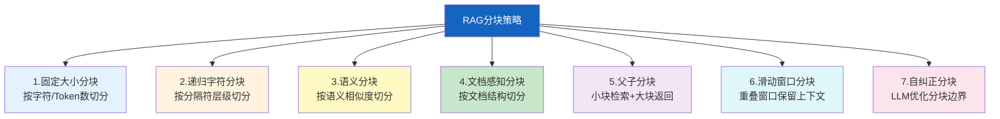
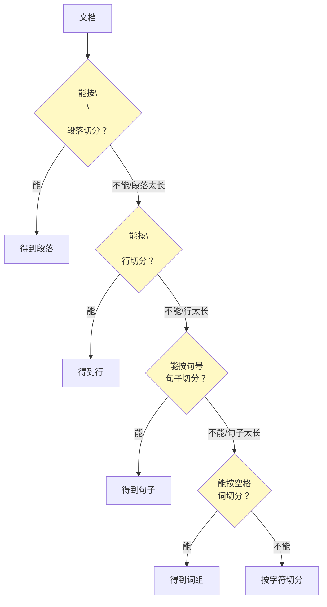
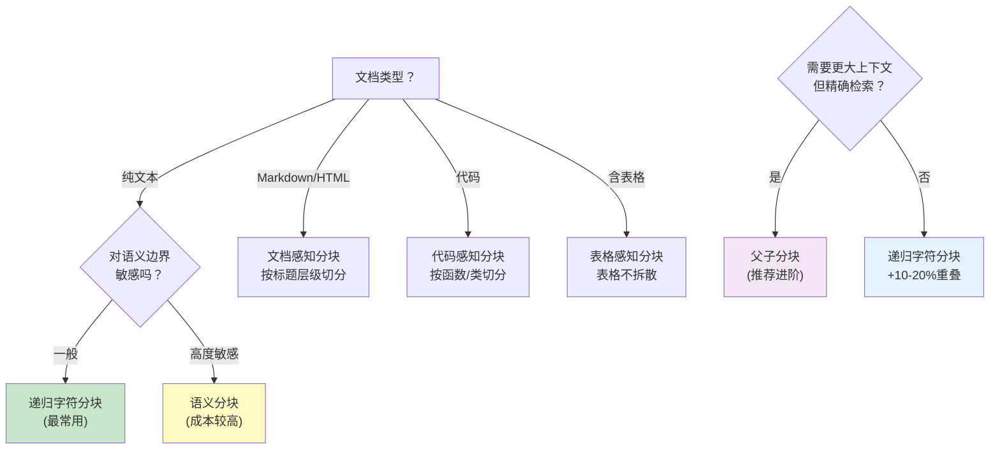

# RAG 分块策略深度指南

> 分块（Chunking）是 RAG 中最容易被低估、但对检索质量影响最大的环节。分块太大，检索到无关内容稀释信号；分块太小，丢失上下文。这份指南系统讲解 7 种分块策略、选型决策和效果评估。

---

## 一、为什么分块决定了 RAG 质量

```mermaid
graph TB
    subgraph 问题 {"分块不当的后果"}
        TOO_BIG["分块太大"] --> TB1["一个块含多个主题<br/>检索信号被稀释"]
        TB1 --> TB2["LLM上下文被无关内容占据<br/>回答质量下降"]

        TOO_SMALL["分块太小"] --> TS1["上下文不完整<br/>LLM只见树木不见森林"]
        TS1 --> TS2["检索需要更多块<br/>延迟和成本上升"]

        BAD_SPLIT["分块位置不对"] --> BS1["句子被截断<br/>语义断裂"]
        BS1 --> BS2["表格/代码被拆散<br/>信息丢失"]
    end

    style TOO_BIG fill:#FFCDD2
    style TOO_SMALL fill:#FFE0B2
    style BAD_SPLIT fill:#FFCDD2
```

---

## 二、7 种分块策略总览



---

## 三、策略1：固定大小分块

最简单的分块方式，按固定字符数或Token数切分。

```mermaid
graph LR
    subgraph 固定分块 {"固定大小分块 (500字符)"}
        DOC["原始文档 2000字符"] --> C1["块1: 字符1-500"]
        DOC --> C2["块2: 字符501-1000"]
        DOC --> C3["块3: 字符1001-1500"]
        DOC --> C4["块4: 字符1501-2000"]
    end

    style 固定分块 fill:#E3F2FD
```

```python
from langchain_text_splitters import CharacterTextSplitter

# 固定字符数分块
splitter = CharacterTextSplitter(
    separator="\n\n",      # 优先在段落边界切分
    chunk_size=500,        # 每块最多500字符
    chunk_overlap=50,      # 相邻块重叠50字符
)

chunks = splitter.split_text(long_text)
```

| 优点 | 缺点 | 适合场景 |
|------|------|----------|
| 实现简单，速度快 | 可能在句子中间截断 | 格式统一的纯文本 |
| 块大小可预测 | 不考虑语义边界 | 日志、简单文档 |

---

## 四、策略2：递归字符分块（最常用）

按分隔符优先级递归切分：先尝试段落分隔符，切不动再试句子，再试词。



```python
from langchain_text_splitters import RecursiveCharacterTextSplitter

# 递归字符分块——最常用的分块策略
splitter = RecursiveCharacterTextSplitter(
    chunk_size=1000,        # 每块最多1000字符
    chunk_overlap=100,      # 相邻块重叠100字符
    separators=[
        "\n\n",   # 段落分隔（最优先）
        "\n",     # 换行
        "。",     # 中文句号
        ".",      # 英文句号
        "！",     # 中文感叹号
        "!",      # 英文感叹号
        "？",     # 中文问号
        "?",      # 英文问号
        "；",     # 中文分号
        ";",      # 英文分号
        "，",     # 中文逗号
        ",",      # 英文逗号
        " ",      # 空格
        "",       # 字符（最后兜底）
    ],
)

chunks = splitter.split_text(long_text)
```

---

## 五、策略3：语义分块

不再按字符数切分，而是计算相邻句子的语义相似度，在相似度骤降处切分。

```mermaid
graph TB
    subgraph 语义分块 {"语义分块原理"}
        S1["句子1: Python是编程语言"] --> SIM1["语义相似度高"]
        S2["句子2: 它支持面向对象"] --> SIM1
        SIM1 --> KEEP["保持同一块"]

        S3["句子3: 今天天气很好"] --> SIM2["语义相似度低"]
        SIM2 --> SPLIT["✂️ 在此切分"]

        S4["句子4: 温度25度"] --> SIM3["语义相似度高"]
        S5["句子5: 适合户外活动"] --> SIM3
        SIM3 --> KEEP2["保持同一块"]
    end

    style SIM1 fill:#C8E6C9
    style SIM2 fill:#FFCDD2
    style SIM3 fill:#C8E6C9
    style SPLIT fill:#FFCDD2
```

```python
from langchain_experimental.text_splitter import SemanticChunker
from langchain_openai import OpenAIEmbeddings

# 语义分块器
semantic_splitter = SemanticChunker(
    OpenAIEmbeddings(),
    # 切分阈值策略
    breakpoint_threshold_type="percentile",  # 按百分位
    breakpoint_threshold_amount=95,          # 相似度差异>95百分位时切分
)

chunks = semantic_splitter.split_text(long_text)
```

| 阈值策略 | 说明 | 效果 |
|----------|------|------|
| percentile | 相似度差异最大的5%处切分 | 自适应 |
| standard_deviation | 差异超过1标准差时切分 | 统计驱动 |
| interquartile | 用四分位距检测异常值切分 | 抗噪声 |
| gradient | 相似度梯度变化最大处切分 | 精细 |

```python
# 不同阈值策略的对比
for threshold_type in ["percentile", "standard_deviation", "interquartile", "gradient"]:
    splitter = SemanticChunker(
        OpenAIEmbeddings(),
        breakpoint_threshold_type=threshold_type,
    )
    chunks = splitter.split_text(sample_text)
    print(f"{threshold_type}: {len(chunks)}块, 平均{len(''.join(chunks))//len(chunks)}字符")
```

---

## 六、策略4：文档感知分块

按文档的天然结构切分，保留标题层级、表格、代码块等。

### 6.1 Markdown 分块

```python
from langchain_text_splitters import MarkdownHeaderTextSplitter

# 按Markdown标题层级切分
md_splitter = MarkdownHeaderTextSplitter(
    headers_to_split_on=[
        ("#", "Header 1"),
        ("##", "Header 2"),
        ("###", "Header 3"),
    ],
)

md_chunks = md_splitter.split_text(markdown_text)

# 每个chunk自动携带标题元数据
for chunk in md_chunks:
    print(f"标题: {chunk.metadata}")
    print(f"内容: {chunk.page_content[:80]}")
    print("---")
```

```mermaid
graph TB
    subgraph Markdown分块 {"Markdown结构感知分块"}
        H1["# 第一章"] --> C1["块1: 第一章内容<br/>metadata: {Header 1: 第一章}"]
        H2["## 1.1 背景"] --> C2["块2: 背景内容<br/>metadata: {Header 1: 第一章, Header 2: 1.1 背景}"]
        H3["### 1.1.1 历史"] --> C3["块3: 历史内容<br/>metadata: {H1: 第一章, H2: 1.1, H3: 历史}"]
        H4["## 1.2 现状"] --> C4["块4: 现状内容<br/>metadata: {H1: 第一章, H2: 1.2 现状}"]
    end

    style Markdown分块 fill:#C8E6C9
```

### 6.2 代码分块

```python
from langchain_text_splitters import RecursiveCharacterTextSplitter, Language

# 按代码语法结构切分
python_splitter = RecursiveCharacterTextSplitter.from_language(
    language=Language.PYTHON,
    chunk_size=1000,
    chunk_overlap=100,
)

code_chunks = python_splitter.split_text(python_code)
# 在函数/类边界切分，不会把函数拆散

# 支持的语言
languages = [
    Language.PYTHON, Language.JAVA, Language.JAVASCRIPT,
    Language.GO, Language.RUST, Language.CPP,
    Language.HTML, Language.SQL, Language.MARKDOWN,
]
```

### 6.3 表格感知分块

```python
def chunk_with_tables(text: str, max_chunk_size: int = 1000) -> list[dict]:
    """表格感知分块：表格不被拆散。

    确保完整的表格保留在一个块中，
    文本部分用递归分块。
    """
    import re
    from langchain_text_splitters import RecursiveCharacterTextSplitter

    # 正则匹配Markdown表格
    table_pattern = r'(\|.+\|\n\|[-: |]+\|\n(?:\|.+\|\n?)+)'
    tables = re.findall(table_pattern, text)

    # 用占位符替换表格
    text_without_tables = text
    table_map = {}
    for i, table in enumerate(tables):
        placeholder = f"[[TABLE_{i}]]"
        table_map[placeholder] = table
        text_without_tables = text_without_tables.replace(table, placeholder)

    # 对非表格文本分块
    text_splitter = RecursiveCharacterTextSplitter(
        chunk_size=max_chunk_size,
        chunk_overlap=100,
    )
    text_chunks = text_splitter.split_text(text_without_tables)

    # 恢复表格
    result = []
    for chunk in text_chunks:
        for placeholder, table in table_map.items():
            if placeholder in chunk:
                chunk = chunk.replace(placeholder, table)
        result.append({"content": chunk, "has_table": "[[TABLE" in chunk})

    return result
```

---

## 七、策略5：父子分块（Small-to-Big）

```mermaid
graph TB
    subgraph 父子分块 {"父子分块策略"}
        subgraph 离线 {"离线建库"}
            DOC["文档"] --> SPLIT1["切分为大块（父块）<br/>1000字符/块"]
            SPLIT1 --> SPLIT2["每个父块再切为小块（子块）<br/>200字符/块"]
            SPLIT2 --> INDEX["子块→嵌入向量<br/>存入向量库"]
            SPLIT1 --> STORE["父块→文档库<br/>不嵌入"]
        end

        subgraph 在线 {"在线检索"}
            Q["查询"] --> SEARCH["用子块向量检索<br/>找到最相似的子块"]
            SEARCH --> MAP["子块→父块映射"]
            MAP --> RETURN["返回父块（更大的上下文）"]
        end
    end

    style 离线 fill:#E3F2FD
    style 在线 fill:#FFF3E0
    style SEARCH fill:#FFF9C4
```

```python
from langchain_core.documents import Document
from langchain_core.vectorstores import InMemoryVectorStore
from langchain_openai import OpenAIEmbeddings
import uuid

class ParentChildChunker:
    """父子分块检索器。

    核心思想：
    - 小块（子块）用于检索：语义精确，嵌入质量高
    - 大块（父块）用于生成：提供完整上下文
    """

    def __init__(
        self,
        embeddings: OpenAIEmbeddings,
        parent_chunk_size: int = 1000,
        child_chunk_size: int = 200,
        child_overlap: int = 50,
    ):
        self.embeddings = embeddings
        self.parent_size = parent_chunk_size
        self.child_size = child_chunk_size
        self.child_overlap = child_overlap

        # 子块向量库（用于检索）
        self.vector_store = InMemoryVectorStore(embeddings)
        # 父块文档库（用于返回）
        self.parent_store: dict[str, Document] = {}

    def add_documents(self, texts: list[str], metadata: dict = None):
        """添加文档，自动创建父子分块"""
        from langchain_text_splitters import RecursiveCharacterTextSplitter

        # 1. 切分为父块
        parent_splitter = RecursiveCharacterTextSplitter(
            chunk_size=self.parent_size,
            chunk_overlap=0,
        )
        parent_chunks = parent_splitter.split_text("\n\n".join(texts))

        # 2. 切分为子块
        child_splitter = RecursiveCharacterTextSplitter(
            chunk_size=self.child_size,
            chunk_overlap=self.child_overlap,
        )

        child_docs = []
        for parent_idx, parent_text in enumerate(parent_chunks):
            parent_id = str(uuid.uuid4())

            # 存储父块
            self.parent_store[parent_id] = Document(
                page_content=parent_text,
                metadata={
                    "parent_id": parent_id,
                    "parent_index": parent_idx,
                    **(metadata or {}),
                },
            )

            # 切分子块
            child_texts = child_splitter.split_text(parent_text)
            for child_idx, child_text in enumerate(child_texts):
                child_docs.append(Document(
                    page_content=child_text,
                    metadata={
                        "parent_id": parent_id,
                        "child_index": child_idx,
                        **(metadata or {}),
                    },
                ))

        # 3. 子块嵌入向量库
        self.vector_store.add_documents(child_docs)

    def retrieve(self, query: str, k: int = 5) -> list[Document]:
        """检索：用子块检索，返回父块"""
        # 用子块检索
        child_results = self.vector_store.similarity_search(query, k=k)

        # 去重：同一个父块只返回一次
        seen_parents = set()
        parent_results = []
        for child in child_results:
            parent_id = child.metadata.get("parent_id")
            if parent_id and parent_id not in seen_parents:
                seen_parents.add(parent_id)
                parent_doc = self.parent_store.get(parent_id)
                if parent_doc:
                    parent_results.append(parent_doc)

        return parent_results
```

---

## 八、策略6：滑动窗口分块

```mermaid
graph TB
    subgraph 滑动窗口 {"滑动窗口+重叠"}
        W1["窗口1: [1-500]"]
        W2["窗口2: [400-900]<br/>重叠100字符"]
        W3["窗口3: [800-1300]<br/>重叠100字符"]
        W4["窗口4: [1200-1700]"]

        W1 --> O1["重叠区域<br/>保留上下文连续性"]
        W2 --> O1
        W2 --> O2["重叠区域"]
        W3 --> O2

    end

    style O1 fill:#FFF9C4
    style O2 fill:#FFF9C4
```

```python
from langchain_text_splitters import RecursiveCharacterTextSplitter

# 滑动窗口本质就是设置chunk_overlap
splitter = RecursiveCharacterTextSplitter(
    chunk_size=500,
    chunk_overlap=100,  # 20%重叠率
)
# 重叠确保一个概念跨块时不会完全丢失
```

| 重叠率 | 效果 | 代价 |
|--------|------|------|
| 0% | 无冗余，边界可能丢失信息 | 存储最小 |
| 10-20% | 平衡，大多数场景推荐 | 存储增加10-20% |
| 30-50% | 高冗余，召回率高 | 存储大幅增加 |

---

## 九、分块策略选型决策



---

## 十、分块效果评估

```python
from dataclasses import dataclass

@dataclass
class ChunkEvalResult:
    """分块策略评估结果"""
    strategy: str
    num_chunks: int
    avg_chunk_size: float
    min_chunk_size: int
    max_chunk_size: int
    size_std: float              # 块大小标准差
    boundary_quality: float      # 边界质量分（0-1）
    semantic_coherence: float    # 语义连贯性分（0-1）

def evaluate_chunks(chunks: list[str], strategy_name: str) -> ChunkEvalResult:
    """评估分块质量。

    从多个维度评估分块策略的效果。
    """
    import statistics

    sizes = [len(c) for c in chunks]

    # 1. 块大小分布
    avg_size = statistics.mean(sizes)
    min_size = min(sizes)
    max_size = max(sizes)
    size_std = statistics.stdev(sizes) if len(sizes) > 1 else 0

    # 2. 边界质量：检测是否在句子中间截断
    mid_sentence_cuts = 0
    for chunk in chunks:
        # 检查块结尾是否是完整句子
        if chunk and not chunk[-1] in ".。!！?？\n":
            mid_sentence_cuts += 1

    boundary_quality = 1 - (mid_sentence_cuts / len(chunks)) if chunks else 0

    # 3. 语义连贯性：块内首尾句子的相似度
    # 简化版：检查块内是否包含完整的语义单元
    semantic_coherence = _estimate_coherence(chunks)

    return ChunkEvalResult(
        strategy=strategy_name,
        num_chunks=len(chunks),
        avg_chunk_size=round(avg_size, 1),
        min_chunk_size=min_size,
        max_chunk_size=max_size,
        size_std=round(size_std, 1),
        boundary_quality=round(boundary_quality, 4),
        semantic_coherence=round(semantic_coherence, 4),
    )

def _estimate_coherence(chunks: list[str]) -> float:
    """简化语义连贯性估计"""
    coherent = 0
    for chunk in chunks:
        # 块内包含句号/换行 → 可能是完整语义单元
        if any(marker in chunk for marker in ["。", ".", "\n\n"]):
            coherent += 1
    return coherent / len(chunks) if chunks else 0

def compare_strategies(
    text: str,
    strategies: dict[str, callable],  # {name: splitter}
) -> list[ChunkEvalResult]:
    """对比不同分块策略的效果"""
    results = []
    for name, splitter in strategies.items():
        chunks = splitter.split_text(text)
        result = evaluate_chunks(chunks, name)
        results.append(result)
        print(f"{name}: {result.num_chunks}块, "
              f"平均{result.avg_chunk_size}字符, "
              f"边界质量={result.boundary_quality}")
    return results
```

---

## 十一、最佳实践

| 实践 | 说明 | 优先级 |
|------|------|--------|
| 从递归字符分块开始 | 80%场景够用，再逐步优化 | ★★★ |
| 块大小300-1000字符 | 太小丢上下文，太大稀释信号 | ★★★ |
| 设置10-20%重叠 | 防止跨块概念丢失 | ★★★ |
| Markdown文档用结构感知 | 保留标题层级到metadata | ★★☆ |
| 表格不要拆散 | 完整表格整体入库 | ★★☆ |
| 进阶用父子分块 | 小块检索+大块返回 | ★★☆ |
| 用评估指标对比策略 | 不要凭感觉选分块 | ★☆☆ |
| 中英文混合时设双分隔符 | `。` 和 `.` 都要加 | ★★☆ |

---

## 十二、检查清单

| 检查项 | 状态 |
|--------|------|
| 理解分块对RAG质量的影响 | ☐ |
| 掌握递归字符分块用法 | ☐ |
| 了解语义分块原理和阈值策略 | ☐ |
| 能按文档结构感知分块 | ☐ |
| 理解父子分块的检索模式 | ☐ |
| 知道如何选择分块策略 | ☐ |
| 有分块效果评估方法 | ☐ |
| 设置了合理的块大小和重叠率 | ☐ |
