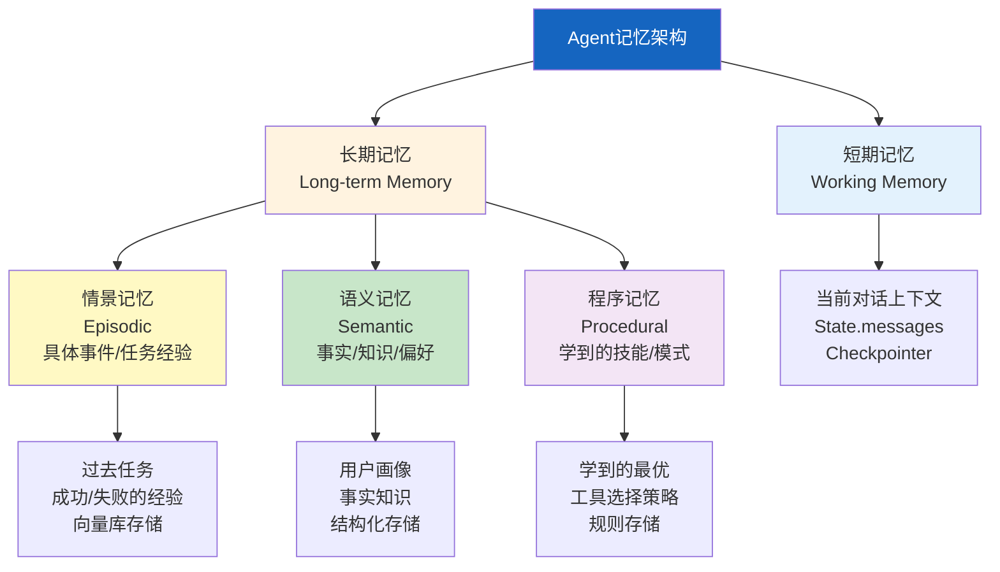

# Agent 记忆架构设计

> 简单的对话记忆只能记住"刚才说了什么"。但真正智能的 Agent 需要：记住用户偏好的长期记忆、从过去任务中学习的经验记忆、区分重要信息的语义记忆。这份指南从认知科学出发，设计 Agent 的多层记忆架构。

---

## 一、为什么需要记忆架构

```mermaid
graph TB
    subgraph 简单 {"简单对话记忆的局限"}
        S1["只记住对话历史<br/>窗口内的内容"]
        S1 --> S2["跨会话遗忘<br/>下次对话从零开始"]
        S1 --> S3["无法学习<br/>不记住用户偏好"]
        S1 --> S4["无法反思<br/>不从过去经验改进"]
    end

    subgraph 高级 {"记忆架构的目标"}
        A1["短期记忆<br/>当前对话上下文"]
        A2["长期记忆<br/>跨会话的用户画像"]
        A3["情景记忆<br/>过去具体任务经验"]
        A4["语义记忆<br/>结构化知识库"]
        A5["程序记忆<br/>学到的操作模式"]
    end

    style 简单 fill:#FFCDD2
    style 高级 fill:#C8E6C9
```

---

## 二、四种记忆类型



---

## 三、短期记忆：工作记忆

```python
from langgraph.graph import StateGraph, START, END
from langgraph.graph.message import add_messages
from langgraph.checkpoint.memory import MemorySaver
from typing import TypedDict, Annotated

class AgentState(TypedDict):
    messages: Annotated[list, add_messages]  # 对话历史
    current_task: str                        # 当前任务
    working_context: dict                    # 工作上下文

# 短期记忆通过State和Checkpointer实现
graph_builder = StateGraph(AgentState)

# Checkpointer保存每步状态
checkpointer = MemorySaver()

# 同一thread_id共享短期记忆
config = {"configurable": {"thread_id": "session-1"}}
```

```mermaid
graph LR
    subgraph 短期记忆 {"短期记忆=State+Checkpointer"}
        M1["对话历史<br/>messages字段<br/>自动追加"]
        M2["任务状态<br/>current_task字段<br/>当前执行的任务"]
        M3["工作上下文<br/>working_context<br/>中间结果/临时数据"]

        M1 & M2 & M3 --> CP["Checkpointer<br/>每步自动持久化"]
    end

    style CP fill:#FFF9C4
```

---

## 四、长期记忆：情景记忆

```python
from langchain_core.vectorstores import InMemoryVectorStore
from langchain_openai import OpenAIEmbeddings
from langchain_core.documents import Document
from dataclasses import dataclass, field
from datetime import datetime
import json

@dataclass
class EpisodicMemory:
    """情景记忆：存储过去任务的经验。

    每次任务完成后，记录：
    - 任务是什么
    - 怎么做的（轨迹）
    - 结果如何
    - 学到了什么
    """

    vector_store: InMemoryVectorStore

    @classmethod
    def create(cls, embeddings=None):
        return cls(
            vector_store=InMemoryVectorStore(embeddings or OpenAIEmbeddings())
        )

    async def store_episode(
        self,
        task: str,
        trajectory: list[dict],
        result: str,
        success: bool,
        lesson: str = "",
    ):
        """存储一次任务经验。

        Args:
            task: 任务描述
            trajectory: 执行轨迹 [{step, action, result}]
            result: 最终结果
            success: 是否成功
            lesson: 经验教训
        """
        # 将经验转化为可检索的文本
        episode_text = (
            f"任务: {task}\n"
            f"成功: {'是' if success else '否'}\n"
            f"步骤数: {len(trajectory)}\n"
            f"结果: {result[:200]}\n"
            f"经验: {lesson}"
        )

        doc = Document(
            page_content=episode_text,
            metadata={
                "type": "episodic",
                "task": task,
                "success": success,
                "timestamp": datetime.now().isoformat(),
                "steps": len(trajectory),
            },
        )

        await self.vector_store.aadd_documents([doc])

    async def recall_similar_episodes(
        self,
        task: str,
        k: int = 3,
        only_success: bool = False,
    ) -> list[Document]:
        """回忆类似任务的经验。

        Args:
            task: 当前任务
            k: 返回数量
            only_success: 是否只回忆成功的经验
        """
        filter_dict = {"type": "episodic"}
        if only_success:
            filter_dict["success"] = True

        results = await self.vector_store.asimilarity_search(
            task, k=k, filter=filter_dict
        )
        return results
```

---

## 五、长期记忆：语义记忆

```python
from dataclasses import dataclass, field
from datetime import datetime

@dataclass
class SemanticMemory:
    """语义记忆：结构化的事实和知识。

    存储：
    - 用户偏好（语言、风格、领域）
    - 事实知识（用户告知的重要信息）
    - 系统知识（学到的领域知识）
    """

    facts: dict = field(default_factory=dict)  # key→value事实
    preferences: dict = field(default_factory=dict)  # 偏好
    knowledge_base: list[dict] = field(default_factory=list)  # 知识条目

    def add_fact(self, key: str, value: str, source: str = "user"):
        """添加一个事实"""
        self.facts[key] = {
            "value": value,
            "source": source,
            "updated_at": datetime.now().isoformat(),
        }

    def add_preference(self, category: str, value: str):
        """添加用户偏好"""
        self.preferences[category] = {
            "value": value,
            "updated_at": datetime.now().isoformat(),
        }

    def add_knowledge(self, topic: str, content: str, confidence: float = 0.8):
        """添加知识条目"""
        self.knowledge_base.append({
            "topic": topic,
            "content": content,
            "confidence": confidence,
            "created_at": datetime.now().isoformat(),
        })

    def get_user_profile(self) -> str:
        """生成用户画像文本（注入到系统提示中）"""
        lines = ["## 用户画像"]

        if self.facts:
            lines.append("### 已知事实")
            for key, info in self.facts.items():
                lines.append(f"- {key}: {info['value']}")

        if self.preferences:
            lines.append("### 偏好")
            for cat, pref in self.preferences.items():
                lines.append(f"- {cat}: {pref['value']}")

        return "\n".join(lines)

    async def extract_and_store(
        self,
        llm,
        conversation: str,
    ):
        """从对话中自动提取事实和偏好。

        在每轮对话后调用，自动学习。
        """
        from langchain_core.messages import HumanMessage

        extract_prompt = f"""从以下对话中提取用户的事实信息和偏好。

对话:
{conversation}

输出JSON格式:
```json
{{
  "facts": [
    {{"key": "姓名", "value": "张三"}},
    {{"key": "职业", "value": "工程师"}}
  ],
  "preferences": [
    {{"category": "回答风格", "value": "简洁技术性"}},
    {{"category": "语言", "value": "中文"}}
  ]
}}
```
如果没有新信息，返回空数组。"""

        response = await llm.ainvoke([HumanMessage(content=extract_prompt)])

        try:
            import re
            json_match = re.search(r'\{.*\}', response.content, re.DOTALL)
            if json_match:
                data = json.loads(json_match.group())
                for fact in data.get("facts", []):
                    self.add_fact(fact["key"], fact["value"])
                for pref in data.get("preferences", []):
                    self.add_preference(pref["category"], pref["value"])
        except (json.JSONDecodeError, KeyError):
            pass
```

---

## 六、记忆整合：Agent 记忆系统

```mermaid
graph TB
    subgraph 记忆系统 {"完整记忆架构"}
        INPUT["用户输入"] --> WORKING["短期记忆<br/>当前对话上下文"]

        WORKING --> LLM["LLM推理"]

        EPISODIC["情景记忆<br/>类似任务经验"] --> CONTEXT["上下文组装"]
        SEMANTIC["语义记忆<br/>用户画像/事实"] --> CONTEXT
        WORKING --> CONTEXT

        CONTEXT --> LLM
        LLM --> OUTPUT["回答"]

        OUTPUT --> LEARN["学习模块<br/>提取经验/事实"]
        LEARN --> EPISODIC
        LEARN --> SEMANTIC

        OUTPUT --> EVAL["评估结果"]
        EVAL -->|"成功"| EPISODIC
        EVAL -->|"失败"| EPISODIC
    end

    style WORKING fill:#E3F2FD
    style EPISODIC fill:#FFF9C4
    style SEMANTIC fill:#C8E6C9
    style LEARN fill:#FFF3E0
    style CONTEXT fill:#F3E5F5
```

```python
from langchain_openai import ChatOpenAI
from langchain_core.messages import SystemMessage, HumanMessage

class AgentMemorySystem:
    """Agent完整记忆系统。

    整合短期记忆、情景记忆和语义记忆，
    为Agent提供全面的记忆能力。
    """

    def __init__(self, llm: ChatOpenAI):
        self.llm = llm
        self.working_memory: list[dict] = []  # 短期记忆
        self.episodic = EpisodicMemory.create()  # 情景记忆
        self.semantic = SemanticMemory()  # 语义记忆

    async def process_message(self, user_input: str) -> str:
        """处理用户消息，整合所有记忆"""

        # 1. 收集情景记忆：回忆类似任务经验
        similar_episodes = await self.episodic.recall_similar_episodes(
            user_input, k=2, only_success=True
        )
        episode_context = "\n".join([
            f"过去经验: {e.page_content[:150]}"
            for e in similar_episodes
        ]) if similar_episodes else "无相关经验"

        # 2. 收集语义记忆：用户画像
        user_profile = self.semantic.get_user_profile()

        # 3. 组装上下文
        system_prompt = f"""你是一个有记忆能力的AI助手。

{user_profile}

## 过去类似任务的经验
{episode_context}

## 当前对话历史
{self._format_working_memory()}"""

        messages = [
            SystemMessage(content=system_prompt),
            HumanMessage(content=user_input),
        ]

        # 4. 调用LLM
        response = await self.llm.ainvoke(messages)
        answer = response.content

        # 5. 更新短期记忆
        self.working_memory.append({"role": "user", "content": user_input})
        self.working_memory.append({"role": "assistant", "content": answer})

        # 6. 学习：从对话中提取事实和偏好
        await self.semantic.extract_and_store(
            self.llm,
            f"用户: {user_input}\n助手: {answer}",
        )

        # 7. 短期记忆管理：超过限制时压缩
        if len(self.working_memory) > 20:
            await self._compress_working_memory()

        return answer

    def _format_working_memory(self) -> str:
        """格式化短期记忆"""
        return "\n".join([
            f"{'用户' if m['role'] == 'user' else '助手'}: {m['content'][:100]}"
            for m in self.working_memory[-10:]  # 最近10轮
        ])

    async def _compress_working_memory(self):
        """压缩短期记忆：将早期对话摘要"""
        old_messages = self.working_memory[:10]
        recent_messages = self.working_memory[10:]

        summary_prompt = "请用一段话总结以下对话的要点:\n\n"
        for m in old_messages:
            summary_prompt += f"{m['role']}: {m['content']}\n"

        response = await self.llm.ainvoke(summary_prompt)

        self.working_memory = [
            {"role": "system", "content": f"早期对话摘要: {response.content}"},
            *recent_messages,
        ]

    async def save_episode(self, task: str, success: bool, lesson: str = ""):
        """任务完成后保存经验"""
        await self.episodic.store_episode(
            task=task,
            trajectory=self.working_memory,
            result=self.working_memory[-1]["content"] if self.working_memory else "",
            success=success,
            lesson=lesson,
        )
```

---

## 七、记忆遗忘与巩固

```mermaid
graph TB
    subgraph 遗忘巩固 {"记忆遗忘与巩固策略"}
        F1["短期记忆遗忘<br/>超过窗口→摘要压缩"]
        F2["情景记忆遗忘<br/>低重要度+长时间未访问→降权"]
        F3["语义记忆巩固<br/>多次出现的事实→置信度提升"]
        F4["冲突解决<br/>新事实覆盖旧事实<br/>记录版本历史"]
    end

    style F1 fill:#E3F2FD
    style F2 fill:#FFF9C4
    style F3 fill:#C8E6C9
    style F4 fill:#FFCDD2
```

```python
import time
from collections import defaultdict

class MemoryManager:
    """记忆管理器：遗忘、巩固和冲突解决"""

    @staticmethod
    def decay_importance(
        episodes: list[dict],
        decay_rate: float = 0.01,
        min_importance: float = 0.1,
    ) -> list[dict]:
        """情景记忆重要性衰减。

        随时间推移，旧记忆的重要性降低，
        除非被再次访问（recall会提升重要性）。
        """
        now = time.time()
        for ep in episodes:
            age_days = (now - ep.get("timestamp_epoch", now)) / 86400
            times_accessed = ep.get("access_count", 0)

            # 衰减公式：importance * (1 - decay_rate * age_days) + 0.1 * times_accessed
            original = ep.get("importance", 1.0)
            decayed = original * max(0, 1 - decay_rate * age_days)
            boost = 0.1 * times_accessed
            ep["current_importance"] = max(min_importance, decayed + boost)

        # 按当前重要性排序
        episodes.sort(key=lambda x: x["current_importance"], reverse=True)
        return episodes

    @staticmethod
    def consolidate_facts(
        new_facts: list[dict],
        existing_facts: dict,
    ) -> dict:
        """事实巩固：多次出现→置信度提升，冲突→更新"""
        for fact in new_facts:
            key = fact["key"]
            value = fact["value"]

            if key in existing_facts:
                existing = existing_facts[key]
                if existing["value"] == value:
                    # 相同事实再次出现→提升置信度
                    existing["confidence"] = min(1.0, existing.get("confidence", 0.5) + 0.1)
                    existing["occurrences"] = existing.get("occurrences", 1) + 1
                else:
                    # 冲突→记录历史，更新为最新
                    if "history" not in existing:
                        existing["history"] = []
                    existing["history"].append({
                        "old_value": existing["value"],
                        "timestamp": existing.get("updated_at"),
                    })
                    existing["value"] = value
                    existing["confidence"] = 0.6  # 新值默认置信度
            else:
                existing_facts[key] = {
                    "value": value,
                    "confidence": 0.5,
                    "occurrences": 1,
                    "updated_at": time.time(),
                }

        return existing_facts
```

---

## 八、与 LangGraph 集成

```python
from langgraph.graph import StateGraph, START, END
from langgraph.graph.message import add_messages
from langgraph.checkpoint.memory import MemorySaver
from langgraph.store.memory import InMemoryStore
from typing import TypedDict, Annotated

class MemoryAgentState(TypedDict):
    messages: Annotated[list, add_messages]
    user_id: str
    task: str

def create_memory_agent():
    """创建带完整记忆系统的Agent"""

    memory_system = AgentMemorySystem(ChatOpenAI(model="gpt-4o"))

    # 长期记忆存入Store（跨线程共享）
    store = InMemoryStore()

    async def agent_node(state: MemoryAgentState) -> dict:
        user_input = state["messages"][-1].content
        user_id = state.get("user_id", "default")

        # 从Store加载用户的长期记忆
        stored = store.get(user_id, "memory_system")
        if stored:
            memory_system.semantic = stored.get("semantic", SemanticMemory())

        # 处理消息
        answer = await memory_system.process_message(user_input)

        # 保存长期记忆到Store
        store.put(user_id, "memory_system", {
            "semantic": memory_system.semantic,
        })

        from langchain_core.messages import AIMessage
        return {"messages": [AIMessage(content=answer)]}

    graph = StateGraph(MemoryAgentState)
    graph.add_node("agent", agent_node)
    graph.add_edge(START, "agent")
    graph.add_edge("agent", END)

    return graph.compile(
        checkpointer=MemorySaver(),  # 短期记忆
        store=store,                  # 长期记忆
    )
```

```mermaid
graph TB
    subgraph 集成 {"LangGraph记忆集成"}
        S["State<br/>messages字段"] -->|"短期记忆"| CP["Checkpointer<br/>线程内持久化"]
        ST["Store<br/>user_id→记忆"] -->|"长期记忆"| CROSS["跨线程共享<br/>用户级记忆"]

        CP -->|"恢复时<br/>加载最近状态"| S
        ST -->|"加载用户<br/>画像和经验"| S
    end

    style CP fill:#E3F2FD
    style ST fill:#FFF3E0
```

---

## 九、最佳实践

| 实践 | 说明 | 优先级 |
|------|------|--------|
| 短期记忆设上限 | 避免无限增长，超限自动摘要压缩 | ★★★ |
| 情景记忆只存成功经验 | 失败经验用低权重存储，避免误导 | ★★☆ |
| 语义记忆需去重和巩固 | 多次出现的事实提升置信度 | ★★☆ |
| 用户画像注入系统提示 | 让Agent主动使用记忆中的信息 | ★★☆ |
| 定期遗忘低重要性记忆 | 防止记忆库膨胀降低检索质量 | ★☆☆ |
| 隐私合规：用户可查看删除 | 遵守GDPR等隐私法规 | ★★☆ |

---

## 十、检查清单

| 检查项 | 状态 |
|--------|------|
| 理解四种记忆类型的区别 | ☐ |
| 实现了短期记忆（State+Checkpointer） | ☐ |
| 实现了情景记忆（向量库存储经验） | ☐ |
| 实现了语义记忆（结构化事实/偏好） | ☐ |
| 有记忆遗忘和巩固策略 | ☐ |
| 能从对话中自动提取事实 | ☐ |
| 长期记忆通过Store跨线程共享 | ☐ |
| 有隐私合规机制 | ☐ |
