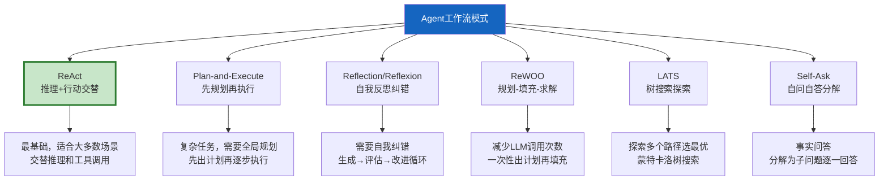
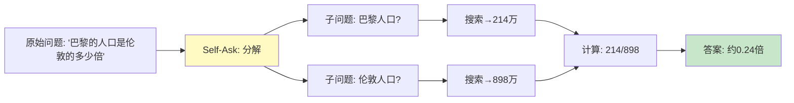
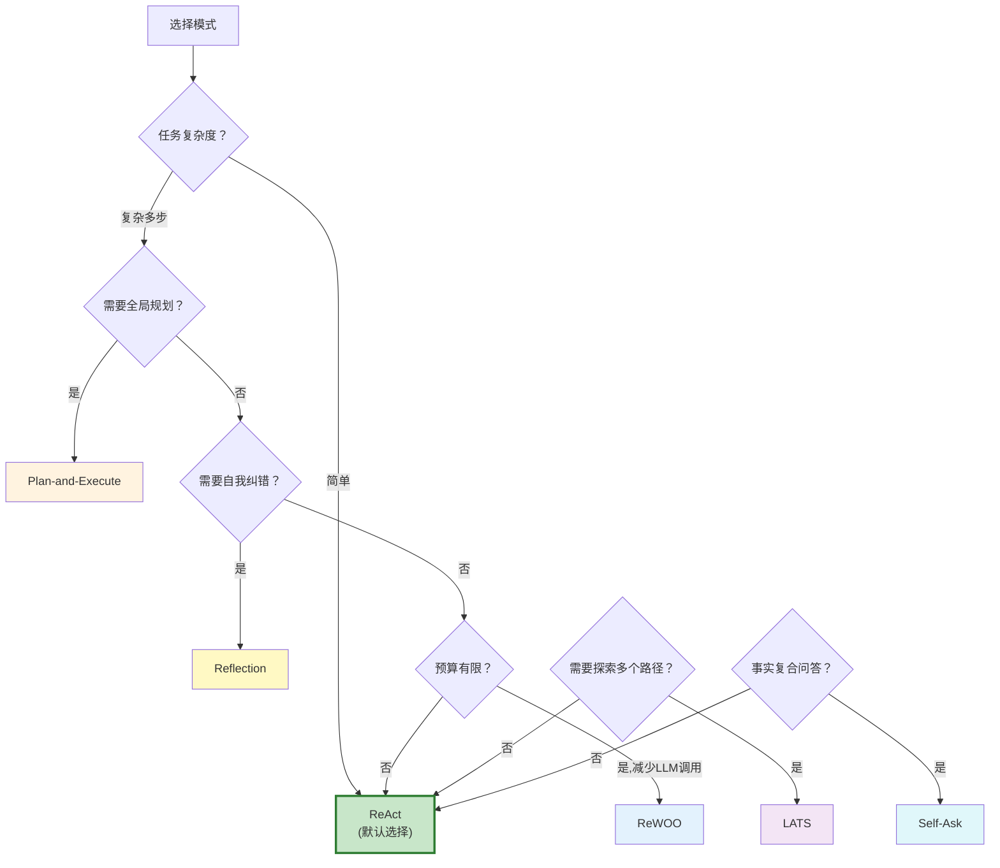

# Agent 工作流模式全集

> ReAct、Plan-and-Execute、Reflection、ReWOO、LATS——这些不是缩写堆砌，而是不同的 Agent 推理架构，各有适用场景。选错模式，Agent 要么过度思考浪费 Token，要么思考不足给出错误答案。这份指南用统一框架对比 6 种核心模式，给出选型决策。

---

## 一、为什么需要不同的工作流模式

```mermaid
graph TB
    subgraph 问题 {"单一ReAct模式的局限"}
        S1["简单问题<br/>'今天天气如何'"] --> R1["ReAct: 推理→工具→推理→工具<br/>过度思考，浪费Token"]
        S2["复杂问题<br/>'写一份市场分析报告'"] --> R2["ReAct: 逐步推理<br/>缺乏全局规划，容易跑偏"]
        S3["需要反思的问题<br/>'代码有什么bug'"] --> R3["ReAct: 直线推进<br/>不会自我纠错"]
    end

    style 问题 fill:#FFCDD2
```

---

## 二、6 种核心模式总览



---

## 三、模式1：ReAct（推理+行动）

```mermaid
graph TB
    subgraph ReAct {"ReAct循环"}
        T["Thought: 我需要搜索信息"] --> A["Action: 调用search工具"]
        A --> O["Observation: 搜索结果返回"]
        O --> T2["Thought: 基于结果我需要..."]
        T2 --> A2["Action: 调用calculator"]
        A2 --> O2["Observation: 计算结果"]
        O2 --> T3["Thought: 现在可以回答了"]
        T3 --> F["Final Answer"]
    end

    style ReAct fill:#C8E6C9
```

```python
# ReAct就是create_react_agent的默认模式
# LangGraph预构建Agent已内置ReAct循环
from langgraph.prebuilt import create_react_agent

agent = create_react_agent(model, [search, calculate])

# ReAct循环自动进行：
# 1. LLM推理(Thought) → 决定调用工具(Action)
# 2. 执行工具 → 获取结果(Observation)
# 3. LLM再推理 → 决定继续调用工具或给出最终答案
```

| 优点 | 缺点 | 适合场景 |
|------|------|----------|
| 通用性强 | 每步都调LLM | 大多数Agent任务 |
| 自动决定何时停止 | Token消耗较高 | 需要工具调用的问答 |
| 实现简单 | 缺乏全局规划 | 步骤数不确定的任务 |

---

## 四、模式2：Plan-and-Execute（先规划再执行）

```mermaid
graph TB
    subgraph PlanExecute {"Plan-and-Execute流程"}
        Q["用户问题"] --> PLANNER["Planner<br/>LLM生成完整计划"]
        PLANNER --> P1["步骤1: 搜索X"]
        PLANNER --> P2["步骤2: 搜索Y"]
        PLANNER --> P3["步骤3: 计算Z"]
        P1 --> EXEC1["Executor<br/>执行步骤1"]
        P2 --> EXEC2["Executor<br/>执行步骤2"]
        P3 --> EXEC3["Executor<br/>执行步骤3"]
        EXEC1 & EXEC2 & EXEC3 --> REPLAN{"需要重新规划？"}
        REPLAN -->|是| PLANNER
        REPLAN -->|否| FINAL["综合输出最终答案"]
    end

    style PLANNER fill:#FFF9C4,stroke:#F9A825,stroke-width:3px
    style REPLAN fill:#FFF3E0
    style FINAL fill:#C8E6C9
```

```python
from langgraph.graph import StateGraph, START, END
from typing import TypedDict, Annotated
from langchain_core.language_models import BaseChatModel
from langchain_core.messages import HumanMessage
from operator import add

class PlanExecuteState(TypedDict):
    input: str
    plan: list[str]              # 计划步骤列表
    past_steps: Annotated[list, add]  # 已执行步骤及结果
    response: str                # 最终回答

PLANNER_PROMPT = """你是任务规划专家。请将以下任务分解为3-7个可执行的步骤。

任务: {input}

输出格式（每行一个步骤，带编号）:
1. 步骤1
2. 步骤2
..."""

REPLAN_PROMPT = """你是任务规划专家。基于已完成的步骤和结果，决定下一步。

原始任务: {input}

已完成步骤:
{past_steps}

剩余计划:
{remaining_plan}

选择：
A) 继续执行剩余计划 → 输出"CONTINUE"
B) 需要修改计划 → 输出新计划
C) 所有步骤完成 → 输出"DONE"

回答:"""

async def plan_step(state: PlanExecuteState, llm: BaseChatModel) -> dict:
    """规划节点：生成执行计划"""
    prompt = PLANNER_PROMPT.format(input=state["input"])
    response = await llm.ainvoke([HumanMessage(content=prompt)])

    # 解析计划
    steps = [line.strip() for line in response.content.split("\n") if line.strip()]
    return {"plan": steps}

async def execute_step(state: PlanExecuteState, llm: BaseChatModel) -> dict:
    """执行节点：执行计划的下一步"""
    plan = state["plan"]
    past_steps = state.get("past_steps", [])

    if not plan:
        return {"response": "计划已完成"}

    # 执行下一步
    current_step = plan[0]
    response = await llm.ainvoke([HumanMessage(content=f"执行任务: {current_step}")])

    return {
        "past_steps": [(current_step, response.content)],
        "plan": plan[1:],  # 移除已执行步骤
    }

async def replan_step(state: PlanExecuteState, llm: BaseChatModel) -> dict:
    """重新规划节点：决定继续/修改/完成"""
    if not state["plan"]:
        # 没有剩余步骤，生成最终回答
        past_text = "\n".join(f"- {step}: {result}" for step, result in state.get("past_steps", []))
        response = await llm.ainvoke([HumanMessage(
            content=f"基于以下执行结果回答用户问题。\n\n问题: {state['input']}\n\n执行结果:\n{past_text}"
        )])
        return {"response": response.content}

    return {}

def should_continue(state: PlanExecuteState) -> str:
    """路由：继续执行还是结束"""
    if state.get("response"):
        return "end"
    if state.get("plan"):
        return "execute"
    return "end"

# 构建图
graph = StateGraph(PlanExecuteState)
graph.add_node("planner", lambda s: plan_step(s, llm))
graph.add_node("executor", lambda s: execute_step(s, llm))
graph.add_node("replanner", lambda s: replan_step(s, llm))

graph.add_edge(START, "planner")
graph.add_edge("planner", "executor")
graph.add_edge("executor", "replanner")
graph.add_conditional_edges("replanner", should_continue, {
    "execute": "executor",
    "end": END,
})

plan_execute_agent = graph.compile()
```

| 优点 | 缺点 | 适合场景 |
|------|------|----------|
| 全局规划，不易跑偏 | 计划可能不准确需重新规划 | 复杂多步任务 |
| 可并行执行独立步骤 | 规划本身消耗Token | 研究报告、分析任务 |
| 执行器可复用 | 不适合简单任务 | 有明确步骤的任务 |

---

## 五、模式3：Reflection/Reflexion（自我反思）

```mermaid
graph TB
    subgraph Reflection {"反思循环"}
        Q["问题"] --> GEN["Generator<br/>生成初始回答"]
        GEN --> REFLECT["Reflector<br/>评估回答质量"]
        REFLECT --> CHECK{"有问题？"}
        CHECK -->|是| REVISE["Reviser<br/>基于反思改进"]
        REVISE --> REFLECT
        CHECK -->|否| FINAL["输出最终回答"]
        CHECK -->|超过N次| FINAL
    end

    style REFLECT fill:#FFF9C4,stroke:#F9A825,stroke-width:3px
    style REVISE fill:#FFCDD2
    style FINAL fill:#C8E6C9
```

```python
from langgraph.graph import StateGraph, START, END
from typing import TypedDict

class ReflectionState(TypedDict):
    question: str
    draft: str
    critique: str
    revision_count: int
    final: str

REFLECT_PROMPT = """你是质量审查专家。请评估以下回答的质量，指出问题。

问题: {question}
回答: {draft}

从以下维度评估：
1. 准确性：有没有事实错误？
2. 完整性：是否充分回答了问题？
3. 清晰性：表述是否清楚？
4. 幻觉：有没有编造的信息？

输出格式:
有/无问题: [有/无]
问题列表: (如有)
改进建议: (如有)"""

REVISE_PROMPT = """基于审查反馈改进回答。

问题: {question}
原始回答: {draft}
审查反馈: {critique}

请输出改进后的回答:"""

async def generate_node(state: ReflectionState, llm) -> dict:
    """生成初始回答"""
    if state.get("draft") and state.get("critique"):
        # 基于反思改进
        prompt = REVISE_PROMPT.format(
            question=state["question"],
            draft=state["draft"],
            critique=state["critique"],
        )
        response = await llm.ainvoke([HumanMessage(content=prompt)])
        return {"draft": response.content, "revision_count": state.get("revision_count", 0) + 1}

    # 首次生成
    response = await llm.ainvoke([HumanMessage(content=state["question"])])
    return {"draft": response.content, "revision_count": 0}

async def reflect_node(state: ReflectionState, llm) -> dict:
    """反思节点：评估并给出改进建议"""
    prompt = REFLECT_PROMPT.format(question=state["question"], draft=state["draft"])
    response = await llm.ainvoke([HumanMessage(content=prompt)])
    return {"critique": response.content}

def should_revise(state: ReflectionState) -> str:
    """决定是否继续修改"""
    count = state.get("revision_count", 0)
    critique = state.get("critique", "")

    if count >= 3:  # 最多修改3次
        return "end"
    if "无问题" in critique[:10]:
        return "end"
    return "revise"

# 构建图
graph = StateGraph(ReflectionState)
graph.add_node("generate", lambda s: generate_node(s, llm))
graph.add_node("reflect", lambda s: reflect_node(s, llm))

graph.add_edge(START, "generate")
graph.add_edge("generate", "reflect")
graph.add_conditional_edges("reflect", should_revise, {
    "revise": "generate",
    "end": END,
})

reflection_agent = graph.compile()
```

---

## 六、模式4：ReWOO（规划-填充-求解）

```mermaid
graph TB
    subgraph ReWOO {"ReWOO: 减少LLM调用"}
        Q["问题"] --> PLAN["一次性生成<br/>完整计划+工具调用模板"]
        PLAN --> E1["填充工具1"]
        PLAN --> E2["填充工具2"]
        PLAN --> E3["填充工具3"]
        E1 & E2 & E3 --> SOLVE["一次LLM调用<br/>综合所有结果"]
        SOLVE --> A["最终答案"]

    end

    style PLAN fill:#FFF9C4
    style SOLVE fill:#C8E6C9
```

```python
# ReWOO核心思想：规划阶段一次性生成所有工具调用，
# 执行时不需要LLM参与推理，最后一次性综合

REEWO_PLAN_PROMPT = """请为以下任务制定完整的解决计划。

任务: {question}

可用工具: {tools}

输出格式（计划中直接包含工具调用的参数模板）:
Plan:
1. #E1 = search("查询词1")
2. #E2 = search("查询词2")
3. #E3 = calculate(#E1 的结果 + #E2 的结果)
4. #E4 = ...

注意：后续步骤可以引用前面步骤的结果（用#E1等标记）。"""

SOLVE_PROMPT = """基于以下执行结果回答问题。

问题: {question}
计划: {plan}
执行结果:
{results}

请综合所有结果给出最终答案:"""

async def rewoo_execute(question: str, tools: dict, llm) -> str:
    """ReWOO模式执行。

    Args:
        question: 用户问题
        tools: 工具字典 {name: callable}
        llm: LLM实例
    """
    # 1. 一次性生成计划（只需1次LLM调用）
    plan_prompt = REEWO_PLAN_PROMPT.format(
        question=question,
        tools=list(tools.keys()),
    )
    plan_response = await llm.ainvoke([HumanMessage(content=plan_prompt)])
    plan_text = plan_response.content

    # 2. 执行计划中的工具调用（不需要LLM）
    import re
    results = {}
    # 匹配 #E1 = tool_name(args) 格式
    pattern = r'#(E\d+)\s*=\s*(\w+)\s*\(([^)]*)\)'
    matches = re.findall(pattern, plan_text)

    for step_id, tool_name, args_str in matches:
        if tool_name in tools:
            # 替换参数中的#Ex引用为实际结果
            for ref_match in re.finditer(r'#(E\d+)', args_str):
                ref_id = ref_match.group(1)
                if ref_id in results:
                    args_str = args_str.replace(f"#{ref_id}", str(results[ref_id]))

            # 解析参数（简化版）
            args = [a.strip().strip('"\'') for a in args_str.split(",")]
            result = await tools[tool_name](*args) if asyncio.iscoroutinefunction(tools[tool_name]) else tools[tool_name](*args)
            results[step_id] = result

    # 3. 一次性综合所有结果（只需1次LLM调用）
    results_text = "\n".join(f"#{k}: {v}" for k, v in results.items())
    solve_prompt = SOLVE_PROMPT.format(
        question=question,
        plan=plan_text,
        results=results_text,
    )
    final_response = await llm.ainvoke([HumanMessage(content=solve_prompt)])

    return final_response.content
```

| 优点 | 缺点 | 适合场景 |
|------|------|----------|
| LLM调用次数最少(2次) | 规划时不考虑中间结果 | 可预先规划的任务 |
| 执行阶段不需要LLM | 无法根据结果调整计划 | 固定流程的管线 |
| 成本低 | 灵活性较差 | ETL、数据采集 |

---

## 七、模式5：LATS（语言Agent树搜索）

```mermaid
graph TB
    subgraph LATS {"LATS: 蒙特卡洛树搜索"}
        ROOT["根节点<br/>初始状态"] --> C1["行动1"]
        ROOT --> C2["行动2"]
        ROOT --> C3["行动3"]
        C1 --> C1A["行动1a"]
        C1 --> C1B["行动1b"]
        C2 --> C2A["行动2a"]
        EVAL["评估每个叶子节点<br/>用LLM打分"] --> C1A
        EVAL --> C1B
        EVAL --> C2A
        C1A -->|得分最高| SELECT["选择最优路径"]
        SELECT --> EXPAND["继续扩展"]
    end

    style EVAL fill:#FFF9C4
    style SELECT fill:#C8E6C9
```

```python
# LATS核心思想：像下棋一样探索多个路径，
# 评估每条路径的好坏，选最优路径继续探索

class LATSAgent:
    """LATS: 语言Agent树搜索。

    1. 对当前状态生成多个可能的行动
    2. 模拟执行每个行动
    3. 用LLM评估每个结果的质量
    4. 选择得分最高的路径继续
    5. 重复直到找到满意答案
    """

    def __init__(
        self,
        llm: BaseChatModel,
        tools: list,
        max_depth: int = 3,
        num_branches: int = 3,
    ):
        self.llm = llm
        self.tools = {t.name: t for t in tools}
        self.max_depth = max_depth
        self.num_branches = num_branches

    async def solve(self, question: str) -> str:
        """解决问题：树搜索方式"""
        # 初始状态
        root = {"state": question, "children": [], "score": 0, "depth": 0}
        best_solution = None
        best_score = -1

        # 深度优先搜索
        frontier = [root]
        while frontier:
            node = frontier.pop(0)

            if node["depth"] >= self.max_depth:
                # 评估叶子节点
                score = await self._evaluate(node, question)
                if score > best_score:
                    best_score = score
                    best_solution = node
                continue

            # 生成多个候选行动
            actions = await self._generate_actions(node, self.num_branches)

            for action in actions:
                child = await self._execute_action(node, action)
                child["depth"] = node["depth"] + 1
                child["score"] = await self._evaluate(child, question)
                node["children"].append(child)
                frontier.append(child)

        return best_solution["state"] if best_solution else "无法解决"

    async def _generate_actions(self, node: dict, n: int) -> list[str]:
        """生成n个候选行动"""
        prompt = f"对于任务'{node['state']}'，提出{n}种不同的解决方法。每行一个。"
        response = await self.llm.ainvoke([HumanMessage(content=prompt)])
        return [a.strip() for a in response.content.split("\n") if a.strip()][:n]

    async def _execute_action(self, node: dict, action: str) -> dict:
        """执行行动，生成子节点"""
        return {"state": f"{node['state']} → {action}", "children": []}

    async def _evaluate(self, node: dict, question: str) -> float:
        """评估节点质量"""
        prompt = f"评估以下方案对问题'{question}'的解决程度，输出0-1的分数:\n{node['state']}"
        response = await self.llm.ainvoke([HumanMessage(content=prompt)])
        import re
        match = re.search(r'0\.\d+|[01]', response.content)
        return float(match.group()) if match else 0.5
```

---

## 八、模式6：Self-Ask（自问自答分解）



```python
SELF_ASK_PROMPT = """问题: {question}

请用自问自答的方式解决。逐步提出子问题并回答。

格式:
问: [子问题]
答: [搜索/计算得到答案]
问: [下一个子问题]
答: [答案]
...
最终答案: [综合回答]

开始:"""

async def self_ask(question: str, llm: BaseChatModel, search_tool) -> str:
    """Self-Ask模式：自问自答分解问题。

    适合需要多步事实查询的复合问题。
    """
    prompt = SELF_ASK_PROMPT.format(question=question)
    response = await llm.ainvoke([HumanMessage(content=prompt)])
    return response.content
```

---

## 九、模式对比与选型



| 模式 | LLM调用次数 | 规划能力 | 纠错能力 | 适合场景 |
|------|------------|----------|----------|----------|
| ReAct | 多(每步1次) | 无(逐步推进) | 无 | 通用Agent |
| Plan-Execute | 中(规划+每步) | 全局规划 | 有(重新规划) | 复杂任务 |
| Reflection | 多(生成+反思) | 无 | 强(自我评估) | 需要高质量输出 |
| ReWOO | 少(2次) | 全局规划 | 无 | 预算有限的管线 |
| LATS | 最多 | 全局+多路径 | 强(评估选择) | 需要最优解 |
| Self-Ask | 中 | 分解问题 | 无 | 事实复合问答 |

---

## 十、在 LangGraph 中实现不同模式

```python
# 总结：LangGraph中各种模式的实现方式
PATTERNS = {
    "ReAct": "create_react_agent(model, tools) — 预构建",
    "Plan-Execute": "StateGraph: planner→executor→replanner循环",
    "Reflection": "StateGraph: generate→reflect→条件回边到generate",
    "ReWOO": "单函数: plan→批量执行→solve",
    "LATS": "自定义树搜索: generate_actions→evaluate→select",
    "Self-Ask": "单函数: 分解→逐一搜索→综合",
}
```

---

## 十一、最佳实践

| 实践 | 说明 | 优先级 |
|------|------|--------|
| 默认从ReAct开始 | 80%场景够用 | ★★★ |
| 复杂任务用Plan-Execute | 需要全局规划时 | ★★★ |
| 高质量要求加Reflection | 生成后反思改进 | ★★☆ |
| 预算紧张用ReWOO | 最少LLM调用 | ★★☆ |
| 模式可组合 | Plan-Execute+Reflection | ★★☆ |
| LATS探索性强但成本高 | 适合需要最优解的场景 | ★☆☆ |

---

## 十二、检查清单

| 检查项 | 状态 |
|--------|------|
| 理解6种模式的核心区别 | ☐ |
| 能用create_react_agent实现ReAct | ☐ |
| 能用StateGraph实现Plan-Execute | ☐ |
| 能实现Reflection自我纠错循环 | ☐ |
| 理解ReWOO减少LLM调用的原理 | ☐ |
| 知道何时用哪种模式 | ☐ |
