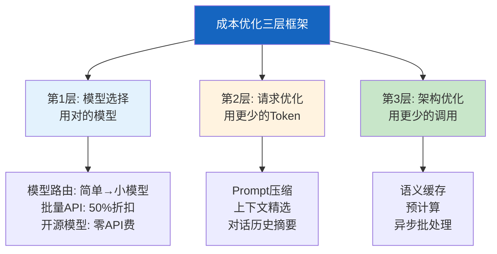
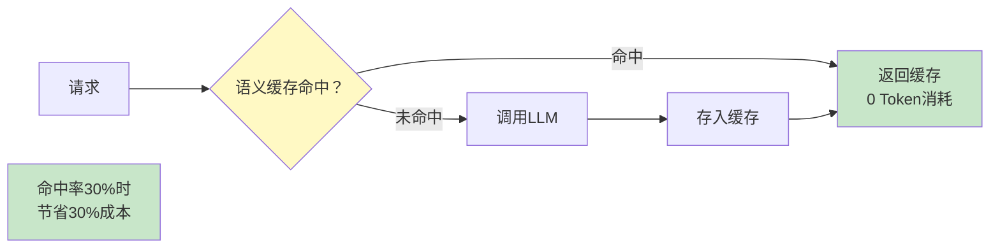

# LLM 应用成本优化策略

> LLM 应用上线后，Token 成本是持续增长的最大开支。一份报告可能消耗数万 Token，一天处理一千个请求就是一笔可观费用。这份指南从模型选择、请求优化、架构设计三个层面，系统讲解如何将成本降低 50-70%。

---

## 一、成本构成分析

```mermaid
graph TB
    subgraph 构成 {"LLM应用成本构成"}
        C1["模型调用 60%<br/>Prompt Token<br/>+ Completion Token"]
        C2["向量计算 10%<br/>嵌入模型调用"]
        C3["基础设施 15%<br/>服务器/数据库/API网关"]
        C4["存储 5%<br/>向量存储+对话历史"]
        C5["其他 10%<br/>监控/日志/第三方API"]
    end

    subgraph 优化空间 {"最大优化空间"}
        O1["模型调用: 模型路由+缓存+压缩"]
        O2["向量计算: 批量嵌入+缓存"]
        O3["基础设施: 自动扩缩容"]
    end

    style 构成 fill:#FFCDD2
    style 优化空间 fill:#C8E6C9
```

---

## 二、三层优化框架



---

## 三、第1层：模型选择优化

### 3.1 模型路由

```mermaid
graph TB
    subgraph 路由 {"智能模型路由"}
        Q["用户请求"] --> CLASSIFY["复杂度分类<br/>用最便宜的模型"]
        CLASSIFY -->|简单<br/>"你好"|" GPT-4o-mini<br/>$0.15/1M tokens"]
        CLASSIFY -->|中等<br/>"总结这段文字"| CLAUDE["Claude 3 Haiku<br/>$0.25/1M tokens"]
        CLASSIFY -->|复杂<br/>"分析市场趋势"| GPT4["GPT-4o<br/>$2.50/1M tokens"]
    end

    subgraph 节省 {"节省效果"}
        S1["80%请求走小模型<br/>成本降低60%+"]
    end

    style 路由 fill:#E3F2FD
    style 节省 fill:#C8E6C9
```

```python
from langchain_core.language_models import BaseChatModel
from langchain_openai import ChatOpenAI
from langchain_core.messages import HumanMessage
from enum import Enum

class ModelTier(str, Enum):
    FAST = "fast"      # GPT-4o-mini / Claude Haiku
    STANDARD = "standard"  # GPT-4o / Claude Sonnet
    POWERFUL = "powerful"  # GPT-4o (高参数) / Claude Opus

class ModelRouter:
    """智能模型路由器。

    根据请求复杂度选择最经济的模型。
    """

    def __init__(self):
        self.models = {
            ModelTier.FAST: ChatOpenAI(model="gpt-4o-mini", temperature=0),
            ModelTier.STANDARD: ChatOpenAI(model="gpt-4o", temperature=0),
            ModelTier.POWERFUL: ChatOpenAI(model="gpt-4o", temperature=0, max_tokens=4000),
        }
        self.model_costs = {
            # 每百万Token的成本（美元）
            ModelTier.FAST: {"input": 0.15, "output": 0.60},
            ModelTier.STANDARD: {"input": 2.50, "output": 10.00},
            ModelTier.POWERFUL: {"input": 2.50, "output": 10.00},
        }
        self.usage_stats = {tier: {"calls": 0, "input_tokens": 0, "output_tokens": 0}
                           for tier in ModelTier}

    async def route_and_call(
        self,
        messages: list,
        complexity: ModelTier | None = None,
    ) -> dict:
        """路由到合适的模型并调用。"""
        # 如果没有指定复杂度，自动判断
        if complexity is None:
            complexity = await self._classify_complexity(messages)

        model = self.models[complexity]
        response = await model.ainvoke(messages)

        # 记录使用
        self.usage_stats[complexity]["calls"] += 1
        if hasattr(response, "usage_metadata"):
            self.usage_stats[complexity]["input_tokens"] += \
                response.usage_metadata.get("input_tokens", 0)
            self.usage_stats[complexity]["output_tokens"] += \
                response.usage_metadata.get("output_tokens", 0)

        return {
            "response": response,
            "model_tier": complexity.value,
            "model_name": model.model_name,
        }

    async def _classify_complexity(self, messages: list) -> ModelTier:
        """用最便宜的模型判断复杂度。"""
        last_msg = messages[-1].content if messages else ""
        prompt = f"""判断以下查询的复杂度。只回答一个词: simple, medium, 或 complex。

查询: {last_msg[:200]}

- simple: 简单问答、打招呼、翻译短句
- medium: 总结、改写、分析单段文本
- complex: 多步推理、长文分析、创意写作、代码生成

复杂度:"""

        response = await self.models[ModelTier.FAST].ainvoke(
            [HumanMessage(content=prompt)]
        )
        result = response.content.strip().lower()

        if "simple" in result:
            return ModelTier.FAST
        elif "complex" in result:
            return ModelTier.POWERFUL
        else:
            return ModelTier.STANDARD

    def cost_report(self) -> dict:
        """生成成本报告。"""
        total_cost = 0
        by_tier = {}
        for tier, stats in self.usage_stats.items():
            costs = self.model_costs[tier]
            input_cost = stats["input_tokens"] / 1_000_000 * costs["input"]
            output_cost = stats["output_tokens"] / 1_000_000 * costs["output"]
            tier_cost = input_cost + output_cost
            total_cost += tier_cost
            by_tier[tier.value] = {
                "calls": stats["calls"],
                "input_tokens": stats["input_tokens"],
                "output_tokens": stats["output_tokens"],
                "cost_usd": round(tier_cost, 4),
            }
        return {
            "total_cost_usd": round(total_cost, 4),
            "by_tier": by_tier,
        }
```

### 3.2 批量 API

```python
# OpenAI Batch API: 50%折扣，适合非实时场景
# 24小时内返回结果，成本减半

class BatchProcessor:
    """批量API处理器：50%成本折扣。"""

    async def create_batch(
        self,
        requests: list[dict],  # [{messages, model}]
    ) -> str:
        """创建批量任务。"""
        import json
        lines = []
        for i, req in enumerate(requests):
            lines.append(json.dumps({
                "custom_id": f"req-{i}",
                "method": "POST",
                "url": "/v1/chat/completions",
                "body": {
                    "model": req.get("model", "gpt-4o"),
                    "messages": req["messages"],
                },
            }))

        # 写入JSONL文件上传
        # 实际用OpenAI Batch API
        # batch = openai.batches.create(
        #     input_file=file_id,
        #     endpoint="/v1/chat/completions",
        #     completion_window="24h",
        # )
        # 50%折扣！

        return "batch_id"

    async def get_results(self, batch_id: str) -> list[dict]:
        """获取批量结果。"""
        # results = openai.batches.retrieve(batch_id)
        # 解析结果文件
        pass
```

---

## 四、第2层：请求优化

### 4.1 优化效果汇总

```mermaid
graph TB
    subgraph 请求优化 {"请求层优化手段"}
        O1["Prompt精简<br/>-10~20%"]
        O2["上下文压缩<br/>-30~50%<br/>(知识库125)"]
        O3["对话历史摘要<br/>-50~70%<br/>(知识库125)"]
        O4["Few-Shot精选<br/>-10~30%"]
        O5["max_tokens限制<br/>防止过度生成"]
    end

    style 请求优化 fill:#FFF3E0
```

### 4.2 max_tokens 成本控制

```python
class TokenLimiter:
    """限制输出Token数防止成本失控。"""

    MAX_TOKENS_BY_TASK = {
        "simple_qa": 200,      # 简单问答
        "summarize": 500,       # 总结
        "analysis": 1000,       # 分析
        "creative_writing": 2000,  # 创意写作
        "code_generation": 1500,   # 代码生成
        "report": 3000,          # 报告
    }

    def get_max_tokens(self, task_type: str) -> int:
        """根据任务类型获取最大Token数。"""
        return self.MAX_TOKENS_BY_TASK.get(task_type, 1000)
```

---

## 五、第3层：架构优化

### 5.1 语义缓存



### 5.2 预计算

```python
class PrecomputeStrategy:
    """预计算策略：对常见问题预先生成答案。"""

    # 常见问题列表（高频率查询）
    COMMON_QUESTIONS = [
        "什么是RAG？",
        "LangChain和LangGraph的区别？",
        "如何选择向量数据库？",
        "Agent是什么？",
    ]

    async def precompute_common_answers(self, llm):
        """为高频问题预计算答案。"""
        precomputed = {}
        for question in self.COMMON_QUESTIONS:
            response = await llm.ainvoke([HumanMessage(content=question)])
            precomputed[question] = response.content

        # 存入缓存，后续请求直接命中
        return precomputed

    async def answer_with_precompute(
        self,
        question: str,
        precomputed: dict,
        semantic_cache,
        llm,
    ):
        """优先查预计算结果。"""
        # 1. 精确匹配预计算
        if question in precomputed:
            return precomputed[question], {"source": "precomputed"}

        # 2. 语义缓存
        entry, score = await semantic_cache.lookup(question)
        if entry:
            return entry.answer, {"source": "cache", "score": score}

        # 3. 调用LLM
        response = await llm.ainvoke([HumanMessage(content=question)])
        await semantic_cache.store(question, response.content)
        return response.content, {"source": "llm"}
```

---

## 六、成本监控仪表盘

```mermaid
graph TB
    subgraph 监控 {"成本监控指标"}
        M1["实时成本<br/>$/小时<br/>$/天"]
        M2["按模型分解<br/>各模型成本占比"]
        M3["按任务分解<br/>问答/总结/分析成本"]
        M4["缓存命中率<br/>节省了多少成本"]
        M5["预算告警<br/>日预算/月预算"]
    end

    style 监控 fill:#E3F2FD
```

```python
class CostMonitor:
    """LLM成本监控器。"""

    def __init__(self, daily_budget: float = 100.0):
        self.daily_budget = daily_budget
        self.costs: list[dict] = []

    def record(
        self,
        model: str,
        input_tokens: int,
        output_tokens: int,
        task_type: str = "",
    ):
        """记录一次调用成本。"""
        # OpenAI定价（$/百万Token）
        pricing = {
            "gpt-4o": {"input": 2.50, "output": 10.00},
            "gpt-4o-mini": {"input": 0.15, "output": 0.60},
            "text-embedding-3-small": {"input": 0.02, "output": 0},
        }

        prices = pricing.get(model, {"input": 2.50, "output": 10.00})
        cost = (input_tokens / 1_000_000 * prices["input"] +
                output_tokens / 1_000_000 * prices["output"])

        self.costs.append({
            "model": model,
            "input_tokens": input_tokens,
            "output_tokens": output_tokens,
            "cost": round(cost, 6),
            "task": task_type,
            "timestamp": time.time(),
        })

    def daily_report(self) -> dict:
        """日成本报告。"""
        today = [c for c in self.costs if self._is_today(c["timestamp"])]
        total = sum(c["cost"] for c in today)

        by_model = {}
        for c in today:
            by_model[c["model"]] = by_model.get(c["model"], 0) + c["cost"]

        budget_used = total / self.daily_budget

        return {
            "total_cost": round(total, 4),
            "daily_budget": self.daily_budget,
            "budget_used_pct": round(budget_used * 100, 1),
            "budget_remaining": round(self.daily_budget - total, 4),
            "by_model": {k: round(v, 4) for k, v in by_model.items()},
            "call_count": len(today),
            "avg_cost_per_call": round(total / len(today), 6) if today else 0,
            "budget_alert": budget_used > 0.8,
        }

    @staticmethod
    def _is_today(timestamp: float) -> bool:
        from datetime import datetime
        return datetime.fromtimestamp(timestamp).date() == datetime.now().date()
```

---

## 七、成本节省估算

```mermaid
graph TB
    subgraph 优化前 {"优化前（月度）"}
        BEFORE["每请求 5000 tokens<br/>日均 1000 请求<br/>月度 150M tokens<br/>全用 GPT-4o<br/>月成本 $375"]
    end

    subgraph 优化后 {"优化后（月度）"}
        AFTER1["模型路由: 80%走mini<br/>→ $150"]
        AFTER2["+语义缓存30%命中<br/>→ $105"]
        AFTER3["+上下文压缩50%<br/>→ $52"]
        AFTER4["+预计算常见问题<br/>→ $42"]
    end

    TOTAL["节省89%<br/>月省$333"]

    style 优化前 fill:#FFCDD2
    style 优化后 fill:#C8E6C9
    style TOTAL fill:#FFF9C4
```

---

## 八、最佳实践

| 实践 | 节省比例 | 实施难度 | 优先级 |
|------|----------|----------|--------|
| 模型路由：简单→小模型 | 40-60% | 中 | ★★★ |
| 语义缓存 | 20-40% | 高 | ★★★ |
| max_tokens限制 | 10-30% | 低 | ★★★ |
| Prompt精简 | 10-20% | 低 | ★★☆ |
| 上下文压缩 | 30-50% | 中 | ★★☆ |
| 批量API(非实时) | 50% | 低 | ★★☆ |
| 预计算常见问题 | 10-20% | 低 | ★★☆ |
| 实时成本监控 | 防止失控 | 低 | ★★★ |

---

## 九、检查清单

| 检查项 | 状态 |
|--------|------|
| 实现了模型路由 | ☐ |
| 有语义缓存 | ☐ |
| 设置了max_tokens限制 | ☐ |
| 有实时成本监控 | ☐ |
| 有日预算告警 | ☐ |
| 精简了Prompt | ☐ |
| 评估了优化前后的成本 | ☐ |
