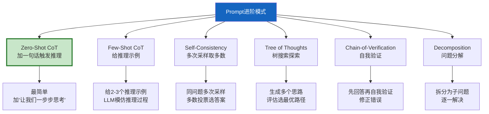
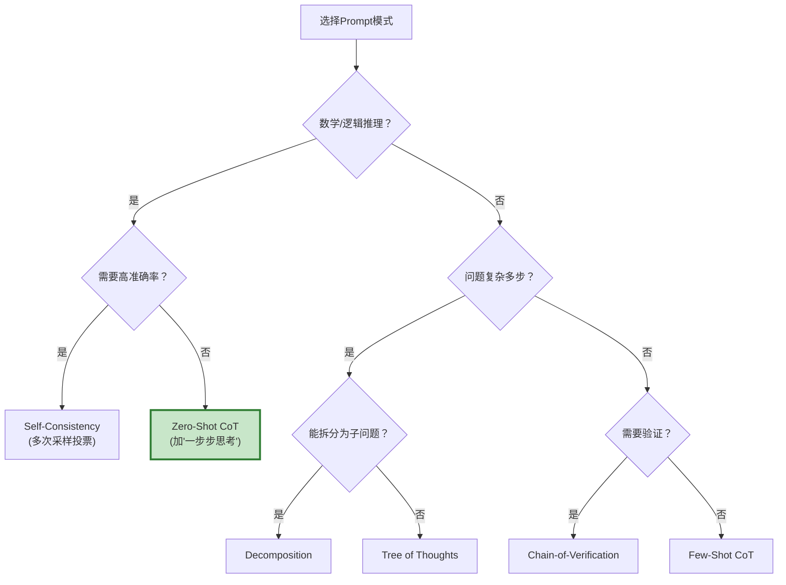

# Prompt 工程进阶模式与思维链

> 基础 Prompt 是"请回答以下问题"。进阶 Prompt 是一门精密的推理工程：思维链（CoT）、自一致性（Self-Consistency）、思维树（ToT）、推理-行动交替（ReAct）。选对模式，LLM 的推理能力可以提升 30-50%。这份指南用统一框架对比 6 种进阶 Prompt 模式。

---

## 一、6 种进阶模式总览



---

## 二、模式1：Zero-Shot CoT

```mermaid
graph LR
    subgraph 对比 {"普通 vs CoT"}
        NORMAL["普通Prompt<br/>'小明有5个苹果...<br>还剩几个？'<br/>→ 直接输出: 3"]
        COT["CoT Prompt<br/>同问题 + '让我们一步步思考'<br/>→ 推理: 5-2=3<br/>→ 答案: 3"]
    end

    style NORMAL fill:#FFCDD2
    style COT fill:#C8E6C9
```

```python
# Zero-Shot CoT：只需在Prompt末尾加一句话
ZERO_SHOT_COT = "让我们一步步思考。"

# 普通
prompt_normal = "小明有5个苹果，给了小红2个，又买了3个，现在有几个？"

# CoT
prompt_cot = prompt_normal + "\n\n" + ZERO_SHOT_COT

# LLM输出对比：
# 普通 → "6个"（可能跳过推理直接猜）
# CoT → "小明有5个，给了小红2个剩3个，又买了3个，3+3=6个。答案是6个。"
```

---

## 三、模式2：Few-Shot CoT

```python
FEW_SHOT_COT_PROMPT = """请参考以下示例的推理方式回答问题。

示例1:
问题: 一个班有32名学生，其中女生占5/8，女生有多少人？
推理: 班级总人数32人，女生占5/8，所以女生人数 = 32 × 5/8 = 40/8 = 20。
答案: 20人

示例2:
问题: 一本书原价80元，打8折后又降价5元，最终价格是多少？
推理: 原价80元，打8折后 = 80 × 0.8 = 64元。再降5元 = 64 - 5 = 59元。
答案: 59元

问题: {question}
推理:"""

async def few_shot_cot(llm, question: str) -> str:
    prompt = FEW_SHOT_COT_PROMPT.format(question=question)
    response = await llm.ainvoke([HumanMessage(content=prompt)])
    return response.content
```

---

## 四、模式3：Self-Consistency

```mermaid
graph TB
    subgraph SC {"Self-Consistency流程"}
        Q["问题"] --> S1["采样1: temperature=0.7<br/>推理→答案A"]
        Q --> S2["采样2: temperature=0.7<br/>推理→答案B"]
        Q --> S3["采样3: temperature=0.7<br/>推理→答案A"]
        Q --> S4["采样4: temperature=0.7<br/>推理→答案A"]
        S1 & S2 & S3 & S4 --> VOTE["多数投票"]
        VOTE --> FINAL["答案A（3票）"]
    end

    style SC fill:#E3F2FD
    style VOTE fill:#FFF9C4
    style FINAL fill:#C8E6C9
```

```python
import asyncio
from collections import Counter

async def self_consistency(
    llm,
    question: str,
    num_samples: int = 5,
    temperature: float = 0.7,
) -> dict:
    """Self-Consistency: 多次采样+多数投票。

    原理：同一个问题用不同temperature采样多次，
    推理路径不同但正确答案一致。
    多数投票选出最可靠的答案。
    """
    # 创建多个高temperature的LLM实例
    from langchain_openai import ChatOpenAI
    sampling_llm = ChatOpenAI(
        model=llm.model_name,
        temperature=temperature,
    )

    prompt = f"{question}\n\n让我们一步步思考，最后输出'答案: X'"

    # 并行采样
    tasks = [sampling_llm.ainvoke([HumanMessage(content=prompt)]) for _ in range(num_samples)]
    responses = await asyncio.gather(*tasks)

    # 提取每个回答的最终答案
    answers = []
    for resp in responses:
        answer = _extract_answer(resp.content)
        answers.append(answer)

    # 多数投票
    counter = Counter(answers)
    best_answer, vote_count = counter.most_common(1)[0]

    return {
        "answer": best_answer,
        "confidence": vote_count / num_samples,
        "all_answers": answers,
        "vote_distribution": dict(counter),
    }

def _extract_answer(text: str) -> str:
    """从推理文本中提取最终答案。"""
    import re
    match = re.search(r'答案[:：]\s*(.+?)(?:\n|$)', text)
    if match:
        return match.group(1).strip()
    # 兜底：取最后一行
    lines = [l.strip() for l in text.split("\n") if l.strip()]
    return lines[-1] if lines else text[:50]
```

---

## 五、模式4：Tree of Thoughts (ToT)

```mermaid
graph TB
    subgraph ToT {"思维树搜索"}
        ROOT["问题"] --> T1["思路1: 从条件A出发"]
        ROOT --> T2["思路2: 从条件B出发"]
        ROOT --> T3["思路3: 从条件C出发"]

        T1 --> E1["评估: 前景好"] --> T1A["继续展开"]
        T1 --> E1B["评估: 不太好"]
        T2 --> E2["评估: 前景好"] --> T2A["继续展开"]
        T3 --> E3["评估: 不太好"]

        T1A --> SOL1["解法1"]
        T2A --> SOL2["解法2"]
        SOL1 & SOL2 --> BEST["选最优解"]
    end

    style ROOT fill:#E3F2FD
    style E1 fill:#FFF9C4,stroke:#F9A825,stroke-width:3px
    style BEST fill:#C8E6C9
```

```python
async def tree_of_thoughts(
    llm,
    question: str,
    num_branches: int = 3,
    max_depth: int = 2,
) -> str:
    """Tree of Thoughts: 树搜索式推理。

    1. 生成多个初始思路
    2. 评估每个思路的前景
    3. 选有前景的继续展开
    4. 最终选最优解
    """
    # 1. 生成多个思路
    gen_prompt = f"""问题: {question}

请提出{num_branches}种不同的解决思路。每种思路从不同角度出发。
输出格式（每行一个思路）:
思路1: ...
思路2: ...
思路3: ..."""

    response = await llm.ainvoke([HumanMessage(content=gen_prompt)])
    thoughts = [l.strip() for l in response.content.split("\n") if l.strip()][:num_branches]

    # 2. 评估每个思路
    eval_prompt = f"""问题: {question}

以下是一些解决思路，请评估每个思路的前景（0-10分）：

{chr(10).join(f'{i+1}. {t}' for i, t in enumerate(thoughts))}

输出格式:
思路1: X分 - 理由
思路2: X分 - 理由
..."""

    eval_response = await llm.ainvoke([HumanMessage(content=eval_prompt)])

    # 3. 选最优思路继续推理
    # 简化版：选第一个思路
    best_thought = thoughts[0]

    # 4. 基于最优思路推理出答案
    solve_prompt = f"""问题: {question}

解决思路: {best_thought}

请基于这个思路一步步推理，给出最终答案。"""

    final_response = await llm.ainvoke([HumanMessage(content=solve_prompt)])
    return final_response.content
```

---

## 六、模式5：Chain-of-Verification

```mermaid
graph TB
    subgraph CoV {"自我验证流程"}
        Q["问题"] --> DRAFT["生成初始答案"]
        DRAFT --> VERIFY["生成验证问题<br/>检查答案中的关键点"]
        VERIFY --> CHECK["逐一验证"]
        CHECK --> CONSISTENT{"答案一致？"}
        CONSISTENT -->|是| FINAL["输出答案"]
        CONSISTENT -->|否| REVISE["修正答案"]
        REVISE --> FINAL
    end

    style VERIFY fill:#FFF9C4,stroke:#F9A825,stroke-width:3px
    style CHECK fill:#FFF3E0
    style REVISE fill:#FFCDD2
    style FINAL fill:#C8E6C9
```

```python
async def chain_of_verification(llm, question: str) -> str:
    """Chain-of-Verification: 生成→验证→修正。"""

    # 1. 生成初始答案
    draft_prompt = f"问题: {question}\n\n请回答。"
    draft_response = await llm.ainvoke([HumanMessage(content=draft_prompt)])
    draft_answer = draft_response.content

    # 2. 生成验证问题
    verify_prompt = f"""问题: {question}
初始答案: {draft_answer}

请生成2-3个验证问题，检查答案中的关键事实是否正确。
验证问题应该可以用简单事实回答。

输出格式:
验证1: ...
验证2: ...
验证3: ..."""

    verify_response = await llm.ainvoke([HumanMessage(content=verify_prompt)])

    # 3. 逐一验证
    check_prompt = f"""问题: {question}
初始答案: {draft_answer}

验证问题:
{verify_response.content}

请逐一回答验证问题，并检查初始答案是否正确。
如果发现错误，请修正。

最终答案:"""

    final_response = await llm.ainvoke([HumanMessage(content=check_prompt)])
    return final_response.content
```

---

## 七、模式6：Decomposition（问题分解）

```mermaid
graph TB
    subgraph 分解 {"问题分解策略"}
        Q["复杂问题"] --> D["LLM分解为子问题"]
        D --> SQ1["子问题1"]
        D --> SQ2["子问题2"]
        D --> SQ3["子问题3"]
        SQ1 --> A1["回答1"]
        SQ2 --> A2["回答2"]
        SQ3 --> A3["回答3"]
        A1 & A2 & A3 --> COMBINE["综合答案"]
    end

    style D fill:#FFF9C4
    style COMBINE fill:#C8E6C9
```

```python
async def decompose_and_solve(llm, question: str) -> str:
    """问题分解：拆分→逐一解决→综合。"""
    # 1. 分解
    decompose_prompt = f"""请将以下复杂问题分解为2-4个更简单的子问题。

问题: {question}

子问题:"""
    decomp_response = await llm.ainvoke([HumanMessage(content=decompose_prompt)])
    sub_questions = [l.strip() for l in decomp_response.content.split("\n") if l.strip() and len(l.strip()) > 5]

    # 2. 逐一解决
    sub_answers = []
    for sq in sub_questions:
        # 去掉编号前缀
        clean_sq = sq.split(".", 1)[-1].strip() if "." in sq[:3] else sq
        response = await llm.ainvoke([HumanMessage(content=f"请简要回答: {clean_sq}")])
        sub_answers.append(f"{clean_sq}: {response.content}")

    # 3. 综合
    combine_prompt = f"""原始问题: {question}

子问题及答案:
{chr(10).join(sub_answers)}

请综合以上信息，回答原始问题。"""

    final_response = await llm.ainvoke([HumanMessage(content=combine_prompt)])
    return final_response.content
```

---

## 八、模式对比与选型



| 模式 | LLM调用 | 准确率提升 | 成本 | 适合场景 |
|------|---------|-----------|------|----------|
| Zero-Shot CoT | 1次 | +15-25% | 低 | 数学/逻辑 |
| Few-Shot CoT | 1次 | +20-30% | 低 | 有推理模式可参考 |
| Self-Consistency | N次 | +25-40% | 高 | 需要高准确率 |
| Tree of Thoughts | 多次 | +30-50% | 高 | 探索性问题 |
| Chain-of-Verification | 3次 | +15-25% | 中 | 事实问答 |
| Decomposition | 多次 | +20-30% | 中 | 复合问题 |

---

## 九、最佳实践

| 实践 | 说明 | 优先级 |
|------|------|--------|
| 默认加CoT触发词 | "让我们一步步思考" | ★★★ |
| 数学推理用Self-Consistency | 多次采样投票最可靠 | ★★☆ |
| Few-Shot给2-3个示例 | 太多示例浪费Token | ★★☆ |
| 复杂问题先分解 | 分而治之 | ★★☆ |
| 事实问答加验证 | 防止幻觉 | ★★☆ |
| 温度参数与模式匹配 | CoT用低温度，SC用高温度 | ★☆☆ |

---

## 十、检查清单

| 检查项 | 状态 |
|--------|------|
| 理解6种模式的原理 | ☐ |
| 会用Zero-Shot CoT | ☐ |
| 会用Few-Shot CoT | ☐ |
| 实现了Self-Consistency | ☐ |
| 理解Tree of Thoughts | ☐ |
| 实现了Chain-of-Verification | ☐ |
| 能根据场景选模式 | ☐ |
