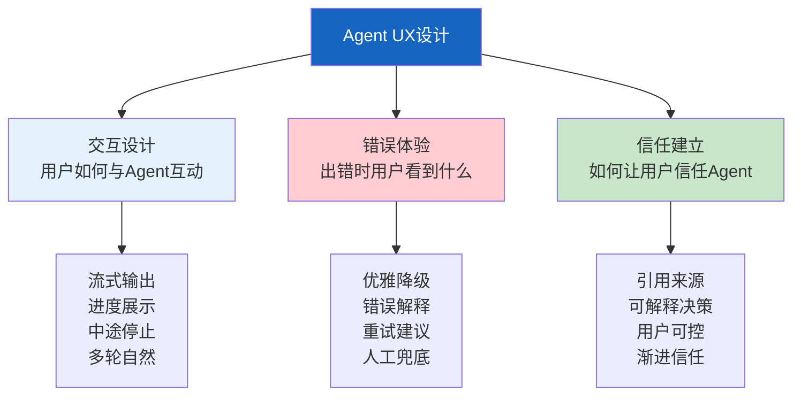

# Agent 用户体验设计指南

> Agent 的技术再强，如果用户体验差，用户就不会用。LLM 响应慢、偶尔出错、行为不确定——这些技术特性直接影响用户感知。这份指南从交互设计、错误处理、信任建立三个维度，讲解如何让 Agent 应用"感觉好用"。

---

## 一、Agent UX 的三个维度



---

## 二、交互设计模式

### 2.1 响应状态管理

```mermaid
graph TB
    subgraph 状态 {"Agent响应状态流"}
        IDLE["空闲<br/>等待输入"] --> THINKING["思考中<br/>显示加载动画"]
        THINKING --> SEARCHING["搜索中<br/>显示搜索内容"]
        SEARCHING --> GENERATING["生成中<br/>打字机效果"]
        GENERATING --> COMPLETE["完成<br/>显示结果"]
        THINKING --> ERROR["出错<br/>显示错误+重试"]
        ERROR --> IDLE
    end

    style THINKING fill:#FFF9C4
    style GENERATING fill:#E3F2FD
    style COMPLETE fill:#C8E6C9
    style ERROR fill:#FFCDD2
```

```python
from enum import Enum
from dataclasses import dataclass
from typing import Any

class AgentStatus(str, Enum):
    IDLE = "idle"
    THINKING = "thinking"
    SEARCHING = "searching"
    GENERATING = "generating"
    COMPLETE = "complete"
    ERROR = "error"

@dataclass
class UserExperience:
    """用户体验状态管理。"""
    status: AgentStatus = AgentStatus.IDLE
    progress_message: str = ""
    partial_output: str = ""
    error_message: str = ""
    can_cancel: bool = True
    can_retry: bool = False

    def start_thinking(self):
        self.status = AgentStatus.THINKING
        self.progress_message = "正在思考..."
        self.partial_output = ""

    def start_searching(self, query: str):
        self.status = AgentStatus.SEARCHING
        self.progress_message = f"正在搜索: {query[:50]}"

    def append_token(self, token: str):
        self.status = AgentStatus.GENERATING
        self.partial_output += token

    def complete(self):
        self.status = AgentStatus.COMPLETE
        self.progress_message = ""

    def fail(self, error: str):
        self.status = AgentStatus.ERROR
        self.error_message = error
        self.can_retry = True
```

### 2.2 进度展示

```python
class ProgressIndicator:
    """Agent执行进度展示。"""

    @staticmethod
    def tool_progress(tool_name: str, status: str) -> str:
        """工具调用进度。"""
        icons = {"start": "🔍", "end": "✅", "error": "❌"}
        icon = icons.get(status, "⏳")
        return f"{icon} {tool_name}"

    @staticmethod
    def thinking_steps(step: int, total: int | None = None) -> str:
        """思考步骤进度。"""
        if total:
            return f"步骤 {step}/{total}"
        return f"步骤 {step}"

    @staticmethod
    def estimated_wait(elapsed: float) -> str:
        """预计等待时间。"""
        if elapsed < 2:
            return "正在处理..."
        elif elapsed < 5:
            return "还在思考..."
        elif elapsed < 10:
            return "需要一点时间..."
        else:
            return "正在处理复杂问题，请稍候..."
```

### 2.3 错误体验设计

```mermaid
graph TB
    subgraph 错误处理 {"错误体验设计原则"}
        E1["不要显示原始错误<br/>用户看不懂stack trace"]
        E2["给出人话解释<br/>'搜索服务暂时不可用'"]
        E3["提供下一步建议<br/>'可以稍后重试'"]
        E4["保留已有内容<br/>不要清空已生成的内容"]
        E5["提供人工兜底<br/>'联系客服'或'转人工'"]
    end

    style 错误处理 fill:#C8E6C9
```

```python
class ErrorExperience:
    """错误体验设计。"""

    ERROR_MESSAGES = {
        "timeout": {
            "user_message": "响应超时，可能是问题比较复杂。可以简化问题后重试。",
            "suggestion": "尝试把问题拆分为更小的部分",
            "action": "retry",
        },
        "rate_limit": {
            "user_message": "请求太频繁了，请稍等片刻再试。",
            "suggestion": "等待30秒后重试",
            "action": "wait_retry",
        },
        "tool_error": {
            "user_message": "工具调用失败，但我可以尝试用其他方式回答。",
            "suggestion": "尝试不使用工具直接回答",
            "action": "fallback",
        },
        "content_filter": {
            "user_message": "抱歉，这个话题我暂时无法回答。",
            "suggestion": "尝试换个方式提问",
            "action": "rephrase",
        },
        "network_error": {
            "user_message": "网络连接出了问题，请检查网络后重试。",
            "suggestion": "检查网络连接",
            "action": "retry",
        },
    }

    @classmethod
    def get_error_response(cls, error_type: str) -> dict:
        """获取用户友好的错误响应。"""
        return cls.ERROR_MESSAGES.get(error_type, {
            "user_message": "出了点问题，请重试。",
            "suggestion": "如果问题持续，请联系客服",
            "action": "retry",
        })
```

---

## 三、信任建立

```mermaid
graph TB
    subgraph 信任 {"建立用户信任的5个方法"}
        T1["1.引用来源<br/>答案标注信息来源"]
        T2["2.置信度展示<br/>高/中/低置信度"]
        T3["3.渐进信任<br/>先低风险→高风险"]
        T4["4.用户可控<br/>可修改/可撤销"]
        T5["5.透明决策<br/>展示推理过程"]
    end

    style 信任 fill:#C8E6C9
```

```python
class TrustBuilder:
    """用户信任建立器。"""

    @staticmethod
    def format_answer_with_sources(
        answer: str,
        sources: list[dict],
        confidence: float = 0.8,
    ) -> str:
        """格式化回答：加来源和置信度。"""
        # 置信度标记
        if confidence >= 0.85:
            conf_label = "🟢 高置信度"
        elif confidence >= 0.6:
            conf_label = "🟡 中置信度"
        else:
            conf_label = "🔴 低置信度，建议核实"

        # 来源列表
        source_text = "\n".join(
            f"  [{i+1}] {s.get('title', s.get('source', '未知'))}"
            for i, s in enumerate(sources[:3])
        )

        return (
            f"{answer}\n\n"
            f"---\n"
            f"📊 {conf_label}\n"
            f"📚 信息来源:\n{source_text}"
        )

    @staticmethod
    def show_reasoning_trace(steps: list[str]) -> str:
        """展示推理过程（可折叠）。"""
        trace = "\n".join(f"  {i+1}. {step}" for i, step in enumerate(steps))
        return f"\n<details>\n<summary>推理过程</summary>\n{trace}\n</details>\n"
```

---

## 四、加载状态设计

```mermaid
graph TB
    subgraph 加载 {"加载状态时间线"}
        L1["0-500ms<br/>不显示加载<br/>（太快用户感觉不到）"]
        L2["500ms-2s<br/>显示简单加载<br/>'正在思考...'"]
        L3["2-5s<br/>显示进度<br/>'正在搜索相关信息...'"]
        L4["5-10s<br/>显示预计时间<br/>'需要一点时间...'"]
        L5[">10s<br/>提供取消选项<br/>'正在处理复杂问题'"]
    end

    style L1 fill:#C8E6C9
    style L2 fill:#E3F2FD
    style L3 fill:#FFF9C4
    style L4 fill:#FFF3E0
    style L5 fill:#FFCDD2
```

---

## 五、最佳实践

| 实践 | 说明 | 优先级 |
|------|------|--------|
| 始终流式输出 | 让用户看到实时进展 | ★★★ |
| 展示工具调用进度 | 用户知道Agent在做什么 | ★★★ |
| 错误用人话解释 | 不显示技术错误 | ★★★ |
| 保留已生成内容 | 出错不清空已有内容 | ★★★ |
| 提供停止按钮 | 用户可中断 | ★★☆ |
| 标注信息来源 | 建立信任 | ★★☆ |
| 展示置信度 | 不确定时让用户核实 | ★★☆ |
| 加载状态分阶段 | 0.5s前不显示、5s后给预计时间 | ★★☆ |

---

## 六、检查清单

| 检查项 | 状态 |
|--------|------|
| 有流式输出+打字机效果 | ☐ |
| 有工具调用进度展示 | ☐ |
| 错误用人话解释 | ☐ |
| 有停止生成按钮 | ☐ |
| 出错时保留已有内容 | ☐ |
| 答案标注来源 | ☐ |
| 展示置信度 | ☐ |
| 加载状态分阶段 | ☐ |
