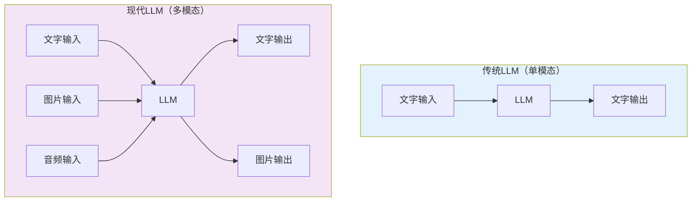
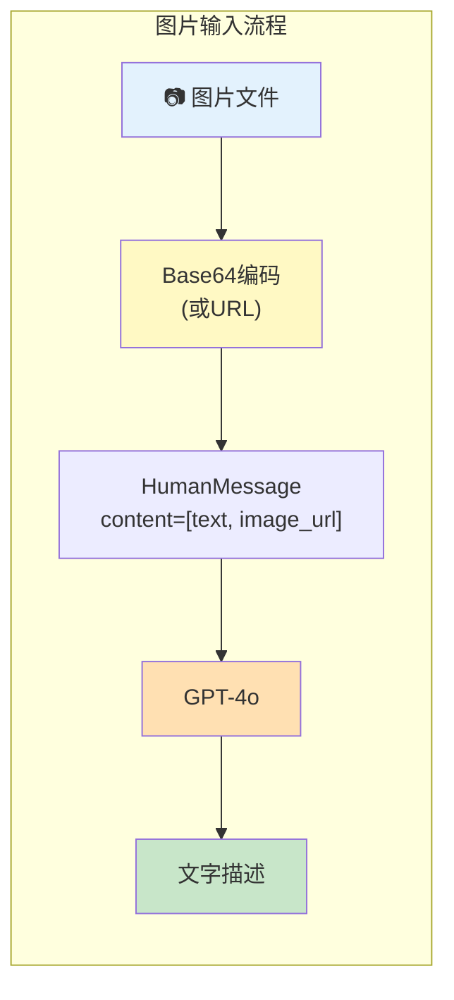
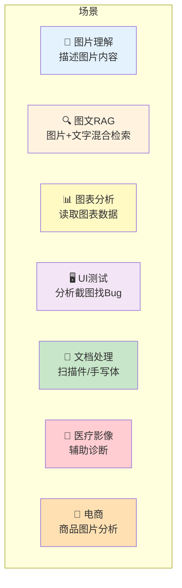
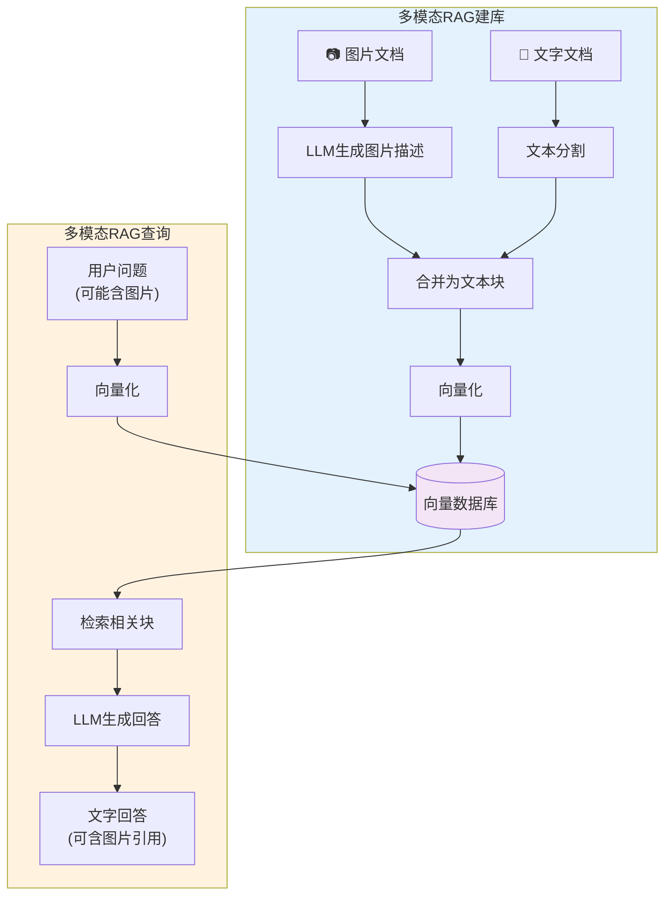
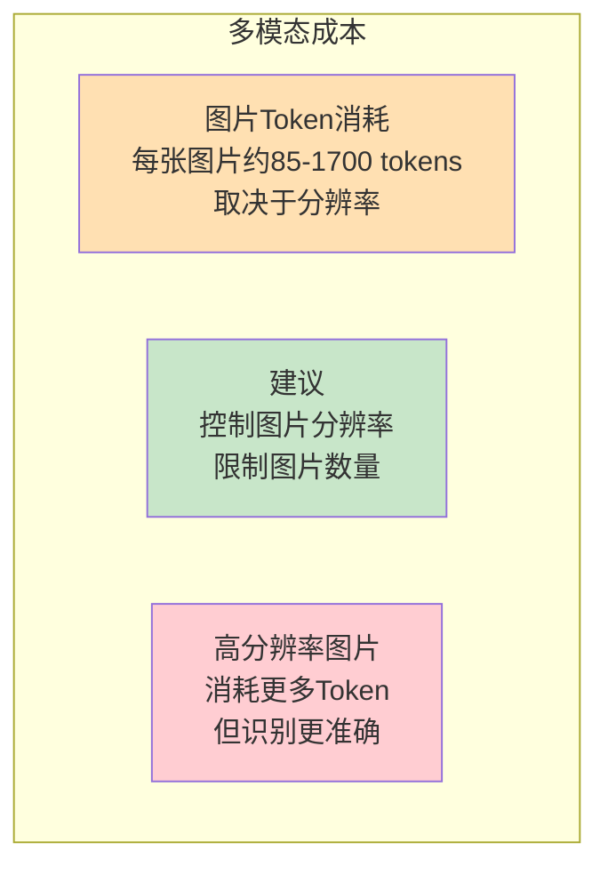

# 多模态应用开发

> LLM 不只能处理文字——现代模型支持图片、音频输入。本指南教你用 LangChain 构建多模态应用。

---

## 一、什么是多模态



## 二、支持多模态的模型

| 模型 | 文字 | 图片 | 音频 | 视频 |
|------|------|------|------|------|
| GPT-4o / GPT-4o-mini | ✅ | ✅ | ✅ | ✅(帧) |
| Claude 3.5 Sonnet | ✅ | ✅ | ❌ | ❌ |
| Gemini 1.5 Pro | ✅ | ✅ | ✅ | ✅ |
| Qwen-VL | ✅ | ✅ | ❌ | ❌ |

## 三、图片输入

### 3.1 基本用法

```python
from dotenv import load_dotenv
from langchain_openai import ChatOpenAI
from langchain_core.messages import HumanMessage

load_dotenv()
llm = ChatOpenAI(model="gpt-4o-mini")

# 方式一：使用图片URL
message = HumanMessage(
    content=[
        {"type": "text", "text": "请描述这张图片的内容。"},
        {"type": "image_url", "image_url": {"url": "https://example.com/image.jpg"}},
    ]
)
response = llm.invoke([message])
print(response.content)
```

### 3.2 本地图片

```python
import base64

def encode_image(image_path: str) -> str:
    """将本地图片编码为base64"""
    with open(image_path, "rb") as f:
        return base64.b64encode(f.read()).decode("utf-8")

# 使用本地图片
image_base64 = encode_image("screenshot.png")

message = HumanMessage(
    content=[
        {"type": "text", "text": "这张截图中有哪些UI元素？"},
        {"type": "image_url", "image_url": {"url": f"data:image/png;base64,{image_base64}"}},
    ]
)
response = llm.invoke([message])
```

### 3.3 图片输入的数据流



### 3.4 多图输入

```python
# 同时发送多张图片
message = HumanMessage(
    content=[
        {"type": "text", "text": "比较这两张图片的不同之处。"},
        {"type": "image_url", "image_url": {"url": "https://example.com/img1.jpg"}},
        {"type": "image_url", "image_url": {"url": "https://example.com/img2.jpg"}},
    ]
)
response = llm.invoke([message])
```

## 四、多模态 Agent

```python
from langchain_openai import ChatOpenAI
from langchain_core.tools import tool
from langchain_core.messages import HumanMessage
from langchain.agents import create_tool_calling_agent, AgentExecutor
from langchain_core.prompts import ChatPromptTemplate, MessagesPlaceholder

@tool
def analyze_image(image_url: str, question: str) -> str:
    """分析图片内容。当用户提供了图片URL并想了解图片信息时使用。

    Args:
        image_url: 图片的URL地址
        question: 关于图片的问题
    """
    llm = ChatOpenAI(model="gpt-4o-mini")
    message = HumanMessage(content=[
        {"type": "text", "text": question},
        {"type": "image_url", "image_url": {"url": image_url}},
    ])
    response = llm.invoke([message])
    return response.content

# 创建带图片分析能力的Agent
llm = ChatOpenAI(model="gpt-4o-mini")
tools = [analyze_image]

prompt = ChatPromptTemplate.from_messages([
    ("system", "你是一个多模态助手，可以分析图片。"),
    ("human", "{input}"),
    MessagesPlaceholder(variable_name="agent_scratchpad"),
])

agent = create_tool_calling_agent(llm, tools, prompt)
executor = AgentExecutor(agent=agent, tools=tools, verbose=True)

# 使用
result = executor.invoke({
    "input": "请分析这张图片：https://example.com/chart.png，告诉我图表中的趋势。"
})
```

## 五、多模态应用场景



## 六、多模态 RAG



```python
# 多模态 RAG 示例
from langchain_openai import ChatOpenAI, OpenAIEmbeddings
from langchain_core.messages import HumanMessage
from langchain_community.vectorstores import FAISS
from langchain_core.documents import Document

# 1. 将图片转为文字描述
def image_to_text(image_url: str) -> str:
    """用LLM将图片转为文字描述"""
    llm = ChatOpenAI(model="gpt-4o-mini")
    message = HumanMessage(content=[
        {"type": "text", "text": "详细描述这张图片的内容，包括文字、数字、图表数据等所有可见信息。"},
        {"type": "image_url", "image_url": {"url": image_url}},
    ])
    return llm.invoke([message]).content

# 2. 构建多模态知识库
def build_multimodal_kb(images: list[str], texts: list[str]):
    """构建包含图片和文字的知识库"""
    embeddings = OpenAIEmbeddings()
    all_docs = []

    # 图片→文字描述→文档
    for img_url in images:
        description = image_to_text(img_url)
        all_docs.append(Document(
            page_content=description,
            metadata={"source": img_url, "type": "image"}
        ))

    # 文字→文档
    for text in texts:
        all_docs.append(Document(
            page_content=text,
            metadata={"type": "text"}
        ))

    return FAISS.from_documents(all_docs, embeddings)
```

## 七、成本注意事项



```python
# 控制图片大小以节省Token
from PIL import Image
import io

def resize_image(image_path: str, max_size: int = 1024) -> bytes:
    """调整图片大小以减少Token消耗"""
    img = Image.open(image_path)
    img.thumbnail((max_size, max_size))
    buffer = io.BytesIO()
    img.save(buffer, format="JPEG", quality=85)
    return buffer.getvalue()
```
