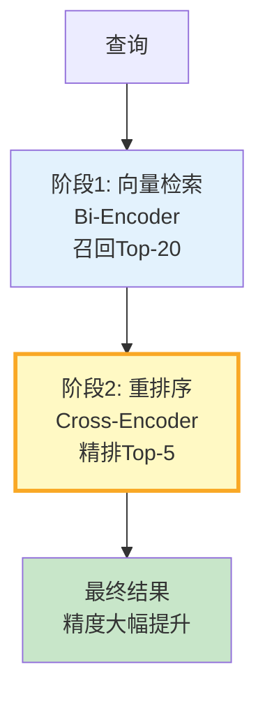

# RAG 重排序与 Cross-Encoder 实践

> 向量检索速度快但精度有限——它用 Bi-Encoder 把查询和文档各自编码再算相似度，丢失了查询与文档的细粒度交互。重排序用 Cross-Encoder 把查询和文档拼在一起重新评分，精度大幅提升。这份指南讲透重排序原理、实现和效果。

---

## 一、为什么需要重排序

```mermaid
graph TB
    subgraph 问题 {"向量检索的精度问题"}
        Q["查询"] --> BI["Bi-Encoder<br/>查询和文档分别编码"]
        BI --> SIM["cosine相似度<br/>丢失交互信息"]
        SIM --> R1["Top-1可能是错的<br/>只是大致相关"]
    end

    subgraph 解决 {"重排序提升精度"}
        Q2["查询"] --> RET["向量检索Top-K<br/>快速召回"]
        RET --> CROSS["Cross-Encoder<br/>查询+文档拼在一起评分"]
        CROSS --> R2["重排序后Top-1更准"]
    end

    style 问题 fill:#FFCDD2
    style 解决 fill:#C8E6C9
    style CROSS fill:#FFF9C4,stroke:#F9A825,stroke-width:3px
```

---

## 二、Bi-Encoder vs Cross-Encoder

```mermaid
graph TB
    subgraph Bi {"Bi-Encoder（向量检索）"}
        Q1["查询→向量A"] --> S1["cosine(A, B)"]
        D1["文档→向量B"] --> S1
        S1 --> R1["速度快<br/>精度中<br/>适合大规模召回"]
    end

    subgraph Cross {"Cross-Encoder（重排序）"}
        Q2["查询"] --> CONCAT["拼接: [查询] + [文档]"]
        D2["文档"] --> CONCAT
        CONCAT --> MODEL["Transformer<br/>联合编码"]
        MODEL --> R2["速度慢<br/>精度高<br/>适合小规模精排"]
    end

    style Bi fill:#E3F2FD
    style Cross fill:#C8E6C9
```

| 维度 | Bi-Encoder | Cross-Encoder |
|------|-----------|---------------|
| 速度 | 极快（预计算向量） | 慢（每对实时计算） |
| 精度 | 中等 | 高（捕获交互） |
| 适合 | 大规模召回（10000+） | 小规模精排（Top-K） |
| 延迟 | ~5ms | ~50-200ms |
| 成本 | 低 | 中 |

---

## 三、两阶段检索流程



---

## 四、实现

### 4.1 用 Cohere Rerank

```python
class CohereReranker:
    """Cohere Rerank API重排序。

    最简单的重排序方案——调API即可。
    """

    def __init__(self, api_key: str, model: str = "rerank-multilingual-v3.0"):
        import cohere
        self.client = cohere.Client(api_key)
        self.model = model

    async def rerank(
        self,
        query: str,
        documents: list[str],
        top_k: int = 5,
    ) -> list[dict]:
        """重排序文档。

        Args:
            query: 查询文本
            documents: 待排序的文档列表
            top_k: 返回前K个

        Returns:
            排序后的文档列表 [{index, score, document}]
        """
        response = self.client.rerank(
            model=self.model,
            query=query,
            documents=documents,
            top_n=top_k,
        )

        results = []
        for r in response.results:
            results.append({
                "index": r.index,
                "score": r.relevance_score,
                "document": documents[r.index],
            })

        return results
```

### 4.2 用 HuggingFace Cross-Encoder

```python
class CrossEncoderReranker:
    """本地Cross-Encoder重排序。

    可离线运行，不依赖外部API。
    """

    def __init__(self, model_name: str = "BAAI/bge-reranker-large"):
        from sentence_transformers import CrossEncoder
        self.model = CrossEncoder(model_name)

    def rerank(
        self,
        query: str,
        documents: list[str],
        top_k: int = 5,
    ) -> list[dict]:
        """重排序文档。

        Cross-Encoder把查询和文档拼接后联合编码，
        捕获细粒度交互信息，精度高于Bi-Encoder。
        """
        # 构建查询-文档对
        pairs = [[query, doc] for doc in documents]

        # 计算相关性分数
        scores = self.model.predict(pairs)

        # 按分数排序
        ranked = sorted(
            enumerate(scores), key=lambda x: x[1], reverse=True
        )

        return [
            {
                "index": idx,
                "score": float(score),
                "document": documents[idx],
            }
            for idx, score in ranked[:top_k]
        ]
```

### 4.3 集成到 RAG 管线

```python
class TwoStageRetriever:
    """两阶段检索器：向量召回+重排序精排。

    流程：
    1. 向量检索Top-N（快速召回）
    2. Cross-Encoder重排序（精排）
    3. 返回Top-K（高精度）
    """

    def __init__(
        self,
        vectorstore,
        reranker,
        recall_k: int = 20,  # 第一阶段召回数
        final_k: int = 5,    # 最终返回数
    ):
        self.vectorstore = vectorstore
        self.reranker = reranker
        self.recall_k = recall_k
        self.final_k = final_k

    async def retrieve(self, query: str) -> list:
        """两阶段检索。"""
        # 阶段1: 向量检索快速召回
        docs = await self.vectorstore.asimilarity_search(query, k=self.recall_k)

        if not docs:
            return []

        if len(docs) <= self.final_k:
            return docs  # 不够多，不需要重排序

        # 阶段2: 重排序精排
        doc_texts = [d.page_content for d in docs]
        reranked = self.reranker.rerank(query, doc_texts, top_k=self.final_k)

        # 按重排序结果返回原始Document
        return [docs[r["index"]] for r in reranked]
```

---

## 五、效果评估

```python
import numpy as np

class RerankEvaluator:
    """重排序效果评估器。"""

    @staticmethod
    def compare_with_without_rerank(
        queries: list[str],
        ground_truth: list[list[int]],  # 每个查询的正确文档ID
        vectorstore,
        reranker,
        k: int = 5,
    ) -> dict:
        """对比有无重排序的检索效果。"""
        before_recalls = []
        after_recalls = []
        before_mrr = []
        after_mrr = []

        for query, truth in zip(queries, ground_truth):
            truth_set = set(truth)

            # 无重排序
            docs = vectorstore.similarity_search(query, k=k)
            before_ids = [d.metadata.get("id") for d in docs]
            before_recall = len(set(before_ids) & truth_set) / len(truth_set)
            before_recalls.append(before_recall)
            before_mrr.append(RerankEvaluator._mrr(before_ids, truth_set))

            # 有重排序
            retriever = TwoStageRetriever(vectorstore, reranker, recall_k=20, final_k=k)
            reranked_docs = retriever.retrieve(query)
            after_ids = [d.metadata.get("id") for d in reranked_docs]
            after_recall = len(set(after_ids) & truth_set) / len(truth_set)
            after_recalls.append(after_recall)
            after_mrr.append(RerankEvaluator._mrr(after_ids, truth_set))

        return {
            "before": {
                "recall": round(np.mean(before_recalls), 4),
                "mrr": round(np.mean(before_mrr), 4),
            },
            "after": {
                "recall": round(np.mean(after_recalls), 4),
                "mrr": round(np.mean(after_mrr), 4),
            },
            "improvement": {
                "recall": round(np.mean(after_recalls) - np.mean(before_recalls), 4),
                "mrr": round(np.mean(after_mrr) - np.mean(before_mrr), 4),
            },
        }

    @staticmethod
    def _mrr(ranked_ids: list, truth_set: set) -> float:
        """计算MRR（平均倒数排名）。"""
        for rank, doc_id in enumerate(ranked_ids):
            if doc_id in truth_set:
                return 1 / (rank + 1)
        return 0
```

---

## 六、参数调优

```mermaid
graph TB
    subgraph 参数 {"重排序参数调优"}
        P1["recall_k: 第一阶段召回数<br/>20-50<br/>↑ 召回↑ 但重排序慢"]
        P2["final_k: 最终返回数<br/>3-5<br/>↑ 覆盖↑ 但LLM上下文长"]
        P3["模型选择: Cohere API快<br/>BGE-large本地精确<br/>按需求选"]
    end

    style 参数 fill:#E3F2FD
```

---

## 七、最佳实践

| 实践 | 说明 | 优先级 |
|------|------|--------|
| recall_k=20-50 | 第一阶段召回足够多 | ★★★ |
| final_k=3-5 | 重排序后不需要太多 | ★★★ |
| 用Cohere最简单 | API调用无需部署 | ★★☆ |
| 本地用BGE-reranker | 数据敏感场景 | ★★☆ |
| 评估重排序前后效果 | 用真实数据验证提升 | ★★★ |
| 延迟敏感可跳过重排序 | 简单查询不需要 | ★☆☆ |

---

## 八、检查清单

| 检查项 | 状态 |
|--------|------|
| 理解Bi-Encoder和Cross-Encoder区别 | ☐ |
| 实现了两阶段检索 | ☐ |
| 能用Cohere Rerank | ☐ |
| 能用BGE Cross-Encoder | ☐ |
| 评估了重排序前后效果 | ☐ |
