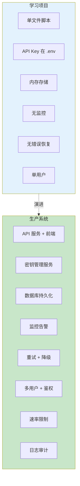
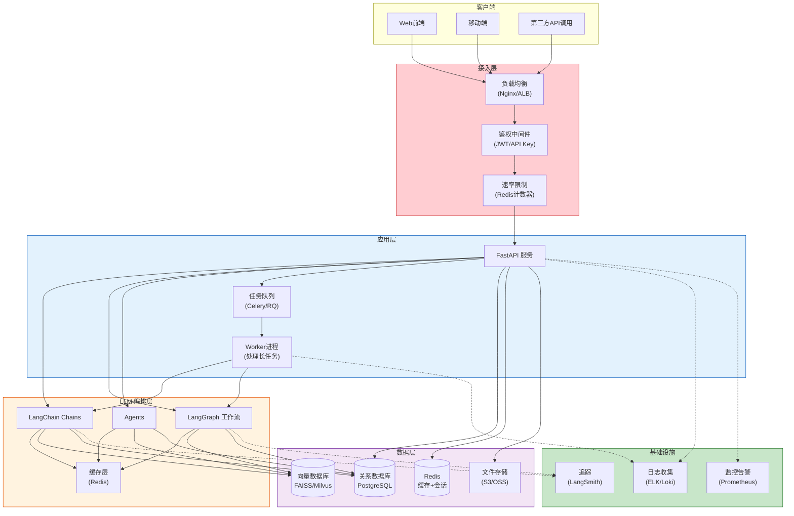
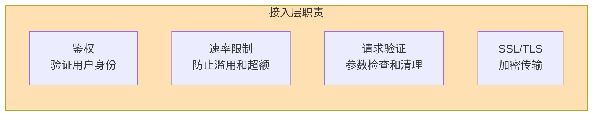
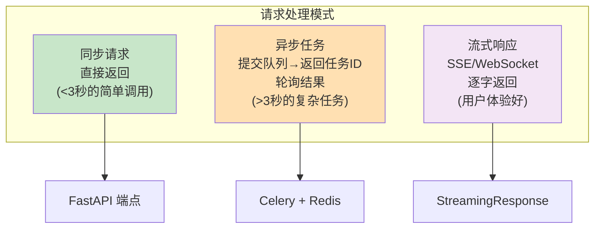
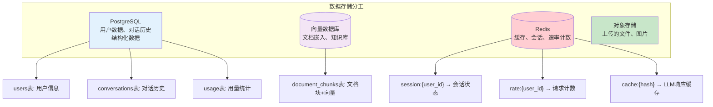
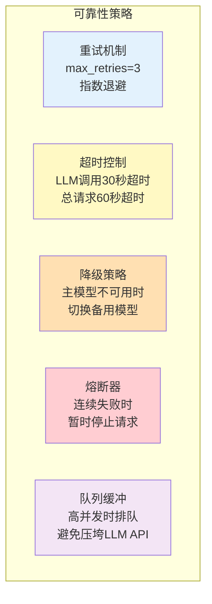
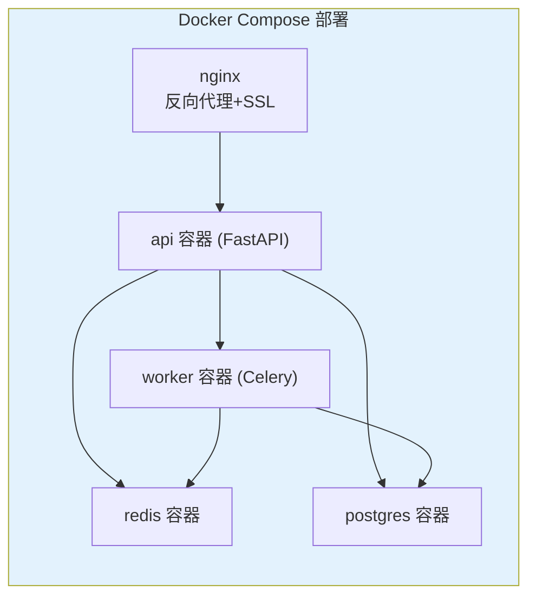
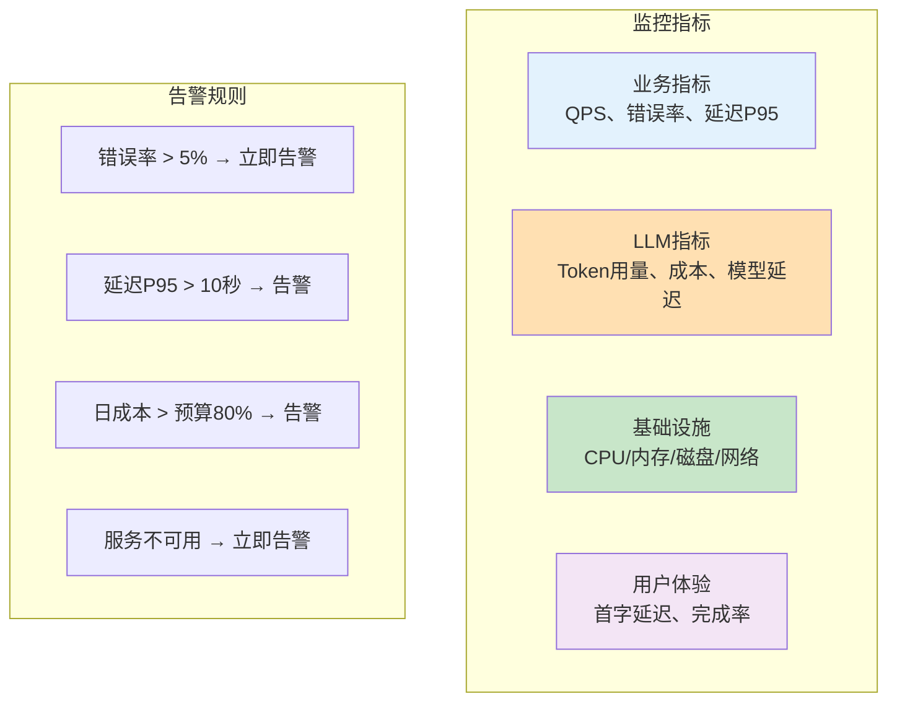
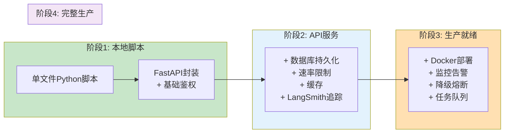

# 生产级架构设计

> 从学习项目到生产系统，需要考虑可靠性、可扩展性、安全性和可维护性。本指南覆盖 LLM 应用的生产架构。

---

## 一、学习项目 vs 生产系统



## 二、生产架构全景



## 三、分层详解

### 3.1 接入层



```python
# FastAPI 接入层示例
from fastapi import FastAPI, Depends, HTTPException, Request
from slowapi import Limiter
from slowapi.util import get_remote_address

app = FastAPI()
limiter = Limiter(key_func=get_remote_address)

# 速率限制
@app.post("/api/chat")
@limiter.limit("10/minute")  # 每分钟最多10次
async def chat(request: Request, body: ChatRequest):
    # 鉴权检查
    user = authenticate(request.headers.get("Authorization"))
    if not user:
        raise HTTPException(status_code=401, detail="未授权")

    # 输入验证
    if len(body.question) > 2000:
        raise HTTPException(status_code=400, detail="输入过长")

    # 处理
    result = await process_chat(body.question, user.id)
    return {"answer": result}
```

### 3.2 应用层



```python
# 三种处理模式的代码

# 模式1：同步（简单问答）
@app.post("/api/ask")
@limiter.limit("30/minute")
async def ask(request: Request, body: QuestionRequest):
    user = authenticate(request)
    result = await chain.ainvoke({"input": body.question})
    return {"answer": result}

# 模式2：异步任务（复杂工作流）
from celery import Celery

celery_app = Celery("tasks", broker="redis://localhost:6379")

@celery_app.task
def process_complex_task(question: str, user_id: str):
    """长时间运行的LLM工作流"""
    result = langgraph_app.invoke({"input": question})
    # 保存结果到数据库
    save_result(user_id, result)
    return result

@app.post("/api/analyze")
async def analyze(body: AnalysisRequest):
    user = authenticate(request)
    task = process_complex_task.delay(body.question, user.id)
    return {"task_id": task.id, "status": "processing"}

@app.get("/api/task/{task_id}")
async def get_task_status(task_id: str):
    task = process_complex_task.AsyncResult(task_id)
    if task.ready():
        return {"status": "done", "result": task.result}
    return {"status": "processing"}

# 模式3：流式响应
from fastapi.responses import StreamingResponse

@app.post("/api/chat/stream")
@limiter.limit("10/minute")
async def chat_stream(request: Request, body: QuestionRequest):
    user = authenticate(request)
    async def generate():
        async for chunk in chain.astream({"input": body.question}):
            yield f"data: {chunk}\n\n"
    return StreamingResponse(generate(), media_type="text/event-stream")
```

### 3.3 数据层设计



### 3.4 可靠性设计



```python
# 降级策略示例
from langchain_openai import ChatOpenAI
from langchain_anthropic import ChatAnthropic
from langchain_ollama import ChatOllama

class ResilientLLM:
    """带降级能力的LLM调用器"""
    def __init__(self):
        self.primary = ChatOpenAI(model="gpt-4o-mini", max_retries=2, timeout=30)
        self.fallback = ChatAnthropic(model="claude-3-5-sonnet-20241022", max_retries=2)
        self.last_resort = ChatOllama(model="llama3")  # 本地模型兜底

    async def invoke(self, messages):
        """依次尝试主模型→备用→兜底"""
        for llm, name in [(self.primary, "OpenAI"), (self.fallback, "Claude"), (self.last_resort, "Ollama")]:
            try:
                return await llm.ainvoke(messages)
            except Exception as e:
                print(f"⚠️ {name} 调用失败: {e}，切换备用模型...")
                continue
        raise Exception("所有模型均不可用")
```

## 四、部署架构



### docker-compose.yml

```yaml
version: "3.8"
services:
  nginx:
    image: nginx:latest
    ports:
      - "80:80"
      - "443:443"
    volumes:
      - ./nginx.conf:/etc/nginx/nginx.conf
      - ./ssl:/etc/nginx/ssl
    depends_on:
      - api

  api:
    build: .
    command: uvicorn main:app --host 0.0.0.0 --port 8000
    env_file: .env
    depends_on:
      - db
      - redis

  worker:
    build: .
    command: celery -A tasks worker --loglevel=info
    env_file: .env
    depends_on:
      - redis

  db:
    image: postgres:16
    environment:
      POSTGRES_DB: llm_app
      POSTGRES_USER: postgres
      POSTGRES_PASSWORD: ${DB_PASSWORD}
    volumes:
      - pgdata:/var/lib/postgresql/data

  redis:
    image: redis:7-alpine
    volumes:
      - redisdata:/data

volumes:
  pgdata:
  redisdata:
```

## 五、监控告警



## 六、从学习到生产的演进路线



| 阶段 | 核心任务 | 复杂度 |
|------|----------|--------|
| 1 | 跑通核心功能 | ★☆☆ |
| 2 | API 化 + 基础鉴权 | ★★☆ |
| 3 | 持久化 + 缓存 + 监控 | ★★★ |
| 4 | 容器化 + 高可用 + 告警 | ★★★★ |

不要试图一步到位——按阶段逐步演进，每步都验证可用后再进入下一步。
