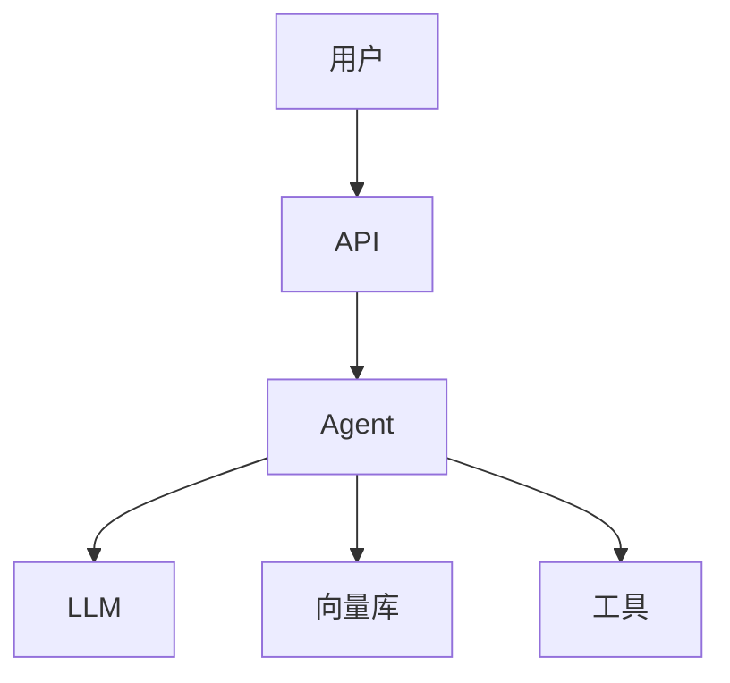

# LLM 应用设计文档模板与规范

> 一个 LLM 应用上线前应该有一份设计文档——不是形式主义，而是让团队对架构、数据流、风险和决策达成共识。这份指南提供标准模板和填写规范。

---

## 一、设计文档结构

```mermaid
graph TB
    subgraph 文档 {"LLM应用设计文档结构"}
        S1["1.项目概述<br/>做什么、为什么"]
        S2["2.架构设计<br/>组件图+数据流"]
        S3["3.数据设计<br/>数据源+存储+隐私"]
        S4["4.模型设计<br/>选型+Prompt+降级"]
        S5["5.安全设计<br/>注入防护+PII+权限"]
        S6["6.运维设计<br/>监控+告警+SLO"]
        S7["7.风险与缓解<br/>已知风险+应对"]
        S8["8.里程碑<br/>排期+验收标准"]
    end

    style 文档 fill:#E3F2FD
```

---

## 二、模板

```python
DESIGN_DOC_TEMPLATE = """# {项目名} 设计文档

## 版本历史
| 版本 | 日期 | 作者 | 变更 |
|------|------|------|------|
| v1.0 | YYYY-MM-DD | 作者 | 初稿 |

---

## 1. 项目概述

### 1.1 目标
{一段话描述项目目标}

### 1.2 背景
{为什么做这个项目，解决什么问题}

### 1.3 目标用户
{谁使用，使用场景}

### 1.4 成功标准
{可量化的成功标准，如：准确率>85%、P95<3s、月成本<$500}

---

## 2. 架构设计

### 2.1 系统架构图


### 2.2 核心组件
| 组件 | 技术选型 | 职责 |
|------|----------|------|
| API网关 | FastAPI | 接收请求 |
| Agent | LangGraph | 编排工具调用 |
| LLM | GPT-4o | 推理生成 |
| 向量库 | Milvus | RAG检索 |
| 缓存 | Redis | 语义缓存 |
| 存储 | PostgreSQL | 对话历史 |

### 2.3 数据流
{描述数据从输入到输出的完整流程}

---

## 3. 数据设计

### 3.1 数据源
| 数据源 | 格式 | 更新频率 | 大小 |
|--------|------|----------|------|
| PDF文档 | PDF | 每周 | 500MB |
| 知识库 | Markdown | 每日 | 100MB |

### 3.2 数据处理管线
{ETL流程：提取→清洗→分块→嵌入→入库}

### 3.3 数据隐私
- [ ] 不在Prompt中包含敏感信息
- [ ] 输入有PII脱敏
- [ ] 日志不记录PII
- [ ] 数据存储有访问控制

---

## 4. 模型设计

### 4.1 模型选型
| 用途 | 模型 | 理由 | 成本 |
|------|------|------|------|
| 主模型 | GPT-4o | 效果最好 | $2.50/1M |
| 快速模型 | GPT-4o-mini | 简单查询 | $0.15/1M |
| 嵌入 | BGE-large-zh | 中文最强 | 免费 |

### 4.2 Prompt设计
{核心Prompt模板和设计思路}

### 4.3 降级策略
| 场景 | 降级方案 |
|------|----------|
| LLM超时 | 返回缓存或通用回答 |
| 向量库不可用 | 关键词检索兜底 |
| API限流 | 排队+重试 |

---

## 5. 安全设计

### 5.1 威胁模型
{列出主要安全威胁}

### 5.2 防护措施
- [ ] Prompt注入检测
- [ ] 输出PII脱敏
- [ ] 工具权限控制
- [ ] 高危操作审批
- [ ] 请求限流

---

## 6. 运维设计

### 6.1 监控指标
| 指标 | 目标 | 告警阈值 |
|------|------|----------|
| P95延迟 | <3s | >5s |
| 错误率 | <5% | >10% |
| 日成本 | <$20 | >$30 |
| 缓存命中率 | >30% | <10% |

### 6.2 SLO
| 等级 | SLI | SLO |
|------|-----|-----|
| 可用性 | 成功响应率 | 99.5% |
| 延迟 | P95延迟 | <3s |
| 质量 | 用户好评率 | >80% |

---

## 7. 风险与缓解

| 风险 | 概率 | 影响 | 缓解措施 |
|------|------|------|----------|
| LLM幻觉 | 中 | 高 | Self-RAG验证 |
| 成本超预算 | 中 | 中 | 模型路由+缓存 |
| 数据泄露 | 低 | 高 | PII脱敏+本地部署 |
| Agent死循环 | 低 | 中 | max_iterations+循环检测 |

---

## 8. 里程碑

| 阶段 | 交付物 | 预计日期 | 验收标准 |
|------|--------|----------|----------|
| MVP | 基础RAG | 第2周 | 能问答 |
| Beta | 缓存+监控 | 第4周 | P95<3s |
| GA | 生产部署 | 第6周 | SLO达标 |
"""


class DesignDocGenerator:
    """设计文档生成器。"""

    @staticmethod
    def generate(project_name: str, **kwargs) -> str:
        """生成设计文档。"""
        doc = DESIGN_DOC_TEMPLATE.replace("{项目名}", project_name)

        # 填充可填充的部分
        for key, value in kwargs.items():
            placeholder = f"{{{key}}}"
            if placeholder in doc:
                doc = doc.replace(placeholder, str(value))

        return doc

    @staticmethod
    def review_checklist() -> list[str]:
        """设计文档评审清单。"""
        return [
            "项目目标是否清晰可量化",
            "架构图是否覆盖所有组件",
            "数据流是否完整描述",
            "模型选型是否有理由",
            "Prompt设计是否有示例",
            "降级策略是否覆盖主要故障",
            "安全威胁是否识别",
            "监控指标是否有告警阈值",
            "SLO是否可测量",
            "风险是否有缓解措施",
            "里程碑是否有验收标准",
            "成本预算是否估算",
        ]
```

---

## 三、设计评审流程

```mermaid
graph TB
    subgraph 评审 {"设计评审流程"}
        DRAFT["初稿"] --> REVIEW["评审会议<br/>技术+产品+安全"]
        REVIEW --> FEEDBACK["反馈意见"]
        FEEDBACK --> REVISE["修改"]
        REVISE --> APPROVE{"通过？"}
        APPROVE -->|是| BASELINE["基线确定<br/>开始开发"]
        APPROVE -->|否| REVISE
    end

    style REVIEW fill:#FFF9C4,stroke:#F9A825,stroke-width:3px
    style BASELINE fill:#C8E6C9
```

---

## 四、最佳实践

| 实践 | 说明 | 优先级 |
|------|------|--------|
| 上线前必须有设计文档 | 团队达成共识 | ★★★ |
| 架构图必画 | 图比文字清晰 | ★★★ |
| 成功标准可量化 | 不能用"效果好" | ★★★ |
| 风险有缓解措施 | 不只列风险 | ★★☆ |
| 评审会议必须有 | 不走过场 | ★★☆ |
| 文档随项目更新 | 不是一次性 | ★★☆ |

---

## 五、检查清单

| 检查项 | 状态 |
|--------|------|
| 有标准模板 | ☐ |
| 有架构图 | ☐ |
| 有数据设计 | ☐ |
| 有模型选型理由 | ☐ |
| 有安全设计 | ☐ |
| 有监控SLO | ☐ |
| 有风险缓解 | ☐ |
| 有里程碑 | ☐ |
