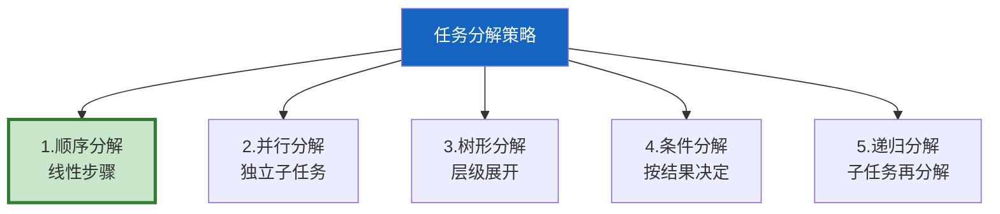
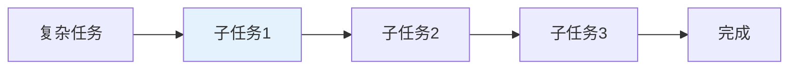
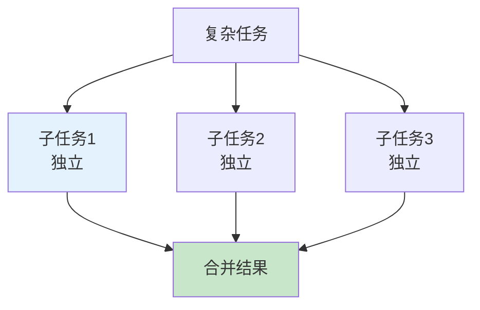
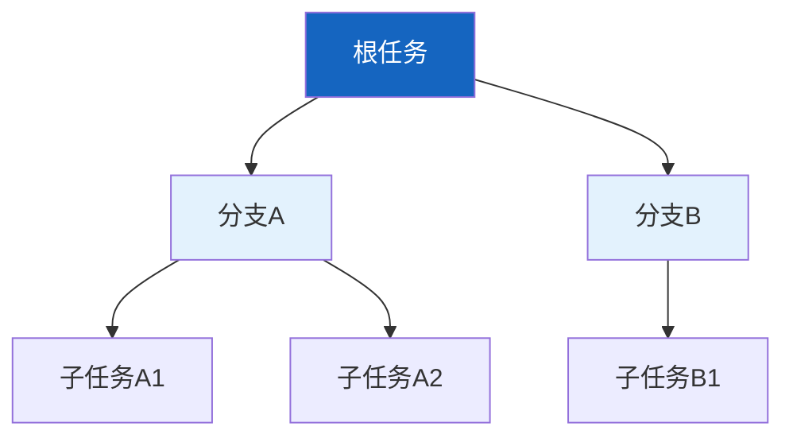
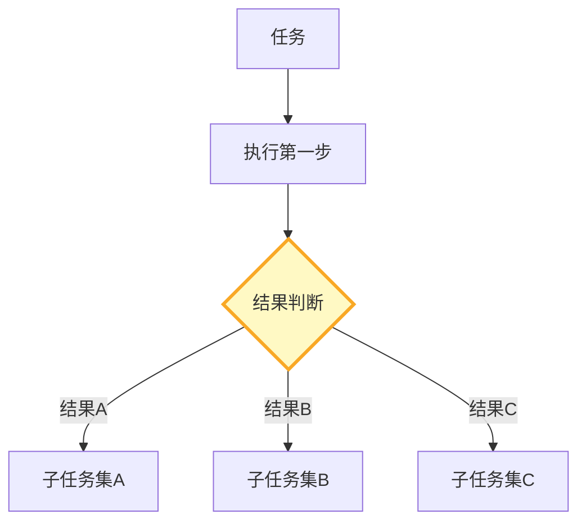
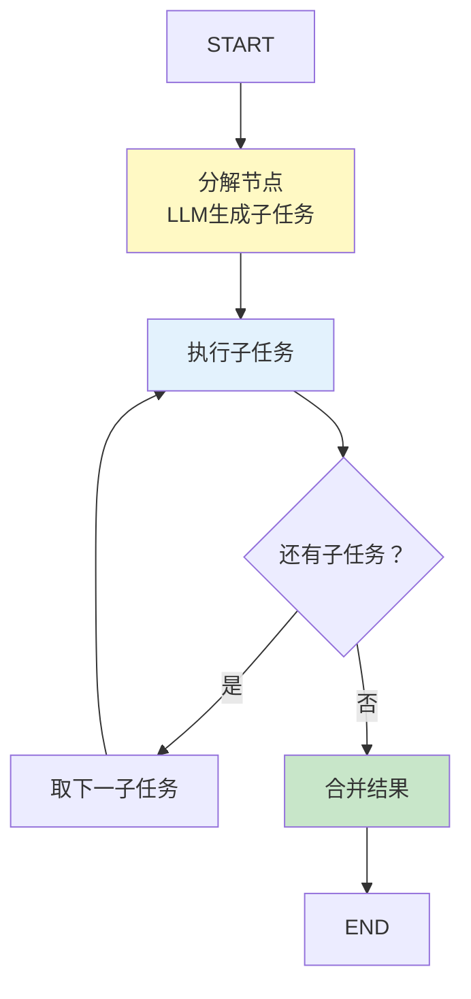

# Agent 任务分解策略

> 复杂任务直接扔给 Agent，它容易跑偏或遗漏步骤。先分解为子任务再逐一执行，效果大幅提升。这份指南覆盖 5 种分解策略和实现方法。

---

## 一、为什么需要任务分解

```mermaid
graph TB
    subgraph 直接 {"直接执行复杂任务"}
        Q1["'分析市场+写报告+发邮件'"] --> AGENT1["Agent"]
        AGENT1 --> R1["❌ 容易遗漏步骤<br/>上下文过长跑偏"]
    end

    subgraph 分解 {"先分解再执行"}
        Q2["'分析市场+写报告+发邮件'"] --> DECOMP["分解"]
        DECOMP --> T1["子任务1: 市场分析"]
        DECOMP --> T2["子任务2: 写报告"]
        DECOMP --> T3["子任务3: 发邮件"]
        T1 --> T2 --> T3
        T3 --> R2["✅ 完整执行"]
    end

    style 直接 fill:#FFCDD2
    style 分解 fill:#C8E6C9
    style DECOMP fill:#FFF9C4,stroke:#F9A825,stroke-width:3px
```

---

## 二、5 种分解策略



---

## 三、策略1：顺序分解



```python
DECOMPOSE_PROMPT = """你是任务分解专家。请将以下复杂任务分解为有序的子任务。

任务: {task}

分解要求：
1. 每个子任务可独立执行和验证
2. 子任务之间有明确的执行顺序
3. 前一个子任务的输出是后一个的输入
4. 子任务数量3-7个

输出格式（每行一个子任务，带编号）:
1. 子任务1（依赖：无）
2. 子任务2（依赖：子任务1）
3. 子任务3（依赖：子任务2）
..."""

class TaskDecomposer:
    """任务分解器。"""

    def __init__(self, llm):
        self.llm = llm

    async def decompose(self, task: str) -> list[dict]:
        """将复杂任务分解为子任务。"""
        from langchain_core.messages import HumanMessage

        prompt = DECOMPOSE_PROMPT.format(task=task)
        response = await self.llm.ainvoke([HumanMessage(content=prompt)])

        # 解析子任务
        subtasks = []
        for line in response.content.split("\n"):
            line = line.strip()
            if not line or not line[0].isdigit():
                continue
            # 格式: "1. 子任务描述（依赖：子任务X）"
            parts = line.split(".", 1)
            if len(parts) < 2:
                continue
            step_num = int(parts[0])
            description = parts[1].strip()

            # 提取依赖
            dependency = None
            if "依赖" in description:
                import re
                dep_match = re.search(r'依赖[：:]\s*(.+?)\)', description)
                if dep_match:
                    dependency = dep_match.group(1)
                    description = re.sub(r'（依赖[：:].+?）', '', description).strip()

            subtasks.append({
                "step": step_num,
                "description": description,
                "dependency": dependency,
            })

        return subtasks
```

---

## 四、策略2：并行分解



```python
import asyncio

class ParallelTaskExecutor:
    """并行任务执行器。"""

    @staticmethod
    async def execute_parallel(
        subtasks: list[dict],
        execute_func: callable,
    ) -> list[dict]:
        """并行执行无依赖的子任务。"""
        # 过滤出无依赖的子任务
        independent = [st for st in subtasks if not st.get("dependency")]

        # 并行执行
        tasks = [execute_func(st) for st in independent]
        results = await asyncio.gather(*tasks, return_exceptions=True)

        return [
            {
                "subtask": st["description"],
                "result": r if not isinstance(r, Exception) else f"错误: {r}",
                "success": not isinstance(r, Exception),
            }
            for st, r in zip(independent, results)
        ]
```

---

## 五、策略3：树形分解



```python
@dataclass
class TaskNode:
    """任务树节点。"""
    description: str
    children: list["TaskNode"] = field(default_factory=list)
    status: str = "pending"  # pending/running/done/failed
    result: str = ""

class TreeDecomposer:
    """树形分解器：子任务可以再分解。"""

    def __init__(self, llm, max_depth: int = 3):
        self.llm = llm
        self.max_depth = max_depth

    async def decompose_tree(self, task: str, depth: int = 0) -> TaskNode:
        """递归分解任务。"""
        node = TaskNode(description=task)

        if depth >= self.max_depth:
            return node

        # 分解当前任务
        subtasks = await TaskDecomposer(self.llm).decompose(task)

        # 递归分解每个子任务
        for st in subtasks:
            child = await self.decompose_tree(st["description"], depth + 1)
            node.children.append(child)

        return node
```

---

## 六、策略4：条件分解



```python
class ConditionalDecomposer:
    """条件分解：根据中间结果决定下一步。"""

    @staticmethod
    async def execute_with_conditions(
        task: str,
        llm,
        execute_func: callable,
    ) -> dict:
        """根据执行结果动态决定下一步。"""
        from langchain_core.messages import HumanMessage

        history = []
        current_task = task
        max_steps = 10

        for step in range(max_steps):
            # 执行当前任务
            result = await execute_func(current_task)
            history.append({"step": step, "task": current_task, "result": result[:200]})

            # 让LLM判断是否完成+下一步
            judge_prompt = f"""基于当前执行结果，决定下一步。

原始任务: {task}
当前步骤: {step}
当前任务: {current_task}
执行结果: {result[:500]}
历史步骤: {history[-3:]}

判断：
1. 原始任务是否已完成？回答"完成"或"未完成"
2. 如果未完成，下一步子任务是什么？

输出格式:
状态: 完成/未完成
下一步: 子任务描述（如果未完成）"""

            response = await llm.ainvoke([HumanMessage(content=judge_prompt)])

            if "完成" in response.content[:10]:
                return {"status": "completed", "steps": len(history), "history": history}

            # 提取下一步任务
            import re
            next_match = re.search(r'下一步[：:]\s*(.+)', response.content)
            if next_match:
                current_task = next_match.group(1).strip()
            else:
                return {"status": "no_next", "steps": len(history), "history": history}

        return {"status": "max_steps", "steps": len(history), "history": history}
```

---

## 七、与 LangGraph 集成



---

## 八、分解策略对比

| 策略 | 子任务关系 | 适合场景 | 复杂度 |
|------|-----------|----------|--------|
| 顺序 | 线性依赖 | 有明确步骤的任务 | 低 |
| 并行 | 独立无依赖 | 多源数据采集 | 中 |
| 树形 | 层级展开 | 超复杂任务 | 高 |
| 条件 | 动态决定 | 结果不确定的任务 | 中 |
| 递归 | 自相似 | 子任务可再分 | 高 |

---

## 九、最佳实践

| 实践 | 说明 | 优先级 |
|------|------|--------|
| 默认用顺序分解 | 最简单可靠 | ★★★ |
| 独立任务用并行 | 减少总执行时间 | ★★☆ |
| 子任务3-7个最佳 | 太少无意义，太多难管理 | ★★★ |
| 每个子任务可验证 | 知道每步是否成功 | ★★☆ |
| 结果不确定用条件分解 | 动态适应 | ★★☆ |

---

## 十、检查清单

| 检查项 | 状态 |
|--------|------|
| 有任务分解器 | ☐ |
| 能顺序分解 | ☐ |
| 能并行执行 | ☐ |
| 能条件分解 | ☐ |
| 能与LangGraph集成 | ☐ |
