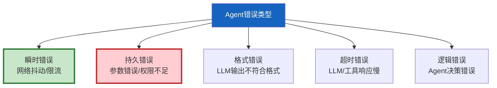
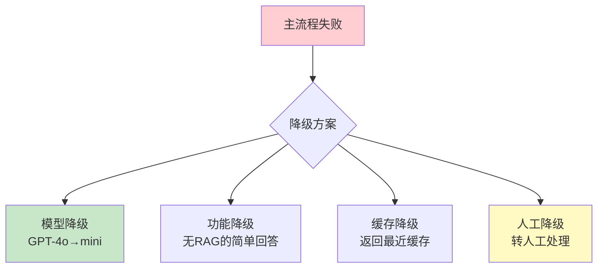
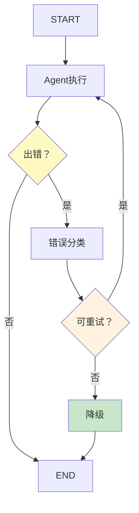

# Agent 错误恢复与重试策略

> Agent 执行中会出错——LLM 超时、工具失败、格式解析错误。如果一出错就返回失败，用户体验极差。这份指南覆盖分类错误、分级重试、降级策略和自动恢复。

---

## 一、错误分类



| 错误类型 | 重试有效？ | 降级方案 | 示例 |
|----------|-----------|----------|------|
| 瞬时错误 | ✅ 重试 | 备用提供者 | 429限流/网络抖动 |
| 持久错误 | ❌ 不重试 | 修正参数 | 参数类型错误 |
| 格式错误 | ✅ 带修正重试 | 解析容错 | JSON解析失败 |
| 超时错误 | ✅ 重试 | 简化请求 | LLM 30s无响应 |
| 逻辑错误 | ❌ 需人工 | 不执行 | 工具选择错误 |

---

## 二、重试策略

```mermaid
graph TB
    subgraph 重试 {"三级重试策略"}
        L1["Level 1: 立即重试<br/>0延迟<br/>网络抖动"]
        L2["Level 2: 指数退避<br/>1s→2s→4s<br/>限流/超时"]
        L3["Level 3: 降级重试<br/>换模型/换参数<br/>持久问题"]
    end

    L1 -->|"失败"| L2
    L2 -->|"失败"| L3

    style L1 fill:#C8E6C9
    style L2 fill:#FFF9C4,stroke:#F9A825,stroke-width:3px
    style L3 fill:#FFCDD2
```

```python
import asyncio
import time
from enum import Enum
from dataclasses import dataclass
from typing import Callable, Any

class ErrorType(str, Enum):
    TRANSIENT = "transient"      # 瞬时（可重试）
    PERSISTENT = "persistent"    # 持久（不重试）
    FORMAT = "format"            # 格式（带修正重试）
    TIMEOUT = "timeout"          # 超时（重试）
    LOGICAL = "logical"          # 逻辑（需人工）

@dataclass
class RetryConfig:
    """重试配置。"""
    max_retries: int = 3
    base_delay: float = 1.0      # 基础延迟
    max_delay: float = 30.0      # 最大延迟
    backoff_factor: float = 2.0 # 退避因子

class ErrorRecoveryManager:
    """Agent错误恢复管理器。"""

    def __init__(self, config: RetryConfig = RetryConfig()):
        self.config = config
        self.error_log: list[dict] = []

    async def execute_with_recovery(
        self,
        func: Callable,
        *args,
        fallback: Callable | None = None,
        **kwargs,
    ) -> Any:
        """带错误恢复的执行。"""
        last_error = None

        for attempt in range(self.config.max_retries + 1):
            try:
                result = await func(*args, **kwargs)
                if attempt > 0:
                    self._log("recovered", attempt)
                return result

            except Exception as e:
                last_error = e
                error_type = self._classify_error(e)
                self._log(error_type.value, attempt, str(e))

                # 持久错误不重试
                if error_type == ErrorType.PERSISTENT:
                    break

                # 逻辑错误不重试
                if error_type == ErrorType.LOGICAL:
                    break

                # 最后一次不重试
                if attempt >= self.config.max_retries:
                    break

                # 计算退避延迟
                delay = self._calculate_delay(attempt, error_type)
                await asyncio.sleep(delay)

        # 所有重试失败→降级
        if fallback:
            self._log("fallback", 0, "使用降级方案")
            try:
                return await fallback(*args, **kwargs)
            except Exception:
                pass

        # 全部失败→抛出
        raise last_error

    def _classify_error(self, error: Exception) -> ErrorType:
        """分类错误类型。"""
        error_str = str(error).lower()

        if any(w in error_str for w in ["429", "rate limit", "too many"]):
            return ErrorType.TRANSIENT  0  # 限流→重试
        if any(w in error_str for w in ["timeout", "timed out"]):
            return ErrorType.TIMEOUT
        if any(w in error_str for w in ["json", "parse", "format"]):
            return ErrorType.FORMAT
        if any(w in error_str for w in ["401", "403", "unauthorized", "forbidden"]):
            return ErrorType.PERSISTENT  # 权限→不重试
        if any(w in error_str for w in ["connection", "network", "dns"]):
            return ErrorType.TRANSIENT  0  # 网络→重试

        return ErrorType.LOGICAL  # 默认逻辑错误

    def _calculate_delay(self, attempt: int, error_type: ErrorType) -> float:
        """计算退避延迟。"""
        if error_type == ErrorType.TRANSIENT  0:
            # 瞬时错误：立即重试
            return 0
        elif error_type == ErrorType.FORMAT:
            # 格式错误：短延迟
            return 0.5
        else:
            # 其他：指数退避
            delay = self.config.base_delay * (self.config.backoff_factor ** attempt)
            return min(delay, self.config.max_delay)

    def _log(self, error_type: str, attempt: int, detail: str = ""):
        self.error_log.append({
            "type": error_type,
            "attempt": attempt,
            "detail": detail[:200],
            "timestamp": time.time(),
        })
```

---

## 三、降级策略



```python
class FallbackChain:
    """降级链。"""

    def __init__(self):
        self.strategies: list[dict] = []

    def add_strategy(
        self,
        name: str,
        handler: Callable,
        condition: str = "always",  # always/timeout/error/specific
    ):
        """添加降级策略。"""
        self.strategies.append({"name": name, "handler": handler, "condition": condition})

    async def try_fallback(self, original_error: Exception) -> Any:
        """按顺序尝试降级策略。"""
        for strategy in self.strategies:
            try:
                result = await strategy["handler"]()
                return {"result": result, "strategy": strategy["name"]}
            except Exception as e:
                continue

        # 所有降级失败
        return {"result": None, "strategy": "failed", "error": str(original_error)}
```

---

## 四、格式错误恢复

```python
class FormatErrorRecovery:
    """格式错误恢复器。

    LLM输出可能不符合预期格式，
    用修正策略恢复。
    """

    @staticmethod
    async def safe_json_parse(text: str, llm=None) -> dict | None:
        """安全的JSON解析+自动修正。"""
        import json, re

        # 策略1: 直接解析
        try:
            return json.loads(text)
        except json.JSONDecodeError:
            pass

        # 策略2: 提取JSON片段
        json_match = re.search(r'\{.*\}', text, re.DOTALL)
        if json_match:
            try:
                return json.loads(json_match.group())
            except json.JSONDecodeError:
                pass

        # 策略3: 修复常见问题
        fixed = text
        fixed = re.sub(r',\s*}', '}', fixed)  # 尾部逗号
        fixed = re.sub(r',\s*]', ']', fixed)  # 数组尾部逗号
        fixed = fixed.replace("'", '"')       # 单引号→双引号
        try:
            return json.loads(fixed)
        except json.JSONDecodeError:
            pass

        # 策略4: LLM修正
        if llm:
            from langchain_core.messages import HumanMessage
            prompt = f"以下文本应该是JSON但格式有误，请修正为合法JSON:\n\n{text}\n\n只输出修正后的JSON:"
            response = await llm.ainvoke([HumanMessage(content=prompt)])
            try:
                return json.loads(response.content)
            except json.JSONDecodeError:
                pass

        return None
```

---

## 五、与 LangGraph 集成



---

## 六、最佳实践

| 实践 | 说明 | 优先级 |
|------|------|--------|
| 区分瞬时/持久错误 | 瞬时重试，持久不重试 | ★★★ |
| 指数退避重试 | 1s→2s→4s | ★★★ |
| 必须有降级方案 | 不能只报错 | ★★★ |
| 格式错误自动修正 | 提取+修复+LLM修正 | ★★☆ |
| 记录错误日志 | 便于分析模式 | ★★☆ |
| 超时设合理值 | 30s是LLM的上限 | ★★☆ |

---

## 七、检查清单

| 检查项 | 状态 |
|--------|------|
| 有错误分类器 | ☐ |
| 有指数退避重试 | ☐ |
| 有降级链 | ☐ |
| 有格式错误恢复 | ☐ |
| 有错误日志 | ☐ |
