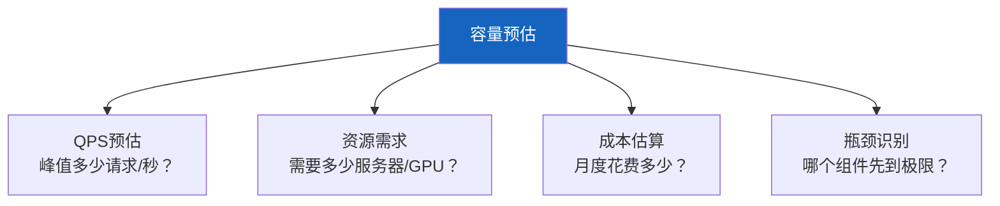

# LLM 应用容量预估与资源规划

> 上线前要回答：需要多少 GPU？能撑多少 QPS？成本是多少？容量预估帮你用数据回答这些问题，而不是拍脑袋。

---

## 一、容量预估的核心问题



---

## 二、QPS 预估方法

```python
class QPSEstimator:
    """QPS预估器。"""

    @staticmethod
    def estimate(
        daily_active_users: int,
        avg_sessions_per_user: int = 3,
        avg_messages_per_session: int = 5,
        peak_factor: float = 3.0,  # 峰值是平均的3倍
    ) -> dict:
        """预估QPS。

        Args:
            daily_active_users: 日活用户数
            avg_sessions_per_user: 每用户日均会话数
            avg_messages_per_session: 每会话消息数
            peak_factor: 峰值倍数
        """
        # 总日请求量
        daily_requests = daily_active_users * avg_sessions_per_user * avg_messages_per_session

        # 平均QPS（假设活跃集中在8小时）
        avg_qps = daily_requests / (8 * 3600)

        # 峰值QPS
        peak_qps = avg_qps * peak_factor

        return {
            "daily_active_users": daily_active_users,
            "daily_requests": daily_requests,
            "avg_qps": round(avg_qps, 2),
            "peak_qps": round(peak_qps, 2),
            "assumptions": {
                "sessions_per_user": avg_sessions_per_user,
                "messages_per_session": avg_messages_per_session,
                "active_hours": 8,
                "peak_factor": peak_factor,
            },
        }
```

---

## 三、资源需求计算

```mermaid
graph TB
    subgraph 资源 {"LLM应用资源需求"}
        R1["API层<br/>CPU为主<br/>FastAPI容器"]
        R2["Agent层<br/>CPU+内存<br/>状态管理"]
        R3["向量库<br/>内存为主<br/>HNSW索引"]
        R4["缓存<br/>内存<br/>Redis"]
        R5["存储<br/>磁盘<br/>PostgreSQL"]
    end

    sub_graph LLM {"LLM调用<br/>不占本地资源<br/>调用外部API"}
    ```

    style 资源 fill:#E3F2FD
    style LLM fill:#C8E6C9
```

```python
class ResourcePlanner:
    """资源规划器。"""

    @staticmethod
    def plan(
        peak_qps: float,
        avg_latency_ms: float = 2000,
    ) -> dict:
        """根据QPS估算资源需求。

        Args:
            peak_qps: 峰值QPS
            avg_latency_ms: 平均延迟（毫秒）
        """
        # 并发请求数 = QPS * 延迟（秒）
        concurrent_requests = peak_qps * (avg_latency_ms / 1000)

        # API层：每个容器可处理~100并发
        api_containers = max(1, int(concurrent_requests / 100) + 1)

        # 向量库：内存取决于文档量（假设10万文档，每文档500维向量）
        vector_mem_gb = max(2, int(100000 * 500 * 4 / 1e9) + 2)  # +2GB for HNSW

        # 缓存：假设30%命中率，需要缓存的请求
        cache_mem_gb = max(1, int(peak_qps * 30))  # 简化估算

        # 存储：对话历史（每条约1KB）
        daily_storage_gb = max(1, int(peak_qps * 86400 * 0.001 / 1024))

        # LLM API成本（GPT-4o-mini）
        daily_tokens = peak_qps * 86400 * 500  # 平均500token/请求
        daily_cost = daily_tokens / 1_000_000 * 0.15  # mini的价格

        return {
            "concurrent_requests": round(concurrent_requests, 1),
            "api_containers": api_containers,
            "api_cpu_per": 2,
            "api_mem_gb_per": 4,
            "vector_db": {
                "instances": 1,
                "memory_gb": vector_mem_gb,
                "cpu": 4,
            },
            "cache": {
                "type": "Redis",
                "memory_gb": cache_mem_gb,
            },
            "storage": {
                "type": "PostgreSQL",
                "daily_growth_gb": daily_storage_gb,
            },
            "llm_api": {
                "daily_tokens": int(daily_tokens),
                "daily_cost_usd": round(daily_cost, 2),
                "monthly_cost_usd": round(daily_cost * 30, 2),
            },
        }
```

---

## 四、瓶颈分析

```mermaid
graph TB
    subgraph 瓶颈 {"容量瓶颈识别"}
        B1["LLM API限流<br/>OpenAI: 500-5000 RPM<br/>最先到限"]
        B2["向量库内存<br/>文档量大→内存不够"]
        B3["Agent并发<br/>状态管理内存"]
        B4["网络带宽<br/>大量Token传输"]
    end

    style B1 fill:#FFCDD2,stroke:#C62828,stroke-width:3px
```

```python
class BottleneckAnalyzer:
    """瓶颈分析器。"""

    @staticmethod
    def analyze(estimated: dict) -> dict:
        """分析哪个组件最先到瓶颈。"""
        bottlenecks = []

        # LLM API通常是第一个瓶颈
        bottlenecks.append({
            "component": "LLM API",
            "limit": "RPM限制（如OpenAI 500 RPM）",
            "max_qps": 500 / 60,  # ~8.3 QPS
            "is_first_bottleneck": True,
            "solution": "多API Key轮换或请求企业版配额",
        })

        # 向量库
        bottlenecks.append({
            "component": "向量库",
            "limit": "内存不足",
            "max_qps": "取决于HNSW参数和硬件",
            "solution": "增加内存或分片",
        })

        # API容器
        api_max_qps = estimated.get("api_containers", 1) * 100
        bottlenecks.append({
            "component": "API层",
            "limit": f"容器并发限制({api_max_qps} QPS)",
            "max_qps": api_max_qps,
            "solution": "增加容器副本",
        })

        return {
            "bottlenecks": bottlenecks,
            "first_bottleneck": "LLM API",
            "max_sustainable_qps": min(b.get("max_qps", 0) for b in bottlenecks if isinstance(b.get("max_qps"), (int, float))),
        }
```

---

## 五、成本估算

```python
class CostEstimator:
    """成本估算器。"""

    @staticmethod
    def monthly_cost(peak_qps: float) -> dict:
        """月度成本估算。"""
        resources = ResourcePlanner.plan(peak_qps)

        # 基础设施成本
        server_cost = resources["api_containers"] * 100  # 每容器$100/月
        db_cost = 50  # PostgreSQL
        vector_cost = resources["vector_db"]["memory_gb"] * 10  # $10/GB内存
        cache_cost = resources["cache"]["memory_gb"] * 10

        infra_total = server_cost + db_cost + vector_cost + cache_cost

        # LLM API成本
        llm_cost = resources["llm_api"]["monthly_cost_usd"]

        return {
            "infrastructure": {
                "servers": server_cost,
                "database": db_cost,
                "vector_db": vector_cost,
                "cache": cache_cost,
                "subtotal": infra_total,
            },
            "llm_api": llm_cost,
            "total_monthly": round(infra_total + llm_cost, 2),
            "cost_per_1k_requests": round((infra_total + llm_cost) / 30 / (peak_qps * 86400 / 1000), 4),
        }
```

---

## 六、扩容策略

```mermaid
graph TB
    subgraph 扩容 {"按瓶颈扩容"}
        L1["LLM API到限<br/>→ 多Key+企业配额+本地模型"]
        L2["向量库慢<br/>→ 增内存+分片+读副本"]
        L3["API层满<br/>→ 加容器+负载均衡"]
        L4["缓存低<br/>→ 增内存+调TTL"]
    end

    style 扩容 fill:#E3F2FD
```

---

## 七、最佳实践

| 实践 | 说明 | 优先级 |
|------|------|--------|
| 先估算再上线 | 不要上线后才发现撑不住 | ★★★ |
| LLM API是第一个瓶颈 | 提前申请配额 | ★★★ |
| 预留50%余量 | 高峰期要有缓冲 | ★★☆ |
| 模型路由省成本 | 80%走小模型 | ★★☆ |
| 监控实际vs预估 | 校准模型 | ★★☆ |

---

## 八、检查清单

| 检查项 | 状态 |
|--------|------|
| 有QPS预估 | ☐ |
| 有资源规划 | ☐ |
| 有瓶颈分析 | ☐ |
| 有成本估算 | ☐ |
| 有扩容方案 | ☐ |
