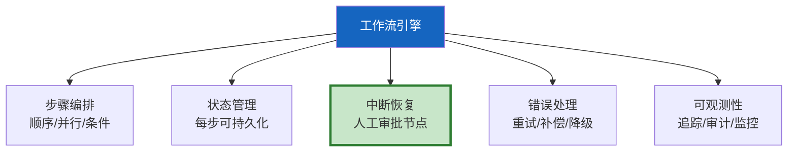

# Agent 工作流引擎设计

> 简单 Agent 是"输入→LLM→输出"一步完成。复杂 Agent 是"多步骤、有条件分支、可中断恢复、有审批节点"的工作流。这份指南讲透如何设计一个支持这些特性的工作流引擎。

---

## 一、工作流引擎核心能力



---

## 二、工作流定义

```python
from dataclasses import dataclass, field
from enum import Enum
from typing import Callable, Any
from langgraph.graph import StateGraph, START, END
from langgraph.checkpoint.memory import MemorySaver

class StepType(str, Enum):
    LLM = "llm"                # LLM调用
    TOOL = "tool"              # 工具调用
    CONDITION = "condition"    # 条件判断
    APPROVAL = "approval"      # 人工审批
    PARALLEL = "parallel"      # 并行执行
    WAIT = "wait"             # 等待

@dataclass
class WorkflowStep:
    """工作流步骤定义。"""
    name: str
    step_type: StepType
    handler: Callable = None
    condition: Callable = None     # 条件判断函数
    timeout: int = 60
    retry: int = 2
    require_approval: bool = False

class WorkflowDefinition:
    """工作流定义。"""
    def __init__(self, name: str):
        self.name = name
        self.steps: dict[str, WorkflowStep] = {}
        self.transitions: dict[str, list[tuple[str, Callable]]] = {}

    def add_step(self, step: WorkflowStep):
        self.steps[step.name] = step

    def add_transition(
        self,
        from_step: str,
        to_step: str,
        condition: Callable = None,
    ):
        if from_step not in self.transitions:
            self.transitions[from_step] = []
        self.transitions[from_step].append((to_step, condition))

    def validate(self) -> dict:
        """验证工作流定义完整性。"""
        issues = []
        for name, step in self.steps.items():
            if not step.handler and step.step_type != StepType.CONDITION:
                issues.append(f"步骤'{name}'缺少handler")
            if name not in self.transitions and name not in [s.name for s in self.steps.values()]:
                issues.append(f"步骤'{name}'没有出口转换")
        return {"valid": len(issues) == 0, "issues": issues}
```

---

## 三、引擎实现

```python
from langgraph.graph import StateGraph, START, END
from langgraph.types import interrupt, Command
from typing import TypedDict, Annotated
from langgraph.graph.message import add_messages
from langgraph.checkpoint.memory import MemorySaver
import asyncio
from dataclasses import dataclass, field

@dataclass
class WorkflowEngineConfig:
    """引擎配置。"""
    max_steps: int = 20
    default_timeout: int = 60
    enable_checkpoint: bool = True
    enable_tracing: bool = True

class WorkflowEngine:
    """工作流引擎——基于LangGraph。

    将工作流定义转换为LangGraph图，
    支持条件路由、中断恢复和错误处理。
    """

    def __init__(
        self,
        definition: WorkflowDefinition,
        config: WorkflowEngineConfig = WorkflowEngineConfig(),
    ):
        self.definition = definition
        self.config = config
        self.checkpointer = MemorySaver() if config.enable_checkpoint else None
        self._compiled = None

    def build(self) -> StateGraph:
        """将工作流定义构建为LangGraph图。"""
        class WorkflowState(TypedDict):
            messages: Annotated[list, add_messages]
            current_step: str
            step_results: dict
            approval_status: str
            error: str

        graph = StateGraph(WorkflowState)

        # 注册步骤为节点
        for name, step in self.definition.steps.items():
            node_func = self._create_node_func(step)
            graph.add_node(name, node_func)

        # 连接转换
        for from_step, transitions in self.definition.transitions.items():
            if len(transitions) == 1 and transitions[0][1] is None:
                # 无条件转换
                graph.add_edge(from_step, transitions[0][0])
            else:
                # 条件路由
                route_map = {}
                route_func = self._create_route_func(transitions)
                for to_step, _ in transitions:
                    route_map[to_step] = to_step
                graph.add_conditional_edges(from_step, route_func, route_map)

        # 设置入口
        if self.definition.steps:
            first_step = list(self.definition.steps.keys())[0]
            graph.add_edge(START, first_step)

        return graph.compile(checkpointer=self.checkpointer)

    def _create_node_func(self, step: WorkflowStep):
        """为步骤创建节点函数。"""
        async def node_func(state: dict) -> dict:
            # 审批步骤
            if step.require_approval:
                approval = interrupt({
                    "step": step.name,
                    "message": f"步骤'{step.name}'需要审批",
                })
                if not approval.get("approved"):
                    return {"approval_status": "rejected"}
                return {"approval_status": "approved", "current_step": step.name}

            # 执行handler
            if step.handler:
                try:
                    result = await step.handler(state)
                    state["step_results"][step.name] = result
                    return {"current_step": step.name, "step_results": state["step_results"]}
                except Exception as e:
                    return {"error": str(e)}

            return {"current_step": step.name}

        return node_func

    def _create_route_func(self, transitions):
        """创建条件路由函数。"""
        def route_func(state: dict) -> str:
            for to_step, condition in transitions:
                if condition is None or condition(state):
                    return to_step
            return END
        return route_func

    def get_compiled(self):
        """获取编译后的图。"""
        if self._compiled is None:
            self._compiled = self.build()
        return self._compiled
```

---

## 四、预定义工作流模板

```mermaid
graph TB
    subgraph 模板 {"常用工作流模板"}
        T1["审批流: 提交→审批→执行"]
        T2["研究流: 搜索→分析→报告"]
        T3["客服流: 分类→检索→回答→满意度"]
        T4["数据流: 收集→清洗→分析→可视化"]
    end

    style 模板 fill:#E3F2FD
```

```python
class WorkflowTemplates:
    """预定义工作流模板。"""

    @staticmethod
    def approval_workflow() -> WorkflowDefinition:
        """审批工作流模板。"""
        wf = WorkflowDefinition("approval")
        wf.add_step(WorkflowStep(
            name="submit", step_type=StepType.LLM,
            handler=lambda s: {"submitted": True},
        ))
        wf.add_step(WorkflowStep(
            name="approve", step_type=StepType.APPROVAL,
            require_approval=True,
        ))
        wf.add_step(WorkflowStep(
            name="execute", step_type=StepType.TOOL,
            handler=lambda s: {"executed": True},
        ))
        wf.add_step(WorkflowStep(
            name="notify", step_type=StepType.TOOL,
            handler=lambda s: {"notified": True},
        ))
        wf.add_transition("submit", "approve")
        wf.add_transition("approve", "execute",
            condition=lambda s: s.get("approval_status") == "approved")
        wf.add_transition("approve", "notify",
            condition=lambda s: s.get("approval_status") == "rejected")
        wf.add_transition("execute", "notify")
        return wf

    @staticmethod
    def research_workflow() -> WorkflowDefinition:
        """研究工作流模板。"""
        wf = WorkflowDefinition("research")
        wf.add_step(WorkflowStep(name="search", step_type=StepType.TOOL))
        wf.add_step(WorkflowStep(name="analyze", step_type=StepType.LLM))
        wf.add_step(WorkflowStep(name="write", step_type=StepType.LLM))
        wf.add_transition("search", "analyze")
        wf.add_transition("analyze", "write")
        return wf
```

---

## 五、并行执行

```python
class ParallelStepExecutor:
    """并行步骤执行器。"""

    @staticmethod
    async def execute_parallel(
        steps: list[WorkflowStep],
        state: dict,
    ) -> dict:
        """并行执行多个步骤。"""
        tasks = [step.handler(state) for step in steps if step.handler]
        results = await asyncio.gather(*tasks, return_exceptions=True)

        merged = {}
        for step, result in zip(steps, results):
            if isinstance(result, Exception):
                merged[step.name] = {"error": str(result)}
            else:
                merged[step.name] = result
        return merged
```

---

## 六、最佳实践

| 实践 | 说明 | 优先级 |
|------|------|--------|
| 基于LangGraph构建 | 状态管理+检查点+条件路由 | ★★★ |
| 步骤要有handler | 每步可独立测试 | ★★★ |
| 审批步骤用interrupt | 可中断可恢复 | ★★★ |
| 工作流要可验证 | 防止死循环和死路 | ★★☆ |
| 有超时和重试 | 防止卡住 | ★★☆ |
| 支持并行步骤 | 提升效率 | ★★☆ |

---

## 七、检查清单

| 检查项 | 状态 |
|--------|------|
| 有工作流定义 | ☐ |
| 有引擎实现 | ☐ |
| 有预定义模板 | ☐ |
| 有并行执行 | ☐ |
| 有验证机制 | ☐ |
