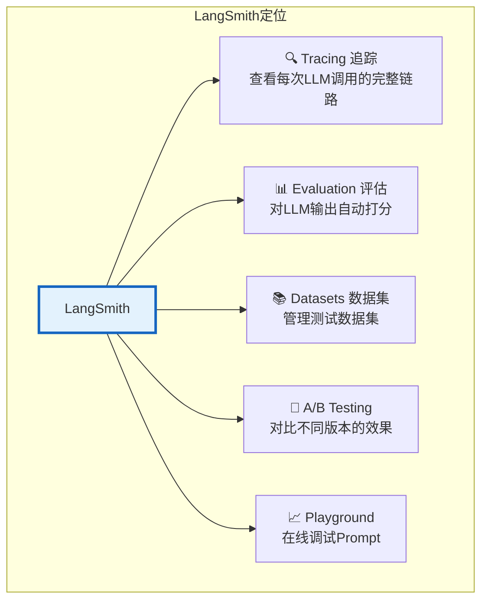
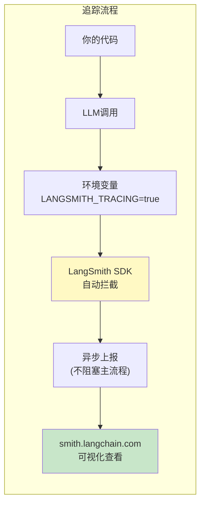
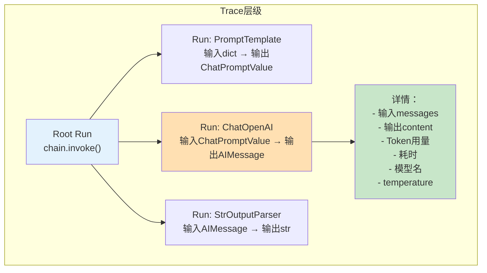
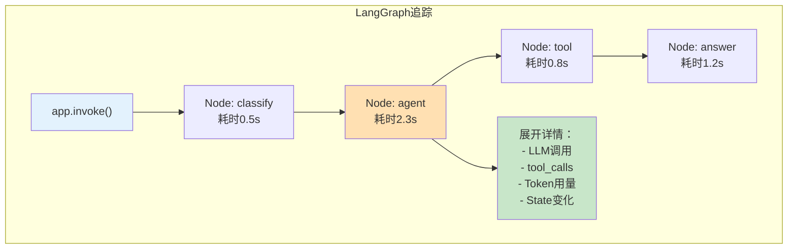
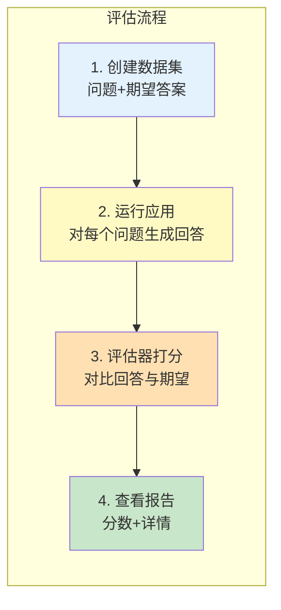
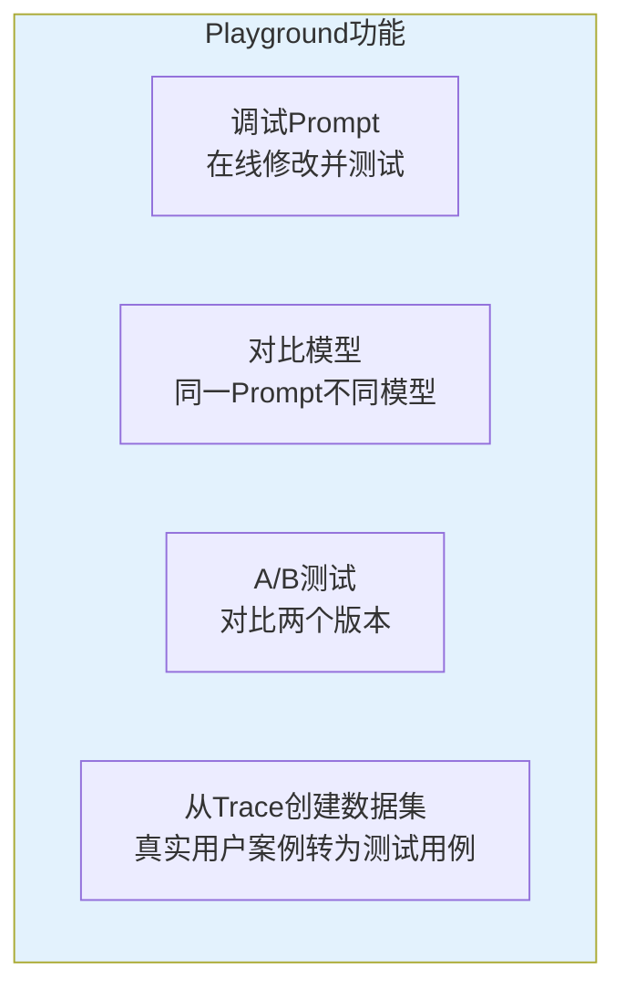
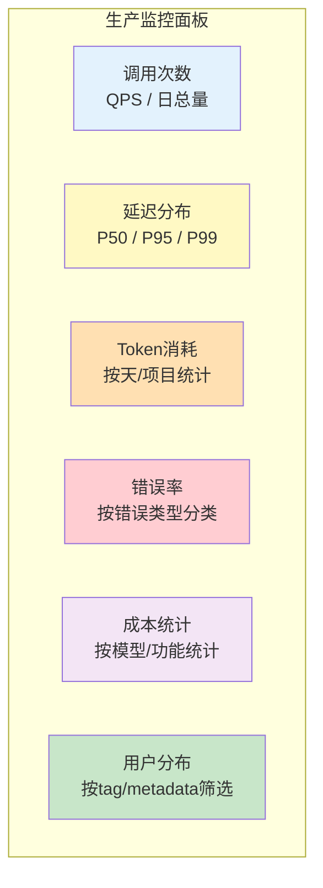

# LangSmith 深度指南

> LangSmith 是 LangChain 官方的 LLM 可观测性平台。本指南覆盖从配置到评估的完整工作流。

---

## 一、LangSmith 是什么



## 二、配置

### 2.1 获取 API Key

1. 前往 [smith.langchain.com](https://smith.langchain.com) 注册
2. Settings → API Keys → Create API Key
3. 在 `.env` 中配置：

```env
LANGSMITH_API_KEY=lsv2_pt_你的密钥
LANGSMITH_TRACING=true
LANGSMITH_PROJECT=my-learning-project
```

### 2.2 自动追踪

配置环境变量后，**所有 LangChain 调用自动上报**，无需修改代码：

```python
from dotenv import load_dotenv
from langchain_openai import ChatOpenAI

load_dotenv()  # 自动加载 LANGSMITH_* 环境变量

llm = ChatOpenAI(model="gpt-4o-mini")
response = llm.invoke("你好")

# 这次调用已自动上报到 LangSmith
# 去 smith.langchain.com 就能看到完整的调用链路
```

### 2.3 追踪的数据流



## 三、追踪界面详解

### 3.1 Trace 结构



### 3.2 每个 Run 记录的信息

| 字段 | 说明 |
|------|------|
| name | 组件名称（如 ChatOpenAI、PromptTemplate） |
| type | 类型（llm, chain, tool, retriever, embedding） |
| inputs | 输入数据（完整内容） |
| outputs | 输出数据（完整内容） |
| error | 如果出错，记录错误信息 |
| start_time / end_time | 开始和结束时间 |
| latency | 耗时（毫秒） |
| token_usage | Token 用量（仅 LLM 类型） |
| metadata | 额外元数据 |
| tags | 自定义标签 |

### 3.3 自定义标签和元数据

```python
# 给调用添加标签和元数据，方便在 LangSmith 中筛选
response = llm.invoke(
    "你好",
    config={
        "tags": ["production", "customer-service"],
        "metadata": {
            "user_id": "user_001",
            "session_id": "session_abc",
            "feature": "chat",
        }
    }
)

# 在 LangSmith 界面可以按 tag/metadata 筛选
```

## 四、LangGraph 追踪



LangGraph 的追踪会展开每个节点的执行细节：

```python
# LangGraph 自动追踪
app = graph.compile()

# 调用时添加元数据
result = app.invoke(
    {"input": "hello"},
    config={
        "configurable": {"thread_id": "session_001"},
        "tags": ["langgraph", "v1"],
        "metadata": {"user": "test_user"},
    }
)

# 在 LangSmith 中可以看到：
# 1. 整个图的执行轨迹
# 2. 每个节点的输入/输出
# 3. 条件路由的判断结果
# 4. 每个节点内部 LLM 调用的详情
```

## 五、评估工作流

### 5.1 评估流程



### 5.2 创建数据集

```python
from langsmith import Client

client = Client()

# 创建数据集
dataset = client.create_dataset(
    "qa_eval_dataset",
    description="问答系统评估数据集"
)

# 添加测试用例
test_cases = [
    {"question": "LangChain是什么？", "answer": "一个LLM应用框架"},
    {"question": "RAG的步骤？", "answer": "加载→分割→向量化→检索→生成"},
    {"question": "LCEL是什么？", "answer": "LangChain表达式语言"},
]

for case in test_cases:
    client.create_example(
        inputs={"question": case["question"]},
        outputs={"answer": case["answer"]},
        dataset_id=dataset.id,
    )
```

### 5.3 定义评估器

```python
from langchain_openai import ChatOpenAI
from langchain_core.prompts import ChatPromptTemplate

llm = ChatOpenAI(model="gpt-4o-mini", temperature=0)

def correctness_evaluator(run, example):
    """正确性评估器"""
    prediction = run.outputs.get("output", "")
    reference = example.outputs.get("answer", "")
    question = example.inputs.get("question", "")

    prompt = ChatPromptTemplate.from_template(
        """判断回答是否正确。
        问题：{question}
        标准答案：{reference}
        实际回答：{prediction}
        是否正确？只返回 1（正确）或 0（不正确）。"""
    )
    chain = prompt | llm
    result = chain.invoke({
        "question": question,
        "reference": reference,
        "prediction": prediction,
    })

    score = 1 if "1" in result.content else 0
    return {"key": "correctness", "score": score}

def relevance_evaluator(run, example):
    """相关性评估器"""
    prediction = run.outputs.get("output", "")
    question = example.inputs.get("question", "")

    prompt = ChatPromptTemplate.from_template(
        "判断回答是否与问题相关。1=相关，0=不相关。\n问题：{q}\n回答：{a}"
    )
    chain = prompt | llm
    result = chain.invoke({"q": question, "a": prediction})
    score = 1 if "1" in result.content else 0
    return {"key": "relevance", "score": score}
```

### 5.4 运行评估

```python
from langsmith import RunEvalConfig

eval_config = RunEvalConfig(
    custom_evaluators=[correctness_evaluator, relevance_evaluator],
)

# 运行评估
results = client.run_on_dataset(
    dataset_name="qa_eval_dataset",
    llm_or_chain_factory=lambda: your_chain,
    evaluation=eval_config,
    project_name="eval_run_001",
)

# 查看结果
print(f"正确性: {results['correctness']['mean_score']:.2%}")
print(f"相关性: {results['relevance']['mean_score']:.2%}")
```

## 六、在线 Playground



### 从 Trace 创建测试用例

```python
# 将生产环境中的真实调用转为测试用例
# 在 LangSmith 界面操作：
# 1. 打开某个 Trace
# 2. 点击 "Add to Dataset"
# 3. 选择数据集或创建新数据集
# 4. 输入期望答案
# 这样就把真实用户的问题变成了回归测试用例
```

## 七、生产监控



## 八、LangSmith 免费额度与限制

| 项目 | 免费额度 | 说明 |
|------|----------|------|
| Traces | 5000次/月 | 开发者计划免费 |
| 数据集 | 无限制 | 可创建无限数据集 |
| 评估运行 | 消耗 Trace 额度 | 每个评估用例消耗1次 |
| 团队成员 | 1人(开发者) | 多人需付费计划 |
| 数据保留 | 14天 | 付费可延长 |

> 💡 学习阶段 5000 次/月足够。生产环境建议评估付费计划或使用开源替代方案（如 Langfuse）。
