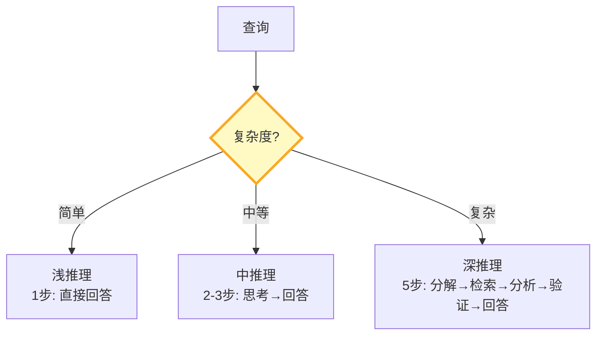

# Agent 推理链优化

> Agent 的推理质量不取决于模型有多强——取决于推理链有多清晰。冗余的推理步骤浪费 Token，断裂的推理链导致错误决策。这份指南讲透如何优化 Agent 的推理链。

---

## 一、推理链的三个层次

```mermaid
graph TB
    subgraph 推理链 {"Agent推理链三层"}
        L1["感知层<br/>理解输入意图"]
        L2["规划层<br/>分解任务+选择策略"]
        L3["执行层<br/>调用工具+生成回答"]
    end

    L1 --> L2 --> L3

    style L2 fill:#FFF9C4,stroke:#F9A825,stroke-width:3px
```

---

## 二、推理链的常见问题

```mermaid
graph TB
    subgraph 问题 {"推理链5种问题"}
        P1["冗余推理<br/>已知信息还要'思考'"]
        P2["推理跳跃<br/>跳过关键步骤"]
        P3["循环推理<br/>在两步间反复"]
        P4["无效推理<br/>思考与行动无关"]
        P5["过度推理<br/>简单问题复杂化"]
    end

    style 问题 fill:#FFCDD2
```

---

## 三、优化策略

```python
from langchain_core.language_models import BaseChatModel
from langchain_core.messages import HumanMessage, SystemMessage
from dataclasses import dataclass
from typing import Optional

@dataclass
class ReasoningStep:
    """推理步骤。"""
    thought: str          # 思考内容
    action: str = ""      # 行动
    is_necessary: bool = True  # 是否必要

class ReasoningOptimizer:
    """推理链优化器。"""

    OPTIMIZATION_PROMPT = """你是一个推理链优化专家。请分析以下Agent的推理过程并优化。

## 原始推理链
{reasoning_chain}

## 优化维度
1. **去冗余**: 移除已知信息的重复推理
2. **补跳跃**: 补充缺失的推理步骤
3. **断循环**: 识别并终止循环推理
4. **去无效**: 移除与任务无关的思考
5. **简化**: 简单问题不需要复杂推理

## 输出
```json
{{
  "issues": ["问题1", "问题2"],
  "optimized_chain": "优化后的推理链",
  "token_saved": 50,
  "clarity_improved": true
}}
```"""

    @staticmethod
    async def optimize(llm: BaseChatModel, reasoning_chain: str) -> dict:
        """优化推理链。"""
        prompt = ReasoningOptimizer.OPTIMIZATION_PROMPT.format(
            reasoning_chain=reasoning_chain[:2000],
        )
        response = await llm.ainvoke([HumanMessage(content=prompt)])

        import re, json
        match = re.search(r'\{.*\}', response.content, re.DOTALL)
        if match:
            return json.loads(match.group())
        return {"optimized_chain": reasoning_chain, "issues": []}

    @staticmethod
    def should_use_cot(query: str) -> bool:
        """判断是否需要思维链。

        简单问题不需要CoT，复杂问题需要。
        """
        # 不需要CoT的场景
        no_cot_triggers = ["你好", "谢谢", "再见", "是", "不是"]
        if len(query) < 10 and any(t in query for t in no_cot_triggers):
            return False

        # 需要CoT的场景
        cot_triggers = ["为什么", "分析", "对比", "计算", "解释", "推理", "分步"]
        if any(t in query for t in cot_triggers):
            return True

        # 默认简单问题不用
        return len(query) > 50

    @staticmethod
    def estimate_reasoning_depth(query: str) -> int:
        """估算推理深度（几步推理）。"""
        if len(query) < 20:
            return 1  # 1步
        elif any(t in query for t in ["对比", "分析", "为什么"]):
            return 3  # 3步
        elif "分步" in query or "详细" in query:
            return 5  # 5步
        return 2  # 默认2步
```

---

## 四、动态推理深度



```python
class DynamicReasoningController:
    """动态推理深度控制器。

    根据查询复杂度选择合适的推理深度，
    避免简单问题过度推理、复杂问题推理不足。
    """

    PROMPT_TEMPLATES = {
        1: "直接回答: {query}",  # 1步
        2: "思考后回答:\n问题: {query}\n思考:",  # 2步
        3: "分步推理:\n问题: {query}\n步骤1:\n步骤2:\n步骤3:\n答案:",  # 3步
        5: "详细推理:\n问题: {query}\n1.分析问题:\n2.检索信息:\n3.分析推理:\n4.验证:\n5.总结回答:",  # 5步
    }

    @classmethod
    def build_prompt(cls, query: str, complexity: int = None) -> str:
        """根据复杂度构建Prompt。"""
        if complexity is None:
            complexity = ReasoningOptimizer.estimate_reasoning_depth(query)

        template = cls.PROMPT_TEMPLATES.get(complexity, cls.PROMPT_TEMPLATES[2])
        return template.format(query=query)
```

---

## 五、推理链质量评估

```python
class ReasoningQualityAssessor:
    """推理链质量评估器。"""

    @staticmethod
    def assess(steps: list[ReasoningStep]) -> dict:
        """评估推理链质量。"""
        if not steps:
            return {"score": 0, "issues": ["无推理步骤"]}

        issues = []
        total_thoughts = len(steps)

        # 1. 冗余检测：连续两步思考内容相似
        for i in range(1, len(steps)):
            if steps[i].thought[:50] == steps[i-1].thought[:50]:
                issues.append(f"步骤{i+1}与步骤{i}重复")

        # 2. 跳跃检测：从工具调用直接跳到最终答案
        has_tool_calls = any(s.action for s in steps)
        if has_tool_calls:
            tool_steps = [i for i, s in enumerate(steps) if s.action]
            non_tool_after = [i for i, s in enumerate(steps) if not s.action and i > tool_steps[-1]]
            if not non_tool_after:
                issues.append("工具调用后直接给答案，缺少结果分析")

        # 3. 循环检测
        thoughts = [s.thought[:30] for s in steps]
        for i in range(len(thoughts) - 1):
            for j in range(i + 2, min(len(thoughts), i + 5)):
                if thoughts[i] == thoughts[j]:
                    issues.append(f"步骤{i+1}和{j+1}可能循环")
                    break

        # 4. 长度评估
        if total_thoughts > 10:
            issues.append(f"推理步骤过多({total_thoughts})，可能过度推理")
        elif total_thoughts == 1 and len(steps[0].thought) > 50:
            issues.append("单步推理但内容长，可能需要分解")

        score = max(0, 1 - len(issues) * 0.2)

        return {
            "steps": total_thoughts,
            "score": round(score, 2),
            "issues": issues,
            "quality": "高" if score >= 0.8 else "中" if score >= 0.5 else "低",
        }
```

---

## 六、最佳实践

| 实践 | 说明 | 优先级 |
|------|------|--------|
| 简单问题不推理 | 省 Token | ★★★ |
| 复杂问题分步推理 | 提升准确率 | ★★★ |
| 动态推理深度 | 按复杂度调整 | ★★★ |
| 去冗余推理 | 已知信息不重复思考 | ★★☆ |
| 检测循环推理 | 防止死循环 | ★★☆ |
| 评估推理质量 | 持续改进 | ★★☆ |

---

## 七、检查清单

| 检查项 | 状态 |
|--------|------|
| 有推理链优化器 | ☐ |
| 有动态推理深度 | ☐ |
| 有质量评估器 | ☐ |
| 有冗余检测 | ☐ |
