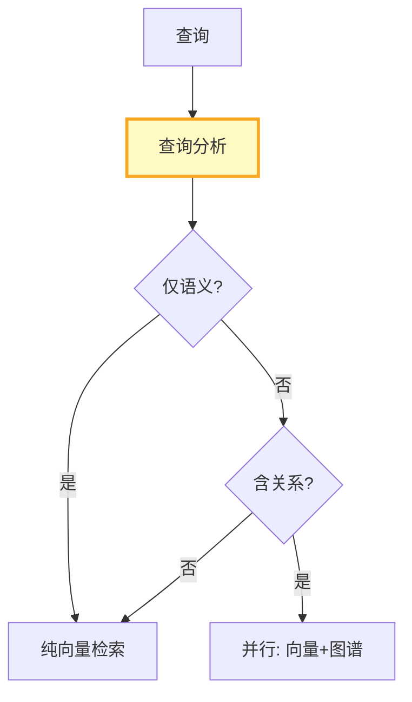

# RAG 知识图谱融合深度

> 知识库 135 讲了知识图谱构建基础。这份指南深入向量 RAG 与知识图谱的融合架构——如何让两种检索互补、如何处理冲突、如何统一输出。

---

## 一、融合架构

```mermaid
graph TB
    subgraph 融合 {"向量+图谱融合"}
        Q["查询"] --> SPLIT["并行检索"]
        SPLIT --> VEC["向量检索<br/>语义相似"]
        SPLIT --> GRAPH["图谱查询<br/>关系精确"]
        VEC --> MERGE["结果融合"]
        GRAPH --> MERGE
        MERGE --> CONFLICT{"冲突检测"}
        CONFLICT -->|无冲突| GEN["LLM生成"]
        CONFLICT -->|有冲突| RESOLVE["冲突解决"]
        RESOLVE --> GEN
    end

    style MERGE fill:#FFF9C4,stroke:#F9A825,stroke-width:3px
    style GEN fill:#C8E6C9
```

---

## 二、结果融合策略

```python
from langchain_core.documents import Document
from dataclasses import dataclass, field
from typing import Optional

@dataclass
class FusedResult:
    """融合结果。"""
    content: str
    source: str       # vector / graph / both
    confidence: float
    metadata: dict = field(default_factory=dict)

class ResultFusion:
    """结果融合器。"""

    @staticmethod
    def fuse(
        vector_results: list[Document],
        graph_results: list[dict],
        query: str,
    ) -> list[FusedResult]:
        """融合向量检索和图谱查询结果。"""
        fused = []

        # 向量结果 → FusedResult
        for doc in vector_results:
            fused.append(FusedResult(
                content=doc.page_content,
                source="vector",
                confidence=0.7,  # 向量检索的置信度
                metadata=doc.metadata,
            ))

        # 图谱结果 → FusedResult
        for result in graph_results:
            content = result.get("content", "")
            entity = result.get("entity", "")
            relations = result.get("relations", [])

            content_text = f"[图谱] {entity}: {', '.join(relations)}"

            # 检查是否与向量结果重叠
            overlapping = [f for f in fused if entity in f.content]
            if overlapping:
                # 合并：增强已有结果
                for f in overlapping:
                    f.source = "both"
                    f.confidence = min(1.0, f.confidence + 0.2)
                    f.content += f"\n[图谱补充] {entity}: {', '.join(relations)}"
            else:
                fused.append(FusedResult(
                    content=content_text,
                    source="graph",
                    confidence=0.9,  # 图谱关系更精确
                    metadata={"entity": entity, "relations": relations},
                ))

        # 按置信度排序
        fused.sort(key=lambda x: x.confidence, reverse=True)
        return fused

    @staticmethod
    def detect_conflicts(results: list[FusedResult]) -> list[dict]:
        """检测冲突：同一实体在向量结果和图谱结果中信息矛盾。"""
        conflicts = []
        # 简化：同一实体出现多次且内容不同
        entity_map = {}
        for r in results:
            entity = r.metadata.get("entity", "")
            if entity:
                if entity in entity_map:
                    if entity_map[entity].content[:50] != r.content[:50]:
                        conflicts.append({
                            "entity": entity,
                            "vector_info": entity_map[entity].content[:100],
                            "graph_info": r.content[:100],
                        })
                else:
                    entity_map[entity] = r
        return conflicts

    @staticmethod
    def resolve_conflict(conflict: dict) -> str:
        """解决冲突——图谱关系优先。"""
        return f"以图谱信息为准: {conflict['graph_info']}"
```

---

## 三、查询分解与路由



```python
class HybridQueryRouter:
    """混合查询路由器。"""

    @staticmethod
    def should_query_graph(query: str) -> bool:
        """判断是否需要图谱查询。"""
        relation_triggers = ["的同事", "的上级", "的关系", "属于", "管理", "负责"]
        return any(t in query for t in relation_triggers)

    @staticmethod
    def should_query_vector(query: str) -> bool:
        """判断是否需要向量检索。"""
        # 大部分查询都需要向量检索
        no_vector_triggers = ["的同事", "的下属"]  # 纯关系查询可能不需要
        return not all(t in query for t in no_vector_triggers)
```

---

## 四、最佳实践

| 实践 | 说明 | 优先级 |
|------|------|--------|
| 向量+图谱并行检索 | 两种优势互补 | ★★★ |
| 图谱关系置信度更高 | 关系是精确的 | ★★☆ |
| 冲突时图谱优先 | 结构化信息更可靠 | ★★☆ |
| 按查询特征路由 | 关系查询走图谱 | ★★☆ |
| 合并而非替代 | 向量补充语义 | ★★☆ |

---

## 五、检查清单

| 检查项 | 状态 |
|--------|------|
| 有结果融合器 | ☐ |
| 有冲突检测 | ☐ |
| 有查询路由 | ☐ |
| 有融合策略 | ☐ |
