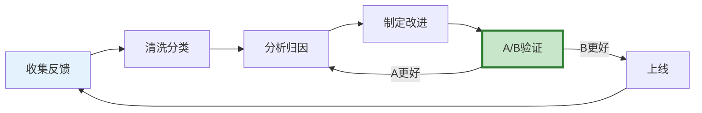

# Agent 反馈闭环深度

> 知识库 153 讲了反馈学习基础。这份指南深入反馈数据的全生命周期——收集、清洗、分析、改进验证和闭环自动化。

---

## 一、反馈闭环全景



---

## 二、反馈数据清洗

```python
from dataclasses import dataclass, field
from datetime import datetime
from enum import Enum
from collections import Counter

class FeedbackQuality(str, Enum):
    HIGH = "high"        # 有价值的反馈
    LOW = "low"          # 无价值（空反馈/垃圾）
    DUPLICATE = "dup"   # 重复

@dataclass
class CleanedFeedback:
    """清洗后的反馈。"""
    feedback_id: str
    feedback_type: str       # thumbs_up/down/rating/correction
    query: str
    response: str
    user_comment: str = ""
    corrected_answer: str = ""
    quality: FeedbackQuality = FeedbackQuality.HIGH
    category: str = ""       # 问题分类
    timestamp: str = field(default_factory=lambda: datetime.now().isoformat())

class FeedbackCleaner:
    """反馈数据清洗器。"""

    @staticmethod
    def clean(feedback: dict) -> CleanedFeedback:
        """清洗单条反馈。"""
        # 空反馈检测
        comment = feedback.get("comment", "").strip()
        if not comment and feedback.get("type") not in ["thumbs_up", "thumbs_down"]:
            return CleanedFeedback(
                feedback_id=feedback.get("id", ""),
                feedback_type=feedback.get("type", ""),
                query=feedback.get("query", ""),
                response=feedback.get("response", ""),
                quality=FeedbackQuality.LOW,
            )

        # 垃圾反馈检测（过短/无意义）
        if len(comment) > 0 and len(comment) < 3:
            return CleanedFeedback(
                feedback_id=feedback.get("id", ""),
                feedback_type=feedback.get("type", ""),
                query=feedback.get("query", ""),
                response=feedback.get("response", ""),
                user_comment=comment,
                quality=FeedbackQuality.LOW,
            )

        return CleanedFeedback(
            feedback_id=feedback.get("id", ""),
            feedback_type=feedback.get("type", ""),
            query=feedback.get("query", ""),
            response=feedback.get("response", ""),
            user_comment=comment,
            corrected_answer=feedback.get("correction", ""),
            quality=FeedbackQuality.HIGH,
        )

    @staticmethod
    def deduplicate(feedbacks: list[CleanedFeedback]) -> list[CleanedFeedback]:
        """去重——相同查询+相同反馈类型只保留一条。"""
        seen = set()
        result = []
        for fb in feedbacks:
            key = f"{fb.query[:50]}:{fb.feedback_type}"
            if key not in seen:
                seen.add(key)
                result.append(fb)
            else:
                fb.quality = FeedbackQuality.DUPLICATE
        return [f for f in result if f.quality != FeedbackQuality.DUPLICATE]
```

---

## 三、反馈分析与归因

```python
from langchain_core.language_models import BaseChatModel
from langchain_core.messages import HumanMessage
import json, re

ANALYSIS_PROMPT = """分析以下负面反馈，找出问题根因。

查询: {query}
Agent回答: {response}
反馈类型: {feedback_type}
用户修正: {correction}

归因分类:
1. 检索不准: 找到的文档不相关
2. 推理错误: 逻辑有问题
3. 格式错误: 输出格式不对
4. 幻觉: 编造了不存在的信息
5. 内容缺失: 知识库没有相关信息
6. 理解错误: 没理解用户意图

输出JSON:
```json
{{
  "root_cause": "...",
  "category": "...",
  "severity": "high/medium/low",
  "improvement": "具体改进建议",
  "actionable": true/false
}}
```"""

class FeedbackAnalyzer:
    """反馈分析器。"""

    def __init__(self, llm: BaseChatModel):
        self.llm = llm

    async def analyze_batch(self, feedbacks: list[CleanedFeedback]) -> dict:
        """批量分析反馈。"""
        analyses = []
        for fb in feedbacks:
            if fb.feedback_type in ["thumbs_down", "rating"] and not fb.corrected_answer:
                continue  # 无具体信息的负面反馈跳过

            prompt = ANALYSIS_PROMPT.format(
                query=fb.query[:200],
                response=fb.response[:500],
                feedback_type=fb.feedback_type,
                correction=fb.corrected_answer[:200] or "无",
            )
            response = await self.llm.ainvoke([HumanMessage(content=prompt)])

            match = re.search(r'\{.*\}', response.content, re.DOTALL)
            if match:
                analysis = json.loads(match.group())
                analysis["original_feedback"] = fb.feedback_id
                analyses.append(analysis)

        # 统计
        from collections import Counter
        categories = Counter(a.get("category", "unknown") for a in analyses)
        severities = Counter(a.get("severity", "unknown") for a in analyses)

        return {
            "total_analyzed": len(analyses),
            "by_category": dict(categories),
            "by_severity": dict(severities),
            "top_issue": categories.most_common(1)[0] if categories else None,
            "high_severity_count": severities.get("high", 0),
            "analyses": analyses[:10],  # 只返回前10条
        }
```

---

## 四、改进验证

```python
class ImprovementValidator:
    """改进验证器。"""

    @staticmethod
    async def validate(
        before_pipeline,
        after_pipeline,
        test_cases: list[dict],  # 之前的负面反馈
    ) -> dict:
        """验证改进是否有效。"""
        before_results = []
        after_results = []

        for tc in test_cases:
            # 改进前
            before_answer = await before_pipeline.answer(tc["query"])
            before_results.append(before_answer)

            # 改进后
            after_answer = await after_pipeline.answer(tc["query"])
            after_results.append(after_answer)

        # 对比
        improved = 0
        regressed = 0
        for before, after in zip(before_results, after_results):
            if len(after.get("answer", "")) > len(before.get("answer", "")):
                improved += 1
            elif len(after.get("answer", "")) < len(before.get("answer", "")):
                regressed += 1

        return {
            "total_cases": len(test_cases),
            "improved": improved,
            "regressed": regressed,
            "unchanged": len(test_cases) - improved - regressed,
            "should_deploy": improved > regressed,
        }
```

---

## 五、最佳实践

| 实践 | 说明 | 优先级 |
|------|------|--------|
| 反馈必须清洗 | 去掉空/垃圾/重复 | ★★★ |
| 修正反馈最有价值 | 用户改了答案=免费标注 | ★★★ |
| 批量归因分析 | 找系统性问题 | ★★★ |
| 改进必须验证 | A/B对比才上线 | ★★★ |
| 每周分析 | 不积压 | ★★☆ |
| 高严重度立即处理 | 幻觉/安全不能等 | ★★★ |

---

## 六、检查清单

| 检查项 | 状态 |
|--------|------|
| 有反馈清洗器 | ☐ |
| 有分析归因 | ☐ |
| 有改进验证 | ☐ |
| 有闭环流程 | ☐ |
