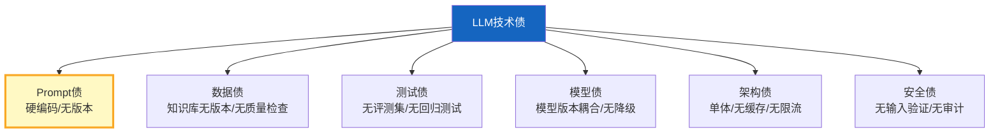

# LLM 应用技术债管理深度

> LLM 应用的技术债来得比传统软件更快——Prompt 写死了、模型版本耦合、知识库没版本、测试集缺失。这些债不还，越积越重。

---

## 一、LLM 技术债类型



---

## 二、技术债评估

```python
from dataclasses import dataclass, field
from enum import Enum

class DebtLevel(str, Enum):
    CRITICAL = "critical"    # 立即还
    HIGH = "high"            # 本季度还
    MEDIUM = "medium"        # 半年内还
    LOW = "low"             # 有空还

@dataclass
class TechDebtItem:
    """技术债项。"""
    id: str
    category: str            # prompt/data/test/model/arch/security
    description: str
    level: DebtLevel
    impact: str              # 影响
    effort_hours: float = 0  # 预估工时
    resolved: bool = False

class TechDebtAssessor:
    """技术债评估器。"""

    @staticmethod
    def assess(project_status: dict) -> list[TechDebtItem]:
        """评估技术债。"""
        debts = []

        # Prompt债
        if not project_status.get("prompt_versioned"):
            debts.append(TechDebtItem(
                id="prompt_001",
                category="prompt",
                description="Prompt硬编码在代码中，无版本管理",
                level=DebtLevel.HIGH,
                impact="修改Prompt需要改代码+重新部署",
                effort_hours=4,
            ))

        # 数据债
        if not project_status.get("kb_versioned"):
            debts.append(TechDebtItem(
                id="data_001",
                category="data",
                description="知识库无版本管理",
                level=DebtLevel.MEDIUM,
                impact="无法回滚到之前的知识库版本",
                effort_hours=8,
            ))

        if not project_status.get("data_quality_check"):
            debts.append(TechDebtItem(
                id="data_002",
                category="data",
                description="无数据质量检查",
                level=DebtLevel.MEDIUM,
                impact="垃圾数据入库影响RAG质量",
                effort_hours=4,
            ))

        # 测试债
        if not project_status.get("has_eval_dataset"):
            debts.append(TechDebtItem(
                id="test_001",
                category="test",
                description="无评测数据集",
                level=DebtLevel.CRITICAL,
                impact="无法量化评估改动效果",
                effort_hours=16,
            ))

        if not project_status.get("has_ci_tests"):
            debts.append(TechDebtItem(
                id="test_002",
                category="test",
                description="无CI/CD自动化测试",
                level=DebtLevel.HIGH,
                impact="改动可能引入退化而不自知",
                effort_hours=8,
            ))

        # 模型债
        if not project_status.get("model_fallback"):
            debts.append(TechDebtItem(
                id="model_001",
                category="model",
                description="无模型降级方案",
                level=DebtLevel.HIGH,
                impact="LLM API不可用时服务完全中断",
                effort_hours=6,
            ))

        # 架构债
        if not project_status.get("has_cache"):
            debts.append(TechDebtItem(
                id="arch_001",
                category="arch",
                description="无语义缓存",
                level=DebtLevel.MEDIUM,
                impact="重复查询浪费Token成本",
                effort_hours=8,
            ))

        if not project_status.get("has_rate_limit"):
            debts.append(TechDebtItem(
                id="arch_002",
                category="arch",
                description="无API限流",
                level=DebtLevel.HIGH,
                impact="用户涌入时可能触发API限流",
                effort_hours=4,
            ))

        # 安全债
        if not project_status.get("input_validation"):
            debts.append(TechDebtItem(
                id="sec_001",
                category="security",
                description="无输入验证",
                level=DebtLevel.CRITICAL,
                impact="可能被注入攻击",
                effort_hours=4,
            ))

        return debts

    @staticmethod
    def prioritize(debts: list[TechDebtItem]) -> list[TechDebtItem]:
        """按优先级排序。"""
        priority_order = {
            DebtLevel.CRITICAL: 0,
            DebtLevel.HIGH: 1,
            DebtLevel.MEDIUM: 2,
            DebtLevel.LOW: 3,
        }
        return sorted(debts, key=lambda d: priority_order.get(d.level, 99))

    @staticmethod
    def summary(debts: list[TechDebtItem]) -> dict:
        """技术债摘要。"""
        from collections import Counter
        by_level = Counter(d.level.value for d in debts)
        by_category = Counter(d.category for d in debts)
        total_effort = sum(d.effort_hours for d in debts)

        return {
            "total_items": len(debts),
            "by_level": dict(by_level),
            "by_category": dict(by_category),
            "total_effort_hours": total_effort,
            "critical_count": by_level.get("critical", 0),
            "recommended_action": "立即处理CRITICAL级技术债" if by_level.get("critical", 0) > 0 else "按优先级逐步偿还",
        }
```

---

## 三、偿还计划

```mermaid
graph TB
    subgraph 计划 {"技术债偿还路线"}
        P1["第1周: CRITICAL<br/>输入验证+评测集"]
        P2["第2-3周: HIGH<br/>Prompt版本+降级+限流+CI"]
        P3["第4-6周: MEDIUM<br/>缓存+知识库版本"]
        P4["持续: LOW<br/>有空就还"]
    end

    P1 --> P2 --> P3 --> P4

    style P1 fill:#FFCDD2,stroke:#C62828,stroke-width:3px
    style P4 fill:#C8E6C9
```

---

## 四、最佳实践

| 实践 | 说明 | 优先级 |
|------|------|--------|
| 定期评估技术债 | 每季度 | ★★★ |
| CRITICAL立即还 | 安全和测试优先 | ★★★ |
| 每个Sprint留20%还债 | 不让债积累 | ★★☆ |
| 还债要记录 | 可追溯 | ★★☆ |
| 新功能不增债 | 先还再借 | ★★☆ |

---

## 五、检查清单

| 检查项 | 状态 |
|--------|------|
| 有技术债评估 | ☐ |
| 有优先级排序 | ☐ |
| 有偿还计划 | ☐ |
| 有摘要报告 | ☐ |
