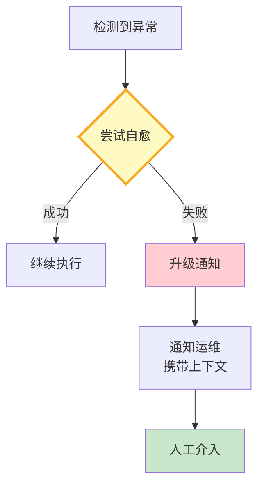

# Agent 自愈与自动恢复深度

> Agent 出错不可怕——可怕的是出错了没人管、卡住了不知道、死循环了不停。自愈让 Agent 能自动检测异常、尝试恢复、必要时通知人工。

---

## 一、自愈的三个层次

```mermaid
graph TB
    subgraph 自愈 {"Agent自愈三层"}
        L1["第1层: 检测<br/>识别异常行为"]
        L2["第2层: 恢复<br/>自动尝试修复"]
        L3["第3层: 升级<br/>无法自愈→通知人工"]
    end

    L1 --> L2 --> L3

    style L1 fill:#FFCDD2,stroke:#C62828,stroke-width:3px
    style L2 fill:#FFF9C4
    style L3 fill:#C8E6C9
```

---

## 二、异常检测

```python
from dataclasses import dataclass, field
from datetime import datetime, timedelta
from enum import Enum
from collections import defaultdict

class AnomalyType(str, Enum):
    LOOP = "loop"                    # 循环
    TIMEOUT = "timeout"              # 超时
    HIGH_ERROR_RATE = "high_error"    # 错误率突增
    HIGH_LATENCY = "high_latency"     # 延迟突增
    TOKEN_SPIKE = "token_spike"       # Token消耗突增
    NO_PROGRESS = "no_progress"       # 无进展
    STUCK = "stuck"                   # 卡住

@dataclass
class Anomaly:
    """异常记录。"""
    type: AnomalyType
    severity: str       # low/medium/high
    description: str
    detected_at: str = field(default_factory=lambda: datetime.now().isoformat())
    auto_recoverable: bool = True

class AnomalyDetector:
    """异常检测器。"""

    def __init__(self, window_size: int = 20):
        self.window_size = window_size
        self.recent_actions: list[dict] = []
        self.recent_errors: list[datetime] = []

    def record_action(self, action: str, result: str, latency_ms: float = 0):
        """记录Agent行动。"""
        self.recent_actions.append({
            "action": action,
            "result": result[:100],
            "latency_ms": latency_ms,
            "timestamp": datetime.now(),
        })
        if len(self.recent_actions) > self.window_size:
            self.recent_actions.pop(0)

    def detect(self) -> list[Anomaly]:
        """检测所有异常。"""
        anomalies = []

        # 1. 循环检测：连续3次相同action+result
        if len(self.recent_actions) >= 3:
            recent = self.recent_actions[-3:]
            if all(a["action"] == recent[0]["action"] and a["result"] == recent[0]["result"] for a in recent):
                anomalies.append(Anomaly(
                    type=AnomalyType.LOOP,
                    severity="high",
                    description=f"Agent在'{recent[0]['action']}'上循环3次",
                ))

        # 2. 错误率检测
        recent_results = [a["result"] for a in self.recent_actions[-10:]]
        error_count = sum(1 for r in recent_results if "error" in r.lower() or "失败" in r)
        if len(recent_results) >= 5 and error_count / len(recent_results) > 0.5:
            anomalies.append(Anomaly(
                type=AnomalyType.HIGH_ERROR_RATE,
                severity="high",
                description=f"错误率{error_count}/{len(recent_results)}超过50%",
            ))

        # 3. 延迟检测
        recent_latencies = [a["latency_ms"] for a in self.recent_actions[-5:] if a["latency_ms"] > 0]
        if recent_latencies and all(l > 5000 for l in recent_latencies):
            anomalies.append(Anomaly(
                type=AnomalyType.HIGH_LATENCY,
                severity="medium",
                description=f"连续{len(recent_latencies)}次延迟>5秒",
            ))

        # 4. 无进展检测：action不同但result都是错误
        if len(self.recent_actions) >= 5:
            recent = self.recent_actions[-5:]
            if all("error" in a["result"].lower() for a in recent):
                anomalies.append(Anomaly(
                    type=AnomalyType.NO_PROGRESS,
                    severity="high",
                    description="连续5次不同操作都失败",
                    auto_recoverable=False,  # 需人工
                ))

        return anomalies
```

---

## 三、自动恢复

```python
class AutoRecoveryEngine:
    """自动恢复引擎。"""

    RECOVERY_STRATEGIES = {
        AnomalyType.LOOP: [
            "增加max_iterations限制",
            "修改Prompt提示换一种方法",
            "跳过当前工具，换替代工具",
        ],
        AnomalyType.TIMEOUT: [
            "重试（减少参数范围）",
            "使用更快的模型",
            "跳过超时步骤",
        ],
        AnomalyType.HIGH_ERROR_RATE: [
            "检查最近变更",
            "降低temperature",
            "切换到备用模型",
        ],
        AnomalyType.HIGH_LATENCY: [
            "启用语义缓存",
            "减少检索Top-K",
            "跳过重排序",
        ],
        AnomalyType.NO_PROGRESS: [
            None,  # 无法自动恢复
        ],
    }

    @classmethod
    def attempt_recovery(cls, anomaly: Anomaly) -> dict:
        """尝试自动恢复。"""
        if not anomaly.auto_recoverable:
            return {
                "recovered": False,
                "action": "escalate_to_human",
                "reason": "无法自动恢复",
            }

        strategies = cls.RECOVERY_STRATEGIES.get(anomaly.type, [])
        if not strategies or strategies[0] is None:
            return {
                "recovered": False,
                "action": "escalate_to_human",
                "reason": f"无{anomaly.type.value}的恢复策略",
            }

        return {
            "recovered": True,
            "action": strategies[0],
            "all_strategies": strategies,
            "anomaly": anomaly.type.value,
        }
```

---

## 四、升级机制



---

## 五、最佳实践

| 实践 | 说明 | 优先级 |
|------|------|--------|
| 实时检测异常 | 不等用户反馈 | ★★★ |
| 循环检测必须有 | 防止Agent死循环 | ★★★ |
| 能自愈先自愈 | 减少人工负担 | ★★★ |
| 无法自愈要升级 | 不能静默失败 | ★★★ |
| 通知携带上下文 | 人工能快速定位 | ★★☆ |
| 记录自愈日志 | 优化恢复策略 | ★★☆ |

---

## 六、检查清单

| 检查项 | 状态 |
|--------|------|
| 有异常检测器 | ☐ |
| 有自动恢复引擎 | ☐ |
| 有升级机制 | ☐ |
| 有恢复策略库 | ☐ |
