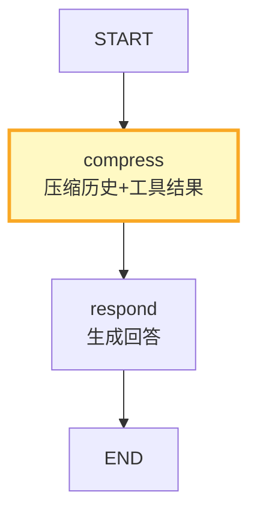

# LangGraph 上下文窗口管理

> 知识库 179 讲了上下文工程原理。这份指南从 LangGraph 视角讲——State 中的 messages 字段如何不无限增长、Checkpointer 如何管理历史、如何在图中控制上下文。

---

## 一、LangGraph 中的上下文问题

```mermaid
graph TB
    subgraph 问题 {"LangGraph上下文问题"}
        P1["messages字段无限增长<br/>每轮对话追加"]
        P2["Checkpointer保存全部历史<br/>恢复时全量加载"]
        P3["工具结果存入messages<br/>大量工具调用膨胀"]
        P4["多轮后Token超限<br/>LLM调用失败"]
    end

    style 问题 fill:#FFCDD2
```

---

## 二、messages 字段管理

```python
from langgraph.graph import StateGraph, START, END
from langgraph.graph.message import add_messages
from typing import TypedDict, Annotated
from langchain_core.messages import HumanMessage, AIMessage, SystemMessage, RemoveMessage

class ManagedState(TypedDict):
    messages: Annotated[list, add_messages]
    summary: str  # 历史摘要

async def compress_history(state: ManagedState, llm) -> dict:
    """压缩历史消息。

    LangGraph的RemoveMessage可以删除旧消息，
    用摘要替代。
    """
    messages = state["messages"]

    if len(messages) <= 10:
        return {}  # 不需要压缩

    # 取前N条需要压缩的消息
    to_compress = messages[:-6]  # 保留最近3轮(6条)
    old_messages = to_compress

    # 生成摘要
    conversation = "\n".join(
        f"{'用户' if isinstance(m, HumanMessage) else '助手'}: {m.content[:200]}"
        for m in old_messages if isinstance(m, (HumanMessage, AIMessage))
    )

    from langchain_core.messages import HumanMessage
    response = await llm.ainvoke([HumanMessage(
        content=f"用一段话总结以下对话要点（200字以内）:\n{conversation[:2000]}"
    )])
    new_summary = response.content

    # 删除旧消息
    delete_messages = [RemoveMessage(id=m.id) for m in old_messages]

    # 添加摘要为系统消息
    summary_msg = SystemMessage(content=f"## 早期对话摘要\n{new_summary}")

    return {
        "messages": delete_messages + [summary_msg],
        "summary": new_summary,
    }

async def generate_response(state: ManagedState, llm) -> dict:
    """生成回答——messages已被压缩，不会超限。"""
    messages = state["messages"]
    response = await llm.ainvoke(messages)
    return {"messages": [response]}
```

---

## 三、工具结果控制

```python
async def summarize_tool_results(state: ManagedState, llm) -> dict:
    """压缩工具结果。

    工具调用返回的内容可能很长，
    压缩为摘要减少Token消耗。
    """
    from langchain_core.messages import ToolMessage

    messages = state["messages"]
    tool_messages = [m for m in messages if isinstance(m, ToolMessage)]

    if not tool_messages:
        return {}

    # 压缩每个工具结果
    updates = []
    for tm in tool_messages:
        if len(tm.content) > 500:
            # 压缩长结果
            from langchain_core.messages import HumanMessage
            response = await llm.ainvoke([HumanMessage(
                content=f"用100字以内总结以下工具结果:\n{tm.content[:1000]}"
            )])
            # 用RemoveMessage删除旧结果，添加摘要
            updates.append(RemoveMessage(id=tm.id))
            updates.append(ToolMessage(
                content=f"[摘要] {response.content}",
                tool_call_id=tm.tool_call_id,
            ))

    return {"messages": updates} if updates else {}
```

---

## 四、最大轮次限制

```python
from langgraph.graph import StateGraph, START, END

def build_managed_conversation(llm):
    """带上下文管理的对话图。"""
    graph = StateGraph(ManagedState)

    # 节点
    graph.add_node("compress", lambda s: compress_history(s, llm))
    graph.add_node("respond", lambda s: generate_response(s, llm))

    # 流程：先压缩历史→再生成
    graph.add_edge(START, "compress")
    graph.add_edge("compress", "respond")
    graph.add_edge("respond", END)

    # 配置Checkpointer
    from langgraph.checkpoint.memory import MemorySaver
    return graph.compile(checkpointer=MemorySaver())
```



---

## 五、Token 预算控制

```python
class TokenBudgetController:
    """Token预算控制器。"""

    def __init__(self, max_tokens: int = 8000):
        self.max_tokens = max_tokens

    def estimate_messages_tokens(self, messages: list) -> int:
        """估算消息列表的Token数。"""
        import tiktoken
        try:
            encoder = tiktoken.encoding_for_model("gpt-4o")
        except Exception:
            return sum(len(str(m)) for m in messages) // 3

        total = 0
        for msg in messages:
            content = msg.content if hasattr(msg, "content") else str(msg)
            total += len(encoder.encode(content))
            total += 4  # 每条消息固定开销
        return total

    def check_budget(self, messages: list) -> dict:
        """检查是否在预算内。"""
        total = self.estimate_messages_tokens(messages)
        return {
            "total_tokens": total,
            "max_tokens": self.max_tokens,
            "within_budget": total <= self.max_tokens,
            "remaining": self.max_tokens - total,
            "needs_compression": total > self.max_tokens * 0.8,
        }
```

---

## 六、最佳实践

| 实践 | 说明 | 优先级 |
|------|------|--------|
| 用RemoveMessage清理旧消息 | LangGraph原生方法 | ★★★ |
| 超过10条触发压缩 | 不要等到超限 | ★★★ |
| 工具结果>500字压缩 | 工具结果最占空间 | ★★☆ |
| 保留最近3轮原文 | 平衡上下文和Token | ★★☆ |
| 压缩在生成前执行 | 确保LLM不超限 | ★★★ |
| 有Token预算检查 | 防止API报错 | ★★☆ |

---

## 七、检查清单

| 检查项 | 状态 |
|--------|------|
| 有历史压缩节点 | ☐ |
| 有工具结果压缩 | ☐ |
| 有Token预算检查 | ☐ |
| 有RemoveMessage清理 | ☐ |
