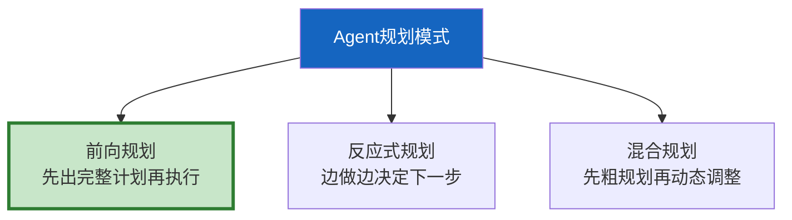
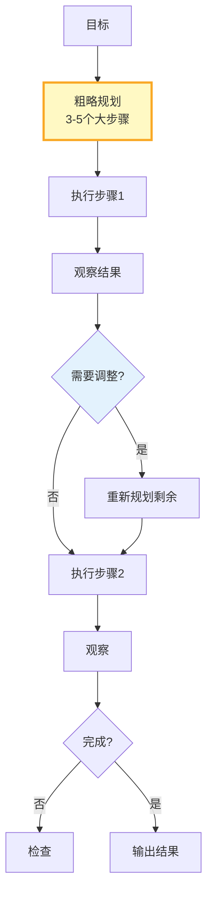

# Agent 规划与推理链深度

> Agent 不只是"调工具"——它需要先规划（决定做什么），再推理（怎么做），最后执行。规划能力决定了 Agent 的上限。

---

## 一、规划的三种模式



---

## 二、前向规划

```python
from langchain_core.language_models import BaseChatModel
from langchain_core.messages import HumanMessage
from dataclasses import dataclass, field
from typing import Optional

@dataclass
class Plan:
    """执行计划。"""
    goal: str
    steps: list[dict] = field(default_factory=list)  # [{action, args, depends_on}]
    estimated_steps: int = 0

PLANNING_PROMPT = """你是任务规划专家。为以下目标制定执行计划。

目标: {goal}

可用工具: {available_tools}

计划要求:
1. 分解为3-7个步骤
2. 每步明确做什么+用什么工具
3. 标注步骤间依赖
4. 考虑失败后的替代方案

输出JSON:
```json
{{
  "steps": [
    {{
      "id": 1,
      "action": "search",
      "tool": "search_web",
      "args": {{"query": "..."}},
      "depends_on": [],
      "fallback": "如果搜索失败，使用知识库检索"
    }}
  ]
}}
```"""

class ForwardPlanner:
    """前向规划器。"""

    def __init__(self, llm: BaseChatModel):
        self.llm = llm

    async def create_plan(self, goal: str, available_tools: list[str]) -> Plan:
        """创建执行计划。"""
        prompt = PLANNING_PROMPT.format(
            goal=goal,
            available_tools=available_tools,
        )
        response = await self.llm.ainvoke([HumanMessage(content=prompt)])

        import re, json
        match = re.search(r'\{.*\}', response.content, re.DOTALL)
        if match:
            data = json.loads(match.group())
            return Plan(
                goal=goal,
                steps=data.get("steps", []),
                estimated_steps=len(data.get("steps", [])),
            )
        return Plan(goal=goal)

    async def replan(
        self,
        original_plan: Plan,
        completed_steps: list[dict],
        failed_step: dict,
    ) -> Plan:
        """根据失败情况重新规划。"""
        prompt = f"""重新规划任务。

原始目标: {original_plan.goal}
已完成: {completed_steps}
失败步骤: {failed_step}

请调整剩余计划，考虑失败原因。
输出同格式的JSON。"""

        response = await self.llm.ainvoke([HumanMessage(content=prompt)])
        match = re.search(r'\{.*\}', response.content, re.DOTALL)
        if match:
            data = json.loads(match.group())
            return Plan(goal=original_plan.goal, steps=data.get("steps", []))
        return original_plan
```

---

## 三、推理链管理

```python
@dataclass
class ReasoningStep:
    """推理步骤。"""
    step_num: int
    observation: str       # 观察到什么
    reasoning: str         # 推理出什么
    action: str            # 决定做什么
    confidence: float = 0.8

class ReasoningChain:
    """推理链管理器。

    记录Agent每一步的观察→推理→行动，
    便于回溯和解释。
    """

    def __init__(self):
        self.steps: list[ReasoningStep] = []

    def add_step(self, observation: str, reasoning: str, action: str):
        """添加推理步骤。"""
        self.steps.append(ReasoningStep(
            step_num=len(self.steps) + 1,
            observation=observation[:200],
            reasoning=reasoning[:200],
            action=action[:100],
        ))

    def get_trace(self) -> str:
        """获取推理轨迹文本。"""
        lines = []
        for step in self.steps:
            lines.append(
                f"步骤{step.step_num}:\n"
                f"  观察: {step.observation}\n"
                f"  推理: {step.reasoning}\n"
                f"  行动: {step.action}"
            )
        return "\n\n".join(lines)

    def detect_issues(self) -> list[str]:
        """检测推理链问题。"""
        issues = []
        if len(self.steps) > 10:
            issues.append("推理步骤过多，可能过度推理")
        # 循环检测
        actions = [s.action for s in self.steps]
        for i in range(len(actions) - 2):
            if actions[i] == actions[i + 1] == actions[i + 2]:
                issues.append(f"步骤{i+1}-{i+3}可能循环")
        return issues
```

---

## 四、混合规划



---

## 五、最佳实践

| 实践 | 说明 | 优先级 |
|------|------|--------|
| 复杂任务先规划 | 减少跑偏 | ★★★ |
| 简单任务直接执行 | 不过度规划 | ★★★ |
| 推理链有记录 | 可追溯可解释 | ★★☆ |
| 失败后要重新规划 | 不能死板执行 | ★★★ |
| 检测推理循环 | 防止死循环 | ★★☆ |

---

## 六、检查清单

| 检查项 | 状态 |
|--------|------|
| 有前向规划器 | ☐ |
| 有推理链管理 | ☐ |
| 有重新规划能力 | ☐ |
| 有问题检测 | ☐ |
