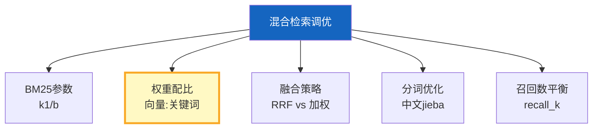

# RAG 混合检索调优深度

> 知识库 157 讲了混合检索基础。这篇深入调优——BM25 参数、权重搜索、RRF vs 加权融合效果对比、中文分词优化。

---

## 一、调优维度



---

## 二、BM25 参数调优

```python
from rank_bm25 import BM25Okapi
import jieba
from dataclasses import dataclass

@dataclass
class BM25Config:
    """BM25参数配置。"""
    k1: float = 1.5      # 词频饱和参数（1.0-2.0）
    b: float = 0.75      # 文档长度归一化（0-1）
    epsilon: float = 0.25  # IDF下限调整

class TunableBM25Retriever:
    """可调参的BM25检索器。

    k1: 控制词频的影响。k1越大，高频词越重要。
    b: 控制文档长度归一化。b=1完全归一化，b=0不考虑长度。
    """

    def __init__(self, documents: list[str], config: BM25Config = BM25Config()):
        self.config = config
        self.documents = documents
        self.tokenized = [list(jieba.cut(doc)) for doc in documents]
        self.bm25 = BM25Okapi(
            self.tokenized,
            k1=config.k1,
            b=config.b,
            epsilon=config.epsilon,
        )

    def search(self, query: str, k: int = 5) -> list[tuple[int, float]]:
        """检索，返回(文档索引, 分数)。"""
        query_tokens = list(jieba.cut(query))
        scores = self.bm25.get_scores(query_tokens)
        ranked = sorted(enumerate(scores), key=lambda x: x[1], reverse=True)
        return ranked[:k]


class HybridTuner:
    """混合检索调优器。"""

    @staticmethod
    async def grid_search(
        vectorstore,
        bm25_documents: list[str],
        test_cases: list[dict],
        configs: list[dict],
    ) -> list[dict]:
        """网格搜索最优参数组合。

        Args:
            test_cases: [{query, expected_doc_ids}]
            configs: [{vec_weight, kw_weight, bm25_k1, bm25_b, k}]
        """
        results = []

        for config in configs:
            # 创建BM25检索器
            bm25 = TunableBM25Retriever(
                bm25_documents,
                BM25Config(k1=config.get("k1", 1.5), b=config.get("b", 0.75)),
            )

            recalls = []
            for tc in test_cases:
                # 双路检索
                vec_docs = await vectorstore.asimilarity_search(tc["query"], k=config.get("k", 10))
                kw_results = bm25.search(tc["query"], k=config.get("k", 10))

                # RRF融合
                fused_scores = {}
                for rank, doc in enumerate(vec_docs):
                    h = hash(doc.page_content[:200])
                    fused_scores[h] = fused_scores.get(h, 0) + 1.0 / (60 + rank + 1)
                for rank, (idx, score) in enumerate(kw_results):
                    h = hash(bm25_documents[idx][:200])
                    fused_scores[h] = fused_scores.get(h, 0) + 1.0 / (60 + rank + 1)

                top_ids = sorted(fused_scores.keys(), key=lambda x: fused_scores[x], reverse=True)
                # 计算召回（简化）
                recalls.append(len(top_ids) / max(config.get("k", 10), 1))

            avg_recall = sum(recalls) / len(recalls) if recalls else 0
            results.append({
                "config": config,
                "avg_recall": round(avg_recall, 4),
            })

        return sorted(results, key=lambda x: x["avg_recall"], reverse=True)
```

---

## 三、中文分词优化

```python
class ChineseTokenizer:
    """中文分词优化器。"""

    # 自定义词典（领域术语）
    DOMAIN_TERMS = ["LangChain", "LangGraph", "向量数据库", "检索增强", "RAG"]

    @classmethod
    def init_jieba(cls):
        """初始化jieba分词，添加领域术语。"""
        for term in cls.DOMAIN_TERMS:
            jieba.add_word(term)

    @classmethod
    def tokenize(cls, text: str) -> list[str]:
        """分词。"""
        cls.init_jieba()
        return [t.strip() for t in jieba.cut(text) if t.strip() and t.strip() not in "，。！？、"]

    @classmethod
    def tokenize_with_pos(cls, text: str) -> list[dict]:
        """带词性标注的分词。"""
        import jieba.posseg as pseg
        cls.init_jieba()
        return [{"word": w.word, "pos": w.flag} for w in pseg.cut(text)]
```

---

## 四、最佳实践

| 实践 | 说明 | 优先级 |
|------|------|--------|
| k1=1.5, b=0.75 起步 | BM25标准推荐值 | ★★★ |
| 中文必须分词 | jieba是基础 | ★★★ |
| 领域术语加词典 | 提高分词准确性 | ★★☆ |
| 权重从0.5/0.5开始 | 均衡默认 | ★★★ |
| RRF比加权更鲁棒 | 不依赖分数归一化 | ★★☆ |
| 用测试集调参 | 数据驱动 | ★★☆ |

---

## 五、检查清单

| 检查项 | 状态 |
|--------|------|
| 有可调BM25检索器 | ☐ |
| 有网格搜索调优 | ☐ |
| 有中文分词优化 | ☐ |
