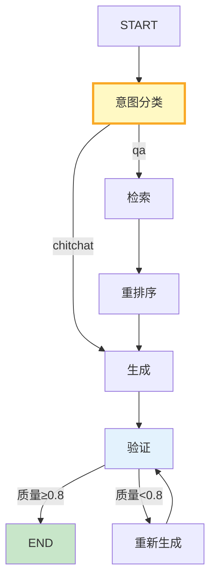

# LangGraph 状态机设计模式深度

> LangGraph 本质是一个状态机——State 在节点间流转，条件边决定走向。这份指南讲透状态机设计模式、状态定义最佳实践和复杂路由。

---

## 一、状态机设计三要素

```mermaid
graph TB
    subgraph 三要素 {"状态机设计"}
        S1["State定义<br/>数据结构+Reducer"]
        S2["节点设计<br/>每个节点的输入输出"]
        S3["路由设计<br/>条件边+循环"]
    end

    style 三要素 fill:#E3F2FD
    style S1 fill:#C8E6C9,stroke:#2E7D32,stroke-width:3px
```

---

## 二、State 定义最佳实践

```python
from typing import TypedDict, Annotated, Optional
from langgraph.graph import StateGraph, START, END
from langgraph.graph.message import add_messages
from operator import add
from dataclasses import dataclass, field
from enum import Enum

class ConversationPhase(str, Enum):
    """对话阶段。"""
    INTENT = "intent"          # 意图识别
    RETRIEVAL = "retrieval"    # 检索
    GENERATION = "generation"  # 生成
    VERIFICATION = "verification"  # 验证
    COMPLETED = "completed"

class AdvancedState(TypedDict):
    """高级状态设计。

    设计原则：
    1. 消息用add_messages reducer自动追加
    2. 列表用add reducer支持并行追加
    3. 标量字段直接覆盖
    4. 业务字段和消息分离
    """
    # 消息历史
    messages: Annotated[list, add_messages]

    # 业务状态
    phase: ConversationPhase          # 当前阶段
    user_intent: str                   # 用户意图
    query: str                         # 当前查询
    resolved_query: str                # 消解后的查询

    # 检索结果
    retrieved_docs: Annotated[list, add]  # 多节点可追加
    reranked_docs: list                 # 重排序后（覆盖）
    context: str                        # 最终上下文（覆盖）

    # 生成
    draft: str                          # 草稿
    final_answer: str                   # 最终答案

    # 元数据
    iteration_count: int                # 迭代次数
    error: str                          # 错误信息
    metadata: dict                      # 通用元数据
```

---

## 三、复杂路由模式

```python
class RoutingPatterns:
    """路由模式集合。"""

    @staticmethod
    def intent_based_route(state: AdvancedState) -> str:
        """基于意图路由。"""
        intent = state.get("user_intent", "unknown")
        if intent == "qa":
            return "retrieval"
        elif intent == "chitchat":
            return "generation"
        elif intent == "task":
            return "tools"
        return "generation"

    @staticmethod
    def quality_based_route(state: AdvancedState) -> str:
        """基于质量评分路由。"""
        score = state.get("quality_score", 0)
        iterations = state.get("iteration_count", 0)

        if score >= 0.8 or iterations >= 3:
            return "end"
        elif score >= 0.5:
            return "improve"
        else:
            return "regenerate"

    @staticmethod
    def conditional_with_fallback(state: AdvancedState) -> str:
        """带兜底的条件路由。"""
        docs = state.get("retrieved_docs", [])
        if not docs:
            return "web_search"  # 无检索结果→Web搜索
        if len(docs) < 3:
            return "expand_search"  # 结果太少→扩展搜索
        return "rerank"  # 正常→重排序


def build_advanced_state_machine(llm, vectorstore):
    """构建高级状态机。"""
    graph = StateGraph(AdvancedState)

    # 注册节点
    graph.add_node("classify_intent", classify_intent_node)
    graph.add_node("retrieve", retrieve_node)
    graph.add_node("rerank", rerank_node)
    graph.add_node("generate", generate_node)
    graph.add_node("verify", verify_node)
    graph.add_node("regenerate", regenerate_node)

    # 入口→意图分类
    graph.add_edge(START, "classify_intent")

    # 意图分类→条件路由
    graph.add_conditional_edges("classify_intent", RoutingPatterns.intent_based_route, {
        "retrieval": "retrieve",
        "generation": "generate",
        "tools": "generate",  # 简化
    })

    # 检索→重排序→生成
    graph.add_edge("retrieve", "rerank")
    graph.add_edge("rerank", "generate")

    # 生成→验证
    graph.add_edge("generate", "verify")

    # 验证→条件路由（质量够→结束；不够→重新生成）
    graph.add_conditional_edges("verify", RoutingPatterns.quality_based_route, {
        "end": END,
        "improve": "generate",
        "regenerate": "regenerate",
    })

    # 重新生成→验证
    graph.add_edge("regenerate", "verify")

    return graph.compile(checkpointer=MemorySaver())
```



---

## 四、状态持久化与恢复

```python
class StatePersistenceManager:
    """状态持久化管理器。

    LangGraph的Checkpointer自动处理持久化，
    但需要理解恢复机制。
    """

    @staticmethod
    def get_state_snapshot(graph, thread_id: str) -> dict:
        """获取状态快照。"""
        config = {"configurable": {"thread_id": thread_id}}
        state = graph.get_state(config)
        return {
            "values": state.values,
            "next": state.next,  # 下一步要执行的节点
            "config": state.config,
        }

    @staticmethod
    def resume_from_checkpoint(graph, thread_id: str, input_data: dict = None):
        """从检查点恢复执行。"""
        config = {"configurable": {"thread_id": thread_id}}
        # None表示继续上次中断的执行
        result = graph.invoke(input_data, config)
        return result

    @staticmethod
    def modify_state_and_resume(graph, thread_id: str, updates: dict):
        """修改状态后恢复执行。"""
        config = {"configurable": {"thread_id": thread_id}}
        graph.update_state(config, values=updates)
        return graph.invoke(None, config)
```

---

## 五、最佳实践

| 实践 | 说明 | 优先级 |
|------|------|--------|
| State字段分类管理 | 消息/业务/元数据分离 | ★★★ |
| 列表用add reducer | 支持并行追加 | ★★★ |
| 标量字段直接覆盖 | 最新值生效 | ★★☆ |
| 路由函数纯函数 | 不依赖外部状态 | ★★★ |
| 有最大迭代限制 | 防止无限循环 | ★★★ |
| 验证节点必有 | 生成后检查质量 | ★★☆ |

---

## 六、检查清单

| 检查项 | 状态 |
|--------|------|
| 有高级State设计 | ☐ |
| 有复杂路由模式 | ☐ |
| 有状态持久化 | ☐ |
