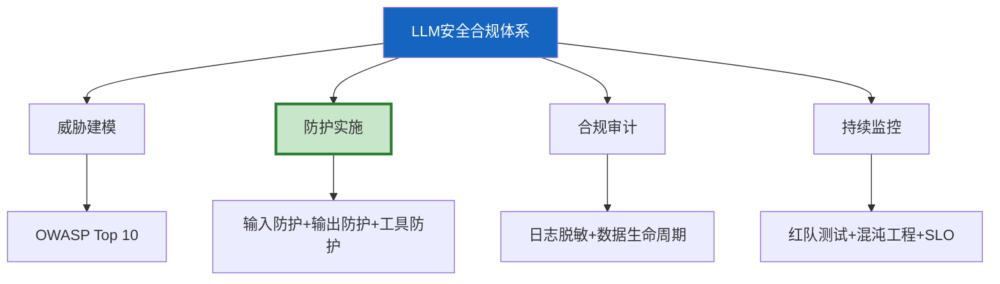

# LLM 应用安全合规体系深度

> 知识库 10 有 393 行、知识库 141 讲了 OWASP Top 10。这篇整合为完整的安全合规体系——从威胁建模到防护实施到合规审计。

---

## 一、安全合规全景



---

## 二、安全防护实施清单

```python
class SecurityImplementation:
    """安全防护实施清单——可执行的检查列表。"""

    CHECKLIST = {
        "输入防护": [
            "✅ 输入长度限制(≤10000字符)",
            "✅ Prompt注入检测(模式匹配)",
            "✅ 编码绕过检测(Base64/Unicode)",
            "✅ 速率限制(令牌桶)",
            "✅ PII检测+脱敏",
        ],
        "输出防护": [
            "✅ 输出PII脱敏(7种PII模式)",
            "✅ 代码执行指令过滤",
            "✅ 输出长度限制",
            "✅ 内容安全过滤(有害内容)",
        ],
        "工具防护": [
            "✅ 工具权限策略(最小权限)",
            "✅ 文件路径白名单",
            "✅ 网络域名白名单",
            "✅ 高危操作需审批(interrupt)",
            "✅ 代码沙箱隔离(Docker)",
        ],
        "数据安全": [
            "✅ 传输加密(TLS)",
            "✅ 存储加密(数据库)",
            "✅ 密钥管理(环境变量/KMS)",
            "✅ 审计日志(不可篡改)",
            "✅ 数据保留期+自动删除",
        ],
        "合规": [
            "✅ 用户可查看其数据",
            "✅ 用户可删除其数据",
            "✅ 数据处理透明化",
            "✅ 合规审计定期执行",
        ],
    }

    @classmethod
    def audit(cls, status: dict) -> dict:
        """安全合规审计。"""
        total = 0
        passed = 0
        by_category = {}

        for category, items in cls.CHECKLIST.items():
            cat_passed = sum(1 for item in items if status.get(item, False))
            total += len(items)
            passed += cat_passed
            by_category[category] = {
                "passed": cat_passed,
                "total": len(items),
                "rate": round(cat_passed / len(items), 4),
            }

        return {
            "overall_rate": round(passed / total, 4),
            "overall_status": "compliant" if passed == total else "non-compliant" if passed < total * 0.7 else "partial",
            "by_category": by_category,
            "gaps": [
                item for category, items in cls.CHECKLIST.items()
                for item in items
                if not status.get(item, False)
            ][:10],
        }
```

---

## 三、安全监控指标

```python
class SecurityMetrics:
    """安全监控指标。"""

    METRICS = {
        "injection_attempts": "注入攻击尝试次数",
        "pii_detected": "检测到的PII数量",
        "blocked_requests": "被阻止的请求数",
        "tool_permission_denied": "工具权限拒绝次数",
        "audit_log_entries": "审计日志条目数",
        "security_alerts": "安全告警数",
    }

    @staticmethod
    def dashboard() -> dict:
        """安全仪表盘数据。"""
        return {
            "injection_blocked_rate": 0.99,      # 99%注入被拦截
            "pii_redaction_rate": 1.0,             # 100%PII脱敏
            "high_risk_operations": 0,             # 高危操作数
            "audit_coverage": 1.0,                 # 100%操作有审计
            "compliance_score": 0.95,              # 合规评分
        }
```

---

## 四、最佳实践

| 实践 | 说明 | 优先级 |
|------|------|--------|
| 定期安全审计 | 每季度 | ★★★ |
| 红队测试 | 上线前+定期 | ★★★ |
| 安全防护分层 | 输入+输出+工具+数据 | ★★★ |
| 合规缺口修复 | CRITICAL立即 | ★★★ |
| 安全监控仪表盘 | 实时可视 | ★★☆ |

---

## 五、检查清单

| 检查项 | 状态 |
|--------|------|
| 有安全实施清单 | ☐ |
| 有合规审计 | ☐ |
| 有安全监控 | ☐ |
