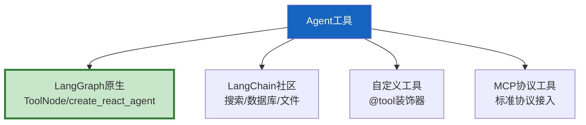

# Agent 工具集成大全最新

> 知识库 14 有 464 行但内容较旧。这篇补充最新的工具集成——LangGraph 原生工具、社区工具和自定义工具最佳实践。

---

## 一、工具分类



---

## 二、常用工具速查

```python
class ToolReference:
    """常用工具速查表。"""

    TOOLS = {
        # 搜索类
        "TavilySearchResults": {"package": "langchain_community.tools", "用途": "AI搜索", "免费额度": "1000/月"},
        "DuckDuckGoSearchRun": {"package": "langchain_community.tools", "用途": "免费搜索", "免费额度": "无限"},

        # 数据库类
        "SQLDatabaseToolkit": {"package": "langchain_community.tools", "用途": "SQL查询", "注意": "只读权限"},
        "QuerySQLDatabaseTool": {"package": "langchain_community.tools", "用途": "SQL执行"},

        # 文件类
        "FileReadTool": {"package": "自定义", "用途": "读取文件"},
        "WriteFileTool": {"package": "自定义", "用途": "写入文件"},
        "ListDirectoryTool": {"package": "自定义", "用途": "列目录"},

        # 代码执行类
        "PythonREPLTool": {"package": "langchain_experimental.tools", "用途": "Python执行", "注意": "需沙箱"},
        "ShellTool": {"package": "自定义", "用途": "Shell命令", "注意": "高危"},

        # API类
        "RequestsGetTool": {"package": "langchain_community.tools", "用途": "HTTP GET"},
        "ZapierNLAQueryRun": {"package": "langchain_community.tools", "用途": "Zapier自动化"},

        # 多模态类
        "ImageGenerationTool": {"package": "自定义(DALL-E)", "用途": "文生图"},
        "ImageAnalysisTool": {"package": "自定义(GPT-4o)", "用途": "图像理解"},

        # LangGraph原生
        "ToolNode": {"package": "langgraph.prebuilt", "用途": "批量工具执行"},
    }

    @classmethod
    def get_tool(cls, name: str) -> dict:
        return cls.TOOLS.get(name, {"error": "工具不存在"})

    @classmethod
    def by_category(cls, category: str) -> list[str]:
        """按分类获取工具。"""
        categories = {
            "search": ["TavilySearchResults", "DuckDuckGoSearchRun"],
            "database": ["SQLDatabaseToolkit", "QuerySQLDatabaseTool"],
            "file": ["FileReadTool", "WriteFileTool", "ListDirectoryTool"],
            "code": ["PythonREPLTool", "ShellTool"],
            "api": ["RequestsGetTool", "ZapierNLAQueryRun"],
            "multimodal": ["ImageGenerationTool", "ImageAnalysisTool"],
        }
        return categories.get(category, [])
```

---

## 三、自定义工具最佳实践

```python
from langchain_core.tools import tool
from pydantic import BaseModel, Field

class SearchInput(BaseModel):
    """搜索参数。"""
    query: str = Field(description="搜索关键词")
    max_results: int = Field(default=5, description="最大结果数", ge=1, le=20)

@tool(args_schema=SearchInput)
async def search_web(query: str, max_results: int = 5) -> str:
    """搜索网络获取信息。

    何时使用：用户询问最新信息、实时数据。
    何时不使用：通用知识问题。

    Args:
        query: 搜索关键词
        max_results: 返回结果数(1-20)
    """
    # 实现...
    return f"搜索结果: {query}"

# 工具设计5原则检查
class ToolDesignChecker:
    @staticmethod
    def check(tool_func) -> dict:
        issues = []
        # 1. 有docstring
        if not tool_func.__doc__ or len(tool_func.__doc__) < 20:
            issues.append("缺少详细docstring")
        # 2. 有"何时使用"说明
        if "何时" not in (tool_func.__doc__ or "") and "when" not in (tool_func.__doc__ or "").lower():
            issues.append("缺少'何时使用'说明")
        # 3. 参数有描述
        # 4. 返回值类型明确
        # 5. 不超过5个参数
        import inspect
        sig = inspect.signature(tool_func)
        if len(sig.parameters) > 5:
            issues.append(f"参数过多({len(sig.parameters)}个)")
        return {"well_designed": len(issues) == 0, "issues": issues}
```

---

## 四、最佳实践

| 实践 | 说明 | 优先级 |
|------|------|--------|
| 工具5-10个最佳 | 太多决策混乱 | ★★★ |
| 每个工具有"何时使用" | Agent靠描述决策 | ★★★ |
| 参数用Pydantic | 类型约束 | ★★★ |
| 代码执行需沙箱 | 安全隔离 | ★★★ |
| 工具描述要精确 | 减少误选 | ★★☆ |

---

## 五、检查清单

| 检查项 | 状态 |
|--------|------|
| 有工具速查表 | ☐ |
| 有自定义工具模板 | ☐ |
| 有设计检查器 | ☐ |
