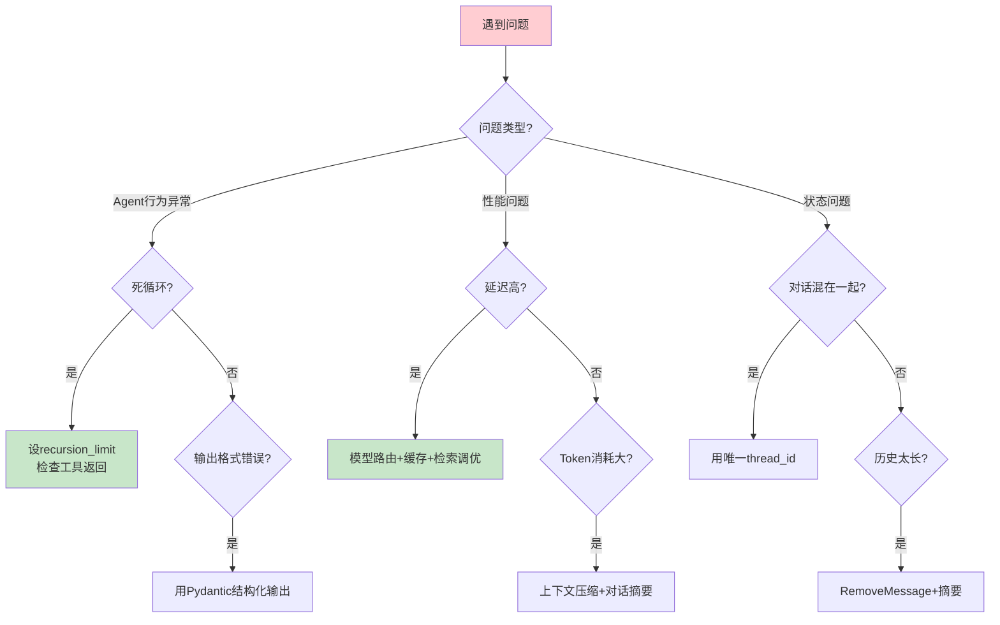

# 常见问题与排错指南最新

> 知识库 07 有 385 行但需更新。这篇补充 LangGraph 常见问题和最新排错方法。

---

## 一、常见问题速查

```python
class TroubleshootingGuide:
    """常见问题排错指南。"""

    FAQ = {
        "Agent死循环": {
            "症状": "Agent反复调用同一工具",
            "原因": "max_iterations未设/工具返回空结果/Prompt不够明确",
            "解决": "设置recursion_limit + 工具返回明确结果 + Prompt加'如果已有答案就停止'",
        },
        "LLM返回非JSON": {
            "症状": "LLM回答不是期望的JSON格式",
            "原因": "Prompt不够明确/temperature太高/模型能力不足",
            "解决": "用Pydantic结构化输出 + 降低temperature到0 + 用更强的模型",
        },
        "流式输出无内容": {
            "症状": "astream_events的on_chat_model_stream的chunk.content为空",
            "原因": "忘记设streaming=True / LLM在生成tool_calls时content为空",
            "解决": "ChatOpenAI(model='gpt-4o', streaming=True) + 检查if chunk.content",
        },
        "interrupt无法恢复": {
            "症状": "invoke(Command(resume=...))报错",
            "原因": "没有配checkpointer / thread_id不一致",
            "解决": "compile(checkpointer=MemorySaver()) + 用同一thread_id",
        },
        "对话历史太长": {
            "症状": "Token超限/LLM报错context length exceeded",
            "原因": "messages无限增长",
            "解决": "用RemoveMessage清理旧消息 + 超过10条触发摘要压缩",
        },
        "多用户状态混在一起": {
            "症状": "用户A的对话出现在用户B中",
            "原因": "thread_id未设或相同",
            "解决": "每个用户每个会话用唯一thread_id",
        },
        "工具调用失败": {
            "症状": "工具执行报错",
            "原因": "参数类型错误/网络超时/权限不足",
            "解决": "参数用Pydantic验证 + 设置超时 + ToolNode自动捕获错误",
        },
        "LangSmith看不到追踪": {
            "症状": "LangSmith dashboard无数据",
            "原因": "未设环境变量/项目名不对",
            "解决": "设LANGSMITH_TRACING=true + LANGSMITH_API_KEY + 检查项目名",
        },
        "向量检索结果不相关": {
            "症状": "检索到的文档与问题无关",
            "原因": "分块不合理/嵌入模型差/查询太短",
            "解决": "调chunk_size + 换BGE嵌入 + 用查询重写扩展",
        },
        "性能慢": {
            "症状": "端到端延迟>5秒",
            "原因": "LLM调用多次/检索慢/无缓存",
            "解决": "模型路由80%走mini + 语义缓存 + HNSW调优",
        },
    }

    @classmethod
    def search(cls, keyword: str) -> dict:
        """搜索问题。"""
        keyword_lower = keyword.lower()
        for issue, info in cls.FAQ.items():
            if keyword_lower in issue.lower() or keyword_lower in str(info).lower():
                return {"issue": issue, **info}
        return {"error": f"未找到'{keyword}'相关的问题"}
```

---

## 二、排错决策树



---

## 三、最佳实践

| 实践 | 说明 | 优先级 |
|------|------|--------|
| 先看LangSmith追踪 | 最快定位问题 | ★★★ |
| 递归限制必设 | 防死循环 | ★★★ |
| thread_id必设 | 防状态混乱 | ★★★ |
| streaming=True必设 | 否则流式无输出 | ★★★ |
| 验证脚本先行 | 防配置问题 | ★★☆ |

---

## 四、检查清单

| 检查项 | 状态 |
|--------|------|
| 有FAQ速查 | ☐ |
| 有排错决策树 | ☐ |
