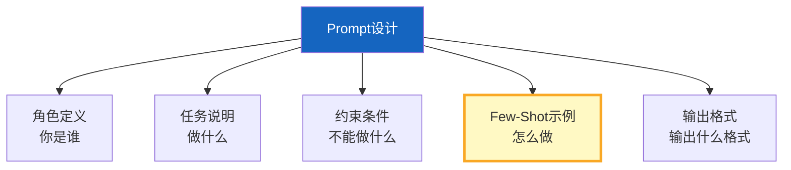

# Prompt 工程实战指南最新

> 知识库 09 有 375 行。这篇从 2025 年最新实践补充——结构化提示、Few-Shot 选择、Prompt 模板管理和 A/B 测试。

---

## 一、Prompt 设计五要素



---

## 二、结构化提示模板

```python
from langchain_core.prompts import ChatPromptTemplate
from langchain_core.messages import SystemMessage

class PromptTemplates:
    """最新Prompt模板集。"""

    # 1. RAG问答
    RAG_QA = ChatPromptTemplate.from_messages([
        ("system", "你是专业问答助手。基于检索到的信息回答问题。标注来源。信息不足时说明。"),
        ("human", "## 参考信息\n{context}\n\n## 问题\n{question}"),
    ])

    # 2. 工具选择
    TOOL_SELECTION = ChatPromptTemplate.from_messages([
        ("system", """你是工具选择专家。根据用户需求选择最合适的工具。

可用工具: {available_tools}

选择原则:
- 精确匹配优先于模糊匹配
- 选择能直接解决问题的工具
- 避免选择冗余工具"""),
        ("human", "{user_request}"),
    ])

    # 3. 结构化输出
    STRUCTURED_OUTPUT = ChatPromptTemplate.from_messages([
        ("system", """你是数据分析专家。输出必须是JSON格式。

输出schema:
```json
{{"category": "...", "sentiment": "...", "confidence": 0.0, "details": ["..."]}}
```"""),
        ("human", "{input}"),
    ])

    # 4. 自我纠错
    SELF_CORRECT = ChatPromptTemplate.from_messages([
        ("system", "你是质量检查专家。检查回答是否有错误，如有则修正。"),
        ("human", "问题: {question}\n\n回答: {answer}\n\n检查并修正:"),
    ])
```

---

## 三、Few-Shot 示例选择

```python
from langchain_core.prompts import FewShotChatMessagePromptTemplate

class FewShotSelector:
    """动态Few-Shot示例选择器。"""

    @staticmethod
    def create_dynamic_few_shot(examples: list[dict], selector=None):
        """创建动态Few-Shot提示。

        根据用户输入动态选择最相关的示例。
        """
        example_prompt = ChatPromptTemplate.from_messages([
            ("human", "{input}"),
            ("ai", "{output}"),
        ])

        return FewShotChatMessagePromptTemplate(
            example_prompt=example_prompt,
            examples=examples,
        )

    @staticmethod
    def select_by_similarity(
        query: str,
        examples: list[dict],
        k: int = 3,
    ) -> list[dict]:
        """按语义相似度选择示例。"""
        # 简化版：用关键词重叠
        query_words = set(query.lower().split())
        scored = []
        for ex in examples:
            ex_words = set(ex["input"].lower().split())
            overlap = len(query_words & ex_words)
            scored.append((ex, overlap))

        scored.sort(key=lambda x: x[1], reverse=True)
        return [ex for ex, _ in scored[:k]]
```

---

## 四、Prompt 调优技巧

```python
class PromptOptimization:
    """Prompt调优技巧集。"""

    TIPS = {
        "明确角色": "用'你是...'定义角色，比不定义效果好20%",
        "正面指令": "用'用中文回答'而非'不要用英文'",
        "分步引导": "复杂任务用'让我们一步步思考'",
        "格式约束": "要求JSON输出时给schema示例",
        "负面约束": "明确不能做什么，如'不要编造信息'",
        "温度控制": "事实问答temperature=0，创意写作=0.7",
        "链式Prompt": "复杂任务拆为多个简单Prompt链式调用",
        "自一致性": "同问题多次采样取多数答案",
    }

    @staticmethod
    def before_after_examples():
        """好vs坏Prompt对比。"""
        return {
            "bad": "回答问题: {question}",
            "good": """你是专业问答助手。基于以下信息回答问题。

## 参考信息
{context}

## 规则
1. 基于参考信息回答
2. 信息不足时说明
3. 用中文回答
4. 标注信息来源

## 问题
{question}""",
        }
```

---

## 五、最佳实践

| 技巧 | 效果 | 优先级 |
|------|------|--------|
| 明确角色定义 | +20% | ★★★ |
| 提供Few-Shot示例 | +30% | ★★★ |
| 约束输出格式 | +25% | ★★★ |
| 分步引导(CoT) | +15% | ★★☆ |
| 正面指令 | +10% | ★★☆ |
| 温度控制 | 关键 | ★★★ |

---

## 六、检查清单

| 检查项 | 状态 |
|--------|------|
| 有结构化模板 | ☐ |
| 有Few-Shot选择 | ☐ |
| 有调优技巧 | ☐ |
