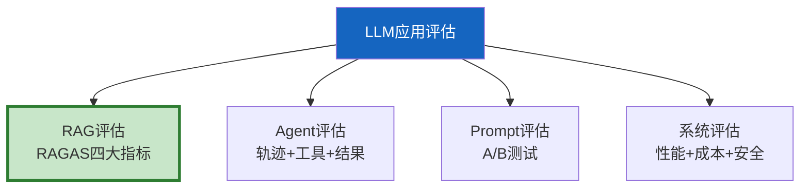

# LLM 应用评估与测试最新

> 知识库 11 有 419 行。这篇补充 2025 年最新评估方法——Agent 评估、RAGAS 集成、CI/CD 评估管线和 A/B 测试评估。

---

## 一、评估体系全景



---

## 二、评估方法速查

```python
class EvalMethods:
    """LLM应用评估方法速查。"""

    METHODS = {
        "RAGAS": {
            "类型": "RAG评估",
            "指标": "忠实度/相关性/精确率/召回率",
            "方式": "LLM-as-Judge",
            "工具": "ragas库",
        },
        "轨迹评估": {
            "类型": "Agent评估",
            "指标": "工具选择准确率/参数准确率/任务完成率",
            "方式": "与参考轨迹对比",
        },
        "端到端测试": {
            "类型": "Agent评估",
            "指标": "任务完成率/平均步数/Token消耗",
            "方式": "测试集批量执行",
        },
        "A/B测试": {
            "类型": "Prompt评估",
            "指标": "用户满意度/准确率/响应质量",
            "方式": "流量分组对比",
        },
        "红队测试": {
            "类型": "安全评估",
            "指标": "攻击成功率/防护率",
            "方式": "主动注入攻击",
        },
        "性能基准": {
            "类型": "系统评估",
            "指标": "TTFT/P95延迟/QPS/成本",
            "方式": "压测工具",
        },
    }

    @classmethod
    def recommend(cls, eval_target: str) -> list[str]:
        """根据评估目标推荐方法。"""
        return {
            "RAG系统": ["RAGAS", "性能基准"],
            "Agent系统": ["轨迹评估", "端到端测试", "红队测试"],
            "Prompt调优": ["A/B测试"],
            "上线前检查": ["端到端测试", "红队测试", "性能基准"],
        }.get(eval_target, ["RAGAS"])
```

---

## 三、评估管线

```python
class EvaluationPipeline:
    """评估管线——从测试集到报告。"""

    async def run(self, test_cases: list[dict], pipeline, judge_llm=None) -> dict:
        """运行评估管线。"""
        results = []

        for tc in test_cases:
            # 执行
            start = time.time()
            output = await pipeline.answer(tc["question"])
            latency = (time.time() - start) * 1000

            # 评估
            eval_result = {
                "question": tc["question"][:50],
                "latency_ms": round(latency, 2),
                "answer_length": len(output.get("answer", "")),
            }

            if judge_llm:
                # LLM-as-Judge评分
                eval_result["score"] = await self._llm_judge(
                    judge_llm, tc["question"], output.get("answer", ""),
                    tc.get("expected", ""),
                )

            results.append(eval_result)

        return self._report(results)

    async def _llm_judge(self, llm, question, answer, expected):
        """LLM评估。"""
        from langchain_core.messages import HumanMessage
        prompt = f"判断回答是否正确(0-1):\n问题:{question}\n回答:{answer[:200]}\n标准:{expected[:100]}"
        resp = await llm.ainvoke([HumanMessage(content=prompt)])
        import re
        match = re.search(r'0\.\d+|[01]', resp.content)
        return float(match.group()) if match else 0.5

    @staticmethod
    def _report(results: list[dict]) -> dict:
        n = len(results)
        return {
            "total": n,
            "avg_latency_ms": round(sum(r["latency_ms"] for r in results) / n, 2),
            "avg_score": round(sum(r.get("score", 0) for r in results) / n, 4),
        }
```

---

## 四、最佳实践

| 实践 | 说明 | 优先级 |
|------|------|--------|
| 测试集≥50条 | 覆盖足够场景 | ★★★ |
| LLM-as-Judge | 无需人工标注 | ★★★ |
| 纳入CI/CD | 每次提交评估 | ★★★ |
| 有基线对比 | 检测退化 | ★★★ |
| 红队测试 | 上线前安全 | ★★☆ |

---

## 五、检查清单

| 检查项 | 状态 |
|--------|------|
| 有评估方法速查 | ☐ |
| 有评估管线 | ☐ |
| 有推荐决策 | ☐ |
