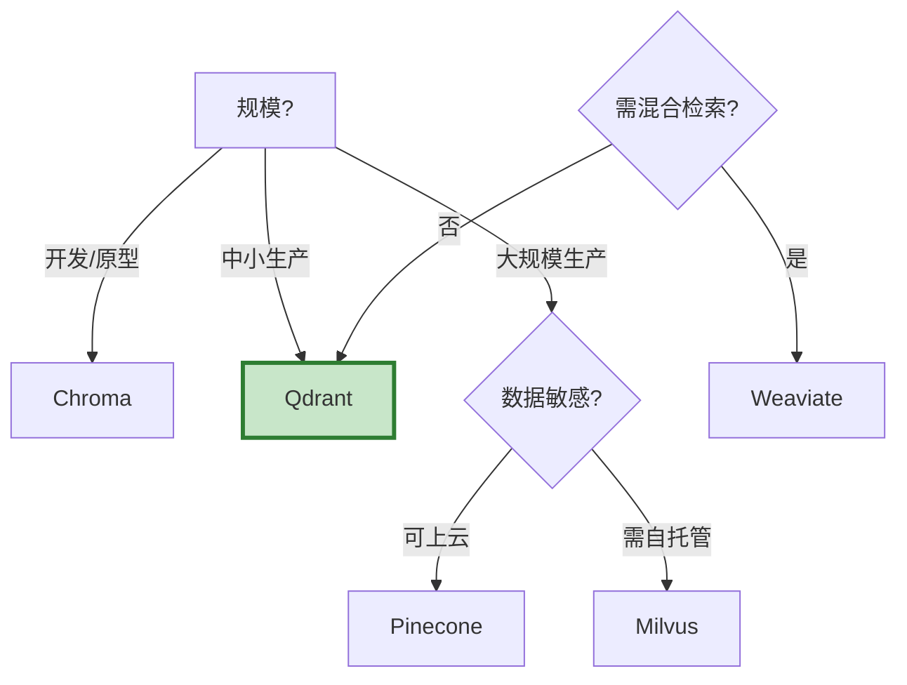

# 向量数据库深度对比最新

> 知识库 12 有 294 行。这篇更新为 2025 年最新对比——新增 Qdrant、Weaviate 最新版本，补充选型决策和部署方案。

---

## 一、6 大向量库对比

| 向量库 | 类型 | 开源 | 部署 | 性能 | 中文支持 | 适合场景 |
|--------|------|------|------|------|----------|----------|
| Milvus | 分布式 | ✅ | 云/自托管 | 高 | 通用 | 生产级大规模 |
| Qdrant | 轻量 | ✅ | Docker | 高 | 通用 | 中小规模生产 |
| Chroma | 嵌入式 | ✅ | 本地 | 中 | 通用 | 开发/原型 |
| Weaviate | 全功能 | ✅ | Docker | 高 | 通用 | 混合检索 |
| FAISS | 库 | ✅ | 本地 | 极高 | 通用 | 纯计算 |
| Pinecone | 托管 | ❌ | 云 | 高 | 通用 | 零运维 |

---

## 二、选型决策



---

## 三、快速接入

```python
class VectorStoreQuickStart:
    """向量库快速接入。"""

    @staticmethod
    def chroma(embeddings):
        """Chroma——最快上手。"""
        from langchain_community.vectorstores import Chroma
        return Chroma(embedding_function=embeddings)

    @staticmethod
    def qdrant(embeddings):
        """Qdrant——推荐中小生产。"""
        from langchain_community.vectorstores import QdrantVectorStore
        from qdrant_client import QdrantClient
        client = QdrantClient(":memory:")  # 本地；生产用url=
        return QdrantVectorStore(
            client=client, collection_name="my_docs",
            embedding=embeddings,
        )

    @staticmethod
    def milvus(embeddings):
        """Milvus——大规模生产。"""
        from langchain_community.vectorstores import Milvus
        return Milvus(
            embedding_function=embeddings,
            connection_args={"host": "localhost", "port": "19530"},
        )
```

---

## 四、最佳实践

| 实践 | 说明 | 优先级 |
|------|------|--------|
| 开发用Chroma | 零配置 | ★★★ |
| 生产用Qdrant | 轻量高性能 | ★★★ |
| 大规模用Milvus | 分布式扩展 | ★★★ |
| HNSW索引 | 速度精度平衡 | ★★☆ |
| 定期重建索引 | 防止性能退化 | ★★☆ |

---

## 五、检查清单

| 检查项 | 状态 |
|--------|------|
| 有6大对比 | ☐ |
| 有选型决策 | ☐ |
| 有快速接入 | ☐ |
