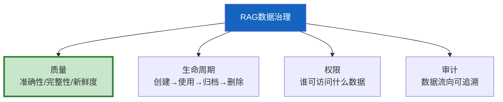
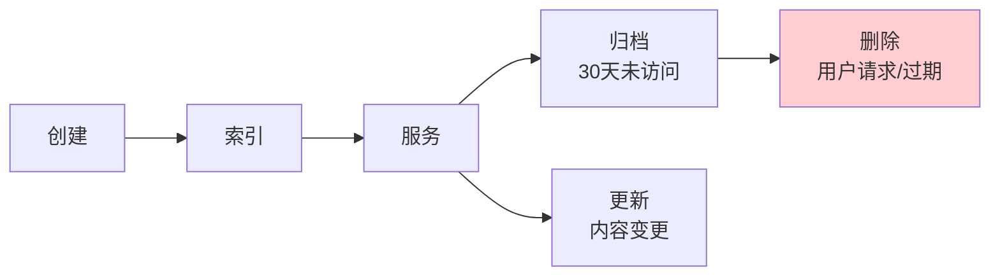

# RAG 数据治理最新

> 知识库 68 仅 178 行。这篇从数据治理视角补充——数据质量标准、生命周期、权限治理和审计追踪。

---

## 一、数据治理四大维度



---

## 二、数据质量标准

```python
class DataQualityStandards:
    """数据质量标准。"""

    DIMENSIONS = {
        "准确性": "数据内容与事实一致",
        "完整性": "必要字段不缺失",
        "一致性": "不同来源数据不矛盾",
        "及时性": "数据不过时（按类型设TTL）",
        "唯一性": "无重复数据",
        "有效性": "格式/范围符合规范",
    }

    @staticmethod
    def quality_score(doc: dict) -> float:
        """计算质量评分。"""
        score = 0
        if doc.get("content") and len(doc["content"]) > 50:
            score += 0.2  # 完整性
        if doc.get("source"):
            score += 0.2  # 可溯源
        if doc.get("updated_at"):
            score += 0.2  # 及时性
        if doc.get("content_hash"):
            score += 0.2  # 唯一性
        if doc.get("verified"):
            score += 0.2  # 准确性
        return score
```

---

## 三、数据生命周期



```python
class DataLifecycleGovernance:
    """数据生命周期治理。"""

    RETENTION = {
        "active": "常驻向量库",
        "archived": "30天未访问→移到冷存储",
        "expired": "超过保留期→删除",
        "user_deleted": "用户请求→立即删除",
    }

    @staticmethod
    def classify(age_days: int, last_access_days: int) -> str:
        """分类数据状态。"""
        if last_access_days > 90:
            return "expired"
        elif last_access_days > 30:
            return "archived"
        return "active"
```

---

## 四、最佳实践

| 实践 | 说明 | 优先级 |
|------|------|--------|
| 入库前质量检查 | 防止垃圾数据 | ★★★ |
| 定期新鲜度检查 | 按类型设TTL | ★★★ |
| 权限分级管理 | 文档级ACL | ★★★ |
| 数据流向可审计 | 审计日志 | ★★☆ |
| 过期数据自动清理 | 30天未访问归档 | ★★☆ |

---

## 五、检查清单

| 检查项 | 状态 |
|--------|------|
| 有质量标准 | ☐ |
| 有生命周期 | ☐ |
