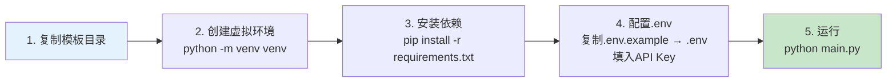
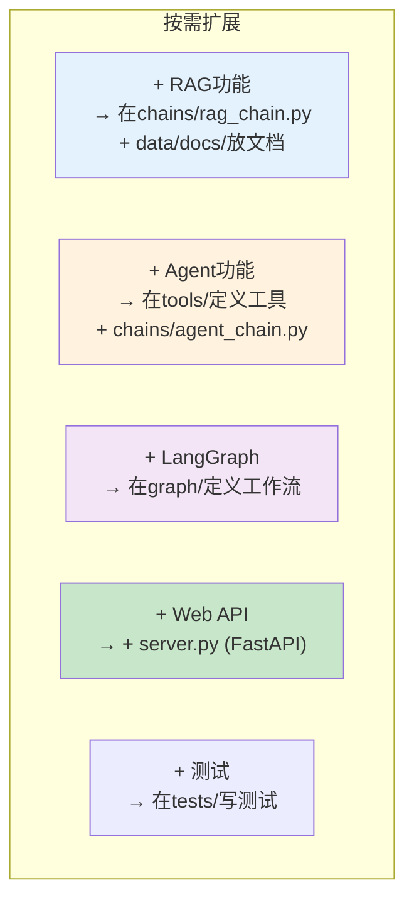

# 项目模板脚手架

> 不用每次从零开始——这个脚手架模板让你 10 分钟启动一个标准化的 LangChain/LangGraph 项目。

---

## 一、模板结构

```
langchain_template/
├── .env                    # 环境变量（API Key等）
├── .env.example            # 环境变量示例
├── .gitignore
├── requirements.txt
├── README.md
├── main.py                 # 主入口
├── config.py               # 配置管理
├── chains/                  # Chain 定义
│   ├── __init__.py
│   ├── qa_chain.py          # 问答链
│   └── rag_chain.py         # RAG 链
├── graph/                   # LangGraph 定义
│   ├── __init__.py
│   ├── state.py             # State 定义
│   ├── nodes.py             # 节点定义
│   └── workflow.py          # 图构建与编译
├── tools/                   # 工具定义
│   ├── __init__.py
│   ├── search.py
│   └── calculator.py
├── prompts/                 # Prompt 管理
│   ├── __init__.py
│   └── system_prompts.py
├── utils/                   # 工具函数
│   ├── __init__.py
│   ├── error_handler.py     # 错误处理
│   └── logger.py            # 日志配置
├── data/                    # 数据目录
│   └── docs/                # 文档目录（RAG用）
└── tests/                   # 测试
    ├── __init__.py
    └── test_chains.py
```

## 二、核心文件

### 2.1 配置管理

```python
# config.py
import os
from dotenv import load_dotenv
from dataclasses import dataclass

load_dotenv()

@dataclass
class Config:
    # LLM 配置
    llm_model: str = os.getenv("LLM_MODEL", "gpt-4o-mini")
    llm_temperature: float = float(os.getenv("LLM_TEMPERATURE", "0"))
    llm_max_tokens: int = int(os.getenv("LLM_MAX_TOKENS", "1000"))
    llm_timeout: int = int(os.getenv("LLM_TIMEOUT", "30"))
    llm_max_retries: int = int(os.getenv("LLM_MAX_RETRIES", "3"))

    # Embedding 配置
    embedding_model: str = os.getenv("EMBEDDING_MODEL", "text-embedding-3-small")

    # RAG 配置
    chunk_size: int = int(os.getenv("CHUNK_SIZE", "500"))
    chunk_overlap: int = int(os.getenv("CHUNK_OVERLAP", "50"))
    rag_top_k: int = int(os.getenv("RAG_TOP_K", "4"))

    # 存储配置
    db_path: str = os.getenv("DB_PATH", "data/app.db")
    vector_db_path: str = os.getenv("VECTOR_DB_PATH", "data/vector_store")

    # 应用配置
    debug: bool = os.getenv("DEBUG", "True").lower() == "true"
    port: int = int(os.getenv("PORT", "8000"))

config = Config()
```

### 2.2 .env.example

```env
# LLM 配置
OPENAI_API_KEY=sk-你的密钥
LLM_MODEL=gpt-4o-mini
LLM_TEMPERATURE=0
LLM_MAX_TOKENS=1000
LLM_TIMEOUT=30
LLM_MAX_RETRIES=3

# Embedding
EMBEDDING_MODEL=text-embedding-3-small

# RAG 配置
CHUNK_SIZE=500
CHUNK_OVERLAP=50
RAG_TOP_K=4

# 存储
DB_PATH=data/app.db
VECTOR_DB_PATH=data/vector_store

# 应用
DEBUG=True
PORT=8000

# LangSmith (可选)
LANGSMITH_API_KEY=
LANGSMITH_TRACING=false
LANGSMITH_PROJECT=my-project
```

### 2.3 .gitignore

```gitignore
# 环境变量
.env

# Python
__pycache__/
*.pyc
*.pyo
venv/
.venv/

# 数据
data/app.db
data/vector_store/
data/*.db

# IDE
.vscode/
.idea/
*.swp

# OS
.DS_Store
Thumbs.db
```

### 2.4 LLM 工厂

```python
# chains/__init__.py
from langchain_openai import ChatOpenAI
from config import config

def get_llm(**kwargs):
    """统一创建LLM实例"""
    defaults = {
        "model": config.llm_model,
        "temperature": config.llm_temperature,
        "max_tokens": config.llm_max_tokens,
        "timeout": config.llm_timeout,
        "max_retries": config.llm_max_retries,
    }
    defaults.update(kwargs)
    return ChatOpenAI(**defaults)
```

### 2.5 Prompt 管理

```python
# prompts/system_prompts.py

QA_SYSTEM = """你是一个有用的AI助手。用简洁、准确的中文回答问题。
如果不确定，请明确说"我不确定"，不要编造信息。"""

RAG_SYSTEM = """你是一个知识库问答助手。基于提供的背景知识回答用户问题。

规则：
1. 只基于背景知识回答，不编造信息
2. 如果背景知识中没有答案，回复"知识库中未找到相关信息"
3. 回答时标注信息来源
4. 保持客观、准确、简洁"""

CUSTOMER_SERVICE = """你是友好的客服助手。
先理解用户问题再回答。如果信息不足，礼貌追问。
无法解决的问题，建议转人工。"""
```

### 2.6 错误处理

```python
# utils/error_handler.py
import functools
import logging

logger = logging.getLogger(__name__)

def safe_call(func):
    """装饰器：安全的LLM调用"""
    @functools.wraps(func)
    def wrapper(*args, **kwargs):
        try:
            return func(*args, **kwargs)
        except Exception as e:
            logger.error(f"{func.__name__} 失败: {e}", exc_info=True)
            return {"error": str(e), "result": None}
    return wrapper

# 使用
@safe_call
def ask_question(question: str) -> str:
    chain = get_qa_chain()
    return chain.invoke({"input": question})
```

### 2.7 日志配置

```python
# utils/logger.py
import logging
import sys

def setup_logger(name: str = "app", level: str = "INFO"):
    """配置日志"""
    logger = logging.getLogger(name)
    logger.setLevel(getattr(logging, level))

    handler = logging.StreamHandler(sys.stdout)
    formatter = logging.Formatter(
        "%(asctime)s [%(name)s] %(levelname)s: %(message)s",
        datefmt="%Y-%m-%d %H:%M:%S",
    )
    handler.setFormatter(formatter)

    if not logger.handlers:
        logger.addHandler(handler)

    return logger

logger = setup_logger()
```

### 2.8 主入口

```python
# main.py
from dotenv import load_dotenv
from utils.logger import logger
from chains import get_llm
from chains.qa_chain import get_qa_chain

load_dotenv()

def main():
    logger.info("应用启动")

    # 示例：简单问答
    llm = get_llm()
    chain = get_qa_chain()

    print("=" * 50)
    print("  LangChain 应用 (输入 quit 退出)")
    print("=" * 50)

    while True:
        user_input = input("\n👤 你: ").strip()
        if user_input.lower() == "quit":
            break
        if not user_input:
            continue

        try:
            # 流式输出
            print("🤖 助手: ", end="", flush=True)
            for chunk in chain.stream({"input": user_input}):
                print(chunk, end="", flush=True)
            print()
        except Exception as e:
            logger.error(f"调用失败: {e}")
            print(f"❌ 出错了: {e}")

if __name__ == "__main__":
    main()
```

### 2.9 问答链

```python
# chains/qa_chain.py
from langchain_core.prompts import ChatPromptTemplate, MessagesPlaceholder
from langchain_core.output_parsers import StrOutputParser
from chains import get_llm
from prompts.system_prompts import QA_SYSTEM

def get_qa_chain():
    """创建带记忆的问答链"""
    llm = get_llm()
    prompt = ChatPromptTemplate.from_messages([
        ("system", QA_SYSTEM),
        MessagesPlaceholder(variable_name="history"),
        ("human", "{input}"),
    ])
    return prompt | llm | StrOutputParser()
```

### 2.10 requirements.txt

```txt
langchain>=0.3.0
langchain-openai>=0.2.0
langchain-community>=0.3.0
langgraph>=0.2.0
python-dotenv>=1.0.0
faiss-cpu>=1.7.0
pypdf>=4.0.0
```

## 三、快速启动步骤



## 四、模板的扩展方式



## 五、一键创建脚本

```python
# init_project.py - 复制此脚本快速创建新项目
import os

TEMPLATE = {
    ".env.example": """OPENAI_API_KEY=sk-xxx
LLM_MODEL=gpt-4o-mini
LLM_TEMPERATURE=0
""",
    ".gitignore": ".env\n__pycache__/\nvenv/\n*.pyc\n",
    "requirements.txt": "langchain\nlangchain-openai\nlanggraph\npython-dotenv\n",
    "main.py": '''from dotenv import load_dotenv
from langchain_openai import ChatOpenAI

load_dotai()
llm = ChatOpenAI(model="gpt-4o-mini")
print(llm.invoke("你好").content)
''',
}

def create_project(name: str = "my_langchain_app"):
    os.makedirs(name, exist_ok=True)
    for filename, content in TEMPLATE.items():
        filepath = os.path.join(name, filename)
        with open(filepath, "w", encoding="utf-8") as f:
            f.write(content)
    print(f"✅ 项目 {name} 创建完成")

if __name__ == "__main__":
    create_project()
```
