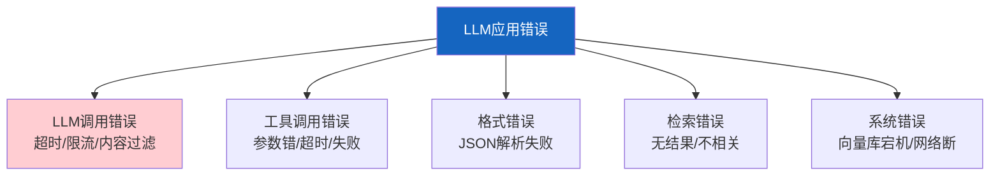

# LLM 应用错误处理最新

> 知识库 23 有 427 行、知识库 171 有错误恢复深度。这篇整合为最新速查——按错误类型给出处理方案。

---

## 一、错误分类速查



---

## 二、错误处理速查表

```python
class ErrorHandler:
    """LLM应用错误处理速查表。"""

    ERROR_TYPES = {
        "LLM超时": {
            "原因": "LLM响应超过30秒",
            "处理": "重试(减少Token) → 降级到mini → 返回缓存",
            "告警": ">10秒告警，>30秒报错",
        },
        "LLM限流(429)": {
            "原因": "API调用频率超限",
            "处理": "指数退避重试(1s→2s→4s) → 多Key轮换",
            "告警": "限流次数>10/小时告警",
        },
        "内容过滤": {
            "原因": "LLM拒绝生成(安全策略)",
            "处理": "告知用户'内容受限' → 建议换个问法",
            "告警": "记录过滤原因",
        },
        "工具参数错误": {
            "原因": "LLM生成的参数类型/格式不对",
            "处理": "返回错误信息给Agent → Agent自动修正",
            "告警": "同工具连续失败>3次告警",
        },
        "工具超时": {
            "原因": "工具执行超过设定超时",
            "处理": "取消执行 → 尝试替代工具 → 跳过",
            "告警": "工具超时率>10%告警",
        },
        "JSON解析失败": {
            "原因": "LLM输出不符合JSON格式",
            "处理": "提取JSON片段 → 修复常见问题 → LLM修正",
            "告警": "解析失败率>5%告警",
        },
        "检索无结果": {
            "原因": "向量库返回空结果",
            "处理": "降低相似度阈值 → Web搜索补充 → 直接LLM回答",
            "告警": "空结果率>20%告警",
        },
        "向量库不可用": {
            "原因": "向量库服务宕机",
            "处理": "降级到关键词检索 → 缓存兜底 → 通知运维",
            "告警": "立即告警",
        },
    }

    @classmethod
    def get_handler(cls, error_type: str) -> dict:
        """获取错误处理方案。"""
        return cls.ERROR_TYPES.get(error_type, {
            "处理": "记录错误 → 返回通用错误信息",
            "告警": "未知错误记录",
        })
```

---

## 三、重试策略

```python
import asyncio
from dataclasses import dataclass

@dataclass
class RetryConfig:
    """重试配置。"""
    max_retries: int = 3
    base_delay: float = 1.0
    max_delay: float = 30.0
    backoff_factor: float = 2.0

async def retry_with_backoff(func, config: RetryConfig = RetryConfig()):
    """指数退避重试。"""
    for attempt in range(config.max_retries + 1):
        try:
            return await func()
        except Exception as e:
            if attempt >= config.max_retries:
                raise
            delay = min(config.base_delay * (config.backoff_factor ** attempt), config.max_delay)
            await asyncio.sleep(delay)
    raise Exception("重试次数耗尽")
```

---

## 四、最佳实践

| 错误类型 | 核心策略 | 优先级 |
|----------|----------|--------|
| LLM超时 | 重试→降级→缓存 | ★★★ |
| 限流 | 指数退避 | ★★★ |
| 格式错误 | 提取→修复→LLM修正 | ★★☆ |
| 检索无结果 | 降阈值→Web→直接回答 | ★★☆ |
| 向量库宕机 | 关键词→缓存→通知 | ★★★ |

---

## 五、检查清单

| 检查项 | 状态 |
|--------|------|
| 有错误速查表 | ☐ |
| 有重试策略 | ☐ |
