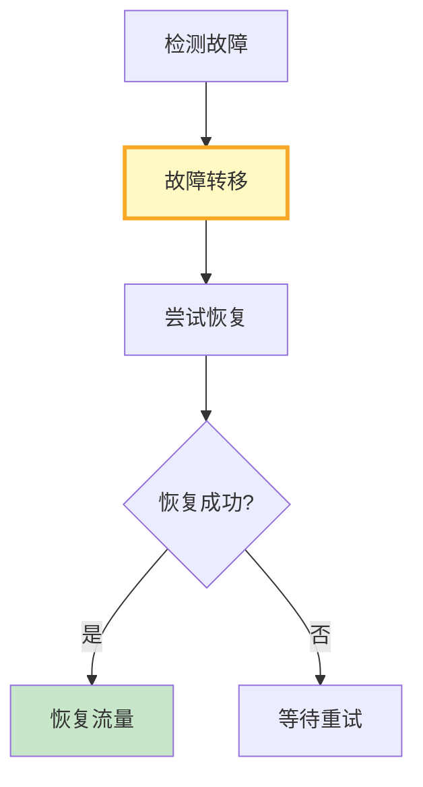

# LLM 应用容灾与高可用最新

> 知识库 63 仅 182 行、知识库 220 有深度。这篇整合为最新速查——容灾架构、故障转移和恢复流程。

---

## 一、容灾架构速查

```mermaid
graph TB
    subgraph 容灾 {"容灾三层"}
        L1["接入层<br/>DNS+负载均衡<br/>多区域入口"]
        L2["服务层<br/>多实例+自动扩缩容<br/>健康检查"]
        L3["数据层<br/>向量库主备+数据库复制<br/>定期备份"]
    end

    subgraph 降级 {"LLM降级链"}
        M1["GPT-4o(主)"]
        M2["Claude(备1)"]
        M3["Qwen本地(备2)"]
        M4["缓存兜底"]
    end

    style L3 fill:#C8E6C9,stroke:#2E7D32,stroke-width:3px
```

---

## 二、故障转移

```python
from dataclasses import dataclass, field
from datetime import datetime
from enum import Enum

class ComponentStatus(str, Enum):
    HEALTHY = "healthy"
    DEGRADED = "degraded"
    FAILED = "failed"

@dataclass
class FailoverConfig:
    """故障转移配置。"""
    max_failures: int = 3           # 连续失败次数阈值
    health_check_interval: int = 30  # 健康检查间隔(秒)
    recovery_check_interval: int = 60  # 恢复检查间隔

class FailoverManager:
    """故障转移管理器。"""

    def __init__(self, config: FailoverConfig = FailoverConfig()):
        self.config = config
        self.status: dict[str, ComponentStatus] = {}
        self.failure_counts: dict[str, int] = {}

    def record_result(self, component: str, success: bool):
        """记录组件执行结果。"""
        if success:
            self.failure_counts[component] = 0
            self.status[component] = ComponentStatus.HEALTHY
        else:
            self.failure_counts[component] = self.failure_counts.get(component, 0) + 1
            if self.failure_counts[component] >= self.config.max_failures:
                self.status[component] = ComponentStatus.FAILED
            else:
                self.status[component] = ComponentStatus.DEGRADED

    def should_failover(self, component: str) -> bool:
        """是否应该故障转移。"""
        return self.status.get(component) == ComponentStatus.FAILED

    def get_status(self, component: str) -> str:
        return self.status.get(component, ComponentStatus.HEALTHY).value
```

---

## 三、恢复流程



---

## 四、最佳实践

| 实践 | 说明 | 优先级 |
|------|------|--------|
| LLM多提供者降级链 | GPT→Claude→本地 | ★★★ |
| 向量库主备+快照 | 定期备份 | ★★★ |
| 健康检查3次阈值 | 防误判 | ★★★ |
| 定期容灾演练 | 不演练=没容灾 | ★★★ |
| 缓存兜底 | 无LLM也能响应 | ★★☆ |

---

## 五、检查清单

| 检查项 | 状态 |
|--------|------|
| 有故障转移管理器 | ☐ |
| 有降级链 | ☐ |
| 有恢复流程 | ☐ |
