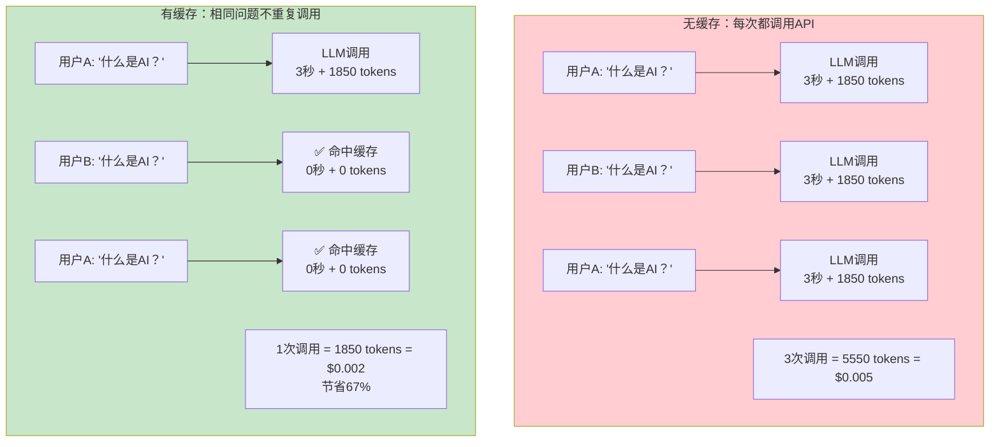
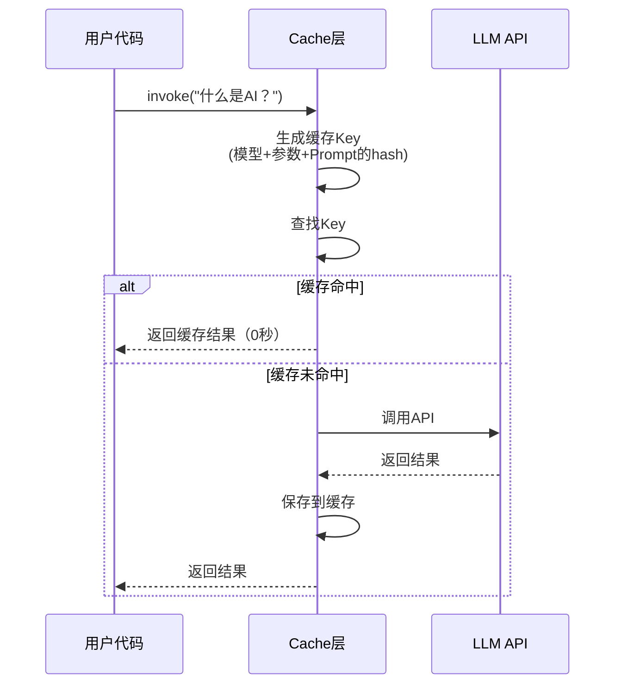
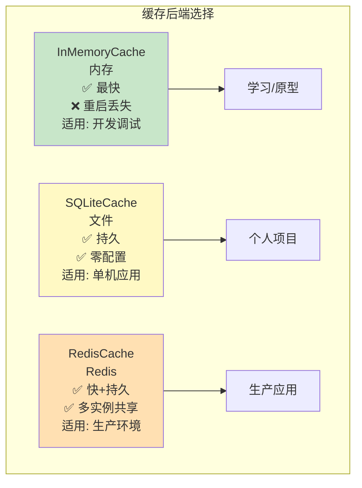
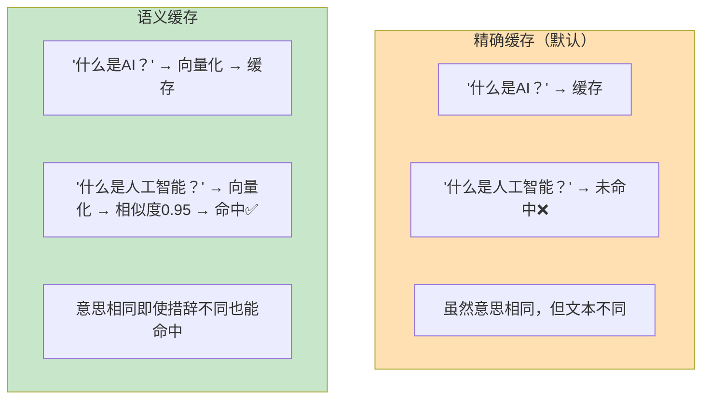
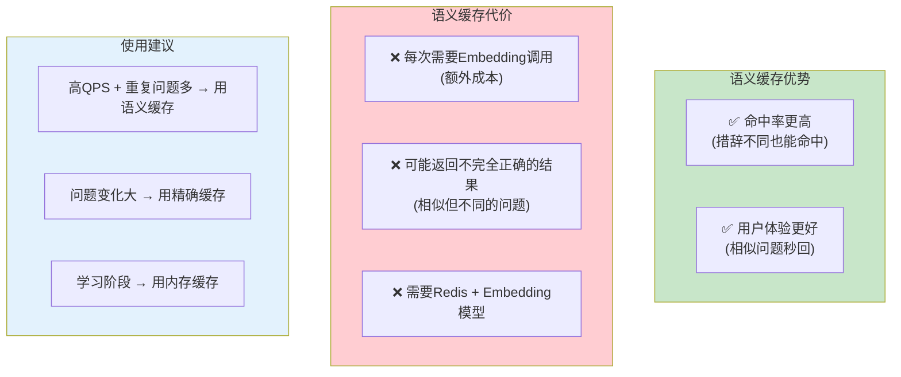
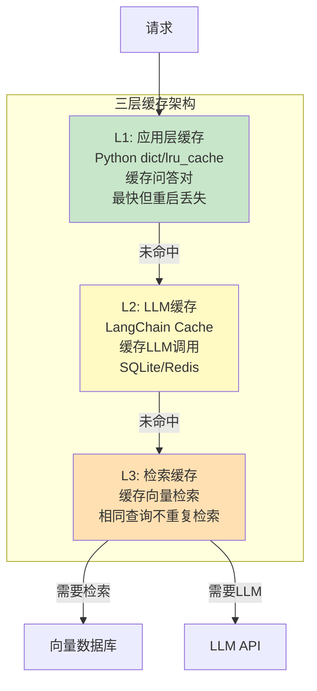
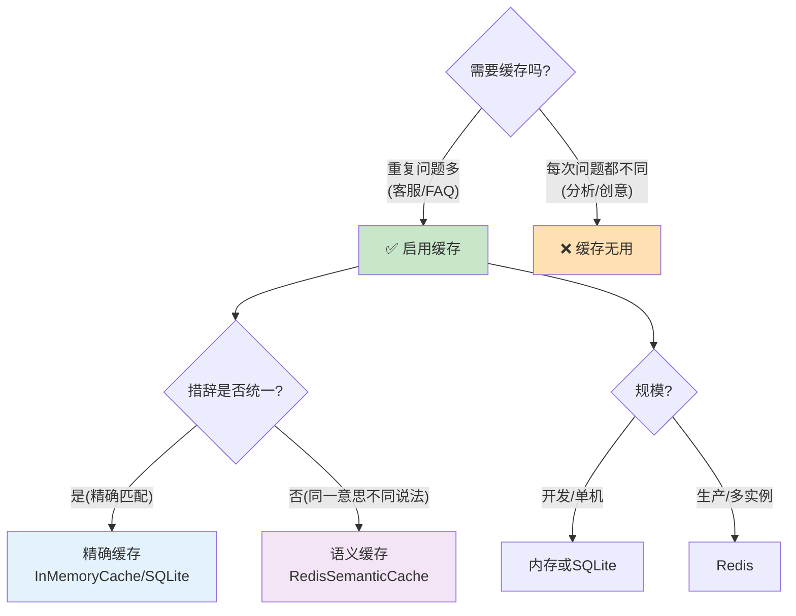
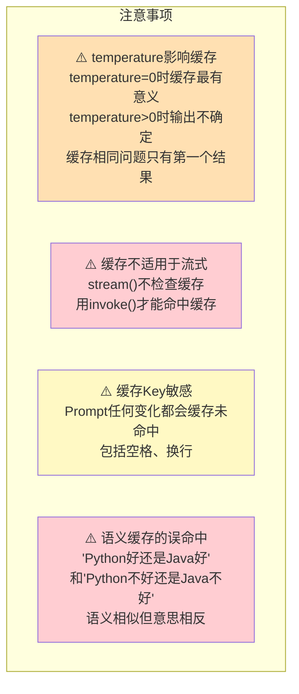

# 缓存策略专题

> 缓存是 LLM 应用成本优化的第一手段。本指南覆盖 LangChain 的缓存机制和高级缓存模式。

---

## 一、为什么需要缓存



## 二、LangChain 缓存机制

### 2.1 缓存的工作原理



### 2.2 缓存 Key 的生成规则

缓存 Key 由以下要素组合后哈希生成：

| 要素 | 说明 | 影响 |
|------|------|------|
| 模型名称 | gpt-4o-mini vs gpt-4o | 不同模型不共享缓存 |
| Prompt 内容 | 完整的 System + Human 消息 | 不同 Prompt 不共享 |
| temperature | 0 vs 0.7 | 不同温度不共享 |
| max_tokens | 1000 vs 2000 | 不同参数不共享 |
| 其他参数 | top_p, frequency_penalty 等 | 参数变化缓存失效 |

### 2.3 内置缓存后端

```python
from langchain_core.globals import set_llm_cache

# 1. 内存缓存（开发用，重启丢失）
from langchain_community.cache import InMemoryCache
set_llm_cache(InMemoryCache())

# 2. SQLite 缓存（持久化，单机用）
from langchain_community.cache import SQLiteCache
set_llm_cache(SQLiteCache(database_path="data/llm_cache.db"))

# 3. Redis 缓存（生产环境，多实例共享）
from langchain_community.cache import RedisCache
from redis import Redis
set_llm_cache(RedisCache(redis_=Redis(host="localhost", port=6379)))

# 4. Upstash Redis（Serverless Redis）
from langchain_community.cache import UpstashRedisCache
# set_llm_cache(UpstashRedisCache(redis_url="https://..."))
```

### 2.4 缓存后端对比



### 2.5 缓存效果验证

```python
from dotenv import load_dotenv
from langchain_openai import ChatOpenAI
from langchain_core.globals import set_llm_cache
from langchain_community.cache import InMemoryCache
import time

load_dotenv()
set_llm_cache(InMemoryCache())
llm = ChatOpenAI(model="gpt-4o-mini")

# 第一次调用（未命中缓存）
start = time.time()
r1 = llm.invoke("用一句话解释量子计算")
t1 = time.time() - start
print(f"第一次: {t1:.2f}s")

# 第二次相同调用（命中缓存）
start = time.time()
r2 = llm.invoke("用一句话解释量子计算")
t2 = time.time() - start
print(f"第二次: {t2:.4f}s (缓存)")
print(f"加速: {t1/t2:.0f}x")

# 验证内容相同
assert r1.content == r2.content
```

## 三、语义缓存

### 3.1 精确缓存 vs 语义缓存



### 3.2 语义缓存实现

```python
from langchain_community.cache import RedisSemanticCache
from langchain_openai import OpenAIEmbeddings
from redis import Redis

# 语义缓存（需要 Redis + Embedding 模型）
semantic_cache = RedisSemanticCache(
    redis_=Redis(host="localhost", port=6379),
    embedding=OpenAIEmbeddings(),
    score_threshold=0.95,  # 相似度阈值，越高越严格
)

set_llm_cache(semantic_cache)

# 现在 "什么是AI" 和 "什么是人工智能" 会命中同一缓存
```

### 3.3 语义缓存的权衡



## 四、应用层缓存模式

### 4.1 RAG 结果缓存

```python
import hashlib
import json

def rag_with_cache(question: str, vectorstore, llm, cache: dict = None):
    """带缓存的RAG问答"""
    if cache is None:
        cache = {}

    # 生成缓存key
    cache_key = hashlib.md5(question.encode()).hexdigest()

    # 检查缓存
    if cache_key in cache:
        print("✅ 命中应用层缓存")
        return cache[cache_key]

    # 未命中：执行完整RAG
    docs = vectorstore.similarity_search(question, k=3)
    context = "\n".join(d.page_content for d in docs)

    prompt = f"基于以下知识回答：{context}\n问题：{question}"
    answer = llm.invoke(prompt).content

    # 存入缓存
    cache[cache_key] = {
        "answer": answer,
        "sources": [d.metadata.get("source") for d in docs],
    }

    return cache[cache_key]
```

### 4.2 检索结果缓存

```python
from functools import lru_cache

@lru_cache(maxsize=100)
def cached_search(query: str, k: int = 3):
    """缓存向量检索结果（相同查询不重复检索）"""
    return tuple(vectorstore.similarity_search(query, k=k))
```

### 4.3 分层缓存架构



## 五、缓存策略决策



## 六、缓存注意事项



## 七、缓存命中率监控

```python
class CacheMonitor:
    """缓存命中率监控"""
    def __init__(self):
        self.hits = 0
        self.misses = 0

    def record_hit(self):
        self.hits += 1

    def record_miss(self):
        self.misses += 1

    @property
    def hit_rate(self) -> float:
        total = self.hits + self.misses
        return self.hits / total if total > 0 else 0

    def summary(self) -> dict:
        return {
            "hits": self.hits,
            "misses": self.misses,
            "hit_rate": f"{self.hit_rate:.1%}",
            "estimated_savings": f"${self.hits * 0.002:.2f}",  # 估算节省
        }

monitor = CacheMonitor()

# 在应用中记录
def chat_with_monitoring(question: str):
    # 检查缓存前
    monitor.record_miss()  # 先记miss
    result = chain.invoke({"input": question})
    # 如果实际命中了缓存（通过比较耗时判断）
    # ...
    return result
```
