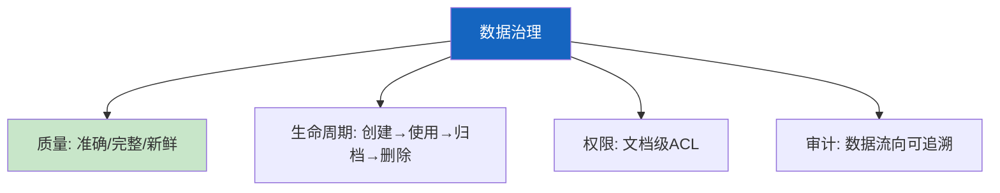

# RAG 数据治理最新

> 知识库 68 有 178 行、知识库 247 有深度。这篇整合为最新速查——数据质量、生命周期、权限和审计。

---

## 一、治理四大维度



---

## 二、质量检查

```python
from dataclasses import dataclass
from enum import Enum

class QualityLevel(str, Enum):
    HIGH = "high"
    MEDIUM = "medium"
    LOW = "low"

@dataclass
class DataQualityChecker:
    """数据质量检查器。"""

    @staticmethod
    def check(doc: dict) -> dict:
        """检查文档质量。"""
        issues = []
        content = doc.get("content", "")

        if len(content) < 50:
            issues.append("内容太短")
        if not doc.get("source"):
            issues.append("缺少来源")
        if not doc.get("updated_at"):
            issues.append("缺少时间戳")
        if "\ufffd" in content:
            issues.append("含编码错误")

        level = QualityLevel.HIGH if not issues else QualityLevel.LOW if len(issues) > 2 else QualityLevel.MEDIUM

        return {"level": level.value, "issues": issues, "score": 1 - len(issues) * 0.2}


class DataLifecycleManager:
    """数据生命周期管理。"""

    TTL = {"news": 7, "policy": 90, "tech": 180, "reference": 365}

    @classmethod
    def classify(cls, doc_type: str, age_days: int) -> str:
        """分类数据状态。"""
        max_age = cls.TTL.get(doc_type, 365)
        if age_days > max_age:
            return "expired"
        elif age_days > max_age * 0.8:
            return "aging"
        return "fresh"
```

---

## 三、最佳实践

| 实践 | 说明 | 优先级 |
|------|------|--------|
| 入库前质量检查 | 防垃圾数据 | ★★★ |
| 按类型设TTL | 新闻7天/技术180天 | ★★★ |
| 权限分级管理 | 文档级ACL | ★★★ |
| 数据流向审计 | 可追溯 | ★★☆ |
| 过期自动清理 | 保持新鲜 | ★★☆ |

---

## 四、检查清单

| 检查项 | 状态 |
|--------|------|
| 有质量检查器 | ☐ |
| 有生命周期 | ☐ |
