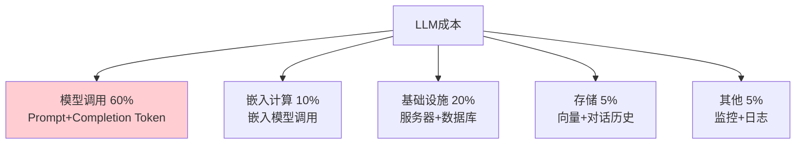

# LLM 应用成本分析与 ROI 最新

> 知识库 73 有 178 行。这篇讲透——Token 成本估算、ROI 计算和成本优化策略。

---

## 一、成本构成



---

## 二、成本估算

```python
from dataclasses import dataclass

@dataclass
class Pricing:
    """模型定价。"""
    input_per_1m: float   # 输入$/百万Token
    output_per_1m: float  # 输出$/百万Token

PRICING = {
    "gpt-4o": Pricing(2.50, 10.00),
    "gpt-4o-mini": Pricing(0.15, 0.60),
    "claude-3-5-sonnet": Pricing(3.00, 15.00),
    "claude-3-haiku": Pricing(0.25, 1.25),
    "text-embedding-3-small": Pricing(0.02, 0),
}

class CostEstimator:
    """成本估算器。"""

    @staticmethod
    def estimate_daily(
        daily_requests: int = 1000,
        avg_input_tokens: int = 500,
        avg_output_tokens: int = 200,
        model: str = "gpt-4o",
    ) -> dict:
        """估算日成本。"""
        p = PRICING.get(model, PRICING["gpt-4o"])

        daily_input_tokens = daily_requests * avg_input_tokens
        daily_output_tokens = daily_requests * avg_output_tokens

        input_cost = daily_input_tokens / 1e6 * p.input_per_1m
        output_cost = daily_output_tokens / 1e6 * p.output_per_1m
        total_daily = input_cost + output_cost

        return {
            "model": model,
            "daily_requests": daily_requests,
            "daily_input_tokens": daily_input_tokens,
            "daily_output_tokens": daily_output_tokens,
            "daily_cost_usd": round(total_daily, 4),
            "monthly_cost_usd": round(total_daily * 30, 2),
            "cost_per_request": round(total_daily / daily_requests, 6),
        }

    @staticmethod
    def compare_models(daily_requests: int = 1000) -> dict:
        """对比不同模型的月成本。"""
        results = {}
        for model in ["gpt-4o", "gpt-4o-mini", "claude-3-5-sonnet", "claude-3-haiku"]:
            est = CostEstimator.estimate_daily(daily_requests, model=model)
            results[model] = est["monthly_cost_usd"]
        return results

    @staticmethod
    def roi_analysis(
        monthly_cost: float,
        monthly_savings: float = 0,
        monthly_revenue_increase: float = 0,
    ) -> dict:
        """ROI分析。"""
        total_benefit = monthly_savings + monthly_revenue_increase
        roi = (total_benefit - monthly_cost) / monthly_cost * 100 if monthly_cost > 0 else 0
        payback_months = monthly_cost / max(total_benefit, 1) if total_benefit > 0 else float('inf')

        return {
            "monthly_cost": round(monthly_cost, 2),
            "monthly_benefit": round(total_benefit, 2),
            "monthly_net": round(total_benefit - monthly_cost, 2),
            "roi_pct": round(roi, 1),
            "payback_months": round(payback_months, 1) if payback_months != float('inf') else "无法回本",
            "profitable": total_benefit > monthly_cost,
        }
```

---

## 三、成本优化策略

| 策略 | 节省 | 优先级 |
|------|------|--------|
| 模型路由(80%走mini) | 60-80% | ★★★ |
| 语义缓存(30%命中) | 30% | ★★★ |
| 上下文压缩 | 30-50% | ★★☆ |
| 批量API | 50% | ★★☆ |
| max_tokens限制 | 10-30% | ★★★ |

---

## 四、检查清单

| 检查项 | 状态 |
|--------|------|
| 有成本估算器 | ☐ |
| 有ROI分析 | ☐ |
